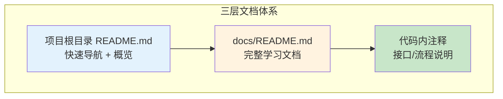
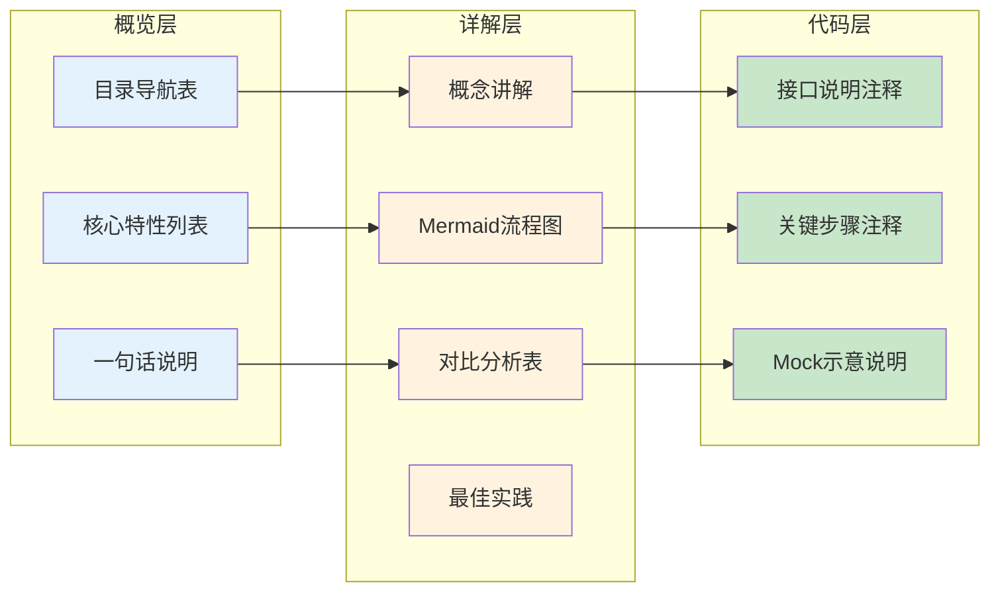
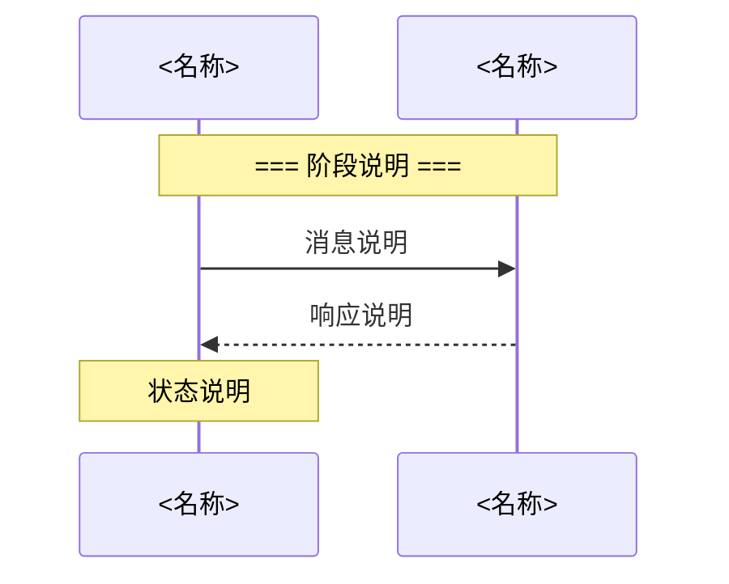

# AI Infra 学习项目风格规范

> 本文档定义了 AI Infra 资源分配相关学习项目的风格规范，供后续新增学习内容时遵循。

---

## 目录

- [1. 项目架构规范](#1-项目架构规范)
- [2. 目录结构规范](#2-目录结构规范)
- [3. 文档编写规范](#3-文档编写规范)
- [4. 代码风格规范](#4-代码风格规范)
- [5. 示例规范](#5-示例规范)
- [6. Mermaid 图表规范](#6-mermaid-图表规范)
- [7. 模板速查](#7-模板速查)

---

## 1. 项目架构规范

### 1.1 三层文档体系

每个学习项目必须包含三层文档：



| 文档层级 | 位置 | 内容 | 篇幅 |
|----------|------|------|------|
| **概览层** | 项目根目录 README.md | 快速导航表 + 核心特性 + 项目结构 + 使用示例 | < 50行 |
| **详解层** | docs/README.md | 完整概念、流程图、对比表、最佳实践 | 详细展开 |
| **代码层** | 代码文件内注释 | 接口说明、关键步骤注释、Mock说明 | 适度注释 |

### 1.2 文档分层原则



---

## 2. 目录结构规范

### 2.1 标准目录结构

每个项目必须遵循以下目录结构：

```
<project-name>/
├── README.md                   # 概览层文档
├── go.mod                      # Go模块定义（如适用）
│
├── cmd/                        # 入口程序
│   └── <component>/main.go
│
├── pkg/                        # 核心代码包
│   ├── <package-1>/<file>.go
│   └── <package-2>/<file>.go
│
├── config/                     # 配置文件
│   └── <config-file>.yaml
│
├── manifests/                  # Kubernetes部署清单
│   ├── <resource-type>.yaml
│
|                      
└── 主题.md    # 技术主题学习文档
```

### 2.2 目录命名规范

| 目录 | 命名规则 | 说明 |
|------|----------|------|
| `cmd/` | `<component>/` | 入口程序，每个组件一个子目录 |
| `pkg/` | `<package>/` | 核心代码，按功能模块组织 |
| `config/` | 直接放置配置文件 | 调度器配置、参数配置等 |
| `manifests/` | 按资源类型命名 | DaemonSet、Deployment、ConfigMap等 |
| `docs/` | README.md | 详解层文档唯一入口 |

### 2.3 文件命名规范

| 文件类型 | 命名规则 | 示例 |
|----------|----------|------|
| Go代码 | 功能描述性命名 | `gpuutilization.go`、`deviceuuid.go` |
| YAML清单 | 资源类型/序号命名 | `01-resourceclass.yaml`、`daemonset.yaml` |
| 配置文件 | 功能描述命名 | `scheduler-config.yaml` |

---

## 3. 文档编写规范

### 3.1 概览层 README.md 规范

**必须包含：**

1. **标题**：一句话说明项目核心功能
2. **快速导航表**：列出核心文件及其说明
3. **核心特性块**：ASCII 或简单表格展示
4. **项目结构**：简化版目录树
5. **使用示例**：最小化 YAML 示例

**模板：**

```markdown
# <项目名称>

> 一句话说明项目核心功能。

## 快速导航

| 文件 | 说明 |
|------|------|
| [docs/README.md](docs/README.md) | 📖 **完整学习文档** - <核心内容> |
| <其他核心文件路径> | <简要说明> |

## 核心特性

```
┌─────────────────────────────────────────────┐
│              <项目核心能力>                  │
├─────────────────────────────────────────────┤
│  ✅ <特性1>  - <一句话说明>                  │
│  ✅ <特性2>  - <一句话说明>                  │
└─────────────────────────────────────────────┘
```

## 项目结构

```
<project-name>/
├── <核心目录1>/<核心文件>      # <简要说明>
├── <核心目录2>/<核心文件>      # <简要说明>
└── docs/README.md              # 详细文档
```

## 使用示例

```yaml
# <最小化示例>
<关键配置>
```

详见 **[docs/README.md](ai%20infra/week0%20容器运行时/docs/README.md)** 获取<核心内容>详解。
```

### 3.2 详解层 主题.md 规范

**必须包含：**

1. **标题 + 一句话说明**
2. **目录导航**（锚点链接）
3. **概念讲解**（分层编号 1.1、1.2...）
4. **Mermaid 流程图/架构图**
5. **对比分析表**
6. **最佳实践/总结**

**章节编号规范：**

```markdown
## 1. 概述
### 1.1 <子主题>
### 1.2 <子主题>

## 2. <核心概念>
### 2.1 <子主题>
### 2.2 <子主题>

## N. 最佳实践
## 附录
```

### 3.3 代码层注释规范

**Go 代码注释规范：**

```go
// ============================================================
// 分隔符：用于划分代码逻辑区块
// ============================================================

// === 步骤N: <步骤说明> ===
// 详细说明...

// 【核心字段】
// 字段说明...

// 【调用时机】
// 接口调用时机说明...
```

**注释原则：**

| 注释类型 | 使用场景 | 示例 |
|----------|----------|------|
| **分隔符** | 划分逻辑区块（接口定义、核心方法、辅助方法） | `// ============================================================` |
| **步骤注释** | 复杂流程中的关键步骤 | `// === 步骤1: 检查节点是否有 GPU 资源 ===` |
| **字段说明** | 结构体字段、配置参数 | `// 【核心字段】` |
| **时机说明** | 接口调用时机、生命周期节点 | `// 【调用时机】` |

---

## 4. 代码风格规范

### 4.1 Go 代码风格

**结构体定义：**

```go
// ============================================================
// <结构体名称> <核心功能说明>
// ============================================================
// <实现接口说明>
// <使用场景说明>

type <StructName> struct {
    // <字段名> <字段说明>
    // <具体用途>
    <fieldName> <type>
}
```

**接口实现：**

```go
// ============================================================
// 实现 <接口名称> 接口
// ============================================================
// <接口作用说明>
// <调用时机说明>

func (p *<StructName>) <MethodName>(...) (<return>, error) {
    // === 步骤1: <步骤说明> ===
    // <详细说明>
    
    // === 步骤2: <步骤说明> ===
    // ...
    
    return <result>, nil
}
```

**Mock 函数：**

```go
// ============================================================
// Mock 函数：示意性实现，表达关键语义
// ============================================================
// 生产环境实现：<实际实现方式>
// <生产环境示例代码或链接>

func Mock<FunctionName>(...) <return> {
    // Mock 实现：返回模拟数据
    // 实际应从 <真实数据源> 获取
    
    return <mockData>
}
```

### 4.2 YAML 清单风格

**文件头注释：**

```yaml
# ============================================================
# <资源类型>: <核心功能说明>
# ============================================================
#
# 【核心字段】
# - <字段1>: <说明>
# - <字段2>: <说明>
#
# 【使用方式】
# <使用说明>
```

**关键配置注释：**

```yaml
# ============================================================
# <配置区块说明>
# ============================================================
# <详细说明>
# <注意事项>

<key>: <value>  # 行内简短注释
```

---

## 5. 示例规范

### 5.1 示例简化原则

**原则：** 示例代码只展示核心部分，省略次要配置。

```yaml
# ============================================================
# 示例: <场景说明>
# ============================================================
# 只展示必要部分，其他简化

apiVersion: <api-version>
kind: <kind>
metadata:
  name: <name>  # 必要字段
spec:
  # ============================================================
  # 核心配置：展示关键部分
  # ============================================================
  <核心配置>

  # 其他配置简化...
```

### 5.2 Mock 示例规范

**Mock 数据原则：**

| Mock 类型 | 原则 | 示例 |
|----------|------|------|
| **设备信息** | 返回2-4个模拟设备 | `{"GPU-001", "GPU-002"}` |
| **利用率数据** | 返回典型分布值 | `{25.5, 78.3, 45.0}` |
| **拓扑信息** | 返回基本NUMA信息 | `{NUMANode: 0, PCIPath: "/sys/..."}` |
| **健康状态** | 默认返回健康 | `IsHealthy: true` |

**Mock 函数模板：**

```go
// Mock<FunctionName> <功能说明>
// 生产环境可从 <真实数据源> 获取
func Mock<FunctionName>(<params>) <return> {
    // Mock 实现：返回模拟数据
    // 实际应从 <真实实现> 获取
    mockData := map[string]<type>{
        "<key1>": <value1>,
        "<key2>": <value2>,
    }
    return mockData[<param>]
}
```

---

## 6. Mermaid 图表规范

### 6.1 图表类型选择

| 图表类型 | 使用场景 | 示例场景 |
|----------|----------|----------|
| **flowchart** | 流程、决策树 | 调度流程、Pod创建流程 |
| **graph TB/LR** | 架构、组件关系 | 组件架构、模块依赖 |
| **sequenceDiagram** | 时序交互 | gRPC调用、Pod生命周期 |
| **stateDiagram** | 状态变迁 | ResourceClaim生命周期 |
| **classDiagram** | 结构关系 | API消息结构、接口定义 |

### 6.2 图表风格规范

**节点颜色规范：**

```mermaid
style <node> fill:#e3f2fd    # 蓝色：核心组件、主要节点
style <node> fill:#c8e6c9    # 绿色：成功状态、推荐方案
style <node> fill:#fff3e0    # 橙色：重要步骤、核心功能
style <node> fill:#ffcdd2    # 红色：问题、局限、失败
style <node> fill:#fce4ec    # 粉色：元数据、配置
```

**颜色语义表：**

| 颜色 | 色值 | 语义 |
|------|------|------|
| **蓝色** | `#e3f2fd` | 核心组件、主要流程节点 |
| **绿色** | `#c8e6c9` | 成功状态、推荐方案、新特性 |
| **橙色** | `#fff3e0` | 重要步骤、核心功能、Driver实现 |
| **红色** | `#ffcdd2` | 问题、局限、失败状态、旧方式 |
| **粉色** | `#fce4ec` | 元数据、Annotations、配置 |
| **灰色** | `#9e9e9e` | 次要内容、低优先级 |

### 6.3 图表结构规范

**flowchart 规范：**

```mermaid
flowchart TB
    A[起始节点] --> B{决策节点}
    
    B -->|条件1| C[处理节点]
    B -->|条件2| D[处理节点]
    
    C --> E[结束节点]
    D --> E
    
    style A fill:#e1f5fe       # 起始：浅蓝
    style E fill:#c8e6c9       # 结束：绿色
    style C fill:#fff3e0       # 重要步骤：橙色
```

**sequenceDiagram 规范：**



---

## 7. 模板速查

### 7.1 项目 README.md 模板

```markdown
# <项目名称>

> 一句话说明。

## 快速导航

| 文件 | 说明 |
|------|------|
| [docs/README.md](docs/README.md) | 📖 **完整学习文档** |
| <核心文件路径> | <说明> |

## 核心特性

```
┌─────────────────────────────────────────────┐
│              <核心能力>                      │
├─────────────────────────────────────────────┤
│  ✅ <特性1>  - <说明>                        │
│  ✅ <特性2>  - <说明>                        │
└─────────────────────────────────────────────┘
```

## 项目结构

```
<project>/
├── <目录>/<文件>    # <说明>
└── docs/README.md   # 详细文档
```

详见 **[docs/README.md](docs/README.md)**。
```

### 7.2 详解文档模板

```markdown
# <主题>详解

> 一句话说明。

---

## 目录

- [1. 概述](#1-概述)
- [2. <核心概念>](#2-核心概念)
- [3. <流程/架构>](#3-流程架构)
- [4. <对比分析>](#4-对比分析)
- [5. <最佳实践>](#5-最佳实践)

---

## 1. 概述

### 1.1 什么是<概念>

```mermaid
graph TB
    # 架构图
```

### 1.2 核心特性

| 特性 | 说明 |
|------|------|
| <特性> | <说明> |

---

## 2. <核心概念>

### 2.1 <子概念>

```mermaid
graph LR
    # 结构图
```

---

## N. 最佳实践

| 场景 | 推荐 |
|------|------|
| <场景> | <推荐> |

---

## 附录

### A. 参考资料

- [官方文档](链接)
```

### 7.3 Go 代码模板

```go
// Package <name> <功能说明>
package <name>

import (
    "context"
    // 必要导入
)

// ============================================================
// 常量定义
// ============================================================
const (
    Name = "<PluginName>"
)

// ============================================================
// 结构体定义
// ============================================================

// <StructName> <功能说明>
type <StructName> struct {
    handle <HandleType>
}

// ============================================================
// 接口实现
// ============================================================

// Name 返回插件名称
func (p *<StructName>) Name() string {
    return Name
}

// <InterfaceMethod> <接口说明>
// 【调用时机】<时机说明>
func (p *<StructName>) <InterfaceMethod>(ctx context.Context, ...) (<return>, error) {
    // === 步骤1: <说明> ===
    
    // === 步骤2: <说明> ===
    
    return <result>, nil
}

// ============================================================
// Mock 函数
// ============================================================

// Mock<Function> <功能说明>
// 生产环境：<真实实现>
func Mock<Function>(...) <return> {
    return <mockData>
}
```

### 7.4 YAML 清单模板

```yaml
# ============================================================
# <资源类型>: <功能说明>
# ============================================================

apiVersion: <api>
kind: <Kind>
metadata:
  name: <name>
spec:
  # ============================================================
  # 核心配置
  # ============================================================
  <配置项>: <值>  # 简短注释

---
# ============================================================
# 示例: <场景说明>
# ============================================================
apiVersion: v1
kind: Pod
metadata:
  name: <name>
spec:
  <核心配置>
```

---

## 8. 检查清单

### 8.1 新项目创建检查

| 检查项 | 要求 |
|--------|------|
| 目录结构 | 符合 2.1 标准目录结构 |
| 概览层 README.md | 包含导航表、特性块、结构树 |
| 详解层 docs/README.md | 包含目录、Mermaid图、对比表 |
| 代码注释 | 使用分隔符、步骤注释、Mock说明 |
| YAML清单 | 包含文件头注释、关键配置注释 |
| Mermaid图表 | 符合颜色规范、结构规范 |

### 8.2 文档质量检查

| 检查项 | 要求 |
|--------|------|
| 一句话说明 | 概览层和详解层都有 |
| 目录导航 | 详解层必须有锚点链接 |
| Mermaid图表 | 至少包含流程图或架构图 |
| 对比分析 | 核心概念必须有对比表 |
| 最佳实践 | 详解层必须包含 |

---

> 本规范基于 gpu-scheduler、device-plugin、dra-gpu-example 三个项目总结，后续新增学习项目必须遵循此规范。