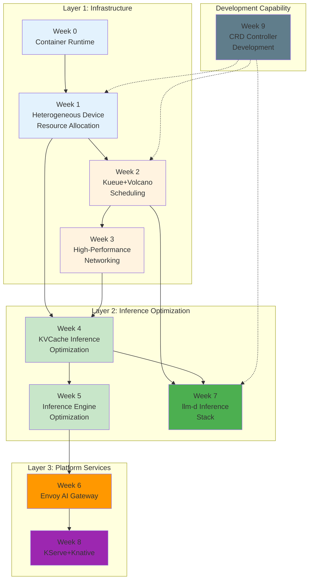
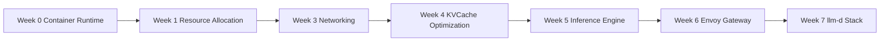
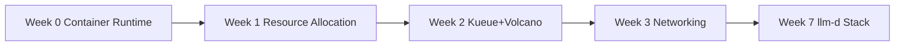
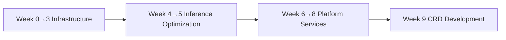

# 🚀 AI Infrastructure Learning Guide

> **Chinese Version**: [README.md](README.md)

> [!TIP]
> ⚠️ **Reading Note**: This project contains a large number of YAML configuration files and Go code files. Please open the project directory in **VSCode** for reading. General Markdown readers (including GitHub web interface) may render embedded code blocks incorrectly — code indentation, alignment, tables, and other formatting may become misaligned. VSCode's Markdown All in One or Markdown Preview Enhanced extensions provide a better reading experience.

> Focusing on **inference deployment** and **resource scheduling**, systematically learn the complete Kubernetes AI infrastructure technology stack.

---

## 📖 Project Overview

This tutorial covers the **AI Infrastructure** domain, providing 10 themed systematic learning paths from low-level container runtime to upper-level inference service platforms.

### Current Focus Areas

```
┌─────────────────────────────────────────────────────────────────┐
│                  AI Infrastructure Core Focus                    │
├─────────────────────────────────────────────────────────────────┤
│  🔹 Inference Deployment Optimization - KVCache management,     │
│     inference engine tuning, PD separation architecture          │
│  🔹 Resource Scheduling - GPU allocation, task queuing,         │
│     network topology-aware scheduling, autoscaling               │
└─────────────────────────────────────────────────────────────────┘
```

With the scaling of large model inference services, the core challenges of AI Infrastructure are:
- **Inference Deployment**: How to efficiently manage KVCache, optimize inference engine throughput, and implement PD separation architecture
- **Resource Scheduling**: How to fairly allocate resources in multi-tenant GPU clusters, be topology-aware, and autoscale

---

## 🗺️ Learning Roadmap



---

## 📋 Module Details

### Week 0: Kubernetes Container Runtime

| Attribute | Content |
|-----------|---------|
| **Topic** | CRI interface, containerd/CRI-O deployment, GPU runtime |
| **Suggested Duration** | 3-5 days |
| **Difficulty** | ⭐⭐ |
| **Key Takeaways** | Understand kubelet-runtime communication mechanism, master GPU container runtime configuration |
| **Recommended Open Source Projects** | [containerd](https://github.com/containerd/containerd) · [CRI-O](https://github.com/cri-o/cri-o) · [NVIDIA Container Toolkit](https://github.com/NVIDIA/nvidia-container-toolkit) |

---

### Week 1: Heterogeneous Device Resource Allocation & Scheduling

| Attribute | Content |
|-----------|---------|
| **Topic** | Device Plugin, GPU-aware scheduler, DRA declarative resource management |
| **Suggested Duration** | 5-7 days |
| **Difficulty** | ⭐⭐⭐ |
| **Key Takeaways** | Master the complete GPU device discovery→allocation→injection pipeline, understand the evolution from Device Plugin to DRA |
| **Recommended Open Source Projects** | [NVIDIA k8s-device-plugin](https://github.com/NVIDIA/k8s-device-plugin) · [NVIDIA k8s-dra-driver-gpu](https://github.com/NVIDIA/k8s-dra-driver-gpu) · [CDI Specification](https://github.com/cncf-tags/container-device-interface) |

---

### Week 2: Kueue + Volcano AI Job Scheduling

| Attribute | Content |
|-----------|---------|
| **Topic** | Job queue management, Gang Scheduling, multi-tenant resource quota |
| **Suggested Duration** | 5-7 days |
| **Difficulty** | ⭐⭐⭐ |
| **Key Takeaways** | Understand Kueue queue model and Volcano batch scheduling, master hybrid workload scheduling solutions |
| **Recommended Open Source Projects** | [kueue](https://github.com/kubernetes-sigs/kueue) · [volcano-sh/volcano](https://github.com/volcano-sh/volcano) |

---

### Week 3: High-Performance Networking Scheduling

| Attribute | Content |
|-----------|---------|
| **Topic** | RDMA device management, network topology-aware scheduling, multi-node low-latency deployment |
| **Suggested Duration** | 5-7 days |
| **Difficulty** | ⭐⭐⭐⭐ |
| **Key Takeaways** | Master RDMA/RoCE principles, implement NUMA/rack/switch topology-aware scheduling |
| **Recommended Open Source Projects** | [Mellanox/rdma-cni](https://github.com/Mellanox/rdma-cni) · [SR-IOV Device Plugin](https://github.com/k8snetworkplumbingwg/sriov-network-device-plugin) · [NVIDIA NCCL](https://github.com/NVIDIA/nccl) |

---

### Week 4: KVCache Inference Deployment Optimization

| Attribute | Content |
|-----------|---------|
| **Topic** | Mooncake / LMCache / HiCache — three KVCache solutions |
| **Suggested Duration** | 7-10 days |
| **Difficulty** | ⭐⭐⭐⭐ |
| **Key Takeaways** | Understand KVCache storage offloading, cross-instance sharing, RDMA zero-copy transfer, PD separation architecture |
| **Recommended Open Source Projects** | [kvcache-ai/Mooncake](https://github.com/kvcache-ai/Mooncake) · [lmcache/LMCache](https://github.com/lmcache/lmcache) · [SGLang HiCache](https://docs.sglang.io/docs/advanced_features/hicache_design) |

---

### Week 5: Inference Engine Optimization

| Attribute | Content |
|-----------|---------|
| **Topic** | vLLM / SGLang throughput optimization strategies |
| **Suggested Duration** | 7-10 days |
| **Difficulty** | ⭐⭐⭐⭐ |
| **Key Takeaways** | Master PagedAttention/RadixAttention, speculative decoding, quantization, PD separation and other optimization techniques |
| **Recommended Open Source Projects** | [vllm-project/vllm](https://github.com/vllm-project/vllm) · [sgl-project/sglang](https://github.com/sgl-project/sglang) |

---

### Week 6: Envoy AI Gateway

| Attribute | Content |
|-----------|---------|
| **Topic** | xDS control plane, traffic management, rate limiting, observability, security & auth, Wasm extensions |
| **Suggested Duration** | 7-10 days |
| **Difficulty** | ⭐⭐⭐⭐ |
| **Key Takeaways** | Master gateway design for AI scenarios, implement model canary releases, token rate limiting, TTFT monitoring |
| **Recommended Open Source Projects** | [envoyproxy/envoy](https://github.com/envoyproxy/envoy) · [envoyproxy/gateway](https://github.com/envoyproxy/gateway) · [Gloo Gateway](https://github.com/solo-io/gloo) · [LiteLLM](https://github.com/BerriAI/litellm) |

---

### Week 7: llm-d Inference Service Stack

| Attribute | Content |
|-----------|---------|
| **Topic** | EPP inference scheduler, KV cache index, WVA autoscaler |
| **Suggested Duration** | 7-10 days |
| **Difficulty** | ⭐⭐⭐⭐⭐ |
| **Key Takeaways** | Understand CNCF llm-d project architecture, master prefix-cache-aware routing, saturation-driven autoscaling |
| **Recommended Open Source Projects** | [llm-d/llm-d-inference-scheduler](https://github.com/llm-d/llm-d-inference-scheduler) · [llm-d/llm-d-kv-cache](https://github.com/llm-d/llm-d-kv-cache) · [llm-d/llm-d-workload-variant-autoscaler](https://github.com/llm-d/llm-d-workload-variant-autoscaler) |

---

### Week 8: KServe + Knative Inference Deployment

| Attribute | Content |
|-----------|---------|
| **Topic** | Model serving abstraction, autoscaling, traffic routing, canary releases |
| **Suggested Duration** | 5-7 days |
| **Difficulty** | ⭐⭐⭐ |
| **Key Takeaways** | Master cloud-native AI inference platform setup, implement Scale-to-Zero and Canary deployments |
| **Recommended Open Source Projects** | [kserve/kserve](https://github.com/kserve/kserve) · [knative/serving](https://github.com/knative/serving) |

---

### Week 9: CRD & Controller Development

| Attribute | Content |
|-----------|---------|
| **Topic** | Custom Resource Definitions, controller development best practices, production deployment |
| **Suggested Duration** | 5-7 days |
| **Difficulty** | ⭐⭐⭐ |
| **Key Takeaways** | Master the complete Kubernetes controller development workflow, able to develop AI Infrastructure custom resources |
| **Recommended Open Source Projects** | [controller-runtime](https://github.com/kubernetes-sigs/controller-runtime) · [Kubeflow](https://github.com/kubeflow/kubeflow) |

---

## 📊 Quick Navigation Overview

| Week | Module | Topic | Duration | Difficulty |
|------|--------|-------|----------|------------|
| 0 | [Container Runtime](week0%20容器运行时/) | CRI interface, runtime deployment, GPU runtime | 3-5 days | ⭐⭐ |
| 1 | [Heterogeneous Device Resource Allocation](week1%20异构设备资源分配调度/) | Device Plugin, GPU scheduler, DRA | 5-7 days | ⭐⭐⭐ |
| 2 | [Kueue+Volcano Scheduling](week2%20kueue%20+%20volcano%20调度/) | Queue management, Gang Scheduling | 5-7 days | ⭐⭐⭐ |
| 3 | [High-Performance Networking](week3%20高性能网络调度/) | RDMA, topology-aware scheduling | 5-7 days | ⭐⭐⭐⭐ |
| 4 | [KVCache Inference Optimization](week4%20kvcache推理部署调优/) | Mooncake/LMCache/HiCache | 7-10 days | ⭐⭐⭐⭐ |
| 5 | [Inference Engine Optimization](week5%20推理引擎优化/) | vLLM/SGLang optimization | 7-10 days | ⭐⭐⭐⭐ |
| 6 | [Envoy AI Gateway](week6%20envoy-ai-gateway/) | xDS, rate limiting, observability | 7-10 days | ⭐⭐⭐⭐ |
| 7 | [llm-d Inference Stack](week7%20llm-d-inference/) | EPP, KV index, WVA scaling | 7-10 days | ⭐⭐⭐⭐⭐ |
| 8 | [KServe+Knative](week8%20kserve-knative/) | Model serving, autoscaling | 5-7 days | ⭐⭐⭐ |
| 9 | [CRD Controller Development](week9%20crd-controller/) | CRD, Controller development | 5-7 days | ⭐⭐⭐ |

> **Total Learning Duration**: ~50-75 days (at 5-7 days/week, approximately 8-12 weeks to complete)

---

## 🎯 Recommended Learning Paths

### Path 1: Inference Deployment Specialization (Recommended)



**Suitable for**: Inference platform engineers, MLOps engineers

### Path 2: Resource Scheduling Specialization



**Suitable for**: Kubernetes platform engineers, scheduling system engineers

### Path 3: Full-Stack AI Infrastructure



**Suitable for**: AI Infrastructure architects, technical leads

---

## 📚 Prerequisites

| Domain | Requirement |
|--------|-------------|
| **Kubernetes** | Familiar with Pod, Deployment, Service, ConfigMap and other core concepts |
| **Container Technology** | Understand Docker/containerd basic operations |
| **Go Language** | Week 9 requires Go basics (controller development) |
| **Python** | Week 5 inference engine optimization requires Python basics |
| **Networking** | Week 3 requires TCP/IP, RDMA basic concepts |

---

## 🔗 Technology Ecosystem

```
┌────────────────────────────────────────────────────────────────────┐
│                      AI Infrastructure Ecosystem                    │
├────────────────────────────────────────────────────────────────────┤
│                                                                     │
│   Kubernetes ──► Device Plugin ──► GPU Scheduler ──► Kueue/Volcano │
│       │              │                  │                           │
│       ▼              ▼                  ▼                           │
│   containerd    RDMA/RoCE Network     Inference Service Deploy      │
│       │              │                  │                           │
│       └──────────────┴──────────────────┤                           │
│                                         ▼                           │
│                              ┌─────────────────────┐                │
│                              │   Inference Service │                │
│                              │      End-to-End     │                │
│                              ├─────────────────────┤                │
│                              │ Gateway (Envoy)     │◄── Week 6      │
│                              │ Inference Scheduler │◄── Week 7      │
│                              │ KVCache Management  │◄── Week 4      │
│                              │ Inference Engine    │◄── Week 5      │
│                              │ Model Serving       │◄── Week 8      │
│                              └─────────────────────┘                │
│                                         │                           │
│                                         ▼                           │
│                              ┌─────────────────────┐                │
│                              │  Custom Controller  │◄── Week 9      │
│                              │     Development     │                │
│                              └─────────────────────┘                │
│                                                                     │
└────────────────────────────────────────────────────────────────────┘
```

---

## 📝 Learning Recommendations

1. **Progress by Layer**: First master the infrastructure layer (Week 0-3), then dive into inference optimization (Week 4-5), finally learn platform services (Week 6-8)
2. **Theory + Practice**: Each module includes theoretical documentation + code examples + deployment manifests; hands-on practice is recommended
3. **Study Open Source Project Source Code**: Each module recommends related open source projects; reading source code deepens understanding
4. **Build Knowledge Connections**: Pay attention to dependencies between modules (e.g., Week 3 networking is the foundation for Week 4 KVCache transfer)
5. **Choose Path by Role**: Different roles have different focus areas; choose the learning path that suits you

---

## 📂 Project Structure

```
ai-infra-note/
│
├── README.md                          # 📖 This file - overall introduction (Chinese)
├── README.en.md                       # 📖 This file - overall introduction (English)
│
├── week0 容器运行时/                  # Week 0: Container Runtime
│   ├── 01-kubernetes-container-runtime.md  # Overview
│   ├── docs/                          # Detailed documentation
│   ├── manifests/                     # Configuration examples
│   └── scripts/                       # Diagnostic scripts
│
├── week1 异构设备资源分配调度/        # Week 1: GPU Resource Allocation
│   ├── 02-gpu-resource-allocation.md  # Overview
│   ├── 1.1device-plugin/              # Device Plugin
│   ├── 1.2gpu-scheduler/              # GPU Scheduler
│   ├── 1.3dra-gpu-example/            # DRA Example
│   └── docs/                          # Detailed documentation
│
├── week2 kueue + volcano 调度/        # Week 2: Job Scheduling
│   ├── 03-ai-job-scheduling.md        # Overview
│   ├── 2.1kueue/                      # Kueue
│   ├── 2.2volcano/                    # Volcano
│   ├── 2.3kueue-volcano/              # Combined Solution
│   └── docs/                          # Detailed documentation
│
├── week3 高性能网络调度/              # Week 3: Networking Scheduling
│   ├── 04-high-performance-networking.md  # Overview
│   ├── 3.1rdma-device-plugin/         # RDMA Device Plugin
│   ├── 3.2network-topology-scheduler/ # Topology-Aware Scheduler
│   ├── 3.3multi-node-deployment/      # Multi-Node Deployment
│   └── docs/                          # Detailed documentation
│
├── week4 kvcache推理部署调优/         # Week 4: KVCache Optimization
│   ├── 05-kvcache-inference-optimization.md  # Overview
│   ├── 4.1mooncake/                   # Mooncake
│   ├── 4.2lmcache/                    # LMCache
│   ├── 4.3hicache/                    # HiCache
│   └── docs/                          # Detailed documentation
│
├── week5 推理引擎优化/                # Week 5: Inference Engine Optimization
│   ├── 06-inference-engine-optimization.md  # Overview
│   └── docs/                          # Detailed documentation
│
├── week6 envoy-ai-gateway/            # Week 6: Envoy AI Gateway
│   ├── 07-envoy-ai-gateway.md         # Overview
│   ├── 6.1xds-control-plane/          # xDS Control Plane
│   ├── 6.2traffic-management/         # Traffic Management
│   ├── 6.3rate-limiting/              # Rate Limiting
│   ├── 6.4observability/              # Observability
│   ├── 6.5security-auth/              # Security & Auth
│   ├── 6.6wasm-extensions/            # Wasm Extensions
│   └── docs/                          # Detailed documentation
│
├── week7 llm-d-inference/             # Week 7: llm-d Inference Stack
│   ├── 08-llm-d-inference-stack.md    # Overview
│   ├── inference-scheduler/           # Inference Scheduler
│   ├── kv-cache/                      # KV Cache Index
│   ├── autoscaler/                    # Autoscaler
│   └── docs/                          # Detailed documentation
│
├── week8 kserve-knative/              # Week 8: KServe+Knative
│   ├── 09-kserve-knative-serving.md   # Overview
│   └── docs/                          # Detailed documentation
│
└── week9 crd-controller/              # Week 9: CRD Controller Development
    ├── 10-crd-controller-development.md  # Overview
    ├── cmd/                           # Controller entry point
    ├── pkg/                           # Core code
    ├── manifests/                     # Deployment manifests
    └── docs/                          # Detailed documentation
```

---

## 🤝 Contributing & Feedback

This tutorial is under continuous development. Welcome to:
- 📝 Submit PRs to add content or fix errors
- 💬 Provide learning suggestions or feedback
- 🔗 Share your learning experiences and case studies

---

> **Start Learning**: Recommended to start from [Week 0 Container Runtime](week0%20容器运行时/), understanding the CRI interface is the cornerstone of the entire AI Infrastructure technology stack.
