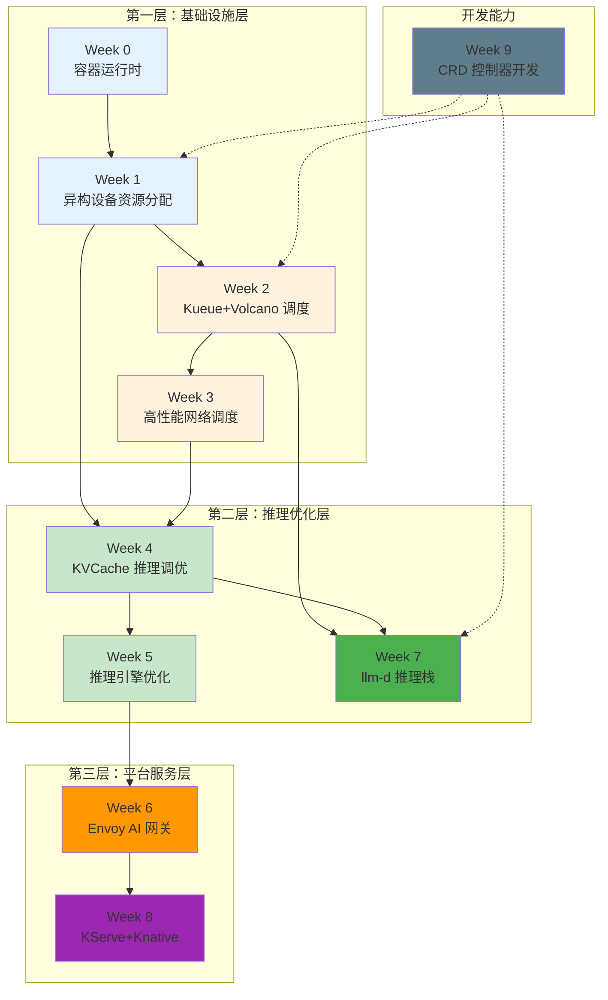
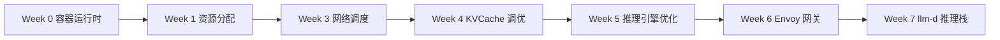
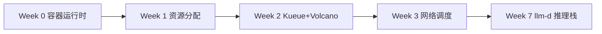
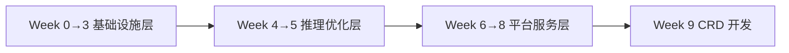

# 🚀 AI Infra 学习教程

> [!TIP]
> ⚠️ **阅读提示**：本项目包含大量 YAML 配置文件和 Go 代码文件，请使用 **VSCode** 打开项目目录进行阅读。通用 Markdown 阅读器（包括 GitHub 网页端）对嵌入的代码块渲染可能显示异常，代码缩进、对齐、表格等格式会错乱。VSCode 的 Markdown All in One 或 Markdown Preview Enhanced 插件可提供更佳的阅读体验。

> 聚焦 **推理部署** 与 **资源调度**，系统学习 Kubernetes AI 基础设施的完整技术栈。

---

## 📖 项目简介

本教程围绕 **AI Infra（AI 基础设施）** 领域，从底层容器运行时到上层推理服务平台，提供 10 个专题的系统化学习路径。

### 当前重点领域

```
┌─────────────────────────────────────────────────────────────────┐
│                    AI Infra 核心关注点                           │
├─────────────────────────────────────────────────────────────────┤
│  🔹 推理部署优化  - KVCache 管理、推理引擎调优、PD 分离架构       │
│  🔹 资源调度      - GPU 分配、任务队列、网络拓扑感知、自动缩放     │
└─────────────────────────────────────────────────────────────────┘
```

随着大模型推理服务规模化，AI Infra 的核心挑战在于：
- **推理部署**：如何高效管理 KVCache、优化推理引擎吞吐、实现 PD 分离架构
- **资源调度**：如何在多租户 GPU 集群中公平分配资源、感知网络拓扑、自动扩缩容

---

## 🗺️ 学习路线图



---

## 📋 各模块详情

### Week 0: Kubernetes 容器运行时

| 属性 | 内容 |
|------|------|
| **主题** | CRI 接口、containerd/CRI-O 部署、GPU 运行时 |
| **建议周期** | 3-5 天 |
| **难度** | ⭐⭐ |
| **核心收获** | 理解 kubelet 与运行时的通信机制，掌握 GPU 容器运行时配置 |
| **推荐开源项目** | [containerd](https://github.com/containerd/containerd) · [CRI-O](https://github.com/cri-o/cri-o) · [NVIDIA Container Toolkit](https://github.com/NVIDIA/nvidia-container-toolkit) |

---

### Week 1: 异构设备资源分配调度

| 属性 | 内容 |
|------|------|
| **主题** | Device Plugin、GPU 感知调度器、DRA 声明式资源管理 |
| **建议周期** | 5-7 天 |
| **难度** | ⭐⭐⭐ |
| **核心收获** | 掌握 GPU 设备发现→分配→注入完整链路，理解从 Device Plugin 到 DRA 的演进 |
| **推荐开源项目** | [NVIDIA k8s-device-plugin](https://github.com/NVIDIA/k8s-device-plugin) · [NVIDIA k8s-dra-driver-gpu](https://github.com/NVIDIA/k8s-dra-driver-gpu) · [CDI Specification](https://github.com/cncf-tags/container-device-interface) |

---

### Week 2: Kueue + Volcano AI 任务调度

| 属性 | 内容 |
|------|------|
| **主题** | 任务队列管理、Gang Scheduling、多租户资源配额 |
| **建议周期** | 5-7 天 |
| **难度** | ⭐⭐⭐ |
| **核心收获** | 理解 Kueue 队列模型与 Volcano 批处理调度，掌握混合工作负载调度方案 |
| **推荐开源项目** | [kueue](https://github.com/kubernetes-sigs/kueue) · [volcano-sh/volcano](https://github.com/volcano-sh/volcano) |

---

### Week 3: 高性能网络调度

| 属性 | 内容 |
|------|------|
| **主题** | RDMA 设备管理、网络拓扑感知调度、多节点低延迟部署 |
| **建议周期** | 5-7 天 |
| **难度** | ⭐⭐⭐⭐ |
| **核心收获** | 掌握 RDMA/RoCE 原理，实现 NUMA/机架/交换机拓扑感知调度 |
| **推荐开源项目** | [Mellanox/rdma-cni](https://github.com/Mellanox/rdma-cni) · [SR-IOV Device Plugin](https://github.com/k8snetworkplumbingwg/sriov-network-device-plugin) · [NVIDIA NCCL](https://github.com/NVIDIA/nccl) |

---

### Week 4: KVCache 推理部署调优

| 属性 | 内容 |
|------|------|
| **主题** | Mooncake / LMCache / HiCache 三大 KVCache 方案 |
| **建议周期** | 7-10 天 |
| **难度** | ⭐⭐⭐⭐ |
| **核心收获** | 理解 KVCache 存储卸载、跨实例共享、RDMA 零拷贝传输、PD 分离架构 |
| **推荐开源项目** | [kvcache-ai/Mooncake](https://github.com/kvcache-ai/Mooncake) · [lmcache/LMCache](https://github.com/lmcache/lmcache) · [SGLang HiCache](https://docs.sglang.io/docs/advanced_features/hicache_design) |

---

### Week 5: 推理引擎优化

| 属性 | 内容 |
|------|------|
| **主题** | vLLM / SGLang 吞吐量优化策略 |
| **建议周期** | 7-10 天 |
| **难度** | ⭐⭐⭐⭐ |
| **核心收获** | 掌握 PagedAttention/RadixAttention、推测解码、量化、PD 分离等优化技术 |
| **推荐开源项目** | [vllm-project/vllm](https://github.com/vllm-project/vllm) · [sgl-project/sglang](https://github.com/sgl-project/sglang) |

---

### Week 6: Envoy AI 网关

| 属性 | 内容 |
|------|------|
| **主题** | xDS 控制面、流量管理、限流、可观测性、安全认证、Wasm 扩展 |
| **建议周期** | 7-10 天 |
| **难度** | ⭐⭐⭐⭐ |
| **核心收获** | 掌握 AI 场景网关设计，实现模型灰度发布、Token 限流、TTFT 监控 |
| **推荐开源项目** | [envoyproxy/envoy](https://github.com/envoyproxy/envoy) · [envoyproxy/gateway](https://github.com/envoyproxy/gateway) · [Gloo Gateway](https://github.com/solo-io/gloo) · [LiteLLM](https://github.com/BerriAI/litellm) |

---

### Week 7: llm-d 推理服务栈

| 属性 | 内容 |
|------|------|
| **主题** | EPP 推理调度器、KV 缓存索引、WVA 自动缩放器 |
| **建议周期** | 7-10 天 |
| **难度** | ⭐⭐⭐⭐⭐ |
| **核心收获** | 理解 CNCF llm-d 项目架构，掌握前缀缓存感知路由、饱和度驱动扩缩容 |
| **推荐开源项目** | [llm-d/llm-d-inference-scheduler](https://github.com/llm-d/llm-d-inference-scheduler) · [llm-d/llm-d-kv-cache](https://github.com/llm-d/llm-d-kv-cache) · [llm-d/llm-d-workload-variant-autoscaler](https://github.com/llm-d/llm-d-workload-variant-autoscaler) |

---

### Week 8: KServe + Knative 推理部署

| 属性 | 内容 |
|------|------|
| **主题** | 模型服务抽象、自动扩缩容、流量路由、灰度发布 |
| **建议周期** | 5-7 天 |
| **难度** | ⭐⭐⭐ |
| **核心收获** | 掌握云原生 AI 推理平台搭建，实现 Scale-to-Zero 和 Canary 发布 |
| **推荐开源项目** | [kserve/kserve](https://github.com/kserve/kserve) · [knative/serving](https://github.com/knative/serving) |

---

### Week 9: CRD & Controller 开发

| 属性 | 内容 |
|------|------|
| **主题** | 自定义资源定义、控制器开发最佳实践、生产部署 |
| **建议周期** | 5-7 天 |
| **难度** | ⭐⭐⭐ |
| **核心收获** | 掌握 Kubernetes 控制器开发全流程，能够开发 AI Infra 自定义资源 |
| **推荐开源项目** | [controller-runtime](https://github.com/kubernetes-sigs/controller-runtime) · [Kubeflow](https://github.com/kubeflow/kubeflow) |

---

## 📊 快速导航总览

| Week | 模块 | 主题 | 周期 | 难度 |
|------|------|------|------|------|
| 0 | [容器运行时](week0%20容器运行时/) | CRI 接口、运行时部署、GPU 运行时 | 3-5天 | ⭐⭐ |
| 1 | [异构设备资源分配](week1%20异构设备资源分配调度/) | Device Plugin、GPU 调度器、DRA | 5-7天 | ⭐⭐⭐ |
| 2 | [Kueue+Volcano 调度](week2%20kueue%20+%20volcano%20调度/) | 队列管理、Gang Scheduling | 5-7天 | ⭐⭐⭐ |
| 3 | [高性能网络调度](week3%20高性能网络调度/) | RDMA、拓扑感知调度 | 5-7天 | ⭐⭐⭐⭐ |
| 4 | [KVCache 推理调优](week4%20kvcache推理部署调优/) | Mooncake/LMCache/HiCache | 7-10天 | ⭐⭐⭐⭐ |
| 5 | [推理引擎优化](week5%20推理引擎优化/) | vLLM/SGLang 优化 | 7-10天 | ⭐⭐⭐⭐ |
| 6 | [Envoy AI 网关](week6%20envoy-ai-gateway/) | xDS、限流、可观测性 | 7-10天 | ⭐⭐⭐⭐ |
| 7 | [llm-d 推理栈](week7%20llm-d-inference/) | EPP、KV 索引、WVA 缩放 | 7-10天 | ⭐⭐⭐⭐⭐ |
| 8 | [KServe+Knative](week8%20kserve-knative/) | 模型服务、自动缩放 | 5-7天 | ⭐⭐⭐ |
| 9 | [CRD 控制器开发](week9%20crd-controller/) | CRD、Controller 开发 | 5-7天 | ⭐⭐⭐ |

> **总学习周期**：约 50-75 天（按每周 5-7 天计，约 8-12 周完成）

---

## 🎯 推荐学习路径

### 路径一：推理部署专项（推荐）



**适合**：推理平台开发工程师、MLOps 工程师

### 路径二：资源调度专项



**适合**：Kubernetes 平台工程师、调度系统开发工程师

### 路径三：全栈 AI Infra



**适合**：AI Infra 架构师、技术负责人

---

## 📚 前置知识要求

| 领域 | 要求 |
|------|------|
| **Kubernetes** | 熟悉 Pod、Deployment、Service、ConfigMap 等核心概念 |
| **容器技术** | 理解 Docker/containerd 基本操作 |
| **Go 语言** | Week 9 需要 Go 基础（控制器开发） |
| **Python** | Week 5 推理引擎优化需要 Python 基础 |
| **网络基础** | Week 3 需要 TCP/IP、RDMA 基础概念 |

---

## 🔗 技术生态关联

```
┌────────────────────────────────────────────────────────────────────┐
│                        AI Infra 技术生态                            │
├────────────────────────────────────────────────────────────────────┤
│                                                                     │
│   Kubernetes ──► Device Plugin ──► GPU 调度器 ──► Kueue/Volcano    │
│       │              │                  │                          │
│       ▼              ▼                  ▼                          │
│   containerd    RDMA/RoCE 网络      推理服务部署                    │
│       │              │                  │                          │
│       └──────────────┴──────────────────┤                          │
│                                         ▼                          │
│                              ┌─────────────────────┐               │
│                              │   推理服务全链路     │               │
│                              ├─────────────────────┤               │
│                              │ Gateway (Envoy)     │◄── Week 6     │
│                              │ Inference Scheduler │◄── Week 7     │
│                              │ KVCache Management  │◄── Week 4     │
│                              │ Inference Engine    │◄── Week 5     │
│                              │ Model Serving       │◄── Week 8     │
│                              └─────────────────────┘               │
│                                         │                          │
│                                         ▼                          │
│                              ┌─────────────────────┐               │
│                              │  自定义控制器开发    │◄── Week 9     │
│                              └─────────────────────┘               │
│                                                                     │
└────────────────────────────────────────────────────────────────────┘
```

---

## 📝 学习建议

1. **按层递进**：先掌握基础设施层（Week 0-3），再深入推理优化层（Week 4-5），最后学习平台服务层（Week 6-8）
2. **理论与实践结合**：每个模块包含理论文档 + 代码示例 + 部署清单，建议动手实践
3. **关注开源项目源码**：每个模块推荐了相关开源项目，源码研读能加深理解
4. **建立知识关联**：注意模块间的依赖关系（如 Week 3 网络调度是 Week 4 KVCache 传输的基础）
5. **根据角色选路径**：不同岗位关注点不同，选择适合的学习路径

---

## 📂 项目结构

```
ai-infra-note/
│
├── README.md                          # 📖 本文件 - 整体介绍
│
├── week0 容器运行时/                  # Week 0: 容器运行时
│   ├── 01-kubernetes-container-runtime.md  # 概览
│   ├── docs/                          # 详解文档
│   ├── manifests/                     # 配置示例
│   └── scripts/                       # 诊断脚本
│
├── week1 异构设备资源分配调度/        # Week 1: GPU 资源分配
│   ├── 02-gpu-resource-allocation.md  # 概览
│   ├── 1.1device-plugin/              # Device Plugin
│   ├── 1.2gpu-scheduler/              # GPU 调度器
│   ├── 1.3dra-gpu-example/            # DRA 示例
│   └── docs/                          # 详解文档
│
├── week2 kueue + volcano 调度/        # Week 2: 任务调度
│   ├── 03-ai-job-scheduling.md        # 概览
│   ├── 2.1kueue/                      # Kueue
│   ├── 2.2volcano/                    # Volcano
│   ├── 2.3kueue-volcano/              # 结合方案
│   └── docs/                          # 详解文档
│
├── week3 高性能网络调度/              # Week 3: 网络调度
│   ├── 04-high-performance-networking.md  # 概览
│   ├── 3.1rdma-device-plugin/         # RDMA 设备插件
│   ├── 3.2network-topology-scheduler/ # 拓扑感知调度
│   ├── 3.3multi-node-deployment/      # 多节点部署
│   └── docs/                          # 详解文档
│
├── week4 kvcache推理部署调优/         # Week 4: KVCache 调优
│   ├── 05-kvcache-inference-optimization.md  # 概览
│   ├── 4.1mooncake/                   # Mooncake
│   ├── 4.2lmcache/                    # LMCache
│   ├── 4.3hicache/                    # HiCache
│   └── docs/                          # 详解文档
│
├── week5 推理引擎优化/                # Week 5: 推理引擎优化
│   ├── 06-inference-engine-optimization.md  # 概览
│   └── docs/                          # 详解文档
│
├── week6 envoy-ai-gateway/            # Week 6: Envoy AI 网关
│   ├── 07-envoy-ai-gateway.md         # 概览
│   ├── 6.1xds-control-plane/          # xDS 控制面
│   ├── 6.2traffic-management/         # 流量管理
│   ├── 6.3rate-limiting/              # 智能限流
│   ├── 6.4observability/              # 可观测性
│   ├── 6.5security-auth/              # 安全认证
│   ├── 6.6wasm-extensions/            # Wasm 扩展
│   └── docs/                          # 详解文档
│
├── week7 llm-d-inference/             # Week 7: llm-d 推理栈
│   ├── 08-llm-d-inference-stack.md    # 概览
│   ├── inference-scheduler/           # 推理调度器
│   ├── kv-cache/                      # KV 缓存索引
│   ├── autoscaler/                    # 自动缩放器
│   └── docs/                          # 详解文档
│
├── week8 kserve-knative/              # Week 8: KServe+Knative
│   ├── 09-kserve-knative-serving.md   # 概览
│   └── docs/                          # 详解文档
│
└── week9 crd-controller/              # Week 9: CRD 控制器开发
    ├── 10-crd-controller-development.md  # 概览
    ├── cmd/                           # 控制器入口
    ├── pkg/                           # 核心代码
    ├── manifests/                     # 部署清单
    └── docs/                          # 详解文档
```

---

## 🤝 贡献与反馈

本教程持续更新中，欢迎：
- 📝 提交 PR 补充内容或修正错误
- 💬 提出学习建议或问题反馈
- 🔗 分享你的学习心得和实践案例

---

> **开始学习**：建议从 [Week 0 容器运行时](week0%20容器运行时/) 开始，理解 CRI 接口是整个 AI Infra 技术栈的基石。