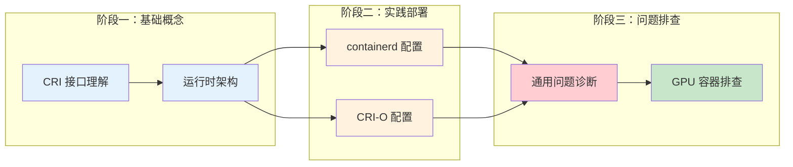
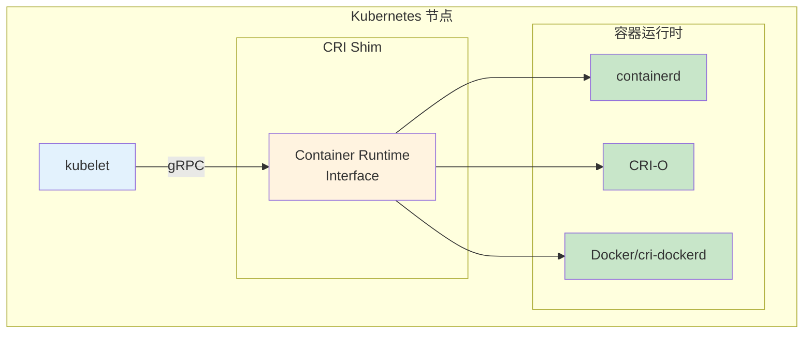

# Kubernetes 容器运行时详解

> 深入理解 Kubernetes CRI 接口、主流运行时部署配置、问题排查及 GPU 运行时实现原理。

---

## 快速导航

| 文件 | 说明 |
|------|------|
| [docs/README.md](docs/README.md) | 📖 **完整学习文档** - 容器运行时核心概念与架构 |
| [docs/cri-interface.md](docs/cri-interface.md) | 🔌 **CRI 接口详解** - kubelet 与运行时的通信协议 |
| [docs/runtime-deployment.md](docs/runtime-deployment.md) | ⚙️ **运行时部署配置** - containerd/CRI-O 安装与配置 |
| [docs/troubleshooting.md](docs/troubleshooting.md) | 🔧 **问题排查** - 常见问题场景与诊断方法 |
| [docs/nvidia-toolkit.md](docs/nvidia-toolkit.md) | 🎮 **NVIDIA Toolkit** - GPU 运行时原理与排查 |

---

## 核心特性

```
┌─────────────────────────────────────────────────────────────────┐
│                    Kubernetes 容器运行时学习路径                    │
├─────────────────────────────────────────────────────────────────┤
│  ✅ CRI 接口     - RuntimeService/ImageService 核心接口定义       │
│  ✅ 运行时部署    - containerd、CRI-O 安装配置与调优               │
│  ✅ 问题排查     - 日志分析、诊断命令、常见错误处理                 │
│  ✅ GPU 运行时   - NVIDIA Toolkit 架构与 CDI 模式实现             │
└─────────────────────────────────────────────────────────────────┘
```

---

## 学习路径



---

## 项目结构

```
week0-container-runtime/
├── README.md                           # 概览层文档
│
├── docs/
│   ├── README.md                       # 完整学习文档入口
│   ├── cri-interface.md                # CRI 接口详解
│   ├── runtime-deployment.md           # 运行时部署配置
│   ├── troubleshooting.md              # 问题定位排查
│   └── nvidia-toolkit.md               # NVIDIA Toolkit 原理
│
├── manifests/
│   ├── containerd/                     # containerd 配置示例
│   ├── crio/                           # CRI-O 配置示例
│   └── nvidia/                         # NVIDIA 运行时配置示例
│
└── scripts/
    └── diagnose/                       # 诊断脚本
```

---

## 核心内容概览

### 1. CRI 接口



**核心接口：**
- `RuntimeService`：Pod/容器生命周期管理
- `ImageService`：镜像拉取/删除/列表

### 2. 运行时对比

| 特性 | containerd | CRI-O | Docker |
|------|------------|-------|--------|
| 架构 | 独立运行时 | 专为 K8s 设计 | 完整容器平台 |
| 资源占用 | 低 | 低 | 较高 |
| 配置复杂度 | 中等 | 简单 | 简单 |
| GPU 支持 | 原生 CDI | 原生 CDI | nvidia-runtime |

### 3. 问题排查命令

```bash
# 查看运行时状态
crictl info

# 列出 Pod
crictl pods

# 查看容器日志
crictl logs <container-id>

# 查看运行时日志
journalctl -u containerd -f
```

---

## 前置知识

| 知识点 | 要求 |
|--------|------|
| Kubernetes 基础 | 了解 Pod、Node、kubelet 概念 |
| Linux 系统 | 熟悉 systemd、journalctl |
| 容器基础 | 理解镜像、容器、OCI 规范 |

---

## 推荐学习顺序

1. **理解 CRI 接口** → [docs/cri-interface.md](docs/cri-interface.md)
2. **部署配置运行时** → [docs/runtime-deployment.md](docs/runtime-deployment.md)
3. **掌握问题排查** → [docs/troubleshooting.md](docs/troubleshooting.md)
4. **深入 GPU 运行时** → [docs/nvidia-toolkit.md](docs/nvidia-toolkit.md)

---

> 开始学习：推荐从 [docs/cri-interface.md](docs/cri-interface.md) 开始，理解 CRI 接口是后续学习的基础。