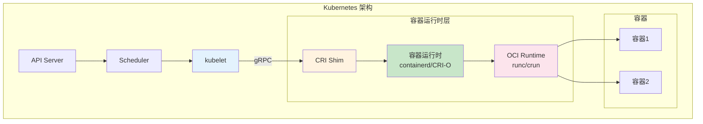
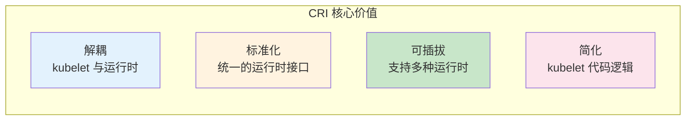
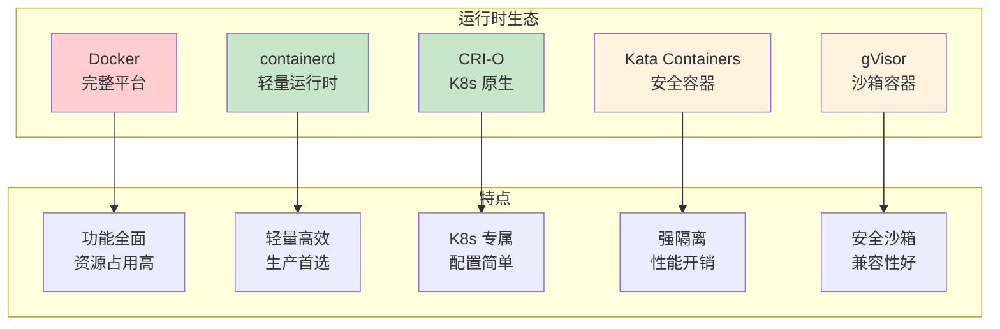
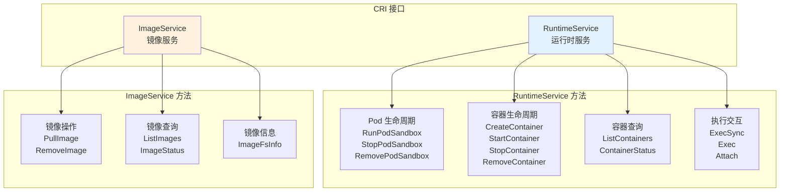
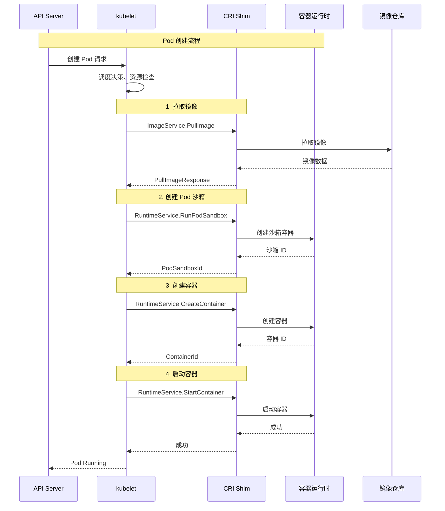
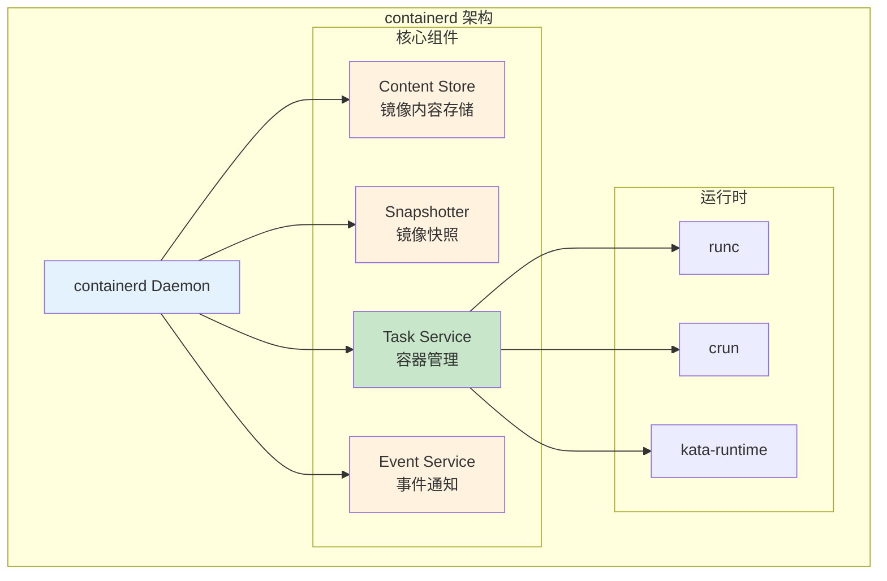
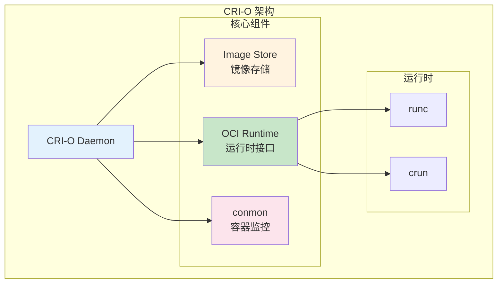
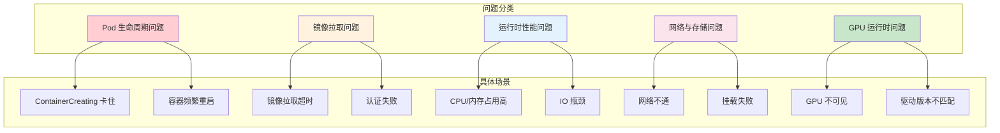
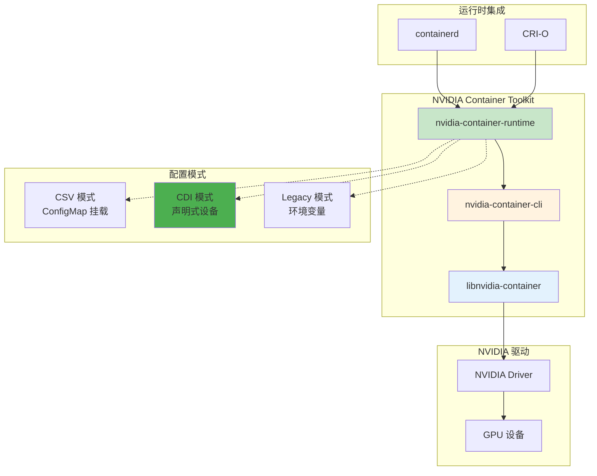
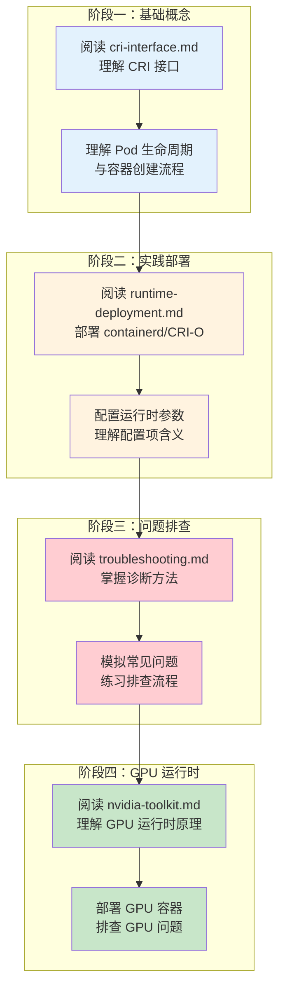

# Kubernetes 容器运行时完整学习指南

> 本文档系统介绍 Kubernetes 容器运行时接口（CRI）、主流运行时部署配置、问题排查方法，以及 NVIDIA GPU 运行时的实现原理。

---

## 目录

- [1. 概述](#1-概述)
- [2. CRI 接口架构](#2-cri-接口架构)
- [3. 运行时部署与配置](#3-运行时部署与配置)
- [4. 问题定位与排查](#4-问题定位与排查)
- [5. GPU 运行时原理](#5-gpu-运行时原理)
- [6. 学习路径](#6-学习路径)
- [附录](#附录)

---

## 1. 概述

### 1.1 什么是容器运行时

容器运行时是负责执行容器生命周期的软件组件，它负责：
- 创建、启动、停止容器
- 拉取和管理镜像
- 配置容器网络
- 挂载存储卷



### 1.2 CRI 的出现背景

在 Kubernetes 早期，kubelet 通过 Docker API 直接操作 Docker 守护进程。这种设计存在以下问题：

| 问题 | 说明 |
|------|------|
| **强耦合** | kubelet 与 Docker 绑定，难以支持其他运行时 |
| **抽象泄漏** | Docker 特有概念影响 Kubernetes 设计 |
| **性能开销** | Docker daemon 引入额外开销 |
| **兼容性** | Docker 接口变更影响 Kubernetes 稳定性 |

为解决这些问题，Kubernetes 引入了 **CRI（Container Runtime Interface）** 抽象层。

### 1.3 CRI 核心价值



**核心价值：**

1. **解耦**：kubelet 只需要调用 CRI 接口，不关心具体运行时实现
2. **标准化**：定义统一的接口规范，便于不同运行时接入
3. **可插拔**：支持 containerd、CRI-O、Docker 等多种运行时
4. **简化**：kubelet 代码更清晰，职责更明确

### 1.4 主流容器运行时



| 运行时 | 定位 | 优势 | 适用场景 |
|--------|------|------|----------|
| **containerd** | 生产级运行时 | 稳定、高效、社区活跃 | 生产环境首选 |
| **CRI-O** | K8s 原生运行时 | 轻量、简单、OCI 兼容 | Kubernetes 专用 |
| **Docker** | 完整容器平台 | 功能丰富、工具链完善 | 开发环境 |
| **Kata** | 安全容器 | 强隔离、虚拟机级别安全 | 安全敏感场景 |
| **gVisor** | 沙箱容器 | 用户态内核、安全隔离 | 多租户场景 |

---

## 2. CRI 接口架构

### 2.1 接口组成

CRI 由两个核心服务接口组成：



### 2.2 调用流程



### 2.3 详细文档

| 文档 | 内容 |
|------|------|
| [cri-interface.md](cri-interface.md) | CRI 接口详解，包含完整接口定义和调用示例 |

---

## 3. 运行时部署与配置

### 3.1 containerd



**核心配置文件：** `/etc/containerd/config.toml`

### 3.2 CRI-O



**核心配置文件：** `/etc/crio/crio.conf`

### 3.3 运行时对比

| 特性 | containerd | CRI-O |
|------|------------|-------|
| **设计理念** | 通用容器运行时 | Kubernetes 专用 |
| **配置复杂度** | 中等（config.toml） | 简单（crio.conf） |
| **镜像存储** | 多种 Snapshotter | OverlayFS 为主 |
| **GPU 支持** | CDI 原生支持 | CDI 原生支持 |
| **资源占用** | 较低 | 更低 |
| **社区活跃度** | 高（CNCF 毕业） | 高（CNCF 孵化） |
| **企业支持** | Docker、AWS 等 | Red Hat |

### 3.4 详细文档

| 文档 | 内容 |
|------|------|
| [runtime-deployment.md](runtime-deployment.md) | containerd、CRI-O 详细部署配置 |

---

## 4. 问题定位与排查

### 4.1 常见问题分类



### 4.2 诊断工具

| 工具 | 用途 | 示例命令 |
|------|------|----------|
| **crictl** | CRI 诊断 | `crictl pods`, `crictl ps` |
| **journalctl** | 日志查看 | `journalctl -u containerd -f` |
| **nsenter** | 进入命名空间 | `nsenter -t <pid> -n` |
| **strace** | 系统调用追踪 | `strace -p <pid>` |
| **perf** | 性能分析 | `perf top` |

### 4.3 详细文档

| 文档 | 内容 |
|------|------|
| [troubleshooting.md](troubleshooting.md) | 完整问题排查指南，包含场景实例 |

---

## 5. GPU 运行时原理

### 5.1 NVIDIA Container Toolkit 架构



### 5.2 配置模式对比

| 模式 | 工作方式 | 优势 | 劣势 |
|------|----------|------|------|
| **CDI** | 声明式设备描述 | 标准化、可移植 | 需要 CRI 支持 |
| **CSV** | ConfigMap 挂载 | 配置集中管理 | 需要 Device Plugin |
| **Legacy** | 环境变量注入 | 简单直接 | 配置分散 |

### 5.3 详细文档

| 文档 | 内容 |
|------|------|
| [nvidia-toolkit.md](nvidia-toolkit.md) | NVIDIA Toolkit 原理、配置与问题排查 |

---

## 6. 学习路径

### 6.1 推荐学习顺序



### 6.2 学习资源

| 资源 | 链接 | 说明 |
|------|------|------|
| CRI 官方文档 | https://github.com/kubernetes/cri-api | 接口定义与说明 |
| containerd 文档 | https://containerd.io/docs/ | 安装与配置指南 |
| CRI-O 文档 | https://cri-o.io/ | 部署与运维指南 |
| NVIDIA Toolkit | https://docs.nvidia.com/datacenter/cloud-native/ | GPU 容器运行时文档 |

---

## 附录

### A. 快速参考命令

```bash
# ============================================================
# crictl 常用命令
# ============================================================

# 查看 Pod 列表
crictl pods

# 查看容器列表
crictl ps -a

# 查看运行时信息
crictl info

# 拉取镜像
crictl pull <image>

# 查看容器日志
crictl logs <container-id>

# 执行容器命令
crictl exec -it <container-id> <command>

# 查看容器状态
crictl inspect <container-id>

# ============================================================
# 运行时日志查看
# ============================================================

# containerd 日志
journalctl -u containerd -f

# CRI-O 日志
journalctl -u crio -f

# kubelet 日志
journalctl -u kubelet -f
```

### B. 配置文件位置

| 运行时 | 配置文件 |
|--------|----------|
| containerd | `/etc/containerd/config.toml` |
| CRI-O | `/etc/crio/crio.conf` |
| NVIDIA Toolkit | `/etc/nvidia-container-runtime/config.toml` |
| kubelet | `/var/lib/kubelet/config.yaml` |

### C. 故障排查清单

| 问题类型 | 检查项 |
|----------|--------|
| Pod 无法启动 | 1. 检查镜像是否存在<br/>2. 检查资源是否充足<br/>3. 查看运行时日志 |
| 镜像拉取失败 | 1. 检查网络连通性<br/>2. 检查认证信息<br/>3. 检查镜像仓库状态 |
| GPU 不可用 | 1. 检查驱动是否安装<br/>2. 检查运行时配置<br/>3. 验证设备挂载 |
| 性能问题 | 1. 检查 CPU/内存使用<br/>2. 检查 IO 等待<br/>3. 分析运行时瓶颈 |

---

> 继续学习：建议从 [cri-interface.md](cri-interface.md) 开始，深入理解 CRI 接口是后续学习的基础。