# Kubernetes CRI 接口详解

> 本文档详细介绍 Kubernetes Container Runtime Interface（CRI）的接口定义、调用流程和核心能力。

---

## 目录

- [1. CRI 概述](#1-cri-概述)
- [2. 接口定义](#2-接口定义)
- [3. RuntimeService 接口](#3-runtimeservice-接口)
- [4. ImageService 接口](#4-imageservice-接口)
- [5. Pod 生命周期管理](#5-pod-生命周期管理)
- [6. 容器生命周期管理](#6-容器生命周期管理)
- [7. crictl 工具详解](#7-crictl-工具详解)
- [8. 最佳实践](#8-最佳实践)

---

## 1. CRI 概述

### 1.1 什么是 CRI

CRI（Container Runtime Interface）是 Kubernetes 定义的一组 gRPC 接口，用于 kubelet 与容器运行时之间的通信。

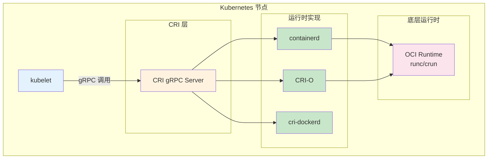

### 1.2 CRI 设计目标


| 目标 | 说明 | 实现 |
|------|------|------|
| **标准化** | 定义统一的运行时接口规范 | gRPC + Protocol Buffers |
| **解耦** | kubelet 不依赖特定运行时 | CRI Shim 抽象层 |
| **可扩展** | 支持多种运行时接入 | 接口定义 + 插件机制 |
| **简化** | 减少 kubelet 运行时相关代码 | 通用接口调用 |

### 1.3 CRI 接口组成

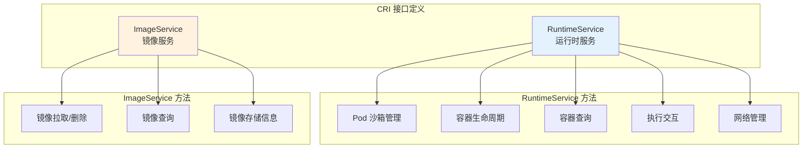

---

## 2. 接口定义

### 2.1 gRPC 服务定义

CRI 使用 gRPC 定义两个核心服务：

```protobuf
// ============================================================
// RuntimeService - 容器和 Pod 生命周期管理
// ============================================================

service RuntimeService {
    // Pod 沙箱管理
    rpc RunPodSandbox(RunPodSandboxRequest) returns (RunPodSandboxResponse) {}
    rpc StopPodSandbox(StopPodSandboxRequest) returns (StopPodSandboxResponse) {}
    rpc RemovePodSandbox(RemovePodSandboxRequest) returns (RemovePodSandboxResponse) {}
    rpc ListPodSandbox(ListPodSandboxRequest) returns (ListPodSandboxResponse) {}
    rpc PodSandboxStatus(PodSandboxStatusRequest) returns (PodSandboxStatusResponse) {}

    // 容器生命周期
    rpc CreateContainer(CreateContainerRequest) returns (CreateContainerResponse) {}
    rpc StartContainer(StartContainerRequest) returns (StartContainerResponse) {}
    rpc StopContainer(StopContainerRequest) returns (StopContainerResponse) {}
    rpc RemoveContainer(RemoveContainerRequest) returns (RemoveContainerResponse) {}
    rpc ListContainers(ListContainersRequest) returns (ListContainersResponse) {}
    rpc ContainerStatus(ContainerStatusRequest) returns (ContainerStatusResponse) {}

    // 执行交互
    rpc ExecSync(ExecSyncRequest) returns (ExecSyncResponse) {}
    rpc Exec(ExecRequest) returns (ExecResponse) {}
    rpc Attach(AttachRequest) returns (AttachResponse) {}
    rpc PortForward(PortForwardRequest) returns (PortForwardResponse) {}

    // 其他
    rpc UpdateContainerResources(UpdateContainerResourcesRequest) 
        returns (UpdateContainerResourcesResponse) {}
    rpc Version(VersionRequest) returns (VersionResponse) {}
    rpc Status(StatusRequest) returns (StatusResponse) {}
}

// ============================================================
// ImageService - 镜像管理
// ============================================================

service ImageService {
    rpc ListImages(ListImagesRequest) returns (ListImagesResponse) {}
    rpc ImageStatus(ImageStatusRequest) returns (ImageStatusResponse) {}
    rpc PullImage(PullImageRequest) returns (PullImageResponse) {}
    rpc RemoveImage(RemoveImageRequest) returns (RemoveImageResponse) {}
    rpc ImageFsInfo(ImageFsInfoRequest) returns (ImageFsInfoResponse) {}
}
```

### 2.2 接口版本演进

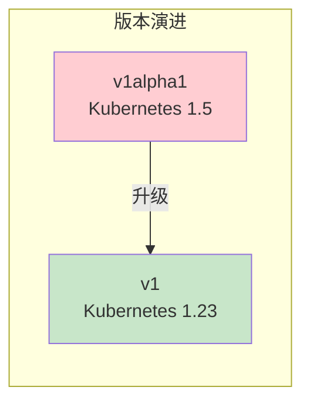

| 版本 | Kubernetes 版本 | 变化 |
|------|-----------------|------|
| **v1alpha1** | 1.5 - 1.22 | 初始版本，部分接口不稳定 |
| **v1** | 1.23+ | 稳定版本，接口冻结 |

### 2.3 Socket 通信

kubelet 通过 Unix Socket 与运行时通信：

| 运行时 | Socket 路径 |
|--------|-------------|
| containerd | `/run/containerd/containerd.sock` |
| CRI-O | `/run/crio/crio.sock` |
| cri-dockerd | `/run/cri-dockerd.sock` |

```bash
# ============================================================
# 查看 Socket 文件
# ============================================================

ls -la /run/containerd/containerd.sock
ls -la /run/crio/crio.sock

# ============================================================
# 使用 grpcurl 直接调用 CRI
# ============================================================

grpcurl -plaintext unix:///run/containerd/containerd.sock \
    runtime.v1.RuntimeService/Version
```

---

## 3. RuntimeService 接口

### 3.1 Pod 沙箱管理

Pod 沙箱（Pod Sandbox）是 Pod 内所有容器共享的基础环境，包括：
- 共享的网络命名空间
- 共享的 IPC 命名空间
- 共享的 PID 命名空间（可选）
- Pod 级别的 cgroup

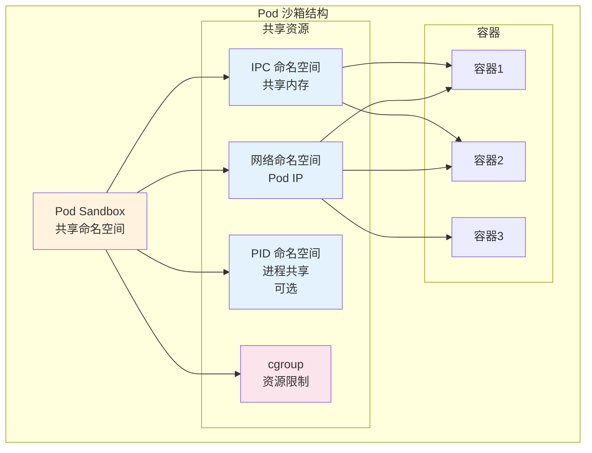

**核心方法：**

| 方法 | 功能 | 调用时机 |
|------|------|----------|
| `RunPodSandbox` | 创建 Pod 沙箱 | Pod 创建时首先调用 |
| `StopPodSandbox` | 停止 Pod 沙箱 | Pod 停止时调用 |
| `RemovePodSandbox` | 删除 Pod 沙箱 | Pod 删除时调用 |
| `ListPodSandbox` | 列出 Pod 沙箱 | kubelet 定期查询 |
| `PodSandboxStatus` | 查询沙箱状态 | 状态同步 |

### 3.2 RunPodSandbox 详解

```protobuf
// ============================================================
// RunPodSandboxRequest - 创建 Pod 氛围请求
// ============================================================

message RunPodSandboxRequest {
    // Pod 配置
    PodSandboxConfig config = 1;
    
    // 运行时处理器名称（可选）
    string runtime_handler = 2;
}

message RunPodSandboxResponse {
    // Pod 沙箱 ID
    string pod_sandbox_id = 1;
}

// ============================================================
// PodSandboxConfig - Pod 沙箱配置
// ============================================================

message PodSandboxConfig {
    // Pod 元数据
    PodSandboxMetadata metadata = 1;
    
    // 主机名
    string hostname = 2;
    
    // 日志目录
    string log_directory = 3;
    
    // DNS 配置
    DNSConfig dns_config = 4;
    
    // 端口映射
    repeated PortMapping port_mappings = 5;
    
    // 资源限制
    LinuxPodSandboxConfig linux = 6;
    
    // Labels 和 Annotations
    map<string, string> labels = 7;
    map<string, string> annotations = 8;
}
```

**调用示例：**

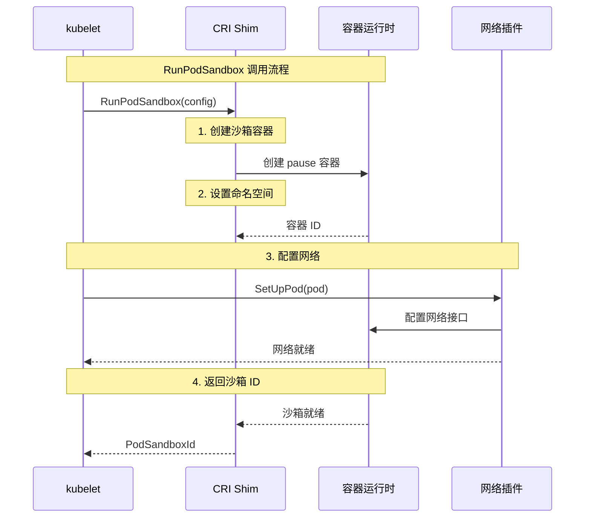

### 3.3 容器生命周期管理

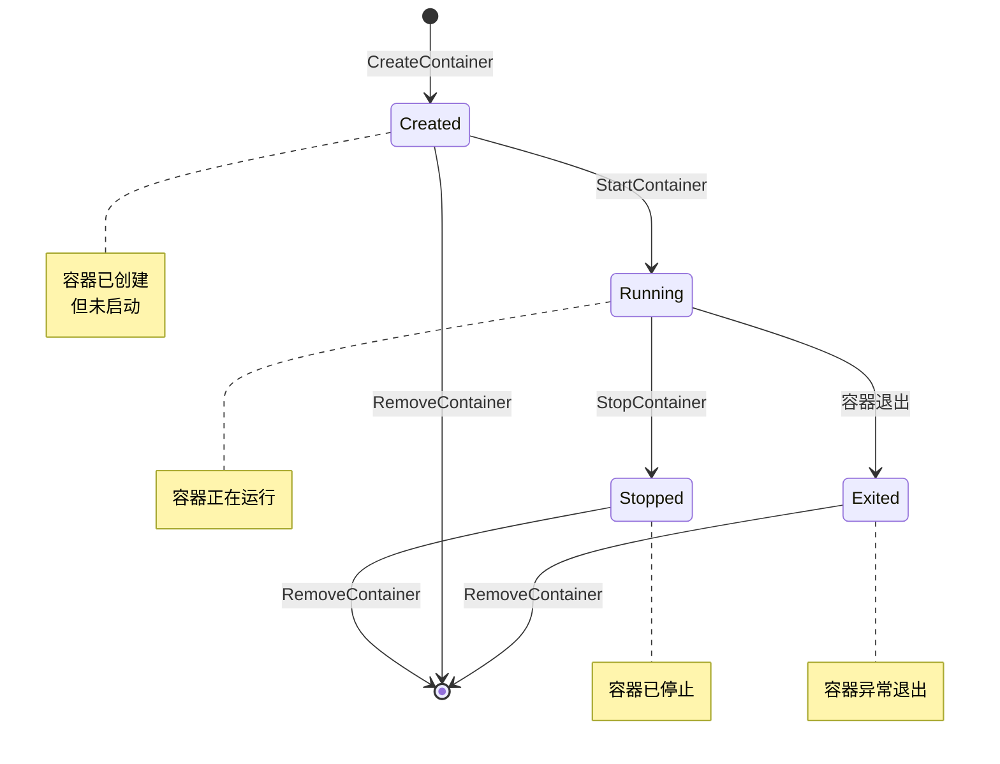

**核心方法：**

| 方法 | 功能 | 调用时机 |
|------|------|----------|
| `CreateContainer` | 创建容器 | Pod 沙箱创建后 |
| `StartContainer` | 启动容器 | 容器创建后 |
| `StopContainer` | 停止容器 | Pod 停止或容器异常 |
| `RemoveContainer` | 删除容器 | Pod 删除时 |
| `ListContainers` | 列出容器 | kubelet 定期查询 |
| `ContainerStatus` | 查询容器状态 | 状态同步 |

### 3.4 CreateContainer 详解

```protobuf
// ============================================================
// CreateContainerRequest - 创建容器请求
// ============================================================

message CreateContainerRequest {
    // Pod 沙箱 ID
    string pod_sandbox_id = 1;
    
    // 容器配置
    ContainerConfig config = 2;
    
    // 沙箱配置（用于继承）
    PodSandboxConfig sandbox_config = 3;
}

message CreateContainerResponse {
    // 容器 ID
    string container_id = 1;
}

// ============================================================
// ContainerConfig - 容器配置
// ============================================================

message ContainerConfig {
    // 容器元数据
    ContainerMetadata metadata = 1;
    
    // 镜像
    ImageSpec image = 2;
    
    // 命令
    repeated string command = 3;
    repeated string args = 4;
    
    // 工作目录
    string working_dir = 5;
    
    // 环境变量
    repeated KeyValue envs = 6;
    
    // 挂载点
    repeated Mount mounts = 7;
    
    // 设备
    repeated Device devices = 8;
    
    // 资源限制
    LinuxContainerResources resources = 9;
    
    // Labels 和 Annotations
    map<string, string> labels = 10;
    map<string, string> annotations = 11;
    
    // 日志路径
    string log_path = 12;
    
    // 是否 stdin/stdout
    bool stdin = 13;
    bool stdin_once = 14;
    bool tty = 15;
}
```

---

## 4. ImageService 接口

### 4.1 镜像管理方法

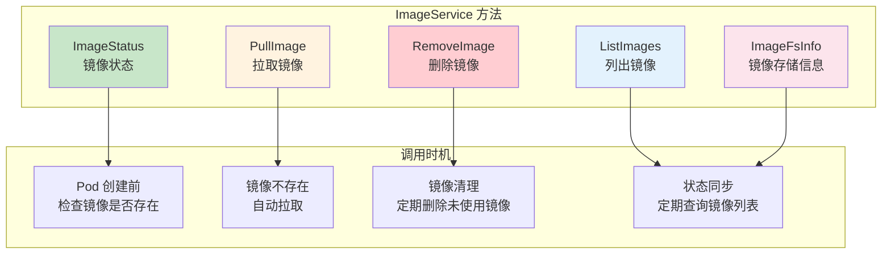

### 4.2 PullImage 详解

```protobuf
// ============================================================
// PullImageRequest - 拉取镜像请求
// ============================================================

message PullImageRequest {
    // 镜像规范
    ImageSpec image = 1;
    
    // 认证信息
    AuthConfig auth = 2;
    
    // 沙箱配置（用于继承）
    PodSandboxConfig sandbox_config = 3;
}

message PullImageResponse {
    // 镜像引用
    string image_ref = 1;
}

// ============================================================
// ImageSpec - 镜像规范
// ============================================================

message ImageSpec {
    // 镜像名称（如 nginx:latest）
    string image = 1;
    
    // Annotations
    map<string, string> annotations = 2;
}
```

**拉取流程：**

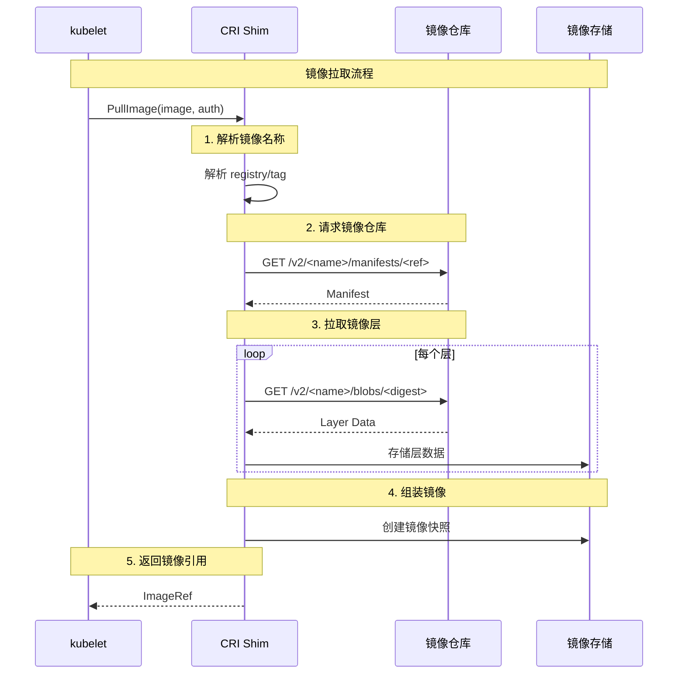

### 4.3 镜像存储结构

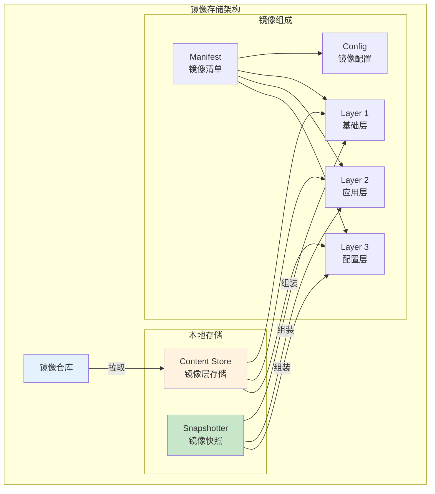

---

## 5. Pod 生命周期管理

### 5.1 Pod 创建完整流程

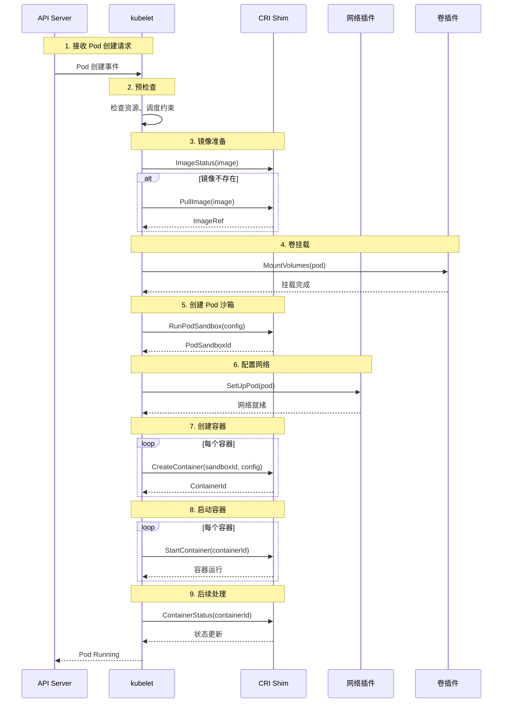

### 5.2 Pod 删除流程

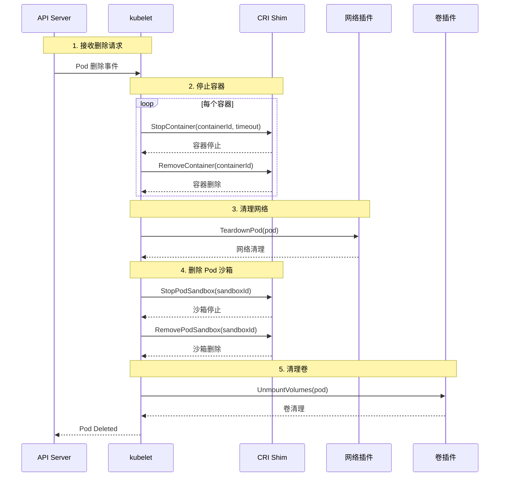

### 5.3 Pod 沙箱与容器关系

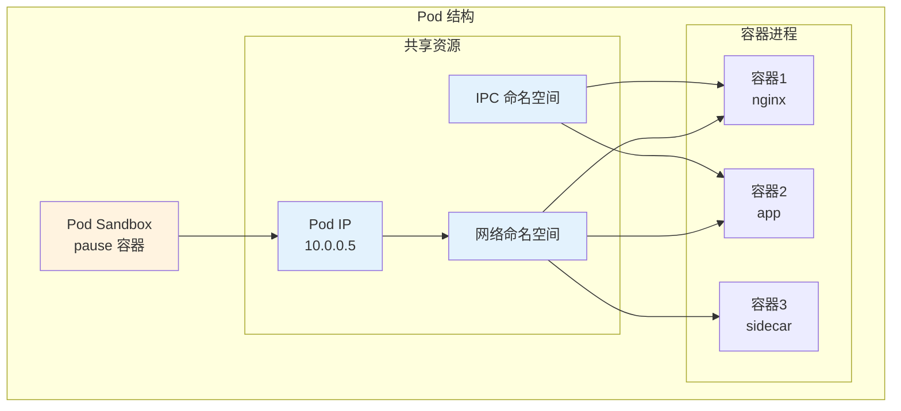

---

## 6. 容器生命周期管理

### 6.1 容器状态

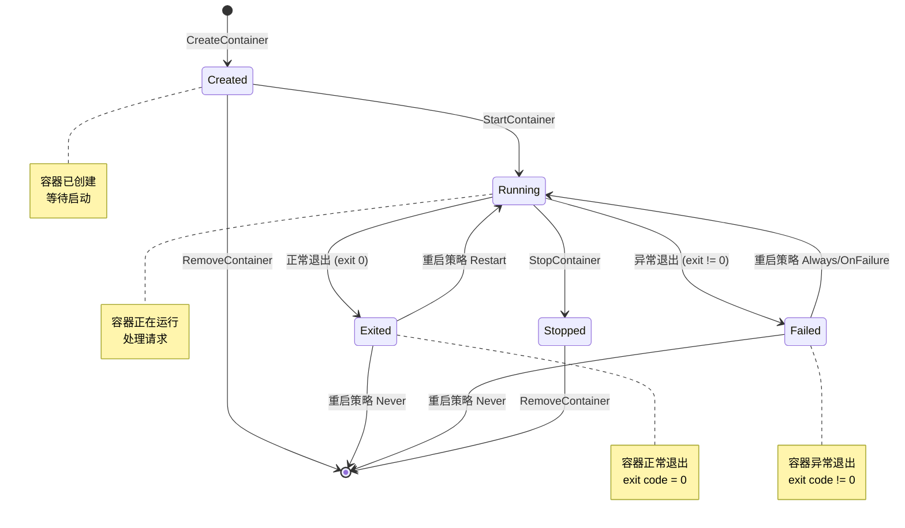

### 6.2 容器配置详解

```protobuf
// ============================================================
// LinuxContainerResources - Linux 容器资源限制
// ============================================================

message LinuxContainerResources {
    // CPU 限制
    int64 cpu_period = 1;      // CFS 周期（微秒）
    int64 cpu_quota = 2;       // CFS 配额（微秒）
    int64 cpu_shares = 3;      // CPU 权重
    int64 cpu_millicores = 4;  // CPU 核心数（毫核）
    
    // 内存限制
    int64 memory_limit_in_bytes = 5;
    int64 memory_swap_limit_in_bytes = 6;
    
    // OOM 控制
    int64 oom_score_adj = 7;   // OOM 分数调整
    
    // HugePages
    map<string, int64> hugepage_limits = 8;
    
    // 统一的资源限制（v1 新增）
    map<string, string> unified = 9;
}
```

### 6.3 挂载配置

```protobuf
// ============================================================
// Mount - 挂载配置
// ============================================================

message Mount {
    // 容器内路径
    string container_path = 1;
    
    // 主机路径
    string host_path = 2;
    
    // 只读挂载
    bool readonly = 3;
    
    // SELinux 重新标记
    string selinux_relabel = 4;
    
    // 传播模式
    MountPropagation propagation = 5;
}

enum MountPropagation {
    PROPAGATION_PRIVATE = 0;     // 私有挂载
    PROPAGATION_HOST_TO_CONTAINER = 1;  // 主机到容器传播
    PROPAGATION_BIDIRECTIONAL = 2;      // 双向传播
}
```

---

## 7. crictl 工具详解

### 7.1 crictl 概述

crictl 是 CRI 的命令行诊断工具，用于直接与容器运行时交互。

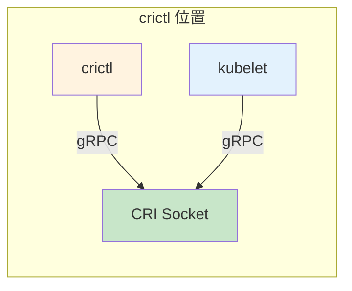

### 7.2 配置 crictl

```bash
# ============================================================
# crictl 配置
# ============================================================

# 配置运行时 socket
cat > /etc/crictl.yaml <<EOF
runtime-endpoint: unix:///run/containerd/containerd.sock
image-endpoint: unix:///run/containerd/containerd.sock
timeout: 10
debug: false
EOF

# 或者直接指定
crictl --runtime-endpoint unix:///run/containerd/containerd.sock pods
```

### 7.3 常用命令清单

```bash
# ============================================================
# Pod 相关命令
# ============================================================

# 列出 Pod
crictl pods

# 列出指定命名空间的 Pod
crictl pods --namespace kube-system

# 查看 Pod 状态
crictl inspectp <pod-id>

# 创建 Pod（测试）
crictl runp pod-config.json

# ============================================================
# 容器相关命令
# ============================================================

# 列出容器
crictl ps
crictl ps -a  # 包含已停止的

# 查看容器状态
crictl inspect <container-id>

# 查看容器日志
crictl logs <container-id>
crictl logs -f <container-id>  # 实时查看

# 在容器中执行命令
crictl exec <container-id> ls /
crictl exec -it <container-id> sh

# 停止容器
crictl stop <container-id>

# 删除容器
crictl rm <container-id>

# ============================================================
# 镜像相关命令
# ============================================================

# 列出镜像
crictl images

# 拉取镜像
crictl pull nginx:latest

# 删除镜像
crictl rmi nginx:latest

# 查看镜像详情
crictl inspecti nginx:latest

# ============================================================
# 运行时信息命令
# ============================================================

# 查看运行时版本
crictl version

# 查看运行时状态
crictl info

# 查看 ImageFS 信息
crictl imagefsinfo
```

### 7.4 实用诊断场景

**场景 1：Pod 卡在 ContainerCreating**

```bash
# ============================================================
# 诊断 ContainerCreating 问题
# ============================================================

# 1. 查看 Pod 状态
crictl pods | grep <pod-name>

# 2. 查看容器状态
crictl ps -a | grep <pod-id>

# 3. 检查镜像是否存在
crictl images | grep <image-name>

# 4. 检查运行时状态
crictl info

# 5. 查看运行时日志
journalctl -u containerd -f --no-pager
```

**场景 2：容器频繁重启**

```bash
# ============================================================
# 诊断容器重启问题
# ============================================================

# 1. 查看容器历史日志
crictl logs <container-id> --tail 100

# 2. 检查容器退出原因
crictl inspect <container-id>

# 3. 检查资源限制
crictl inspect <container-id> | grep -A 20 "resources"

# 4. 检查 OOM 事件
dmesg | grep -i "oom"
```

---

## 8. 最佳实践

### 8.1 运行时选择建议

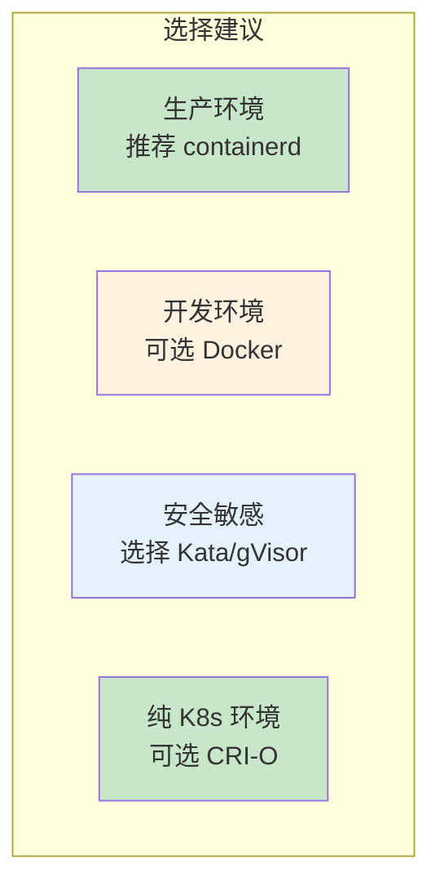

| 场景 | 推荐运行时 | 原因 |
|------|------------|------|
| **生产环境** | containerd | 稳定、高效、社区支持强 |
| **纯 K8s 环境** | CRI-O | 配置简单、专为 K8s 设计 |
| **开发环境** | Docker | 工具链完善、调试方便 |
| **安全敏感** | Kata/gVisor | 强隔离、安全防护 |

### 8.2 配置优化建议

| 配置项 | 建议 | 说明 |
|--------|------|------|
| **Snapshotter** | overlayfs | 性能最佳，生产推荐 |
| **镜像清理** | 定期清理未使用镜像 | 减少磁盘占用 |
| **日志配置** | 设置最大日志大小 | 防止日志占用过多空间 |
| **资源限制** | 合理设置默认限制 | 防止资源耗尽 |

### 8.3 排查问题建议

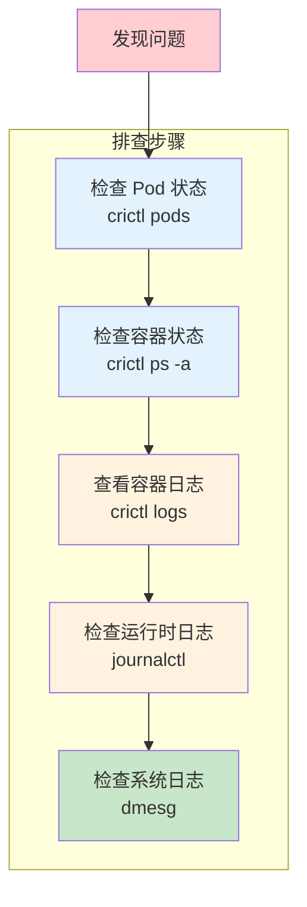

---

## 附录

### A. 接口方法速查表

| 方法 | 功能 | 所属服务 |
|------|------|----------|
| RunPodSandbox | 创建 Pod 沙箱 | RuntimeService |
| StopPodSandbox | 停止 Pod 沙箱 | RuntimeService |
| RemovePodSandbox | 删除 Pod 沙箱 | RuntimeService |
| CreateContainer | 创建容器 | RuntimeService |
| StartContainer | 启动容器 | RuntimeService |
| StopContainer | 停止容器 | RuntimeService |
| RemoveContainer | 删除容器 | RuntimeService |
| PullImage | 拉取镜像 | ImageService |
| RemoveImage | 删除镜像 | ImageService |
| ListImages | 列出镜像 | ImageService |

### B. 参考资料

| 资源 | 链接 |
|------|------|
| CRI API 定义 | https://github.com/kubernetes/cri-api |
| containerd 文档 | https://containerd.io/docs/ |
| CRI-O 文档 | https://cri-o.io/ |
| crictl 工具 | https://github.com/kubernetes-sigs/cri-tools |

---

> 继续学习：了解运行时接口后，推荐阅读 [runtime-deployment.md](runtime-deployment.md) 学习具体运行时的部署和配置。