# NVIDIA Container Toolkit 原理与排查指南

> 本文档详细介绍 NVIDIA Container Toolkit 的架构原理、配置模式、与 Kubernetes 运行时的集成方式，以及常见问题的排查处理。

---

## 目录

- [1. NVIDIA Container Toolkit 概述](#1-nvidia-container-toolkit-概述)
- [2. 架构原理详解](#2-架构原理详解)
- [3. 配置模式对比](#3-配置模式对比)
- [4. 运行时集成配置](#4-运行时集成配置)
- [5. CDI 模式详解](#5-cdi-模式详解)
- [6. GPU 容器问题排查](#6-gpu-容器问题排查)

---

## 1. NVIDIA Container Toolkit 概述

### 1.1 什么是 NVIDIA Container Toolkit

NVIDIA Container Toolkit 是 NVIDIA 提供的一套工具，用于在容器环境中使用 NVIDIA GPU。它通过修改容器运行时的行为，将 GPU 设备、驱动库等资源注入容器。

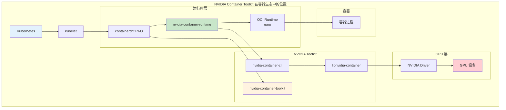

### 1.2 核心组件

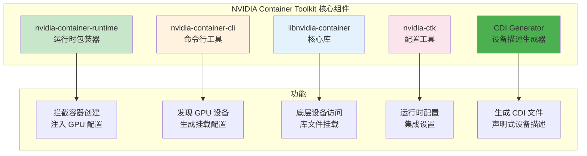

| 组件 | 功能 | 位置 |
|------|------|------|
| **nvidia-container-runtime** | OCI Runtime 包装器，拦截容器创建 | `/usr/bin/nvidia-container-runtime` |
| **nvidia-container-cli** | GPU 设备发现和配置生成 | `/usr/bin/nvidia-container-cli` |
| **libnvidia-container** | 核心库，处理设备挂载 | `/usr/lib/x86_64-linux-gnu/libnvidia-container.so` |
| **nvidia-ctk** | 配置工具，设置运行时集成 | `/usr/bin/nvidia-ctk` |
| **nvidia-cdi-hook** | CDI 设备描述生成器 | `/usr/bin/nvidia-cdi-hook` |

### 1.3 支持的运行时

| 运行时 | 支持方式 | 推荐模式 |
|--------|----------|----------|
| **containerd** | 运行时配置 + CDI | CDI（推荐） |
| **CRI-O** | 运行时配置 + CDI | CDI（推荐） |
| **Docker** | nvidia-runtime | Legacy 或 CDI |

---

## 2. 架构原理详解

### 2.1 工作原理流程

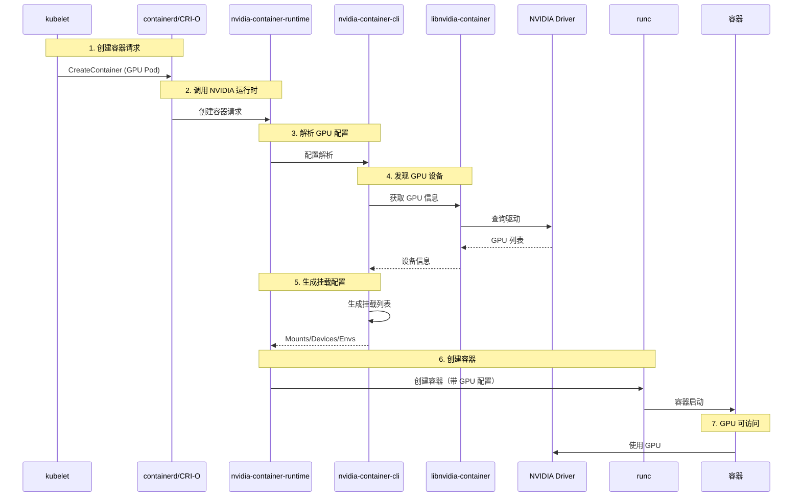

### 2.2 nvidia-container-runtime 详解

nvidia-container-runtime 是一个 OCI Runtime 包装器，它在 runc 之前拦截容器创建请求，根据配置注入 GPU 相关资源。

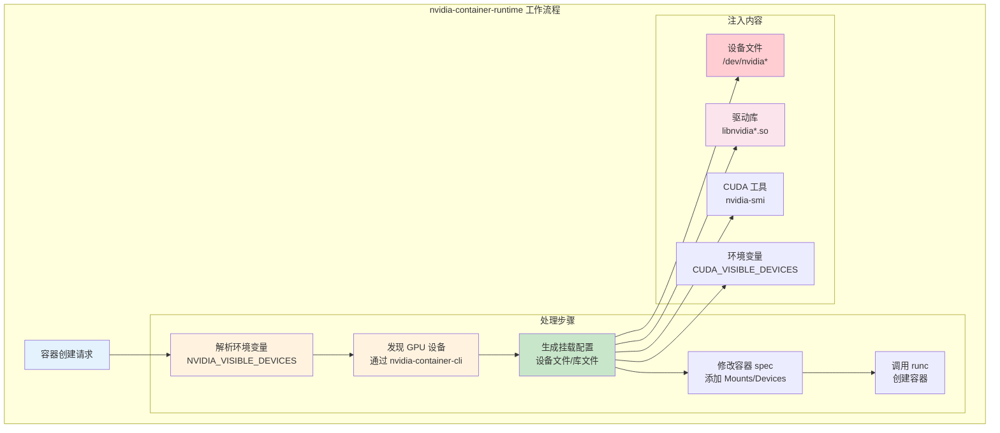

### 2.3 nvidia-container-cli 功能

nvidia-container-cli 是核心命令行工具，负责：
- 发现节点上的 GPU 设备
- 计算需要挂载的文件
- 生成容器配置

```bash
# ============================================================
# nvidia-container-cli 常用命令
# ============================================================

# 查看 GPU 信息
nvidia-container-cli info

# 列出所有 GPU 设备
nvidia-container-cli list

# 查看挂载配置
nvidia-container-cli configure --print

# 测试 GPU 容器配置
nvidia-container-cli configure --no-cgroups --device 0
```

### 2.4 libnvidia-container 库

libnvidia-container 是底层核心库，提供：
- GPU 设备发现功能
- 驱动库文件定位
- 权限和能力管理

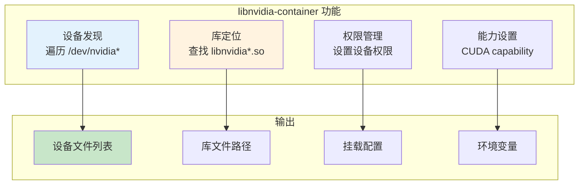

---

## 3. 配置模式对比

### 3.1 三种配置模式

NVIDIA Container Toolkit 支持三种配置模式：

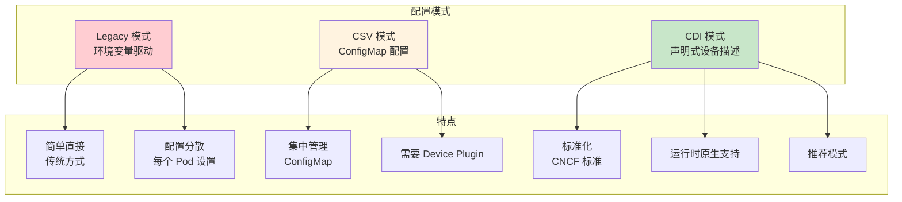

### 3.2 模式对比表

| 特性 | Legacy | CSV | CDI |
|------|--------|-----|-----|
| **配置方式** | 环境变量 | ConfigMap | CDI 文件 |
| **标准化程度** | 低 | 中 | 高（CNCF 标准） |
| **运行时支持** | Docker + K8s | K8s + Device Plugin | containerd 1.7+, CRI-O 1.23+ |
| **灵活性** | 高 | 中 | 高 |
| **可移植性** | 低 | 中 | 高 |
| **维护复杂度** | 低 | 中 | 低 |
| **推荐程度** | 不推荐（兼容） | 可用 | **推荐** |

### 3.3 Legacy 模式

**工作方式：** 通过环境变量 `NVIDIA_VISIBLE_DEVICES` 控制 GPU 分配

```yaml
# ============================================================
# Legacy 模式示例
# ============================================================

apiVersion: v1
kind: Pod
metadata:
  name: gpu-pod-legacy
spec:
  containers:
  - name: cuda
    image: nvcr.io/nvidia/cuda:12.0-base
    env:
    - name: NVIDIA_VISIBLE_DEVICES
      value: "0,1"              # 指定 GPU 设备 ID
    - name: NVIDIA_DRIVER_CAPABILITIES
      value: "compute,utility"  # 指定能力
    resources:
      limits:
        nvidia.com/gpu: 2
```

**特点：**
- 配置简单，但分散在每个 Pod
- 需要运行时配置为 nvidia-container-runtime
- 不够标准化，可移植性差

### 3.4 CSV 模式

**工作方式：** Device Plugin 通过 ConfigMap 提供配置文件

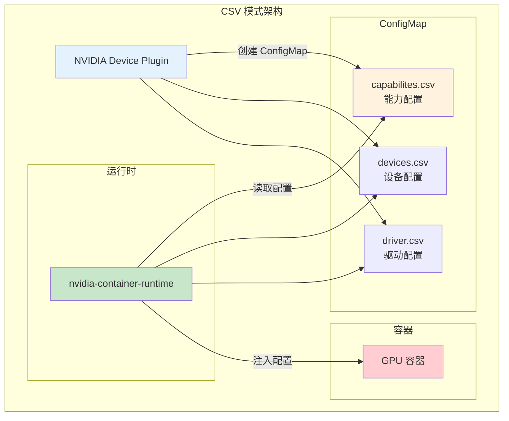

**ConfigMap 示例：**

```yaml
# ============================================================
# CSV 模式 ConfigMap
# ============================================================

apiVersion: v1
kind: ConfigMap
metadata:
  name: nvidia-device-plugin-config
  namespace: kube-system
data:
  capabilities.csv: |
    compute,utility
  devices.csv: |
    0,1,2,3
  driver.csv: |
    version=525.89.02
```

### 3.5 CDI 模式（推荐）

**工作方式：** 使用 CNCF CDI 标准，通过声明式设备描述管理 GPU

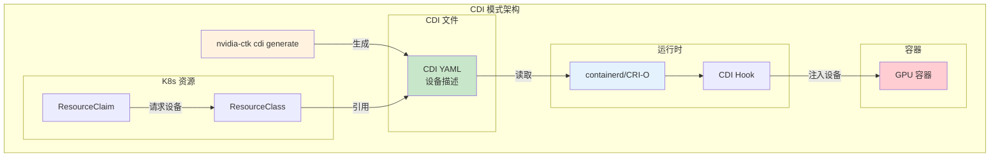

**CDI 文件示例：**

```yaml
# ============================================================
# CDI 设备描述文件示例
# ============================================================
# 位置: /etc/cdi/nvidia.yaml

cdiVersion: 0.5.0
kind: nvidia.com/gpu
devices:
  - name: gpu0
    deviceType: gpu
    attributes:
      index: "0"
      uuid: "GPU-12345678-1234-1234-1234-123456789abc"
    containerEdits:
      deviceNodes:
        - path: /dev/nvidia0
          type: c
          major: 195
          minor: 0
        - path: /dev/nvidiactl
          type: c
          major: 195
          minor: 255
        - path: /dev/nvidia-uvm
          type: c
          major: 195
          minor: 243
      mounts:
        - hostPath: /usr/lib/x86_64-linux-gnu/libnvidia-ml.so.525.89.02
          containerPath: /usr/lib/x86_64-linux-gnu/libnvidia-ml.so.525.89.02
          options:
            - ro
            - nosuid
            - nodev
            - bind
      env:
        - NVIDIA_VISIBLE_DEVICES=void
        - CUDA_VISIBLE_DEVICES=0

containerEdits:
  env:
    - NVIDIA_DRIVER_CAPABILITIES=compute,utility
```

---

## 4. 运行时集成配置

### 4.1 containerd 集成配置

```bash
# ============================================================
# containerd NVIDIA 运行时配置
# ============================================================

# === 1. 安装 NVIDIA Container Toolkit ===
distribution=$(. /etc/os-release;echo $ID$VERSION_ID)
curl -s -L https://nvidia.github.io/libnvidia-container/gpgkey | apt-key add -
curl -s -L https://nvidia.github.io/libnvidia-container/$distribution/libnvidia-container.list | \
    tee /etc/apt/sources.list.d/nvidia-container-toolkit.list

apt-get update
apt-get install -y nvidia-container-toolkit

# === 2. 使用 nvidia-ctk 配置运行时 ===
nvidia-ctk runtime configure --runtime=containerd

# === 3. 重启 containerd ===
systemctl restart containerd

# === 4. 验证配置 ===
cat /etc/containerd/config.toml | grep -A 10 nvidia
```

**配置后的 config.toml：**

```toml
# ============================================================
# containerd NVIDIA 运行时配置片段
# ============================================================

[plugins."io.containerd.grpc.v1.cri".containerd.runtimes.nvidia]
  runtime_type = "io.containerd.runc.v2"
  options = {
    SystemdCgroup = true
    BinaryName = "nvidia-container-runtime"
  }

[plugins."io.containerd.grpc.v1.cri".containerd.runtimes.nvidia-cdi]
  runtime_type = "io.containerd.runc.v2"
  options = {
    SystemdCgroup = true
    BinaryName = "nvidia-container-runtime"
    CDIEnabled = true
  }
```

### 4.2 CRI-O 集成配置

```bash
# ============================================================
# CRI-O NVIDIA 运行时配置
# ============================================================

# === 1. 安装 NVIDIA Container Toolkit ===
# (同 containerd 安装步骤)

# === 2. 使用 nvidia-ctk 配置运行时 ===
nvidia-ctk runtime configure --runtime=crio

# === 3. 重启 CRI-O ===
systemctl restart crio

# === 4. 验证配置 ===
cat /etc/crio/crio.conf | grep -A 5 nvidia
```

**配置后的 crio.conf：**

```toml
# ============================================================
# CRI-O NVIDIA 运行时配置片段
# ============================================================

[runtime.runtimes.nvidia]
  runtime_path = "/usr/bin/nvidia-container-runtime"
  runtime_type = "oci"
  runtime_root = "/run/runc"

[runtime.runtimes.nvidia-cdi]
  runtime_path = "/usr/bin/nvidia-container-runtime"
  runtime_type = "oci"
  runtime_root = "/run/runc"
```

### 4.3 nvidia-ctk 配置详解

```bash
# ============================================================
# nvidia-ctk 常用命令
# ============================================================

# === 查看当前配置 ===
nvidia-ctk config dump

# === 配置运行时 ===
# 配置 containerd
nvidia-ctk runtime configure --runtime=containerd

# 配置 CRI-O
nvidia-ctk runtime configure --runtime=crio

# 配置 Docker
nvidia-ctk runtime configure --runtime=docker

# === 生成 CDI 文件 ===
nvidia-ctk cdi generate --output=/etc/cdi/nvidia.yaml

# === 验证 GPU ===
nvidia-ctk validate

# === 查看版本 ===
nvidia-ctk --version
```

---

## 5. CDI 模式详解

### 5.1 CDI 概述

CDI（Container Device Interface）是 CNCF 制定的标准，用于描述容器设备。它解决了：
- 设备描述标准化问题
- 运行时与设备插件的耦合问题
- 设备分配的声明式管理

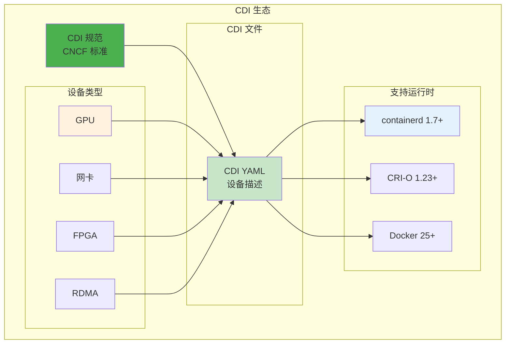

### 5.2 CDI 文件结构

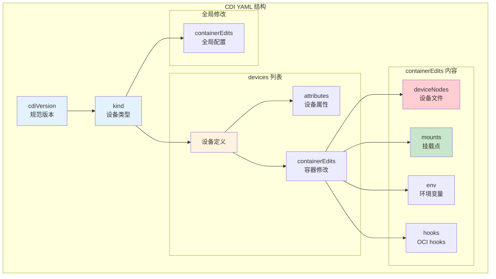

### 5.3 生成 CDI 文件

```bash
# ============================================================
# 生成 NVIDIA CDI 文件
# ============================================================

# === 自动生成 ===
nvidia-ctk cdi generate --output=/etc/cdi/nvidia.yaml

# === 查看生成的文件 ===
cat /etc/cdi/nvidia.yaml

# === 验证 CDI 文件 ===
# 使用 cdi-validator
cdi-validator /etc/cdi/nvidia.yaml

# === 查看可用设备 ===
# CDI 设备名称格式: <vendor>/<class>=<name>
# 例如: nvidia.com/gpu=gpu0
```

### 5.4 使用 CDI 的 Pod 示例

```yaml
# ============================================================
# 使用 CDI 模式的 Pod 示例
# ============================================================

apiVersion: v1
kind: Pod
metadata:
  name: gpu-pod-cdi
spec:
  runtimeClassName: nvidia-cdi    # 指定 NVIDIA CDI 运行时
  containers:
  - name: cuda
    image: nvcr.io/nvidia/cuda:12.0-base
    command: ["nvidia-smi"]
    resources:
      limits:
        nvidia.com/gpu: 1          # 请求 GPU

---
# ============================================================
# DRA 方式（未来推荐）
# ============================================================

apiVersion: resource.k8s.io/v1alpha2
kind: ResourceClaim
metadata:
  name: gpu-claim
spec:
  resourceClassName: nvidia.com-gpu

---
apiVersion: v1
kind: Pod
metadata:
  name: gpu-pod-dra
spec:
  resourceClaims:
  - name: gpu
    resourceClaimName: gpu-claim
  containers:
  - name: cuda
    image: nvcr.io/nvidia/cuda:12.0-base
    command: ["nvidia-smi"]
```

### 5.5 CDI 与 DRA 的关系

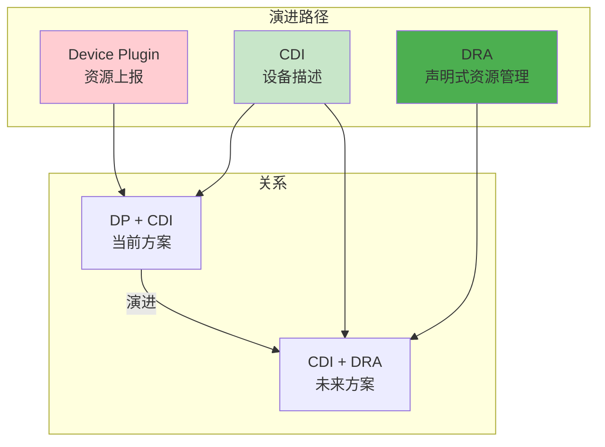

---

## 6. GPU 容器问题排查

### 6.1 问题分类

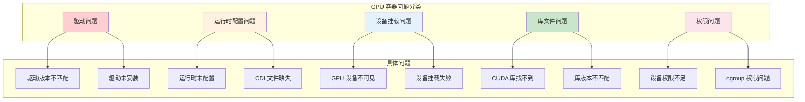

### 6.2 GPU 设备不可见

**问题现象：** 容器内看不到 GPU 设备

```bash
# ============================================================
# GPU 设备不可见排查
# ============================================================

# === 步骤 1: 检查宿主机 GPU ===
nvidia-smi
ls -la /dev/nvidia*

# === 步骤 2: 检查运行时配置 ===
cat /etc/containerd/config.toml | grep nvidia
crictl info | grep nvidia

# === 步骤 3: 检查容器配置 ===
crictl inspect <container-id> | grep -A 20 "devices"
crictl inspect <container-id> | grep -A 30 "mounts"

# === 步骤 4: 检查环境变量 ===
crictl inspect <container-id> | grep -A 10 "env"

# === 步骤 5: 测试 GPU 运行时 ===
# 手动创建 GPU 容器测试
cat > /tmp/gpu-pod.json <<EOF
{
  "metadata": {"name": "gpu-test"},
  "image": {"image": "nvcr.io/nvidia/cuda:12.0-base"}
}
EOF

cat > /tmp/gpu-container.json <<EOF
{
  "metadata": {"name": "gpu-container"},
  "image": {"image": "nvcr.io/nvidia/cuda:12.0-base"},
  "command": ["nvidia-smi"]
}
EOF

crictl run --runtime nvidia /tmp/gpu-container.json /tmp/gpu-pod.json
```

**常见原因及解决：**

| 原因 | 诊断方法 | 解决方案 |
|------|----------|----------|
| 运行时未配置 | `crictl info` | 使用 nvidia-ctk 配置 |
| runtimeClassName 错误 | Pod 配置检查 | 使用正确的运行时名称 |
| CDI 文件缺失 | `/etc/cdi/` 检查 | 生成 CDI 文件 |
| 环境变量缺失 | `crictl inspect` | 配置 NVIDIA_VISIBLE_DEVICES |

### 6.3 NVIDIA_VISIBLE_DEVICES 不生效

**问题现象：** 设置了环境变量但 GPU 不生效

```bash
# ============================================================
# NVIDIA_VISIBLE_DEVICES 不生效排查
# ============================================================

# === 步骤 1: 检查环境变量值 ===
kubectl describe pod <pod-name> | grep NVIDIA_VISIBLE_DEVICES

# 常见错误值:
# - 空值或 "none" - 不注入任何 GPU
# - "void" - 特殊值，表示由 CDI 管理

# === 步骤 2: 检查运行时模式 ===
cat /etc/nvidia-container-runtime/config.toml | grep -A 5 "mode"

# === 步骤 3: 检查 Device Plugin ===
kubectl get pods -n kube-system | grep nvidia-device-plugin
kubectl logs -n kube-system nvidia-device-plugin-xxx

# === 步骤 4: 检查资源配置 ===
kubectl describe pod <pod-name> | grep -A 5 "limits"
# 确保设置了 nvidia.com/gpu 资源请求
```

**配置模式影响：**

| 配置模式 | NVIDIA_VISIBLE_DEVICES 行为 |
|----------|----------------------------|
| Legacy | 直接控制设备 ID |
| CSV | 由 ConfigMap 控制，环境变量被忽略 |
| CDI | 使用 "void"，由 CDI 文件控制 |

### 6.4 驱动版本不匹配

**问题现象：** CUDA 版本与驱动版本不兼容

```bash
# ============================================================
# 驱动版本不匹配排查
# ============================================================

# === 步骤 1: 检查宿主机驱动版本 ===
nvidia-smi | grep "Driver Version"
cat /proc/driver/nvidia/version

# === 步骤 2: 检查容器 CUDA 版本 ===
# 进入容器
kubectl exec -it <pod-name> -- bash
nvcc --version  # CUDA 版本
cat /usr/local/cuda/version.txt

# === 步骤 3: 检查兼容性 ===
# CUDA 与驱动兼容性表:
# | CUDA 版本 | 最小驱动版本 |
# |-----------|--------------|
# | 12.0      | 525.60.13    |
# | 11.8      | 520.61.05    |
# | 11.7      | 515.43.04    |

# === 步骤 4: 检查容器内的库 ===
kubectl exec -it <pod-name> -- ls /usr/lib/x86_64-linux-gnu/libnvidia*
```

**解决方案：**

| 问题 | 解决方案 |
|------|----------|
| 驱动版本过低 | 升级宿主机驱动 |
| CUDA 版本过高 | 使用兼容的 CUDA 镜像 |
| 库文件冲突 | 使用正确的镜像版本 |

### 6.5 CUDA 库找不到

**问题现象：** 容器内 CUDA 程序找不到库文件

```bash
# ============================================================
# CUDA 库找不到排查
# ============================================================

# === 步骤 1: 检查容器内库文件 ===
kubectl exec -it <pod-name> -- ls /usr/lib/x86_64-linux-gnu/libcuda*
kubectl exec -it <pod-name> -- ls /usr/local/cuda/lib64/

# === 步骤 2: 检查挂载配置 ===
crictl inspect <container-id> | grep -B 5 -A 10 libnvidia
crictl inspect <container-id> | grep -B 5 -A 10 libcuda

# === 步骤 3: 检查库路径 ===
kubectl exec -it <pod-name> -- echo $LD_LIBRARY_PATH

# === 步骤 4: 检查运行时挂载能力 ===
nvidia-container-cli configure --print
```

**常见原因：**

| 原因 | 诊断方法 | 解决方案 |
|------|----------|----------|
| 运行时未挂载库 | `crictl inspect` | 配置 NVIDIA_DRIVER_CAPABILITIES |
| 镜像缺少库 | 检查镜像 | 使用官方 CUDA 镜像 |
| LD_LIBRARY_PATH 错误 | 环境变量检查 | 配置正确的路径 |
| 库权限问题 | `ls -la` | 检查库文件权限 |

### 6.6 GPU 容器诊断脚本

```bash
#!/bin/bash
# ============================================================
# gpu-container-diagnose.sh - GPU 容器诊断脚本
# ============================================================

POD_NAME=$1
NAMESPACE=$2

if [ -z "$POD_NAME" ]; then
    echo "用法: $0 <pod-name> [namespace]"
    exit 1
fi

if [ -z "$NAMESPACE" ]; then
    NAMESPACE="default"
fi

echo "=========================================="
echo "GPU 容器诊断报告: $POD_NAME"
echo "生成时间: $(date)"
echo "=========================================="

# === 1. 宿主机 GPU 状态 ===
echo ""
echo "=== 1. 宿主机 GPU 状态 ==="
nvidia-smi
ls -la /dev/nvidia*

# === 2. NVIDIA 驱动信息 ===
echo ""
echo "=== 2. NVIDIA 驆动信息 ==="
cat /proc/driver/nvidia/version

# === 3. NVIDIA Toolkit 配置 ===
echo ""
echo "=== 3. NVIDIA Toolkit 配置 ==="
nvidia-container-cli info
cat /etc/nvidia-container-runtime/config.toml | head -30

# === 4. CDI 文件状态 ===
echo ""
echo "=== 4. CDI 文件状态 ==="
ls -la /etc/cdi/
cat /etc/cdi/nvidia.yaml 2>/dev/null | head -50 || echo "CDI 文件不存在"

# === 5. 运行时配置 ===
echo ""
echo "=== 5. 运行时 GPU 配置 ==="
crictl info | grep -A 20 nvidia || echo "运行时未配置 GPU"

# === 6. 容器 GPU 配置 ===
echo ""
echo "=== 6. 容器 GPU 配置 ==="
CONTAINER_ID=$(crictl ps | grep $POD_NAME | awk '{print $1}')
if [ -n "$CONTAINER_ID" ]; then
    echo "设备挂载:"
    crictl inspect $CONTAINER_ID | grep -A 5 "nvidia"
    echo ""
    echo "环境变量:"
    crictl inspect $CONTAINER_ID | grep -i "NVIDIA" || echo "无 NVIDIA 相关环境变量"
else
    echo "容器未运行"
fi

# === 7. Device Plugin 状态 ===
echo ""
echo "=== 7. NVIDIA Device Plugin 状态 ==="
kubectl get pods -n kube-system -l name=nvidia-device-plugin-ds
kubectl logs -n kube-system -l name=nvidia-device-plugin-ds --tail 20

# === 8. 容器内 GPU 测试 ===
echo ""
echo "=== 8. 容器内 GPU 测试 ==="
kubectl exec -it $POD_NAME -n $NAMESPACE -- nvidia-smi 2>/dev/null || \
    echo "无法在容器内执行 nvidia-smi"

echo ""
echo "=========================================="
echo "诊断报告完成"
echo "=========================================="
```

---

## 附录

### A. NVIDIA_VISIBLE_DEVICES 常见值

| 值 | 含义 | 适用场景 |
|----|------|----------|
| `0,1,2` | 指定 GPU ID | Legacy 模式 |
| `all` | 所有 GPU | Legacy 模式 |
| `void` | 由 CDI 管理 | CDI 模式 |
| `none` 或空 | 不注入 GPU | 无 GPU 容器 |

### B. NVIDIA_DRIVER_CAPABILITIES 常见值

| 能力 | 说明 | 挂载内容 |
|------|------|----------|
| `compute` | CUDA 计算 | CUDA 库 |
| `utility` | nvidia-smi | nvidia-smi 工具 |
| `video` | 视频编解码 | 视频库 |
| `graphics` | OpenGL/Vulkan | 图形库 |
| `ngx` | NGX SDK | NGX 库 |
| `all` | 所有能力 | 所有相关文件 |

### C. 常用命令速查

```bash
# === NVIDIA 验证命令 ===
nvidia-smi                          # GPU 状态
nvidia-container-cli info           # Toolkit 信息
nvidia-ctk validate                 # 配置验证
nvidia-ctk cdi generate             # 生成 CDI 文件

# === 运行时配置命令 ===
nvidia-ctk runtime configure --runtime=containerd
nvidia-ctk runtime configure --runtime=crio
nvidia-ctk runtime configure --runtime=docker

# === 容器内验证 ===
kubectl exec -it <pod> -- nvidia-smi
kubectl exec -it <pod> -- ls /dev/nvidia*
kubectl exec -it <pod> -- nvcc --version
```

### D. 参考资料

| 资源 | 链接 |
|------|------|
| NVIDIA Container Toolkit 文档 | https://docs.nvidia.com/datacenter/cloud-native/container-toolkit/ |
| CDI 规范 | https://github.com/cncf-tags/container-device-interface |
| NVIDIA Device Plugin | https://github.com/NVIDIA/k8s-device-plugin |
| CUDA 兼容性表 | https://docs.nvidia.com/deploy/cuda-compatibility/ |

---

> 学习总结：通过本章学习，你应该掌握了 NVIDIA Container Toolkit 的架构原理、三种配置模式的区别，以及 GPU 容器常见问题的排查方法。推荐在生产环境使用 CDI 模式，这是最标准化和可移植的方式。