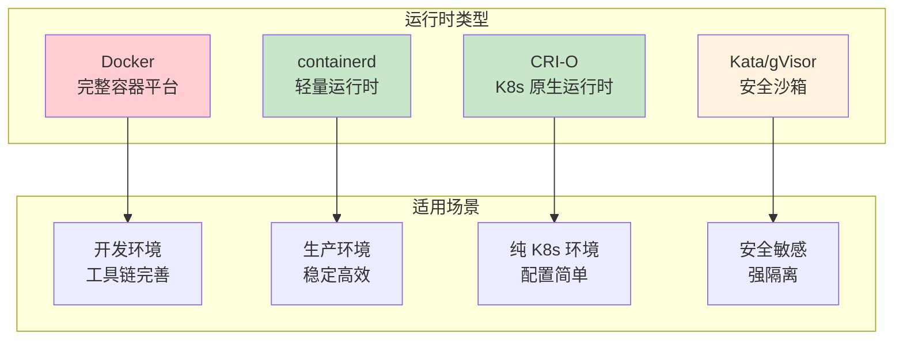
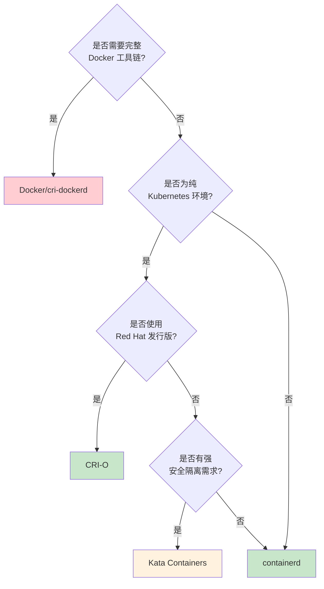
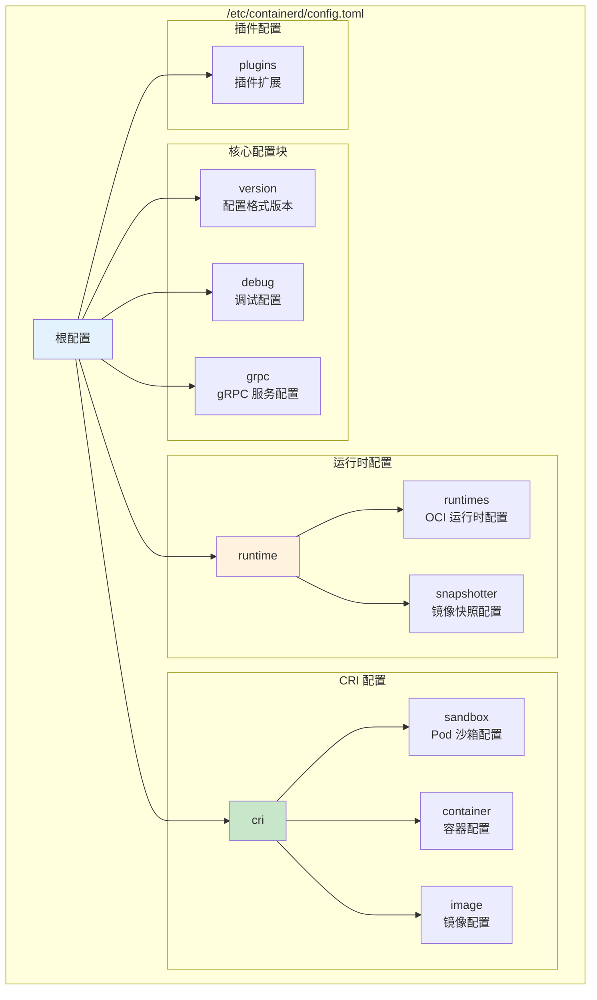
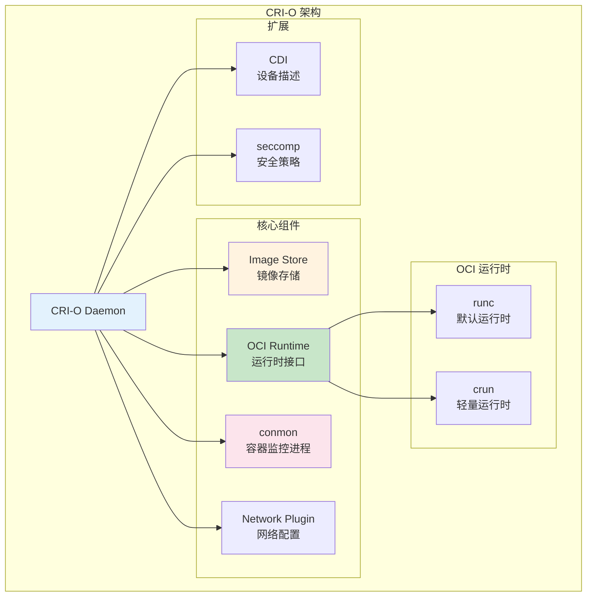
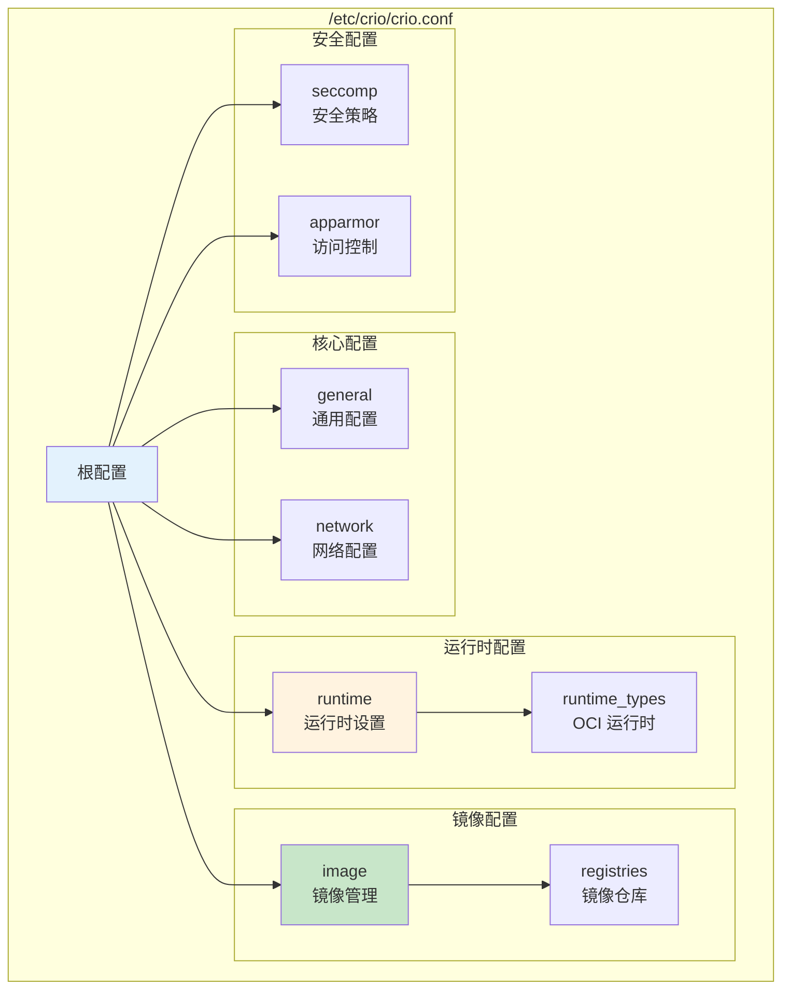
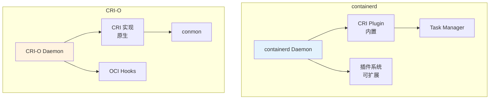
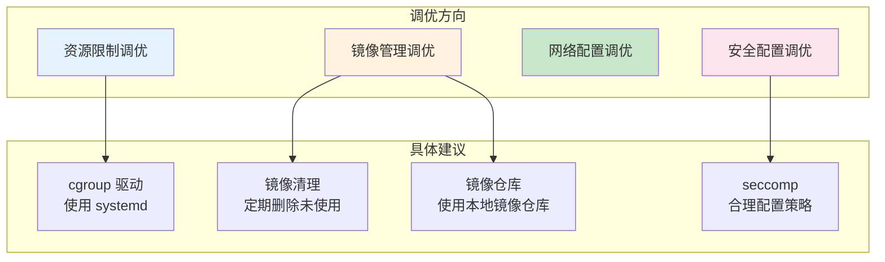

# 容器运行时部署与配置详解

> 本文档详细介绍 containerd 和 CRI-O 两种主流容器运行时的部署方法、核心配置参数和调优建议。

---

## 目录

- [1. 运行时选型](#1-运行时选型)
- [2. containerd 部署与配置](#2-containerd-部署与配置)
- [3. CRI-O 部署与配置](#3-cri-o-部署与配置)
- [4. 运行时对比分析](#4-运行时对比分析)
- [5. 配置调优建议](#5-配置调优建议)
- [6. 验证与测试](#6-验证与测试)

---

## 1. 运行时选型

### 1.1 主流运行时概览



### 1.2 选型决策树



### 1.3 运行时特性对比

| 特性 | containerd | CRI-O | Docker |
|------|------------|-------|--------|
| **架构定位** | 通用容器运行时 | Kubernetes 专用 | 完整容器平台 |
| **资源占用** | 低（~50MB） | 更低（~40MB） | 较高（~150MB） |
| **启动速度** | 快 | 更快 | 较慢 |
| **配置复杂度** | 中等 | 简单 | 简单 |
| **镜像管理** | 多种 Snapshotter | OverlayFS | overlay2 |
| **GPU 支持** | CDI 原生 | CDI 原生 | nvidia-runtime |
| **安全特性** | 基础安全 | OCI 标准 | 完整安全栈 |
| **社区活跃度** | 高（CNCF 毕业） | 高（CNCF 孵化） | 高 |
| **企业支持** | Docker、AWS 等 | Red Hat | Docker |

---

## 2. containerd 部署与配置

### 2.1 containerd 架构


### 2.2 安装 containerd

**Ubuntu/Debian 安装：**

```bash
# ============================================================
# Ubuntu 安装 containerd
# ============================================================

# 1. 安装依赖
apt-get update
apt-get install -y ca-certificates curl gnupg lsb-release

# 2. 添加 Docker 官方 GPG 密钥
mkdir -p /etc/apt/keyrings
curl -fsSL https://download.docker.com/linux/ubuntu/gpg | gpg --dearmor -o /etc/apt/keyrings/docker.gpg

# 3. 添加仓库
echo "deb [arch=$(dpkg --print-architecture) signed-by=/etc/apt/keyrings/docker.gpg] https://download.docker.com/linux/ubuntu $(lsb_release -cs) stable" | tee /etc/apt/sources.list.d/docker.list > /dev/null

# 4. 安装 containerd
apt-get update
apt-get install -y containerd

# 5. 生成默认配置
mkdir -p /etc/containerd
containerd config default > /etc/containerd/config.toml
```

**CentOS/RHEL 安装：**

```bash
# ============================================================
# CentOS/RHEL 安装 containerd
# ============================================================

# 1. 安装依赖
yum install -y yum-utils
yum-config-manager --add-repo https://download.docker.com/linux/centos/docker-ce.repo

# 2. 安装 containerd
yum install -y containerd

# 3. 生成默认配置
mkdir -p /etc/containerd
containerd config default > /etc/containerd/config.toml
```

### 2.3 核心配置详解

**配置文件结构：**



**关键配置参数：**

```toml
# ============================================================
# containerd 核心配置示例
# ============================================================

version = 2

# ============================================================
# 根配置
# ============================================================

# 启用调试模式（生产环境关闭）
debug = false

# ============================================================
# gRPC 服务配置
# ============================================================
[grpc]
  # gRPC 地址
  address = "/run/containerd/containerd.sock"
  
  # TCP 地址（可选）
  # tcp_address = ""
  
  # gRPC 超时
  timeout = "10s"

# ============================================================
# 运行时配置
# ============================================================
[runtime]
  # 默认 OCI 运行时
  runtime_type = "io.containerd.runc.v2"
  
  # 默认 Snapshotter
  snapshotter = "overlayfs"

# ============================================================
# OCI 运行时配置
# ============================================================
[runtimes]
  # runc 配置
  [runtimes.runc]
    runtime_type = "io.containerd.runc.v2"
    options = {
      SystemdCgroup = true  # 使用 systemd cgroup 驱动
    }
  
  # NVIDIA 运行时配置（GPU 支持）
  [runtimes.nvidia]
    runtime_type = "io.containerd.runc.v2"
    options = {
      SystemdCgroup = true
      BinaryName = "nvidia-container-runtime"
    }

# ============================================================
# CRI 配置（Kubernetes 接口）
# ============================================================
[cri]
  # CRI Stream 服务地址
  stream_address = ""
  stream_port = "0"
  
  # ============================================================
  # Pod 沙箱配置
  # ============================================================
  [cri.sandbox]
    # 默认 Pod 沙箱镜像
    sandbox_image = "registry.k8s.io/pause:3.9"
    
    # ============================================================
    # Pod 沙箱运行时
    # ============================================================
    [cri.sandbox.runtimes]
      # 默认运行时
      [cri.sandbox.runtimes.runc]
        runtime_type = "io.containerd.runc.v2"
        options = {
          SystemdCgroup = true
        }
      
      # GPU 运行时（CDI 模式）
      [cri.sandbox.runtimes.nvidia]
        runtime_type = "io.containerd.runc.v2"
        options = {
          SystemdCgroup = true
        }

  # ============================================================
  # 容器配置
  # ============================================================
  [cri.container]
    # 默认运行时
    default_runtime_name = "runc"
    
    # ============================================================
    # 容器运行时
    # ============================================================
    [cri.container.runtimes]
      [cri.container.runtimes.runc]
        runtime_type = "io.containerd.runc.v2"
        options = {
          SystemdCgroup = true
        }
      
      # GPU 运行时
      [cri.container.runtimes.nvidia]
        runtime_type = "io.containerd.runc.v2"
        options = {
          SystemdCgroup = true
        }

  # ============================================================
  # 镜像配置
  # ============================================================
  [cri.image]
    # 镜像拉取并发数
    max_concurrent_downloads = 10
    
    # 镜像拉取超时
    pull_timeout = "5m"
    
    # 镜像仓库认证
    [cri.image.auths]
      # docker.io = {
      #   auth = "base64-encoded-auth"
      # }

# ============================================================
# 插件配置
# ============================================================
[plugins]
  # ============================================================
  # CRI 插件
  # ============================================================
  [plugins."io.containerd.grpc.v1.cri"]
    # 禁用 AppArmor（可选）
    disable_apparmor = false
    
    # 禁用 SELinux（可选）
    disable_selinux = false
    
    # 日志配置
    [plugins."io.containerd.grpc.v1.cri".containerd]
      snapshotter = "overlayfs"
      default_runtime_name = "runc"
```

### 2.4 关键配置说明

| 配置项 | 作用 | 推荐值 |
|--------|------|--------|
| `SystemdCgroup` | 使用 systemd cgroup 驱动 | `true`（K8s 1.26+ 必须） |
| `sandbox_image` | Pod 沙箱镜像 | `pause:3.9` |
| `snapshotter` | 镜像快照驱动 | `overlayfs` |
| `max_concurrent_downloads` | 镜像拉取并发 | `10` |
| `runtime_type` | OCI 运行时类型 | `io.containerd.runc.v2` |

### 2.5 GPU 运行时配置

```bash
# ============================================================
# 配置 NVIDIA GPU 运行时
# ============================================================

# 1. 安装 NVIDIA Container Toolkit
distribution=$(. /etc/os-release;echo $ID$VERSION_ID)
curl -s -L https://nvidia.github.io/libnvidia-container/gpgkey | apt-key add -
curl -s -L https://nvidia.github.io/libnvidia-container/$distribution/libnvidia-container.list | tee /etc/apt/sources.list.d/nvidia-container-toolkit.list

apt-get update
apt-get install -y nvidia-container-toolkit

# 2. 配置 containerd 集成
nvidia-ctk runtime configure --runtime=containerd

# 3. 重启 containerd
systemctl restart containerd

# 4. 验证配置
cat /etc/containerd/config.toml | grep -A 10 nvidia
```

---

## 3. CRI-O 部署与配置

### 3.1 CRI-O 架构



### 3.2 安装 CRI-O

**Ubuntu 安装：**

```bash
# ============================================================
# Ubuntu 安装 CRI-O
# ============================================================

# 1. 设置环境变量（指定版本）
export VERSION="1.28"
export OS="xUbuntu_22.04"

# 2. 添加仓库
echo "deb https://download.opensuse.org/repositories/devel:/kubic:/libcontainers:/stable/$OS/ /" > /etc/apt/sources.list.d/devel:kubic:libcontainers:stable.list
echo "deb https://download.opensuse.org/repositories/devel:/kubic:/libcontainers:/cri-o:/$VERSION/$OS/ /" > /etc/apt/sources.list.d/devel:kubic:libcontainers:cri-o:$VERSION.list

# 3. 添加 GPG 密钥
curl -L https://download.opensuse.org/repositories/devel:kubic:libcontainers:stable/$OS/Release.key | apt-key add -
curl -L https://download.opensuse.org/repositories/devel:kubic:libcontainers:cri-o:/$VERSION/$OS/Release.key | apt-key add -

# 4. 安装 CRI-O
apt-get update
apt-get install -y cri-o cri-o-runc

# 5. 启动服务
systemctl enable crio
systemctl start crio
```

**CentOS/RHEL 安装：**

```bash
# ============================================================
# CentOS/RHEL 安装 CRI-O
# ============================================================

# 1. 添加仓库
VERSION=1.28
curl -L -o /etc/yum.repos.d/cri-o.repo https://download.opensuse.org/repositories/devel:/kubic:/libcontainers:/stable:/cri-o:/$VERSION:/build/CentOS_9/devel:kubic:libcontainers:stable:cri-o:$VERSION:build.repo

# 2. 安装 CRI-O
yum install -y cri-o

# 3. 启动服务
systemctl enable crio
systemctl start crio
```

### 3.3 核心配置详解

**配置文件结构：**



**关键配置参数：**

```toml
# ============================================================
# CRI-O 核心配置示例
# ============================================================

# ============================================================
# 通用配置
# ============================================================
[general]
  # 日志级别
  log_level = "info"
  
  # 日钩子位置
  hooks_dir = [
    "/usr/share/containers/oci/hooks.d"
  ]

# ============================================================
# 网络配置
# ============================================================
[network]
  # CNI 配置目录
  cni_plugin_dirs = [
    "/opt/cni/bin"
  ]
  
  # CNI 配置文件目录
  cni_config_dir = "/etc/cni/net.d"
  
  # 默认网络
  network_dir = "/etc/cni/net.d/"

# ============================================================
# 运行时配置
# ============================================================
[runtime]
  # 默认运行时
  default_runtime = "runc"
  
  # conmon 路径
  conmon = "/usr/bin/conmon"
  
  # conmon 环境变量
  conmon_env = [
    "PATH=/usr/local/sbin:/usr/local/bin:/usr/sbin:/usr/bin:/sbin:/bin"
  ]
  
  # 暂停容器镜像
  pause_image = "registry.k8s.io/pause:3.9"
  
  # SIGTERM 超时
  stop_signals = [
    "SIGTERM",
    "SIGINT"
  ]
  
  # ============================================================
  # OCI 运行时配置
  # ============================================================
  [runtime.runtimes]
    # runc 配置
    [runtime.runtimes.runc]
      runtime_path = "/usr/bin/runc"
      runtime_type = "oci"
      runtime_root = "/run/runc"
    
    # crun 配置（可选）
    [runtime.runtimes.crun]
      runtime_path = "/usr/bin/crun"
      runtime_type = "oci"
      runtime_root = "/run/crun"
    
    # NVIDIA 运行时（GPU）
    [runtime.runtimes.nvidia]
      runtime_path = "/usr/bin/nvidia-container-runtime"
      runtime_type = "oci"
      runtime_root = "/run/runc"

# ============================================================
# 镜像配置
# ============================================================
[image]
  # 默认传输类型
  default_transport = "docker://"
  
  # 镜像拉取超时
  pull_timeout = "5m"
  
  # 并发拉取数
  max_concurrent_downloads = 10

# ============================================================
# 镜像仓库配置
# ============================================================
[registries]
  # 允许的仓库
  [registries.search]
    registries = [
      "docker.io",
      "registry.k8s.io"
    ]
  
  # 不安全的仓库
  [registries.insecure]
    registries = []
  
  # 需要认证的仓库
  [registries.block]
    registries = []

# ============================================================
# seccomp 配置
# ============================================================
[seccomp]
  # 默认 seccomp profile
  profile = "/usr/share/containers/seccomp.json"
  
  # 是否启用
  enabled = true

# ============================================================
# 存储
# ============================================================
[storage]
  # 存储驱动
  driver = "overlay"
  
  # 存储路径
  graphroot = "/var/lib/containers/storage"
  
  # 运行时路径
  runroot = "/run/containers/storage"
```

### 3.4 GPU 运行时配置

```bash
# ============================================================
# CRI-O 配置 NVIDIA GPU 运行时
# ============================================================

# 1. 安装 NVIDIA Container Toolkit
# (参考 containerd 安装步骤)

# 2. 配置 CRI-O 运行时
nvidia-ctk runtime configure --runtime=crio

# 3. 重启 CRI-O
systemctl restart crio

# 4. 验证配置
cat /etc/crio/crio.conf | grep -A 5 nvidia
```

---

## 4. 运行时对比分析

### 4.1 架构对比



### 4.2 功能对比

| 功能 | containerd | CRI-O |
|------|------------|-------|
| **镜像管理** | 多种 Snapshotter 支持 | OverlayFS 为主 |
| **运行时插件** | 支持多种 OCI 运行时 | 支持多种 OCI 运行时 |
| **CDI 支持** | v1.7+ 原生支持 | v1.23+ 原生支持 |
| **镜像加密** | 支持（via imgcrypt） | 支持（via encryption） |
| **资源监控** | 内置 metrics 服务 | Prometheus 指标 |
| **调试工具** | ctr、crictl | crictl |
| **配置方式** | config.toml（TOML） | crio.conf（TOML） |
| **日志系统** | journald + log 文件 | journald |

### 4.3 性能对比

| 指标 | containerd | CRI-O |
|------|------------|-------|
| **内存占用** | ~50-70MB | ~40-60MB |
| **镜像拉取速度** | 快 | 快 |
| **容器启动速度** | 快 | 更快 |
| **Pod 创建延迟** | ~1-2s | ~1-1.5s |
| **稳定性** | 高（生产验证） | 高（Red Hat 支持） |

---

## 5. 配置调优建议

### 5.1 通用调优建议



### 5.2 containerd 调优

| 配置项 | 调优建议 | 说明 |
|--------|----------|------|
| `SystemdCgroup` | `true` | K8s 1.26+ 必须 |
| `max_concurrent_downloads` | `10-20` | 根据网络带宽调整 |
| `pull_timeout` | `5m-10m` | 大镜像适当增加 |
| `snapshotter` | `overlayfs` | 性能最佳 |
| `metrics` | 启用 | 监控运行时状态 |

### 5.3 CRI-O 调优

| 配置项 | 调优建议 | 说明 |
|--------|----------|------|
| `log_level` | `info` | 生产环境避免 debug |
| `max_concurrent_downloads` | `10-20` | 根据带宽调整 |
| `seccomp_profile` | 使用默认 | 安全与兼容平衡 |
| `pause_image` | 本地缓存 | 减少 Pod 创建延迟 |
| `hooks_dir` | 配置必要钩子 | 如 NVIDIA GPU |

### 5.4 镜像仓库优化


---

## 6. 验证与测试

### 6.1 运行时状态验证

```bash
# ============================================================
# 验证 containerd 状态
# ============================================================

# 检查服务状态
systemctl status containerd

# 检查运行时版本
crictl version

# 检查运行时信息
crictl info

# ============================================================
# 验证 CRI-O 状态
# ============================================================

# 检查服务状态
systemctl status crio

# 检查运行时版本
crictl version

# 检查运行时信息
crictl info
```

### 6.2 功能测试

```bash
# ============================================================
# 创建测试 Pod
# ============================================================

# 1. 创建 Pod 配置
cat > /tmp/pod-config.json <<EOF
{
  "metadata": {
    "name": "test-pod",
    "namespace": "default"
  },
  "image": {
    "image": "registry.k8s.io/pause:3.9"
  }
}
EOF

# 2. 创建容器配置
cat > /tmp/container-config.json <<EOF
{
  "metadata": {
    "name": "test-container"
  },
  "image": {
    "image": "nginx:latest"
  },
  "command": ["nginx", "-g", "daemon off;"],
  "log_path": "test-container.log"
}
EOF

# 3. 运行测试
crictl run /tmp/container-config.json /tmp/pod-config.json

# 4. 验证
crictl ps
crictl logs <container-id>

# 5. 清理
crictl stop <container-id>
crictl rm <container-id>
crictl stopp <pod-id>
crictl rmp <pod-id>
```

### 6.3 GPU 运行时验证

```bash
# ============================================================
# 验证 GPU 运行时配置
# ============================================================

# 1. 检查 NVIDIA 运行时
nvidia-container-cli info

# 2. 测试 GPU 容器
cat > /tmp/gpu-pod.json <<EOF
{
  "metadata": {
    "name": "gpu-test-pod"
  },
  "image": {
    "image": "nvcr.io/nvidia/cuda:12.0-base"
  }
}
EOF

cat > /tmp/gpu-container.json <<EOF
{
  "metadata": {
    "name": "gpu-test-container"
  },
  "image": {
    "image": "nvcr.io/nvidia/cuda:12.0-base"
  },
  "command": ["nvidia-smi"]
}
EOF

# 使用 GPU 运行时运行
crictl run --runtime nvidia /tmp/gpu-container.json /tmp/gpu-pod.json
```

---

## 附录

### A. 配置文件位置

| 配置 | containerd | CRI-O |
|------|------------|-------|
| 主配置 | `/etc/containerd/config.toml` | `/etc/crio/crio.conf` |
| Socket | `/run/containerd/containerd.sock` | `/run/crio/crio.sock` |
| 日志 | `/var/log/containerd` | journald |

### B. 常用命令速查

```bash
# ============================================================
# containerd 命令
# ============================================================

# 查看配置
containerd config dump

# 生成默认配置
containerd config default

# ctr 工具
ctr images list
ctr containers list
ctr tasks list

# ============================================================
# CRI-O 命令
# ============================================================

# 查看配置
crio config

# 查看状态
crio-status config
crio-status containers
```

### C. 参考资料

| 资源 | 链接 |
|------|------|
| containerd 官方文档 | https://containerd.io/docs/ |
| containerd 配置指南 | https://github.com/containerd/containerd/blob/main/docs/cri/README.md |
| CRI-O 官方文档 | https://cri-o.io/ |
| CRI-O 安装指南 | https://github.com/cri-o/cri-o/blob/main/install.md |

---

> 继续学习：了解部署配置后，推荐阅读 [troubleshooting.md](troubleshooting.md) 学习常见问题的排查方法。