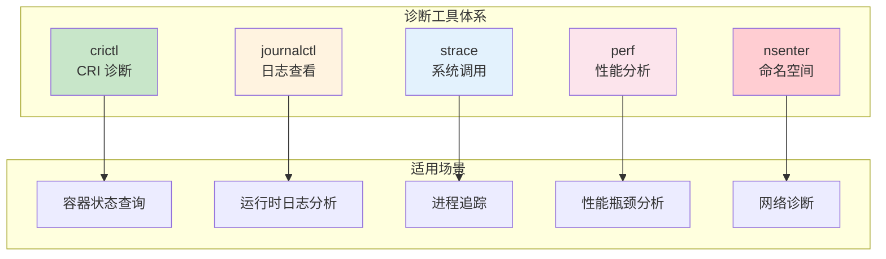
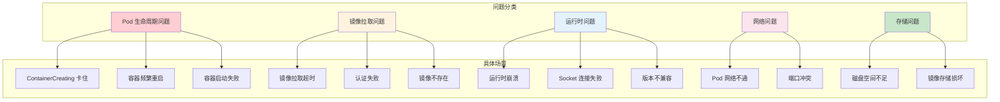
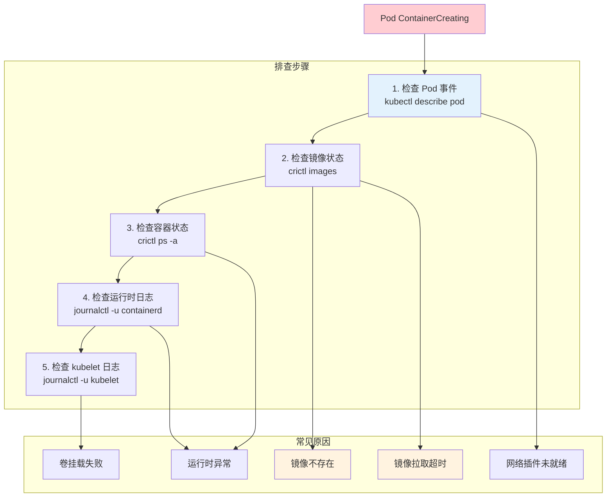
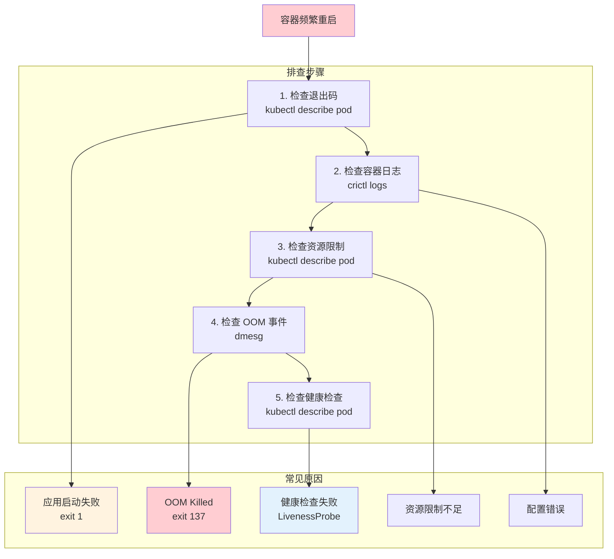
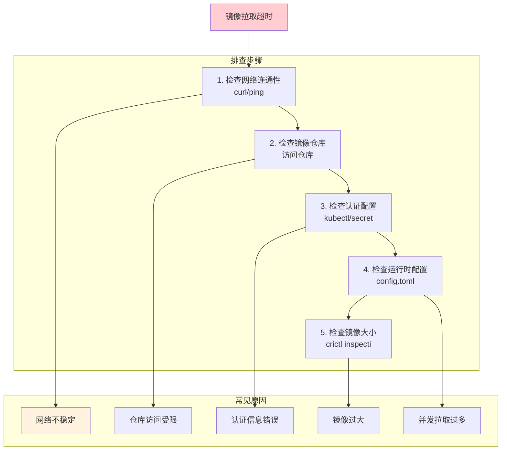
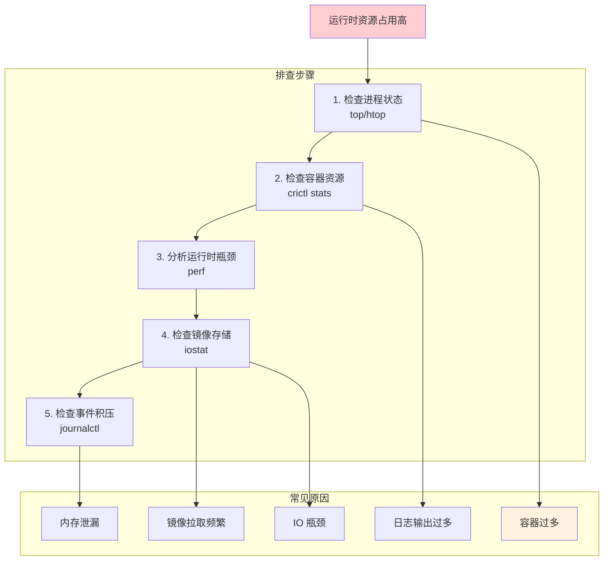
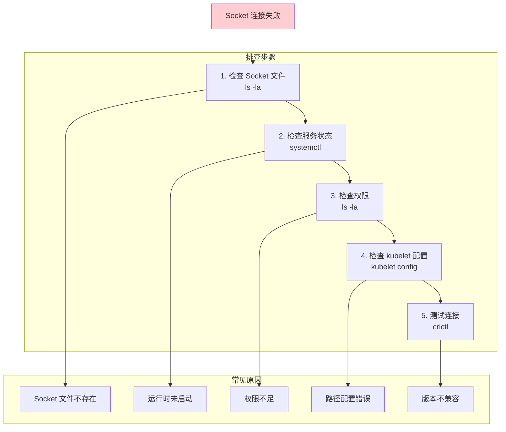

# 容器运行时问题定位与排查指南

> 本文档系统介绍容器运行时常见问题的排查方法，包括诊断工具使用、场景实例分析和解决步骤。

---

## 目录

- [1. 诊断工具概览](#1-诊断工具概览)
- [2. 常见问题分类](#2-常见问题分类)
- [3. Pod 生命周期问题排查](#3-pod-生命周期问题排查)
- [4. 镜像拉取问题排查](#4-镜像拉取问题排查)
- [5. 运行时性能问题排查](#5-运行时性能问题排查)
- [6. 运行时通信问题排查](#6-运行时通信问题排查)
- [7. 诊断脚本与工具](#7-诊断脚本与工具)

---

## 1. 诊断工具概览

### 1.1 核心诊断工具



### 1.2 工具对比

| 工具 | 功能 | 使用时机 |
|------|------|----------|
| **crictl** | CRI 接口操作 | Pod/容器状态查询 |
| **journalctl** | 系统日志查看 | 运行时日志分析 |
| **strace** | 系统调用追踪 | 进程行为分析 |
| **perf** | 性能分析 | CPU/内存瓶颈 |
| **nsenter** | 进入命名空间 | 网络诊断 |
| **dmesg** | 内核日志 | OOM/驱动问题 |
| **iostat** | IO 统计 | 存储瓶颈分析 |

### 1.3 crictl 常用诊断命令

```bash
# ============================================================
# crictl 诊断命令清单
# ============================================================

# === Pod 诊断 ===
crictl pods                      # 列出所有 Pod
crictl pods --namespace default  # 指定命名空间
crictl inspectp <pod-id>         # 查看 Pod 详情

# === 容器诊断 ===
crictl ps                        # 运行中的容器
crictl ps -a                     # 所有容器（含已停止）
crictl inspect <container-id>    # 容器详情
crictl logs <container-id>       # 容器日志
crictl logs --tail 100 <id>      # 最近100行日志
crictl stats <container-id>      # 容器资源使用

# === 运行时诊断 ===
crictl version                   # 运行时版本
crictl info                      # 运行时信息
crictl imagefsinfo               # 镜像存储信息

# === 镜像诊断 ===
crictl images                    # 列出镜像
crictl inspecti <image-id>       # 镜像详情
```

### 1.4 journalctl 日志查看

```bash
# ============================================================
# journalctl 日志查看命令
# ============================================================

# === containerd 日志 ===
journalctl -u containerd               # 所有日志
journalctl -u containerd -f            # 实时日志
journalctl -u containerd --since "1h ago"  # 最近1小时
journalctl -u containerd -p err        # 仅错误日志

# === CRI-O 日志 ===
journalctl -u crio                     # 所有日志
journalctl -u crio -f                  # 实时日志

# === kubelet 日志 ===
journalctl -u kubelet                  # kubelet 日志
journalctl -u kubelet -f               # 实时日志

# === 组合查询 ===
journalctl -u containerd -u kubelet    # 组合日志
journalctl -u containerd -u kubelet --since "10m ago"
```

---

## 2. 常见问题分类

### 2.1 问题分类图



### 2.2 问题优先级

| 问题类型 | 影响 | 优先级 |
|----------|------|--------|
| 运行时崩溃 | 节点不可用 | **P0** |
| Socket 连接失败 | 所有 Pod 异常 | **P0** |
| ContainerCreating 卡住 | Pod 无法启动 | **P1** |
| 镜像拉取失败 | Pod 无法启动 | **P1** |
| 容器频繁重启 | 服务不稳定 | **P2** |
| 网络问题 | 服务访问异常 | **P2** |
| 性能问题 | 响应缓慢 | **P3** |

---

## 3. Pod 生命周期问题排查

### 3.1 ContainerCreating 卡住

**问题现象：** Pod 状态长时间停留在 `ContainerCreating`



**排查步骤：**

```bash
# ============================================================
# ContainerCreating 问题排查
# ============================================================

# === 步骤 1: 检查 Pod 事件 ===
kubectl describe pod <pod-name> -n <namespace>

# 查看关键事件
# Events:
#   Type     Reason     Age   From               Message
#   ----     ------     ----  ----               -------
#   Normal   Scheduled  2m    default-scheduler  Successfully assigned...
#   Warning  Failed     1m    kubelet            Failed to pull image...

# === 步骤 2: 检查镜像状态 ===
crictl images | grep <image-name>

# 如果镜像不存在，手动拉取
crictl pull <image-name>

# === 步骤 3: 检查容器状态 ===
crictl ps -a | grep <pod-name>
crictl inspect <container-id>

# === 步骤 4: 检查运行时日志 ===
journalctl -u containerd -f --no-pager | grep -i error

# === 步骤 5: 检查 kubelet 日志 ===
journalctl -u kubelet --since "5m ago" | grep <pod-name>
```

**常见原因及解决：**

| 原因 | 诊断方法 | 解决方案 |
|------|----------|----------|
| 镜像不存在 | `crictl images` | 手动拉取镜像 |
| 镜像拉取超时 | 检查网络/仓库 | 使用本地镜像仓库 |
| 网络插件未就绪 | 检查 CNI 配置 | 重启网络插件 |
| 卷挂载失败 | `kubectl describe` | 检查 PV/PVC |
| 运行时异常 | `crictl info` | 重启运行时服务 |

### 3.2 容器频繁重启

**问题现象：** 容器反复重启，状态在 Running 和 Waiting 之间切换



**排查步骤：**

```bash
# ============================================================
# 容器频繁重启问题排查
# ============================================================

# === 步骤 1: 检查退出码 ===
kubectl describe pod <pod-name> -n <namespace>

# 关键信息
# Last State:     Terminated
#   Reason:       OOMKilled    # 内存溢出
#   Exit Code:    137          # 128 + 9 (SIGKILL)
#   Exit Code:    1            # 应用错误退出

# === 步骤 2: 检查容器日志 ===
kubectl logs <pod-name> -n <namespace> --previous
# 或者使用 crictl
crictl logs <container-id> --tail 100

# === 步骤 3: 检查资源限制 ===
kubectl describe pod <pod-name> | grep -A 10 "Limits:"
kubectl describe pod <pod-name> | grep -A 10 "Requests:"

# === 步骤 4: 检查 OOM 事件 ===
dmesg | grep -i "oom" | tail -20
dmesg | grep -i "killed process"

# === 步骤 5: 检查健康检查配置 ===
kubectl describe pod <pod-name> | grep -A 20 "Liveness"
kubectl describe pod <pod-name> | grep -A 20 "Readiness"
```

**退出码含义：**

| 退出码 | 含义 | 原因 |
|--------|------|------|
| **0** | 正常退出 | 应用正常结束 |
| **1** | 应用错误 | 应用启动失败 |
| **137** | OOM Killed | 内存不足被杀 |
| **139** | Segmentation Fault | 应用崩溃 |
| **143** | SIGTERM | 正常停止信号 |

### 3.3 容器启动失败

**问题现象：** 容器创建后立即失败，无法进入 Running 状态

```bash
# ============================================================
# 容器启动失败排查
# ============================================================

# === 检查容器状态 ===
crictl ps -a | grep Exited

# === 检查容器详情 ===
crictl inspect <container-id>

# 关键字段
# "state": {
#   "status": "exited",
#   "exitCode": <code>,
#   "finishedAt": "<time>"
# }

# === 检查容器日志 ===
crictl logs <container-id>

# === 检查挂载点 ===
crictl inspect <container-id> | grep -A 30 "mounts"

# === 检查运行时错误 ===
journalctl -u containerd --since "5m ago" | grep -i "error"
```

**常见原因：**

| 原因 | 诊断命令 | 解决方案 |
|------|----------|----------|
| 命令不存在 | `crictl logs` | 修正启动命令 |
| 配置文件缺失 | `crictl inspect` | 检查挂载配置 |
| 权限不足 | `crictl logs` | 添加权限配置 |
| 依赖服务未就绪 | `crictl logs` | 检查服务依赖 |

---

## 4. 镜像拉取问题排查

### 4.1 镜像拉取超时

**问题现象：** 镜像拉取时间过长或失败



**排查步骤：**

```bash
# ============================================================
# 镜像拉取超时排查
# ============================================================

# === 步骤 1: 检查网络连通性 ===
# 测试镜像仓库访问
curl -I https://registry-1.docker.io/v2/
curl -I https://registry.k8s.io/v2/

# === 步骤 2: 检查镜像仓库状态 ===
# 使用 crictl 拉取测试
crictl pull --timeout 10m <image-name>

# 查看拉取日志
journalctl -u containerd -f | grep -i "pull"

# === 步骤 3: 检查认证配置 ===
# 检查 Secret
kubectl get secrets -n <namespace>
kubectl describe secret <secret-name> -n <namespace>

# 检查运行时认证配置
cat /etc/containerd/config.toml | grep -A 5 "auths"

# === 步骤 4: 检查运行时配置 ===
# 检查超时配置
cat /etc/containerd/config.toml | grep "pull_timeout"
cat /etc/containerd/config.toml | grep "max_concurrent_downloads"

# === 步骤 5: 检查镜像信息 ===
crictl inspecti <image-name>
```

**解决方案：**

| 原因 | 解决方案 |
|------|----------|
| 网络不稳定 | 使用本地镜像仓库 |
| 仓库访问受限 | 配置镜像加速器 |
| 认证错误 | 重新配置 Secret |
| 镜像过大 | 增加超时时间，分层优化 |
| 并发过多 | 减少 `max_concurrent_downloads` |

### 4.2 镜像认证失败

**问题现象：** 镜像拉取时提示认证失败

```bash
# ============================================================
# 镜像认证失败排查
# ============================================================

# === 检查错误信息 ===
kubectl describe pod <pod-name>

# 错误示例
# Error: failed to pull image: denied: requested access to the resource is denied

# === 检查 Secret 配置 ===
kubectl get secrets -n <namespace>
kubectl describe secret docker-registry-secret -n <namespace>

# === 创建认证 Secret ===
kubectl create secret docker-registry regcred \
  --docker-server=<registry-server> \
  --docker-username=<username> \
  --docker-password=<password> \
  --docker-email=<email> \
  -n <namespace>

# === 在 Pod 中引用 Secret ===
# 在 Pod spec 中添加
# spec:
#   imagePullSecrets:
#     - name: regcred

# === 验证认证 ===
# 手动拉取测试
crictl pull --creds <username>:<password> <image-name>
```

### 4.3 镜像不存在

**问题现象：** 镜像仓库中不存在指定镜像

```bash
# ============================================================
# 镜像不存在排查
# ============================================================

# === 检查错误信息 ===
kubectl describe pod <pod-name>

# 错误示例
# Error: image "<image-name>" not found

# === 检查镜像名称 ===
# 确认镜像名称和 tag 是否正确
curl -s https://registry.hub.docker.com/v2/repositories/<namespace>/<image>/tags/ | jq

# === 检查本地镜像 ===
crictl images | grep <image-name>

# === 检查镜像仓库 ===
# 使用 skopeo 查询镜像信息
skopeo inspect docker://<image-name>
```

---

## 5. 运行时性能问题排查

### 5.1 CPU/内存占用高

**问题现象：** 运行时进程资源占用异常



**排查步骤：**

```bash
# ============================================================
# 运行时性能排查
# ============================================================

# === 步骤 1: 检查进程状态 ===
# 查看 containerd 进程
top -p $(pgrep containerd)
htop -p $(pgrep containerd)

# 查看 CRI-O 进程
top -p $(pgrep crio)

# === 步骤 2: 检查容器资源 ===
# 查看所有容器资源使用
crictl stats

# 查看特定容器
crictl stats <container-id>

# === 步骤 3: 性能分析 ===
# 使用 perf 分析
perf top -p $(pgrep containerd)

# 生成火焰图（可选）
perf record -p $(pgrep containerd) -g -- sleep 60
perf script > perf.out

# === 步骤 4: 检查 IO ===
iostat -x 1 10
iotop -o

# === 步骤 5: 检查事件 ===
# 查看事件积压
journalctl -u containerd --since "1h ago" | wc -l
```

### 5.2 容器启动延迟

**问题现象：** 容器启动时间过长

```bash
# ============================================================
# 容器启动延迟排查
# ============================================================

# === 检查容器启动时间 ===
crictl inspect <container-id> | grep -A 5 "createdAt"
crictl inspect <container-id> | grep -A 5 "startedAt"

# === 分析启动瓶颈 ===
# 1. 镜像拉取时间
journalctl -u containerd | grep -i "pull" | grep <image-name>

# 2. 挂载时间
journalctl -u kubelet | grep -i "mount" | grep <pod-name>

# 3. 网络配置时间
journalctl -u kubelet | grep -i "network" | grep <pod-name>

# === 优化建议 ===
# 1. 预拉取镜像
crictl pull <image-name>

# 2. 使用本地镜像仓库
# 3. 优化镜像大小（使用 alpine 等）
# 4. 减少挂载点数量
```

---

## 6. 运行时通信问题排查

### 6.1 Socket 连接失败

**问题现象：** kubelet 无法与运行时通信



**排查步骤：**

```bash
# ============================================================
# Socket 连接失败排查
# ============================================================

# === 步骤 1: 检查 Socket 文件 ===
ls -la /run/containerd/containerd.sock
ls -la /run/crio/crio.sock

# === 步骤 2: 检查服务状态 ===
systemctl status containerd
systemctl status crio

# === 步骤 3: 检查权限 ===
# Socket 文件权限应该是可读写
ls -la /run/containerd/containerd.sock
# 应该显示: srwxrwxrwx

# === 步骤 4: 检查 kubelet 配置 ===
# kubelet 配置文件
cat /var/lib/kubelet/config.yaml | grep containerRuntime

# 或者检查 kubelet 启动参数
ps aux | grep kubelet | grep -i "container-runtime-endpoint"

# === 步骤 5: 测试连接 ===
# 使用 crictl 测试
crictl --runtime-endpoint unix:///run/containerd/containerd.sock pods

# 如果连接失败，重启运行时
systemctl restart containerd
```

### 6.2 版本不兼容

**问题现象：** 运行时与 Kubernetes 版本不匹配

```bash
# ============================================================
# 版本兼容性排查
# ============================================================

# === 检查版本 ===
# Kubernetes 版本
kubectl version --short

# 运行时版本
crictl version
containerd --version
crio --version

# === 版本兼容性表 ===
# | K8s 版本 | containerd | CRI-O |
# |---------|------------|-------|
# | 1.26    | 1.6+       | 1.24+ |
# | 1.27    | 1.6+       | 1.25+ |
# | 1.28    | 1.7+       | 1.28+ |
# | 1.29    | 1.7+       | 1.29+ |

# === 解决版本不兼容 ===
# 升级运行时
apt-get install containerd=<version>
# 或
yum install containerd-<version>
```

---

## 7. 诊断脚本与工具

### 7.1 运行时诊断脚本

```bash
#!/bin/bash
# ============================================================
# runtime-diagnose.sh - 运行时诊断脚本
# ============================================================

echo "=========================================="
echo "容器运行时诊断报告"
echo "生成时间: $(date)"
echo "=========================================="

# === 1. 运行时状态 ===
echo ""
echo "=== 1. 运行时服务状态 ==="
systemctl status containerd --no-pager || systemctl status crio --no-pager

# === 2. 运行时版本 ===
echo ""
echo "=== 2. 运行时版本 ==="
crictl version

# === 3. 运行时信息 ===
echo ""
echo "=== 3. 运行时信息 ==="
crictl info

# === 4. Pod 列表 ===
echo ""
echo "=== 4. Pod 列表 ==="
crictl pods

# === 5. 容器列表 ===
echo ""
echo "=== 5. 容器列表 ==="
crictl ps -a

# === 6. 镜像列表 ===
echo ""
echo "=== 6. 镜像列表 ==="
crictl images

# === 7. 最近错误日志 ===
echo ""
echo "=== 7. 最近错误日志 ==="
journalctl -u containerd -p err --since "1h ago" --no-pager | tail -20
journalctl -u crio -p err --since "1h ago" --no-pager | tail -20

# === 8. Socket 文件 ===
echo ""
echo "=== 8. Socket 文件状态 ==="
ls -la /run/containerd/containerd.sock 2>/dev/null || ls -la /run/crio/crio.sock 2>/dev/null

# === 9. 存储信息 ===
echo ""
echo "=== 9. 镜像存储信息 ==="
crictl imagefsinfo

# === 10. 资源使用 ===
echo ""
echo "=== 10. 容器资源使用 ==="
crictl stats

echo ""
echo "=========================================="
echo "诊断报告完成"
echo "=========================================="
```

### 7.2 Pod 问题诊断脚本

```bash
#!/bin/bash
# ============================================================
# pod-diagnose.sh - Pod 问题诊断脚本
# ============================================================

POD_NAME=$1
NAMESPACE=$2

if [ -z "$POD_NAME" ]; then
    echo "用法: $0 <pod-name> [namespace]"
    exit 1
fi

if [ -z "$NAMESPACE" ]; then
    NAMESPACE="default"
fi

echo "=========================================="
echo "Pod 诊断报告: $POD_NAME (namespace: $NAMESPACE)"
echo "生成时间: $(date)"
echo "=========================================="

# === 1. Pod 基本信息 ===
echo ""
echo "=== 1. Pod 基本信息 ==="
kubectl get pod $POD_NAME -n $NAMESPACE -o wide

# === 2. Pod 事件 ===
echo ""
echo "=== 2. Pod 事件 ==="
kubectl describe pod $POD_NAME -n $NAMESPACE | grep -A 20 "Events:"

# === 3. Pod 状态详情 ===
echo ""
echo "=== 3. Pod 状态详情 ==="
kubectl describe pod $POD_NAME -n $NAMESPACE | grep -A 30 "Status:"

# === 4. 容器状态 ===
echo ""
echo "=== 4. 容器状态 ==="
kubectl describe pod $POD_NAME -n $NAMESPACE | grep -A 10 "Container Statuses:"

# === 5. 容器日志 ===
echo ""
echo "=== 5. 容器日志（最近50行） ==="
kubectl logs $POD_NAME -n $NAMESPACE --tail 50 2>/dev/null || echo "无法获取日志"

# === 6. 之前的容器日志（如果存在） ===
echo ""
echo "=== 6. 之前的容器日志 ==="
kubectl logs $POD_NAME -n $NAMESPACE --previous --tail 50 2>/dev/null || echo "无之前的日志"

# === 7. 资源限制 ===
echo ""
echo "=== 7. 资源限制 ==="
kubectl describe pod $POD_NAME -n $NAMESPACE | grep -A 5 "Limits:" || echo "无资源限制"

# === 8. 运行时 Pod 信息 ===
echo ""
echo "=== 8. 运行时 Pod 信息 ==="
POD_ID=$(crictl pods | grep $POD_NAME | awk '{print $1}')
if [ -n "$POD_ID" ]; then
    crictl inspectp $POD_ID
else
    echo "Pod 未在运行时找到"
fi

echo ""
echo "=========================================="
echo "诊断报告完成"
echo "=========================================="
```

### 7.3 镜像问题诊断脚本

```bash
#!/bin/bash
# ============================================================
# image-diagnose.sh - 镜像问题诊断脚本
# ============================================================

IMAGE_NAME=$1

if [ -z "$IMAGE_NAME" ]; then
    echo "用法: $0 <image-name>"
    exit 1
fi

echo "=========================================="
echo "镜像诊断报告: $IMAGE_NAME"
echo "生成时间: $(date)"
echo "=========================================="

# === 1. 本地镜像状态 ===
echo ""
echo "=== 1. 本地镜像状态 ==="
crictl images | grep $IMAGE_NAME || echo "镜像不存在于本地"

# === 2. 镜像详情 ===
echo ""
echo "=== 2. 镜像详情 ==="
IMAGE_ID=$(crictl images | grep $IMAGE_NAME | awk '{print $3}')
if [ -n "$IMAGE_ID" ]; then
    crictl inspecti $IMAGE_ID
else
    echo "无法获取镜像详情"
fi

# === 3. 尝试拉取镜像 ===
echo ""
echo "=== 3. 尝试拉取镜像 ==="
echo "开始拉取..."
crictl pull $IMAGE_NAME

# === 4. 拉取日志 ===
echo ""
echo "=== 4. 最近镜像拉取日志 ==="
journalctl -u containerd --since "5m ago" --no-pager | grep -i "pull" | grep -i $IMAGE_NAME

# === 5. 镜像仓库可达性测试 ===
echo ""
echo "=== 5. 镜像仓库可达性测试 ==="
# 解析镜像仓库
REGISTRY=$(echo $IMAGE_NAME | cut -d'/' -f1)
if [ "$REGISTRY" = "$IMAGE_NAME" ]; then
    REGISTRY="docker.io"
fi

echo "仓库: $REGISTRY"
curl -I https://$REGISTRY/v2/ 2>/dev/null | head -5 || echo "无法连接仓库"

echo ""
echo "=========================================="
echo "诊断报告完成"
echo "=========================================="
```

---

## 附录

### A. 常见错误码速查

| 错误信息 | 原因 | 解决方案 |
|----------|------|----------|
| `ImagePullBackOff` | 镜像拉取失败 | 检查镜像名称、网络、认证 |
| `CrashLoopBackOff` | 容器崩溃循环 | 检查退出码、日志、资源配置 |
| `CreateContainerConfigError` | 配置错误 | 检查 Pod 配置 |
| `ErrImageNeverPull` | 镜像拉取策略禁止 | 调整 imagePullPolicy |
| `NetworkNotReady` | 网络未就绪 | 检查 CNI 配置 |

### B. 诊断命令速查表

```bash
# === 快速诊断 ===
# 1. Pod 状态
kubectl get pods -A | grep -v Running

# 2. 容器状态
crictl ps -a | grep -v Running

# 3. 运行时状态
systemctl status containerd

# 4. 最近错误
journalctl -u containerd -p err --since "1h ago"

# 5. 资源使用
crictl stats
```

---

> 继续学习：掌握通用排查方法后，推荐阅读 [nvidia-toolkit.md](nvidia-toolkit.md) 学习 GPU 运行时的专门排查技巧。