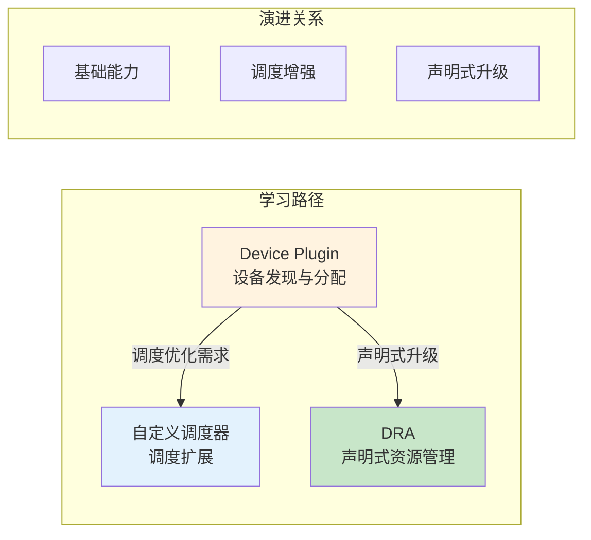
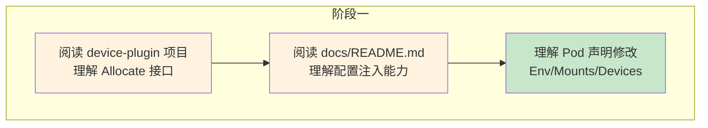
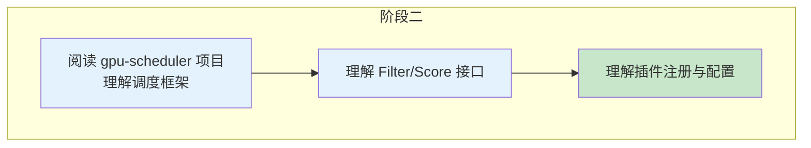
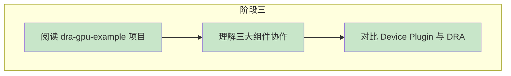
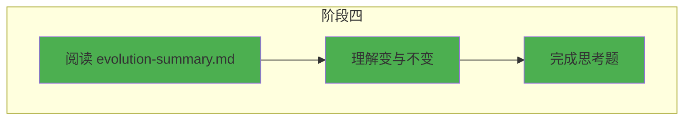

# Kubernetes AI Infra 资源分配学习系列

> 从 Device Plugin 到 DRA，系统学习 Kubernetes GPU 资源分配机制的完整演进路径。

---

## 学习系列总览

本项目系列涵盖 Kubernetes AI 基础设施资源分配的三大核心技术：



---

## 项目导航

| 项目 | 核心技术 | 学习文档 | 核心收获 |
|------|----------|----------|----------|
| **gpu-scheduler** | 调度框架插件 | [docs/README.md](gpu-scheduler/docs/README.md) | Filter/Score 接口、调度流程 |
| **device-plugin** | Device Plugin | [docs/README.md](device-plugin/docs/README.md) | Allocate 接口、配置注入 |
| **dra-gpu-example** | DRA 机制 | [docs/README.md](dra-gpu-example/docs/README.md) | 三大组件、CEL约束 |

---

## 目录结构

```
week-1-resource-allocate/
│
├── gpu-scheduler/                    # GPU感知调度器
│   ├── pkg/plugins/                  # Filter/Score 插件
│   ├── config/                       # 调度器配置
│   └── docs/README.md                # 调度框架详解
│
├── device-plugin/                    # Device Plugin POC
│   ├── pkg/plugin/plugin.go          # Allocate 接口实现
│   ├── manifests/                    # DaemonSet 部署
│   └── docs/README.md                # Allocate 能力详解
│
├── dra-gpu-example/                  # DRA 资源分配示例
│   ├── manifests/                    # ResourceClass/Claim/Pod
│   └── docs/README.md                # DRA 机制详解
│
├── docs/
│   └── evolution-summary.md          # 演进总结 + 思考题
│
├── AGENTS.md                         # 风格规范（后续遵循）
└── README.md                         # 本文档
```

---

## 学习路线

### 阶段一：理解基础机制



**学习重点：**
- Device Plugin gRPC 接口
- Allocate 接口可修改的内容
- Pod 声明注入机制

### 阶段二：扩展调度能力



**学习重点：**
- 调度框架扩展点
- Filter/Score 接口设计
- 自定义插件实现

### 阶段三：掌握新机制



**学习重点：**
- ResourceClass/Claim/Slice 三大组件
- CEL 约束表达式
- DRA Driver 接口

### 阶段四：总结与思考



**学习重点：**
- 演进规律总结
- 开源项目源码研读
- 业务场景思考题

---

## 核心收获

完成本系列学习后，你将掌握：

| 能力维度 | 收获 |
|----------|------|
| **概念理解** | Device Plugin、调度框架、DRA 三大机制 |
| **接口掌握** | Allocate、Filter/Score、Prepare 等核心接口 |
| **流程认知** | 设备发现、资源分配、Pod注入完整流程 |
| **演进理解** | 从 Device Plugin 到 DRA 的演进规律 |
| **实践能力** | 能够设计 GPU 资源分配方案 |

---

## 推荐开源项目源码

| 项目 | 链接 | 研读重点 |
|------|------|----------|
| NVIDIA Device Plugin | https://github.com/NVIDIA/k8s-device-plugin | Allocate 实现 |
| NVIDIA DRA Driver | https://github.com/NVIDIA/k8s-dra-driver-gpu | DRA Driver 实现 |
| Kubernetes Scheduler | https://github.com/kubernetes/kubernetes/tree/master/pkg/scheduler | 调度框架 |
| CDI Specification | https://github.com/cncf-tags/container-device-interface | 设备描述标准 |

---

## 规范遵循

后续新增学习项目请遵循 [AGENTS.md](AGENTS.md) 中定义的风格规范。

**核心规范：**
- 三层文档体系（概览层、详解层、代码层）
- Mermaid 图表颜色语义
- 代码注释分隔符规范
- Mock 函数示意性实现

---

> 开始学习：推荐从 [device-plugin/docs/README.md](device-plugin/docs/README.md) 开始，按阶段顺序学习。