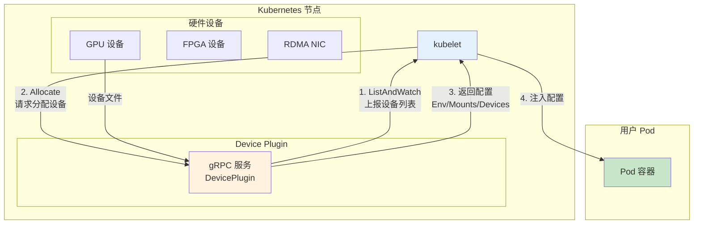
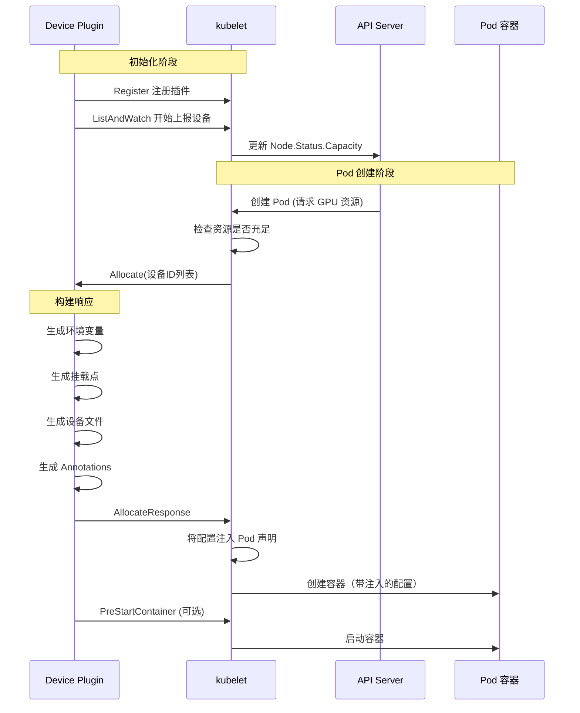
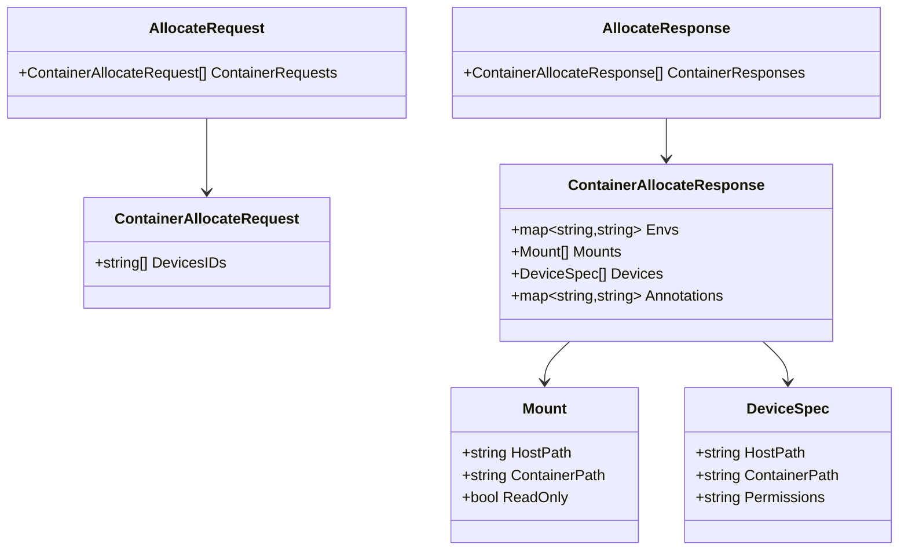
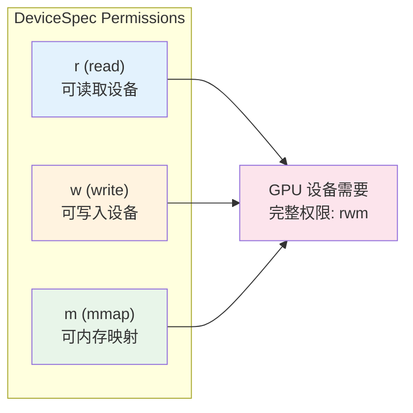
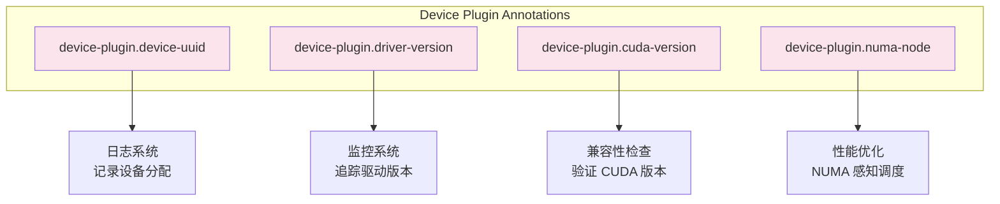
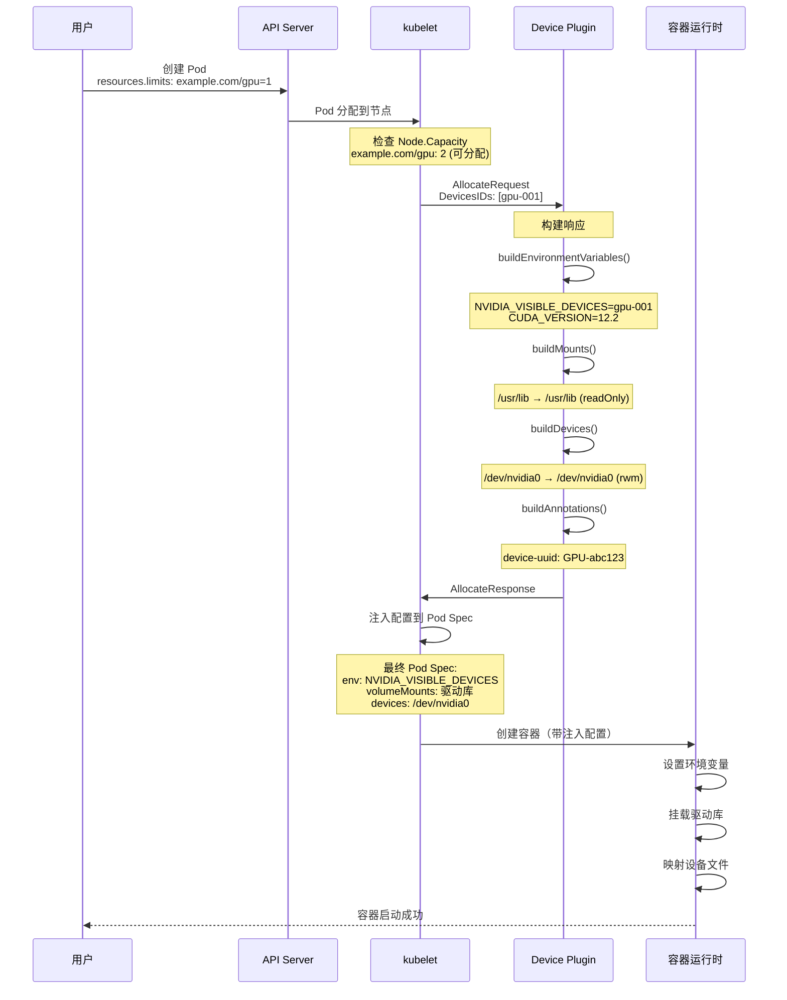
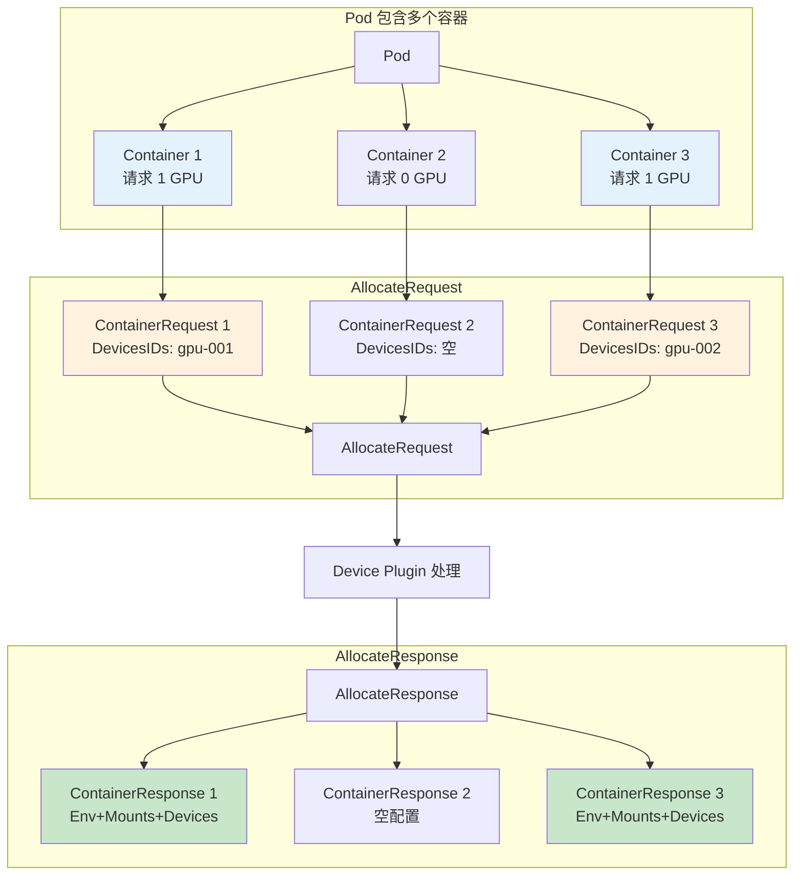
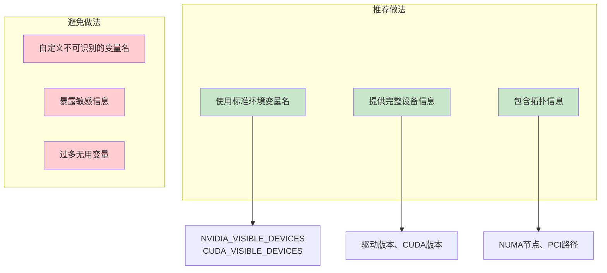

# Kubernetes Device Plugin Allocate 接口详解

> 本文档详细介绍 Device Plugin 的 `Allocate` 接口，以及如何通过此接口修改 Pod 的容器声明，注入驱动、环境变量和设备文件。

---

## 目录

- [1. Device Plugin 概述](#1-device-plugin-概述)
- [2. gRPC 接口定义](#2-grpc-接口定义)
- [3. Allocate 接口核心能力](#3-allocate-接口核心能力)
- [4. ContainerAllocateResponse 结构详解](#4-containerallocateresponse-结构详解)
- [5. 环境变量注入](#5-环境变量注入)
- [6. 挂载点配置](#6-挂载点配置)
- [7. 设备文件映射](#7-设备文件映射)
- [8. Annotations 元数据](#8-annotations-元数据)
- [9. 完整流程示例](#9-完整流程示例)
- [10. 最佳实践](#10-最佳实践)

---

## 1. Device Plugin 概述

### 1.1 什么是 Device Plugin

Device Plugin 是 Kubernetes 的扩展机制，用于让 kubelet 发现和使用特殊硬件设备（如 GPU、FPGA、RDMA NIC 等）。



### 1.2 Device Plugin 核心职责

| 职责 | 接口 | 说明 |
|------|------|------|
| 设备发现 | `ListAndWatch` | 发现节点上的设备，上报给 kubelet |
| 设备分配 | `Allocate` | 分配设备时修改 Pod 声明 |
| 设备健康 | `ListAndWatch` | 监控设备状态，实时上报 |
| 设备拓扑 | `TopologyInfo` | 提供 NUMA 感知信息 |

---

## 2. gRPC 接口定义

### 2.1 DevicePlugin 服务接口

```protobuf
// k8s.io/kubelet/pkg/apis/deviceplugin/v1beta1
service DevicePlugin {
    // 获取插件选项
    rpc GetDevicePluginOptions(Empty) returns (DevicePluginOptions) {}
    
    // 持续上报设备列表和状态（核心）
    rpc ListAndWatch(Empty) returns (stream ListAndWatchResponse) {}
    
    // 设备分配时修改 Pod 声明（核心，本文重点）
    rpc Allocate(AllocateRequest) returns (AllocateResponse) {}
    
    // 返回首选分配方案（可选）
    rpc GetPreferredAllocation(PreferredAllocationRequest) 
        returns (PreferredAllocationResponse) {}
    
    // 容器启动前准备（可选）
    rpc PreStartContainer(PreStartContainerRequest) 
        returns (PreStartContainerResponse) {}
}
```

### 2.2 接口调用时机



---

## 3. Allocate 接口核心能力

### 3.1 Allocate 能做什么

```mermaid
graph LR
    subgraph "Allocate 接口可修改的内容"
        ENV[环境变量<br/>Envs]
        MOUNT[挂载点<br/>Mounts]
        DEV[设备文件<br/>Devices]
        ANNOT[Annotations<br/>元数据]
    end
    
    ENV --> E1[NVIDIA_VISIBLE_DEVICES]
    ENV --> E2[CUDA_VISIBLE_DEVICES]
    ENV --> E3[驱动版本]
    ENV --> E4[NUMA 节点]
    
    MOUNT --> M1[驱动库 .so]
    MOUNT --> M2[CUDA lib64]
    MOUNT --> M3[CUDA bin]
    MOUNT --> M4[配置文件]
    
    DEV --> D1[/dev/nvidia0]
    DEV --> D2[/dev/nvidiactl]
    DEV --> D3[/dev/nvidia-uvm]
    
    ANNOT --> A1[设备 UUID]
    ANNOT --> A2[设备型号]
    ANNOT --> A3[驱动版本]
    
    style ENV fill:#e3f2fd
    style MOUNT fill:#fff3e0
    style DEV fill:#e8f5e9
    style ANNOT fill:#fce4ec
```

### 3.2 能力对比表

| 能力 | 字段 | 典型用途 | 示例 |
|------|------|----------|------|
| **环境变量** | `Envs` | 传递设备配置信息 | `NVIDIA_VISIBLE_DEVICES=gpu-001` |
| **挂载点** | `Mounts` | 挂载驱动库、工具 | `/usr/lib/libcuda.so → 容器` |
| **设备文件** | `Devices` | 映射硬件设备 | `/dev/nvidia0 → 容器` |
| **Annotations** | `Annotations` | 元数据记录 | `device-uuid: GPU-abc123` |

### 3.3 不能做什么

> **重要限制**：Allocate 接口 **不能** 直接修改：
> - Pod 的 `spec.containers[].command` 或 `args`
> - Pod 的 `spec.containers[].image`
> - Pod 的 `spec.containers[].resources.limits`（已分配）
> - Pod 的 `metadata.annotations`（Pod 级别）
> - Pod 的网络配置、安全策略等

Allocate 只能修改 **容器级别** 的运行时配置，通过 kubelet 注入。

---

## 4. ContainerAllocateResponse 结构详解

### 4.1 消息结构

```protobuf
message ContainerAllocateResponse {
    // 环境变量：注入到容器环境
    map<string, string> envs = 1;
    
    // 挂载点：将宿主机目录/文件挂载到容器
    repeated Mount mounts = 2;
    
    // 设备文件：将宿主机设备映射到容器
    repeated DeviceSpec devices = 3;
    
    // Annotations：容器级别的元数据
    map<string, string> annotations = 4;
}

message Mount {
    // 宿主机路径
    string host_path = 1;
    
    // 容器内路径
    string container_path = 2;
    
    // 是否只读
    bool read_only = 3;
}

message DeviceSpec {
    // 宿主机设备路径
    string host_path = 1;
    
    // 容器内设备路径
    string container_path = 2;
    
    // 访问权限: "r"(读), "w"(写), "m"(mmap)
    string permissions = 3;
}
```

### 4.2 结构可视化



---

## 5. 环境变量注入

### 5.1 环境变量注入流程

```mermaid
flowchart LR
    subgraph "Device Plugin"
        A[接收 AllocateRequest<br/>deviceIDs: [gpu-001]]
        B[构建环境变量 Map]
        C[返回 AllocateResponse<br/>Envs: {...}]
    end
    
    subgraph "kubelet"
        D[解析 ContainerAllocateResponse]
        E[注入到 Pod Spec<br/>containers[].env]
    end
    
    subgraph "容器运行时"
        F[创建容器环境]
        G[应用程序读取环境变量]
    end
    
    A --> B --> C --> D --> E --> F --> G
    
    style A fill:#fff3e0
    style C fill:#fff3e0
    style E fill:#e3f2fd
    style G fill:#c8e6c9
```

### 5.2 常用环境变量

| 环境变量 | 作用 | 示例值 |
|----------|------|--------|
| `NVIDIA_VISIBLE_DEVICES` | NVIDIA 容器运行时使用 | `GPU-abc123-0001` |
| `CUDA_VISIBLE_DEVICES` | CUDA 应用程序使用 | `0,1` 或 UUID |
| `NVIDIA_DRIVER_VERSION` | 驱动版本标识 | `535.129.03` |
| `CUDA_VERSION` | CUDA 版本 | `12.2` |
| `GPU_UUID` | 设备唯一标识 | `GPU-abc123-0001` |
| `GPU_MEMORY_MIB` | GPU 显存大小 | `81920` |
| `GPU_NUMA_NODE` | NUMA 拓扑信息 | `0` |
| `GPU_PCI_PATH` | PCI 设备路径 | `/sys/bus/pci/devices/0000:08:00.0` |

### 5.3 代码示例

```go
func (p *GPUDevicePlugin) buildEnvironmentVariables(deviceIDs []string) map[string]string {
    envs := map[string]string{}

    // === 设备可见性 ===
    visibleDevices := strings.Join(deviceIDs, ",")
    envs["NVIDIA_VISIBLE_DEVICES"] = visibleDevices
    envs["CUDA_VISIBLE_DEVICES"] = visibleDevices

    // === 设备属性 ===
    if dev, ok := p.devices[deviceIDs[0]]; ok {
        envs["NVIDIA_DRIVER_VERSION"] = dev.Properties["driver"]
        envs["CUDA_VERSION"] = dev.Properties["cuda"]
        envs["GPU_UUID"] = dev.Properties["uuid"]
        envs["GPU_MEMORY_MIB"] = dev.Properties["memory"]
        envs["GPU_MODEL"] = dev.Properties["model"]
    }

    // === NUMA 感知 ===
    if dev.Topology != nil {
        envs["GPU_NUMA_NODE"] = fmt.Sprintf("%d", dev.Topology.NUMANode)
    }

    return envs
}
```

### 5.4 注入后的 Pod Spec

```yaml
# kubelet 注入环境变量后的容器声明
spec:
  containers:
    - name: gpu-container
      env:
        # Device Plugin 注入的环境变量
        - name: NVIDIA_VISIBLE_DEVICES
          value: "GPU-abc123-0001"
        - name: CUDA_VISIBLE_DEVICES
          value: "GPU-abc123-0001"
        - name: NVIDIA_DRIVER_VERSION
          value: "535.129.03"
        - name: CUDA_VERSION
          value: "12.2"
        - name: GPU_UUID
          value: "GPU-abc123-0001"
        - name: GPU_NUMA_NODE
          value: "0"
```

---

## 6. 挂载点配置

### 6.1 挂载点注入流程

```mermaid
flowchart TB
    subgraph "宿主机"
        H1[/usr/lib/libcuda.so]
        H2[/usr/local/cuda/lib64]
        H3[/usr/local/cuda/bin]
    end
    
    subgraph "Device Plugin"
        DP[构建 Mounts 列表]
    end
    
    subgraph "kubelet 注入"
        K[添加到 containers[].volumeMounts]
    end
    
    subgraph "容器内"
        C1[/usr/lib/libcuda.so]
        C2[/usr/local/cuda/lib64]
        C3[/usr/local/cuda/bin]
    end
    
    H1 --> DP
    H2 --> DP
    H3 --> DP
    DP --> K
    K --> C1
    K --> C2
    K --> C3
    
    style H1 fill:#e8f5e9
    style H2 fill:#e8f5e9
    style H3 fill:#e8f5e9
    style C1 fill:#c8e6c9
    style C2 fill:#c8e6c9
    style C3 fill:#c8e6c9
```

### 6.2 常用挂载点

| 挂载类型 | 宿主机路径 | 容器路径 | 只读 | 说明 |
|----------|------------|----------|------|------|
| **驱动库** | `/usr/lib/x86_64-linux-gnu` | `/usr/lib/x86_64-linux-gnu` | ✅ | libcuda.so 等核心库 |
| **CUDA 库** | `/usr/local/cuda/lib64` | `/usr/local/cuda/lib64` | ✅ | CUDA 运行时库 |
| **CUDA 工具** | `/usr/local/cuda/bin` | `/usr/local/cuda/bin` | ❌ | nvidia-smi, nvcc |
| **CUDA 头文件** | `/usr/local/cuda/include` | `/usr/local/cuda/include` | ✅ | 开发用头文件 |
| **驱动配置** | `/etc/nvidia` | `/etc/nvidia` | ✅ | NVIDIA 配置文件 |
| **库 stub** | `/usr/local/cuda/lib64/stubs` | `/usr/local/cuda/lib64/stubs` | ✅ | stub 库 |

### 6.3 代码示例

```go
func (p *GPUDevicePlugin) buildMounts() []Mount {
    mounts := []Mount{}

    // === 驱动库挂载 ===
    mounts = append(mounts, Mount{
        HostPath:      "/usr/lib/x86_64-linux-gnu",
        ContainerPath: "/usr/lib/x86_64-linux-gnu",
        ReadOnly:      true,  // 驱动库只读，避免污染
    })

    // === CUDA 库挂载 ===
    mounts = append(mounts, Mount{
        HostPath:      "/usr/local/cuda/lib64",
        ContainerPath: "/usr/local/cuda/lib64",
        ReadOnly:      true,
    })

    // === CUDA 工具挂载 ===
    mounts = append(mounts, Mount{
        HostPath:      "/usr/local/cuda/bin",
        ContainerPath: "/usr/local/cuda/bin",
        ReadOnly:      false, // 工具可能需要写临时文件
    })

    return mounts
}
```

### 6.4 注入后的 Pod Spec

```yaml
# kubelet 注入挂载点后的容器声明
spec:
  containers:
    - name: gpu-container
      volumeMounts:
        # Device Plugin 注入的挂载点
        - name: nvidia-driver-lib
          mountPath: /usr/lib/x86_64-linux-gnu
          readOnly: true
        - name: cuda-lib64
          mountPath: /usr/local/cuda/lib64
          readOnly: true
        - name: cuda-bin
          mountPath: /usr/local/cuda/bin
      volumes:
        # kubelet 自动创建的 hostPath volume
        - name: nvidia-driver-lib
          hostPath:
            path: /usr/lib/x86_64-linux-gnu
        - name: cuda-lib64
          hostPath:
            path: /usr/local/cuda/lib64
```

---

## 7. 设备文件映射

### 7.1 设备文件注入流程

```mermaid
flowchart LR
    subgraph "宿主机 /dev"
        D1[/dev/nvidia0]
        D2[/dev/nvidiactl]
        D3[/dev/nvidia-uvm]
    end
    
    subgraph "Device Plugin"
        DP[构建 DeviceSpec 列表]
    end
    
    subgraph "kubelet"
        K[添加 devices 配置]
    end
    
    subgraph "容器 /dev"
        C1[/dev/nvidia0]
        C2[/dev/nvidiactl]
        C3[/dev/nvidia-uvm]
    end
    
    D1 --> DP
    D2 --> DP
    D3 --> DP
    DP --> K --> C1 & C2 & C3
    
    style D1 fill:#ffcdd2
    style D2 fill:#ffcdd2
    style D3 fill:#ffcdd2
    style C1 fill:#c8e6c9
    style C2 fill:#c8e6c9
    style C3 fill:#c8e6c9
```

### 7.2 常用设备文件

| 设备文件 | 作用 | 权限 |
|----------|------|------|
| `/dev/nvidiaN` | GPU 控制设备（N 为索引） | `rwm` |
| `/dev/nvidiactl` | NVIDIA 统一控制接口 | `rwm` |
| `/dev/nvidia-uvm` | Unified Virtual Memory | `rwm` |
| `/dev/nvidia-uvm-tools` | UVM 工具设备 | `rwm` |
| `/dev/nvidia-modeset` | GPU 显示模式设置 | `rwm` |

### 7.3 权限说明



| 权限字符 | 含义 | GPU 是否需要 |
|----------|------|--------------|
| `r` | 读取设备 | ✅ 必须 |
| `w` | 写入设备 | ✅ 必须 |
| `m` | 内存映射 (mmap) | ✅ 必须（性能关键） |

### 7.4 代码示例

```go
func (p *GPUDevicePlugin) buildDevices(deviceIDs []string) []DeviceSpec {
    devices := []DeviceSpec{}

    // === 控制设备（必须）===
    devices = append(devices, DeviceSpec{
        HostPath:      "/dev/nvidiactl",
        ContainerPath: "/dev/nvidiactl",
        Permissions:   "rwm",
    })

    // === UVM 设备（必须）===
    devices = append(devices, DeviceSpec{
        HostPath:      "/dev/nvidia-uvm",
        ContainerPath: "/dev/nvidia-uvm",
        Permissions:   "rwm",
    })

    // === 分配的 GPU 设备 ===
    for _, id := range deviceIDs {
        dev := p.devices[id]
        deviceFile := fmt.Sprintf("/dev/nvidia%d", dev.Topology.GPUIndex)
        
        devices = append(devices, DeviceSpec{
            HostPath:      deviceFile,
            ContainerPath: deviceFile,
            Permissions:   "rwm",
        })
    }

    return devices
}
```

---

## 8. Annotations 元数据

### 8.1 Annotations 用途



### 8.2 Annotations vs Pod Annotations

> **重要区分**：
>
> | 类型 | 范围 | 用途 |
> |------|------|------|
> | `ContainerAllocateResponse.Annotations` | **容器级别** | Device Plugin 注入的元数据 |
> | `Pod.Annotations` | **Pod 级别** | 用户定义的元数据 |

Device Plugin 的 Annotations 是 **容器级别** 的，不会修改 Pod 的 annotations。

### 8.3 代码示例

```go
func (p *GPUDevicePlugin) buildAnnotations(deviceIDs []string) map[string]string {
    annotations := map[string]string{}

    if len(deviceIDs) == 0 {
        return annotations
    }

    // === 记录分配信息 ===
    annotations["device-plugin.allocated-devices"] = strings.Join(deviceIDs, ",")

    if dev, ok := p.devices[deviceIDs[0]]; ok {
        annotations["device-plugin.device-uuid"] = dev.Properties["uuid"]
        annotations["device-plugin.device-model"] = dev.Properties["model"]
        annotations["device-plugin.driver-version"] = dev.Properties["driver"]
        annotations["device-plugin.cuda-version"] = dev.Properties["cuda"]

        if dev.Topology != nil {
            annotations["device-plugin.numa-node"] = fmt.Sprintf("%d", dev.Topology.NUMANode)
        }
    }

    return annotations
}
```

---

## 9. 完整流程示例

### 9.1 Pod 创建完整流程



### 9.2 多容器 Pod 处理



### 9.3 实际注入效果对比

```yaml
# 用户提交的原始 Pod
apiVersion: v1
kind: Pod
metadata:
  name: my-gpu-pod
spec:
  containers:
    - name: gpu-container
      image: nvidia/cuda:12.0
      command: ["python", "train.py"]
      resources:
        limits:
          example.com/gpu: 1  # 请求 GPU
          memory: "8Gi"

---
# kubelet 注入配置后的实际 Pod（内部）
apiVersion: v1
kind: Pod
metadata:
  name: my-gpu-pod
spec:
  containers:
    - name: gpu-container
      image: nvidia/cuda:12.0
      command: ["python", "train.py"]
      resources:
        limits:
          example.com/gpu: 1
          memory: "8Gi"
      
      # ===== Device Plugin 注入的环境变量 =====
      env:
        - name: NVIDIA_VISIBLE_DEVICES
          value: "GPU-abc123-0001"
        - name: CUDA_VISIBLE_DEVICES
          value: "GPU-abc123-0001"
        - name: NVIDIA_DRIVER_VERSION
          value: "535.129.03"
        - name: CUDA_VERSION
          value: "12.2"
        - name: GPU_UUID
          value: "GPU-abc123-0001"
        - name: GPU_NUMA_NODE
          value: "0"
      
      # ===== Device Plugin 注入的挂载点 =====
      volumeMounts:
        - name: nvidia-driver-libs
          mountPath: /usr/lib/x86_64-linux-gnu
          readOnly: true
        - name: cuda-lib64
          mountPath: /usr/local/cuda/lib64
          readOnly: true
        - name: cuda-bin
          mountPath: /usr/local/cuda/bin
      
      # ===== Device Plugin 注入的设备 =====
      # （由容器运行时处理，不在 Pod Spec 中显式）
      # devices:
      #   - hostPath: /dev/nvidia0
      #     containerPath: /dev/nvidia0
      #     permissions: rwm
  
  # ===== kubelet 创建的 volumes =====
  volumes:
    - name: nvidia-driver-libs
      hostPath:
        path: /usr/lib/x86_64-linux-gnu
    - name: cuda-lib64
      hostPath:
        path: /usr/local/cuda/lib64
    - name: cuda-bin
      hostPath:
        path: /usr/local/cuda/bin
```

---

## 10. 最佳实践

### 10.1 环境变量最佳实践



### 10.2 挂载点最佳实践

| 场景 | 建议 |
|------|------|
| **驱动库** | 只读挂载，避免容器污染 |
| **工具目录** | 可写挂载，部分工具需临时文件 |
| **配置文件** | 只读挂载，保持一致性 |
| **版本化库** | 挂载完整目录，而非单个文件 |

### 10.3 设备文件最佳实践

```mermaid
graph LR
    subgraph "必须映射"
        M1[/dev/nvidiaN]
        M2[/dev/nvidiactl]
        M3[/dev/nvidia-uvm]
    end
    
    subgraph "可选映射"
        O1[/dev/nvidia-modeset<br/>显示功能]
        O2[/dev/nvidia-uvm-tools<br/>UVM 工具]
    end
    
    subgraph "权限设置"
        P[rwm 完全权限<br/>GPU 性能关键]
    end
    
    M1 --> P
    M2 --> P
    M3 --> P
    
    style M1 fill:#c8e6c9
    style M2 fill:#c8e6c9
    style M3 fill:#c8e6c9
    style P fill:#fff3e0
```

### 10.4 错误处理

```go
func (p *GPUDevicePlugin) Allocate(ctx context.Context, req *AllocateRequest) (*AllocateResponse, error) {
    // === 错误处理最佳实践 ===
    
    for _, containerReq := range req.ContainerRequests {
        // 1. 验证设备 ID 存在
        for _, id := range containerReq.DevicesIDs {
            if _, ok := p.devices[id]; !ok {
                // 返回错误，kubelet 会重试或失败
                return nil, fmt.Errorf("设备 %s 不存在", id)
            }
        }
        
        // 2. 验证设备健康
        for _, id := range containerReq.DevicesIDs {
            if p.devices[id].Health != "Healthy" {
                return nil, fmt.Errorf("设备 %s 不健康", id)
            }
        }
        
        // 3. 构建响应...
    }
    
    return response, nil
}
```

### 10.5 安全考虑

| 安全措施 | 说明 |
|----------|------|
| **最小权限** | 驱动库只读挂载 |
| **设备隔离** | 只映射请求的设备，不映射全部 |
| **审计日志** | 记录分配信息到 Annotations |
| **版本检查** | 环境变量中包含版本信息，便于审计 |

---

## 附录

### A. 接口完整定义

```go
// Device Plugin gRPC 服务接口
type DevicePluginServer interface {
    GetDevicePluginOptions(context.Context, *Empty) (*DevicePluginOptions, error)
    ListAndWatch(*Empty, ListAndWatchStream) error
    Allocate(context.Context, *AllocateRequest) (*AllocateResponse, error)
    GetPreferredAllocation(context.Context, *PreferredAllocationRequest) (*PreferredAllocationResponse, error)
    PreStartContainer(context.Context, *PreStartContainerRequest) (*PreStartContainerResponse, error)
}

// ContainerAllocateResponse 可修改的字段
type ContainerAllocateResponse struct {
    Envs        map[string]string // ✅ 可注入环境变量
    Mounts      []Mount           // ✅ 可注入挂载点
    Devices     []DeviceSpec      // ✅ 可注入设备文件
    Annotations map[string]string // ✅ 可注入元数据
}
```

### B. 资源名称约定

| 资源名称格式 | 示例 | 说明 |
|--------------|------|------|
| `vendor.com/device` | `nvidia.com/gpu` | NVIDIA GPU |
| `vendor.com/device` | `amd.com/gpu` | AMD GPU |
| `vendor.com/device` | `intel.com/rdma` | Intel RDMA |
| `vendor.com/device` | `fpga.example.com/fpga` | 自定义 FPGA |

### C. 参考资料

- [Device Plugin 官方文档](https://kubernetes.io/docs/concepts/extend-kubernetes/compute-storage-net/device-plugins/)
- [Device Plugin API 定义](https://github.com/kubernetes/kubernetes/tree/master/staging/src/k8s.io/kubelet/pkg/apis/deviceplugin)
- [NVIDIA Device Plugin](https://github.com/NVIDIA/k8s-device-plugin)
- [Dynamic Resource Allocation (Kubernetes 1.26+)](https://kubernetes.io/docs/concepts/scheduling-eviction/dynamic-resource-allocation/)

---

> 本文档详细介绍了 Kubernetes Device Plugin 的 Allocate 接口能力，展示了如何通过环境变量、挂载点、设备文件和 Annotations 来配置 Pod 的容器运行环境。