# Kubernetes GPU 感知调度器

> 一个自定义 Kubernetes 调度器，支持 **GPU 利用率均衡调度** 和 **设备 UUID 精确绑定** 两大核心特性。

---

## 目录

- [1. 概述](#1-概述)
- [2. Kubernetes 调度器架构](#2-kubernetes-调度器架构)
- [3. 调度框架扩展机制](#3-调度框架扩展机制)
- [4. 项目结构](#4-项目结构)
- [5. 核心插件实现](#5-核心插件实现)
- [6. 调度流程详解](#6-调度流程详解)
- [7. 配置与部署](#7-配置与部署)
- [8. 使用示例](#8-使用示例)

---

## 1. 概述

### 1.1 功能特性

| 特性 | 描述 | 适用场景 |
|------|------|----------|
| **GPU 利用率均衡** | 优先调度到低负载 GPU 节点 | 多任务负载均衡、集群资源优化 |
| **设备 UUID 绑定** | 将 Pod 调度到指定 UUID 的 GPU 设备 | 模型调试、硬件亲和性、故障隔离 |

### 1.2 调度决策流程

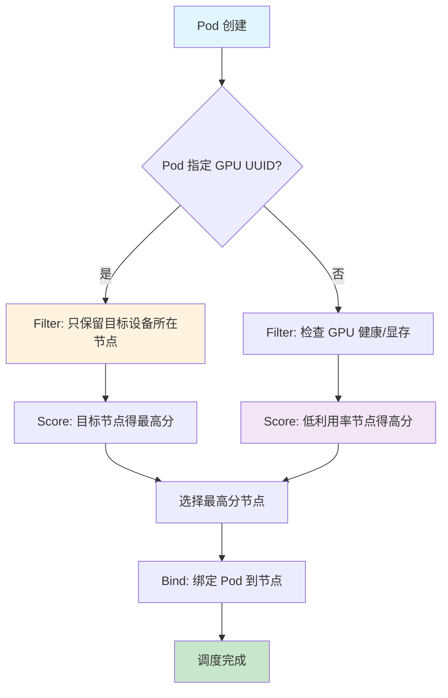

---

## 2. Kubernetes 调度器架构

### 2.1 整体架构

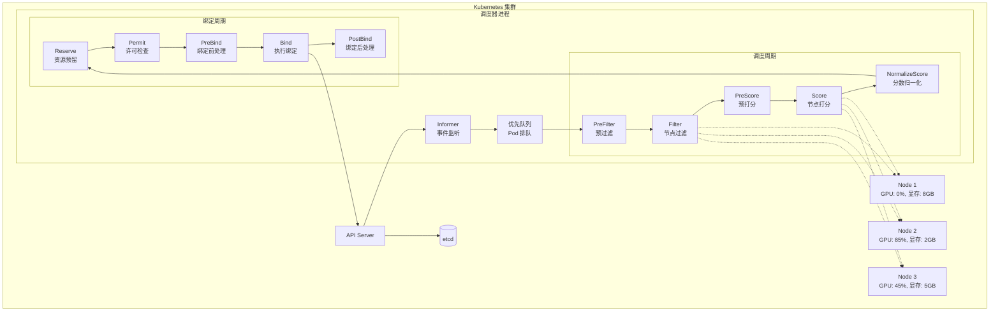

### 2.2 调度周期状态机

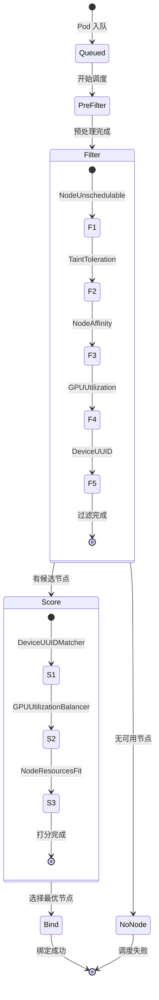

---

## 3. 调度框架扩展机制

### 3.1 扩展点概览

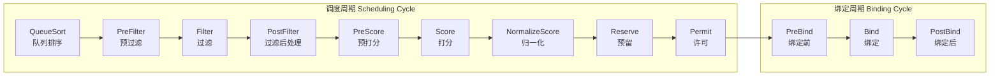

### 3.2 各扩展点作用

| 扩展点 | 阶段 | 作用 | 本项目使用 |
|--------|------|------|------------|
| **QueueSort** | 排队 | 决定 Pod 调度优先级 | ❌ 使用默认 |
| **PreFilter** | 预处理 | 准备调度所需数据 | ❌ 未使用 |
| **Filter** | 过滤 | 排除不满足条件的节点 | ✅ 核心功能 |
| **PostFilter** | 后处理 | 处理过滤失败（如抢占） | ❌ 未使用 |
| **PreScore** | 预打分 | 准备打分数据 | ❌ 未使用 |
| **Score** | 打分 | 为节点评分 | ✅ 核心功能 |
| **NormalizeScore** | 归一化 | 统一分数范围 | ❌ 未使用 |
| **Reserve** | 预留 | 预留资源 | ⚠️ 可选 |
| **Permit** | 许可 | 控制调度等待/拒绝 | ❌ 未使用 |
| **PreBind** | 绑定前 | 绑定前验证/准备 | ⚠️ 可选 |
| **Bind** | 绑定 | 执行 Pod-Node 绑定 | ❌ 使用默认 |
| **PostBind** | 绑定后 | 绑定后清理/通知 | ❌ 未使用 |

### 3.3 插件接口定义

```go
// 所有插件必须实现的基础接口
type Plugin interface {
    Name() string
}

// Filter 插件接口
type FilterPlugin interface {
    Plugin
    Filter(ctx context.Context, state *CycleState, pod *v1.Pod, nodeInfo *NodeInfo) *Status
}

// Score 插件接口
type ScorePlugin interface {
    Plugin
    Score(ctx context.Context, state *CycleState, pod *v1.Pod, nodeName string) (int64, *Status)
    ScoreExtensions() ScoreExtensions  // 可选
}
```

---

## 4. 项目结构

```
gpu-scheduler/
├── cmd/
│   └── scheduler/
│       └── main.go              # 入口：注册插件、启动调度器
├── pkg/
│   ├── gpuinfo/
│   │   └── gpuinfo.go           # Mock: GPU 信息获取接口
│   └── plugins/
│       ├── gpuutilization/
│       │   └── gpuutilization.go # 插件: GPU 利用率均衡
│       └── deviceuuid/
│           └── deviceuuid.go    # 插件: 设备 UUID 匹配
├── config/
│   └── scheduler-config.yaml     # 调度器配置文件
├── manifests/
│   └── deployment.yaml           # K8s 部署清单
└── docs/
    └── README.md                 # 本文档
```

---

## 5. 核心插件实现

### 5.1 GPU 利用率均衡插件

#### 5.1.1 设计目标

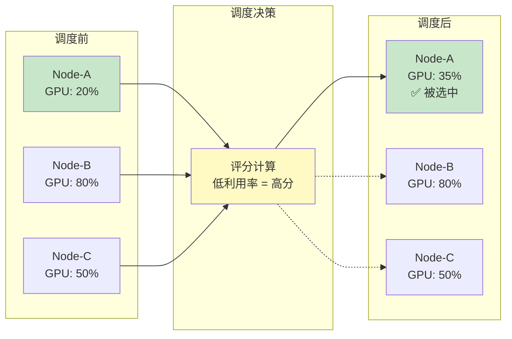

#### 5.1.2 核心逻辑

```go
// Filter: 过滤不健康的 GPU 节点
func (p *GPUUtilizationPlugin) Filter(...) *framework.Status {
    // 1. 检查节点是否有 GPU 资源
    if !p.hasGPUResources(nodeInfo) {
        return Success  // 无 GPU 节点交给其他插件处理
    }
    
    // 2. 检查 GPU 健康状态
    if !p.isGPUHealthy(nodeName) {
        return Unschedulable  // 过滤掉不健康节点
    }
    
    // 3. 检查显存是否充足
    if requestedMemory > availableMemory {
        return Unschedulable  // 过滤掉显存不足节点
    }
    
    return Success
}

// Score: 利用率低 → 分数高
func (p *GPUUtilizationPlugin) Score(...) (int64, *framework.Status) {
    utilization := gpuinfo.GetNodeGPUUtilization(nodeName)
    score := 100 - utilization  // 核心公式
    return score, Success
}
```

#### 5.1.3 评分算法

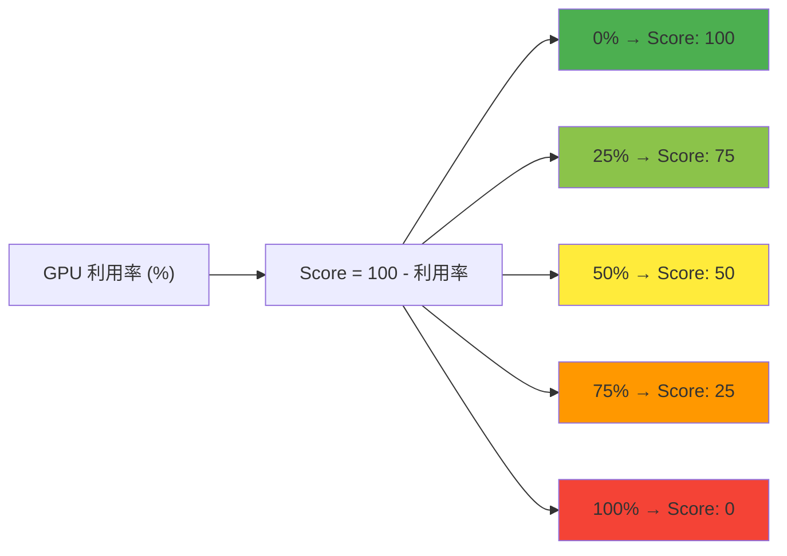

### 5.2 设备 UUID 匹配插件

#### 5.2.1 设计目标

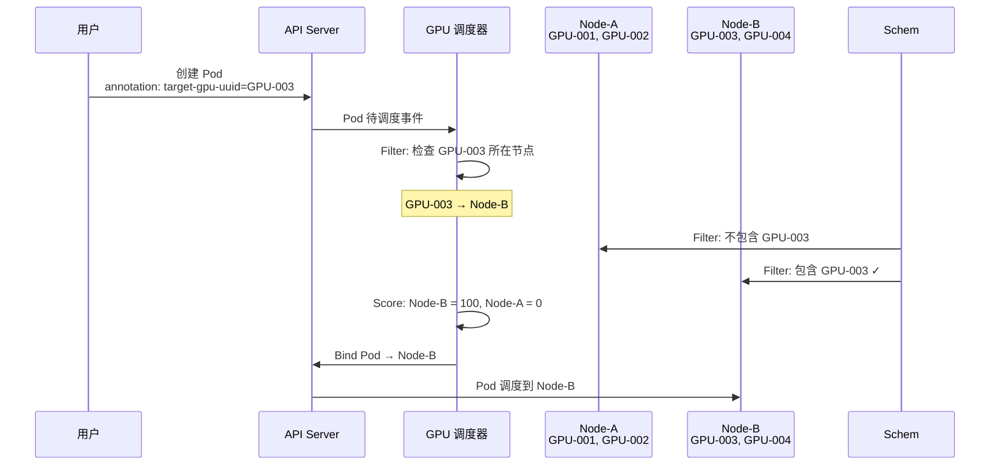

#### 5.2.2 核心逻辑

```go
// Filter: 只保留目标设备所在节点
func (p *DeviceUUIDPlugin) Filter(...) *framework.Status {
    targetUUIDs := p.getPodTargetUUIDs(pod)
    if len(targetUUIDs) == 0 {
        return Success  // 未指定 UUID，交给其他插件
    }
    
    for _, uuid := range targetUUIDs {
        deviceNode := gpuinfo.GetNodeByDeviceUUID(uuid)
        if deviceNode == nodeName {
            return Success  // 找到目标设备
        }
    }
    
    return Unschedulable  // 节点不包含目标设备
}

// Score: 目标设备节点得最高分
func (p *DeviceUUIDPlugin) Score(...) (int64, *framework.Status) {
    targetUUIDs := p.getPodTargetUUIDs(pod)
    if len(targetUUIDs) == 0 {
        return 50, Success  // 未指定，中性评分
    }
    
    for _, uuid := range targetUUIDs {
        if gpuinfo.GetNodeByDeviceUUID(uuid) == nodeName {
            return 100, Success  // 目标节点最高分
        }
    }
    
    return 0, Success  // 其他节点最低分
}
```

#### 5.2.3 Pod 注解示例

```yaml
# 指定单个设备
metadata:
  annotations:
    scheduler.example.com/target-gpu-uuid: "GPU-abc123-0001"

# 指定多个设备（任选其一）
metadata:
  annotations:
    scheduler.example.com/target-gpu-uuids: "GPU-abc123-0001,GPU-xyz789-0002"
```

---

## 6. 调度流程详解

### 6.1 完整调度流程

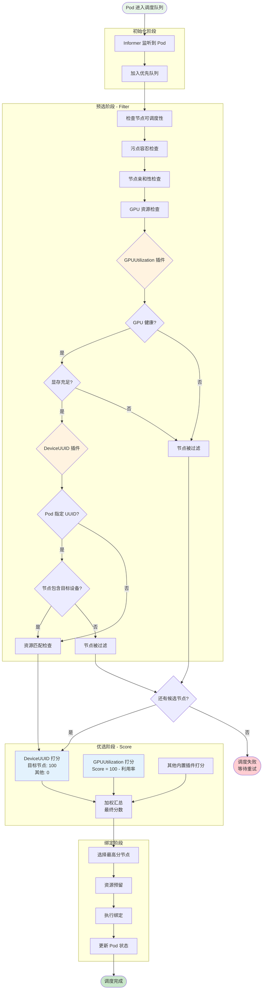

### 6.2 多插件协作示例

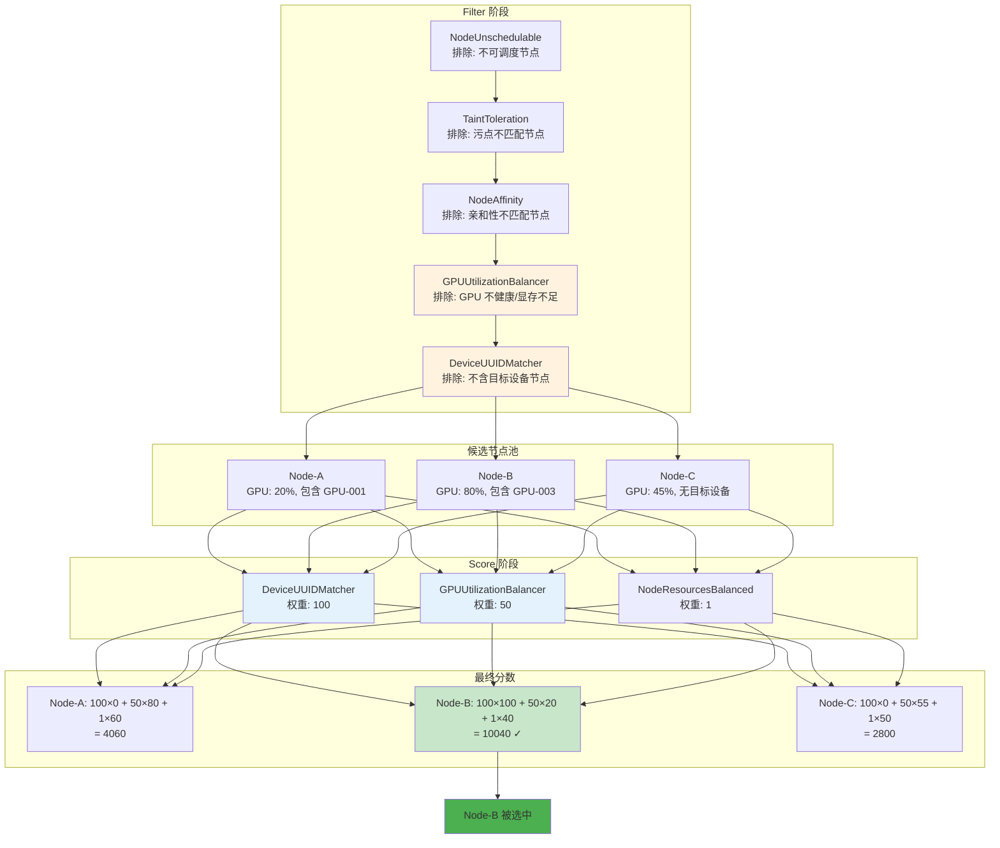

---

## 7. 配置与部署

### 7.1 调度器配置文件

```yaml
apiVersion: kubescheduler.config.k8s.io/v1
kind: KubeSchedulerConfiguration
profiles:
  - schedulerName: gpu-scheduler    # Pod 通过此名称指定调度器
    
    plugins:
      # Filter 阶段：按顺序执行
      filter:
        enabled:
          - name: DeviceUUIDMatcher      # 设备 UUID 过滤
          - name: GPUUtilizationBalancer # GPU 利用率过滤
          - name: NodeUnschedulable      # 内置：节点可调度性
          - name: NodeResourcesFit       # 内置：资源匹配
      
      # Score 阶段：并行执行后加权
      score:
        enabled:
          - name: DeviceUUIDMatcher
            weight: 100                   # 最高权重：精确绑定
          - name: GPUUtilizationBalancer
            weight: 50                    # 中等权重：负载均衡
          - name: NodeResourcesBalancedAllocation
            weight: 1                     # 默认权重
```

### 7.2 权重影响分析

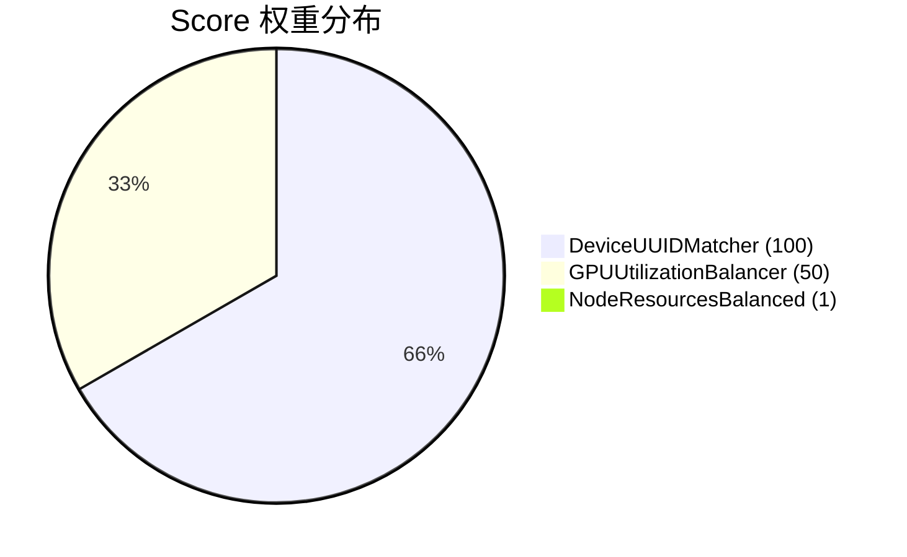

| 插件 | 权重 | 影响程度 | 说明 |
|------|------|----------|------|
| DeviceUUIDMatcher | 100 | 决定性 | 指定设备时，目标节点必定被选中 |
| GPUUtilizationBalancer | 50 | 显著 | 未指定设备时，主导负载均衡 |
| NodeResourcesBalanced | 1 | 辅助 | 默认资源均衡策略 |

### 7.3 部署架构

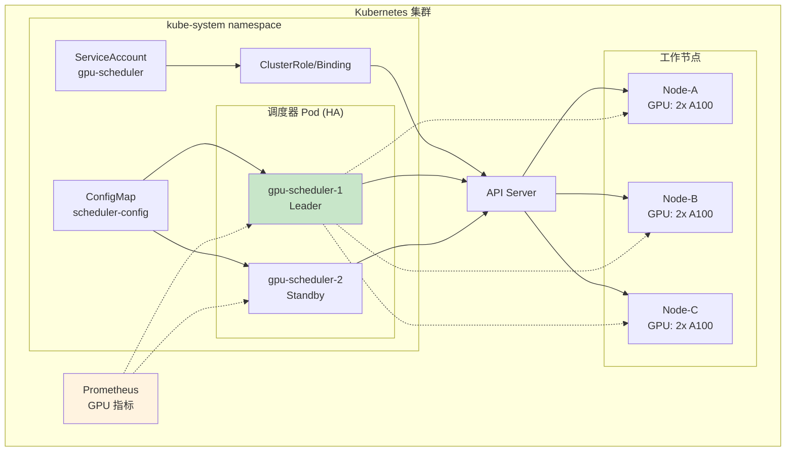

---

## 8. 使用示例

### 8.1 场景一：GPU 负载均衡

```yaml
# 自动调度到 GPU 利用率最低的节点
apiVersion: v1
kind: Pod
metadata:
  name: training-job
spec:
  schedulerName: gpu-scheduler    # 使用 GPU 调度器
  containers:
    - name: training
      image: pytorch/pytorch:latest
      command: ["python", "train.py"]
      resources:
        limits:
          nvidia.com/gpu: 1
          memory: "16Gi"
```

**调度结果：**

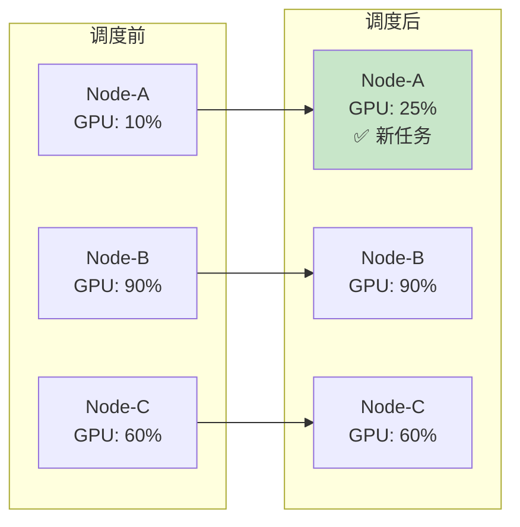

### 8.2 场景二：指定 GPU 设备

```yaml
# 绑定到特定 GPU 设备
apiVersion: v1
kind: Pod
metadata:
  name: debug-job
  annotations:
    scheduler.example.com/target-gpu-uuid: "GPU-abc123-0001"
spec:
  schedulerName: gpu-scheduler
  containers:
    - name: debug
      image: nvidia/cuda:12.0
      command: ["cuda-gdb", "./program"]
      resources:
        limits:
          nvidia.com/gpu: 1
```

**调度流程：**

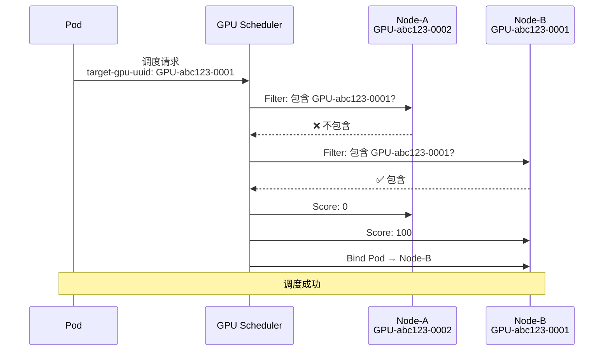

### 8.3 场景三：混合策略

```yaml
# 指定多个设备，选择其中负载最低的
apiVersion: v1
kind: Pod
metadata:
  name: inference-job
  annotations:
    # 可接受的设备列表
    scheduler.example.com/target-gpu-uuids: "GPU-001,GPU-002,GPU-003"
spec:
  schedulerName: gpu-scheduler
  containers:
    - name: inference
      image: tensorflow/serving:latest
      resources:
        limits:
          nvidia.com/gpu: 1
```

**调度逻辑：**

1. **Filter**: 保留包含 GPU-001 或 GPU-002 或 GPU-003 的节点
2. **Score**: 
   - DeviceUUIDMatcher: 所有候选节点都得 100 分
   - GPUUtilizationBalancer: 在候选节点中选择利用率最低的

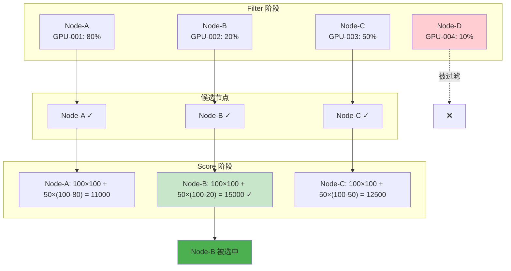

---

## 附录

### A. 关键接口速查

```go
// ============================================
// 插件必须实现的接口
// ============================================

// 基础接口
type Plugin interface {
    Name() string
}

// Filter 插件（可选实现）
type FilterPlugin interface {
    Plugin
    Filter(ctx, state, pod, nodeInfo) *Status
}

// Score 插件（可选实现）
type ScorePlugin interface {
    Plugin
    Score(ctx, state, pod, nodeName) (int64, *Status)
    ScoreExtensions() ScoreExtensions  // 可返回 nil
}

// Reserve 插件（可选实现）
type ReservePlugin interface {
    Plugin
    Reserve(ctx, state, pod, nodeName) *Status
    Unreserve(ctx, state, pod, nodeName)
}

// PreBind 插件（可选实现）
type PreBindPlugin interface {
    Plugin
    PreBind(ctx, state, pod, nodeName) *Status
}

// Bind 插件（可选实现，通常使用默认）
type BindPlugin interface {
    Plugin
    Bind(ctx, state, pod, nodeName) *Status
}
```

### B. 状态码说明

| 状态 | 值 | 含义 | Filter 行为 | Score 行为 |
|------|-----|------|-------------|------------|
| Success | 0 | 成功 | 节点通过 | 分数有效 |
| Error | 1 | 内部错误 | 调度终止 | 调度终止 |
| Unschedulable | 2 | 不可调度 | 节点被过滤 | - |
| UnschedulableAndUnresolvable | 3 | 永久不可调度 | 节点被过滤，不重试 | - |
| Wait | 4 | 等待 | - | 等待条件满足 |
| Skip | 5 | 跳过 | - | 使用默认分数 |

### C. 参考资料

- [Kubernetes 调度框架官方文档](https://kubernetes.io/docs/concepts/scheduling-eviction/scheduling-framework/)
- [调度器插件开发指南](https://kubernetes.io/docs/reference/scheduling/config/)
- [NVIDIA GPU Device Plugin](https://github.com/NVIDIA/k8s-device-plugin)
- [DCGM Exporter](https://github.com/NVIDIA/dcgm-exporter)

---

> 本文档为学习 Kubernetes 调度器扩展机制而编写，展示了如何通过调度框架实现 GPU 感知调度。