# Kubernetes Dynamic Resource Allocation (DRA) 详解

> 本文档介绍 Kubernetes 1.26+ 引入的 DRA 机制，展示三大核心组件的协作流程，以及 DRA 相比传统 Device Plugin 的优势。

---

## 目录

- [1. DRA 概述](#1-dra-概述)
- [2. 三大核心组件](#2-三大核心组件)
- [3. DRA 工作流程](#3-dra-工作流程)
- [4. DRA vs Device Plugin](#4-dra-vs-device-plugin)
- [5. DRA 解决的业务场景](#5-dra-解决的业务场景)
- [6. 实践示例](#6-实践示例)
- [7. 最佳实践](#7-最佳实践)

---

## 1. DRA 概述

### 1.1 什么是 DRA

Dynamic Resource Allocation (DRA) 是 Kubernetes 1.26 引入的资源分配新机制，用于管理特殊硬件资源（如 GPU、FPGA、RDMA NIC 等）。

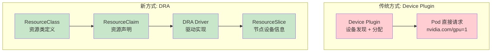

### 1.2 DRA 核心特性对比

| 特性 | DRA | Device Plugin |
|------|-----|---------------|
| **声明式资源请求** | ✅ ResourceClaim API | ❌ Pod resources.limits |
| **跨节点资源** | ✅ 支持（网络存储、远程设备） | ❌ 仅节点本地 |
| **生命周期管理** | ✅ Claim 有独立生命周期 | ❌ Pod 删除即释放 |
| **约束匹配** | ✅ CEL 表达式约束 | ❌ 简单资源计数 |
| **拓扑感知** | ✅ NUMA/PCI 拓扑信息 | ⚠️ 有限支持 |
| **参数配置** | ✅ ResourceClass 结构化参数 | ❌ 无配置概念 |

---

## 2. 三大核心组件

### 2.1 组件架构总览

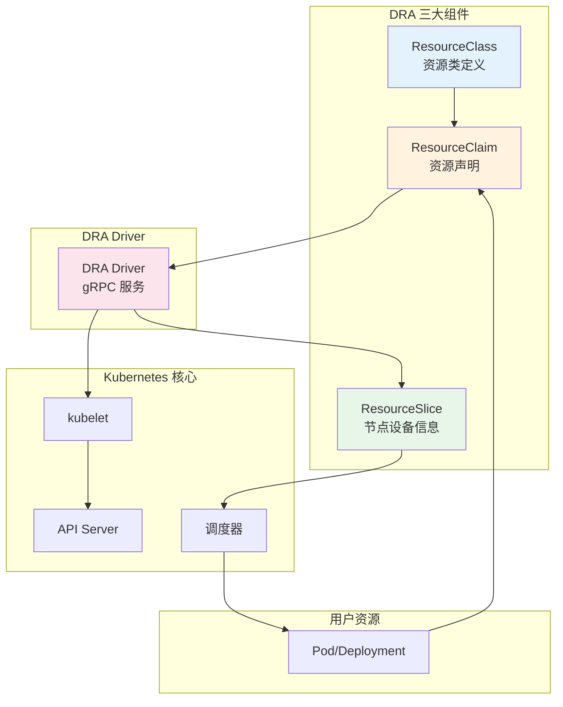

### 2.2 ResourceClass - 资源类定义

**核心作用：** 定义一类资源的配置，指定处理此资源的 Driver，可传递结构化参数。

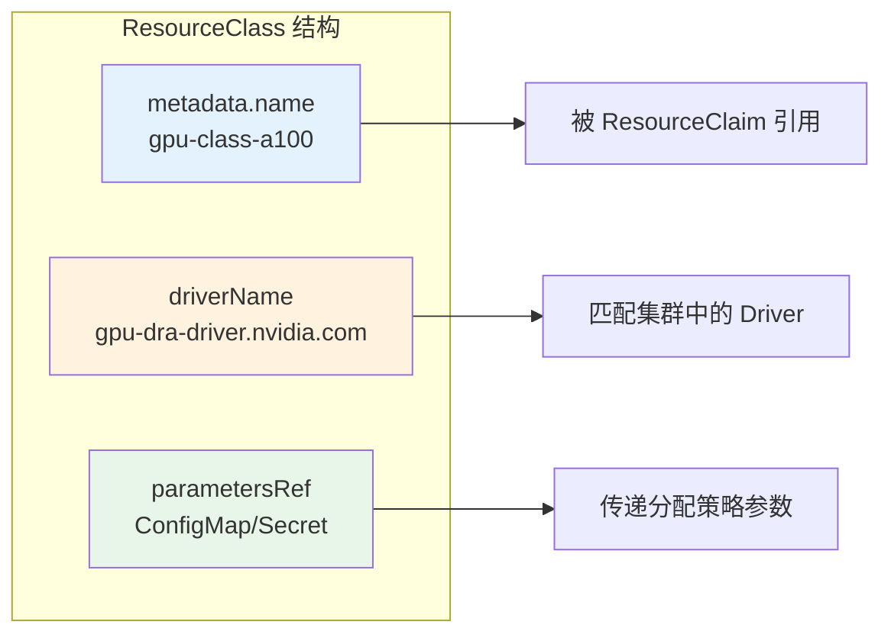

**核心字段说明：**

| 字段 | 说明 |
|------|------|
| `driverName` | 处理此资源类的 Driver 名称，必须匹配集群中注册的 Driver |
| `parametersRef` | 驱动参数配置，通过 ConfigMap 或 Secret 传递结构化参数 |

**示例：**

```yaml
apiVersion: resource.k8s.io/v1beta1
kind: ResourceClass
metadata:
  name: gpu-class-a100
driverName: gpu-dra-driver.nvidia.com
parametersRef:
  kind: ConfigMap
  name: gpu-class-a100-config
  namespace: kube-system
```

### 2.3 ResourceClaim - 资源声明

**核心作用：** 声明对具体资源的请求，类似 PVC 但用于硬件资源。

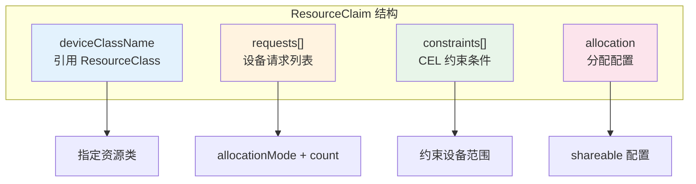

**核心字段说明：**

| 字段 | 说明 |
|------|------|
| `deviceClassName` | 引用的 ResourceClass |
| `requests[].allocationMode` | `ExactCount`（精确数量）或 `AllDevices`（全部设备） |
| `requests[].count` | 请求的设备数量 |
| `constraints` | CEL 表达式约束，限制可分配的设备范围 |
| `allocation.shareable` | 是否允许多 Pod 共享 |

**生命周期状态机：**

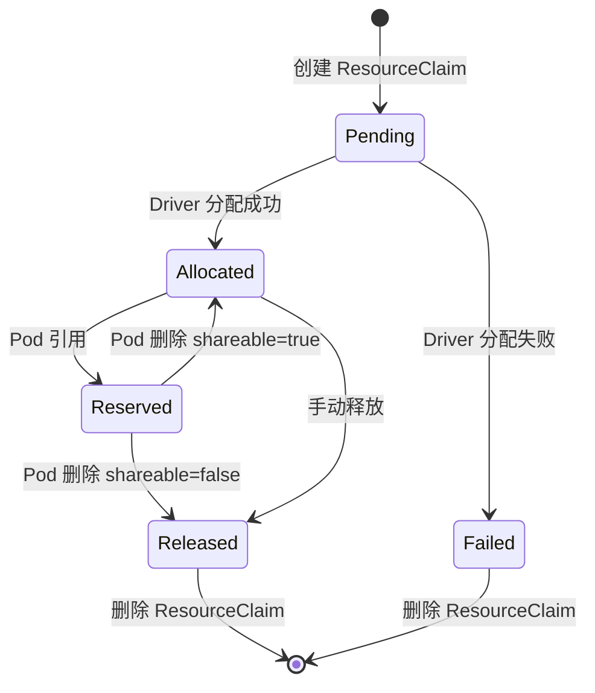

### 2.4 ResourceSlice - 节点设备信息

**核心作用：** Driver 上报的节点设备信息，供调度器查询和匹配。

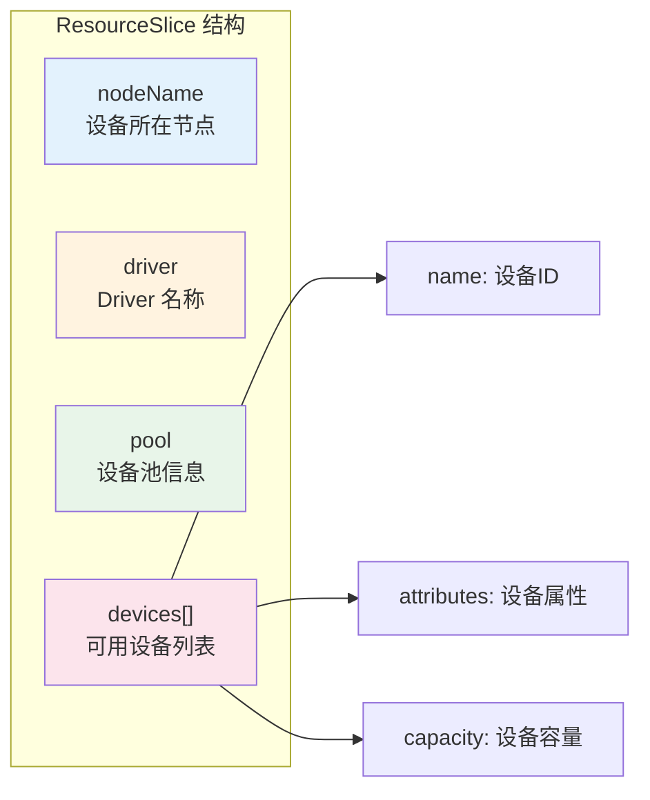

**设备属性示例：**

```yaml
devices:
  - name: gpu-0
    attributes:
      model: "NVIDIA-A100-SXM4-80GB"
      uuid: "GPU-abc123-0001"
      memory: 81920
      numaNode: 0
      healthy: true
      nvlink: true
```

---

## 3. DRA 工作流程

### 3.1 完整流程

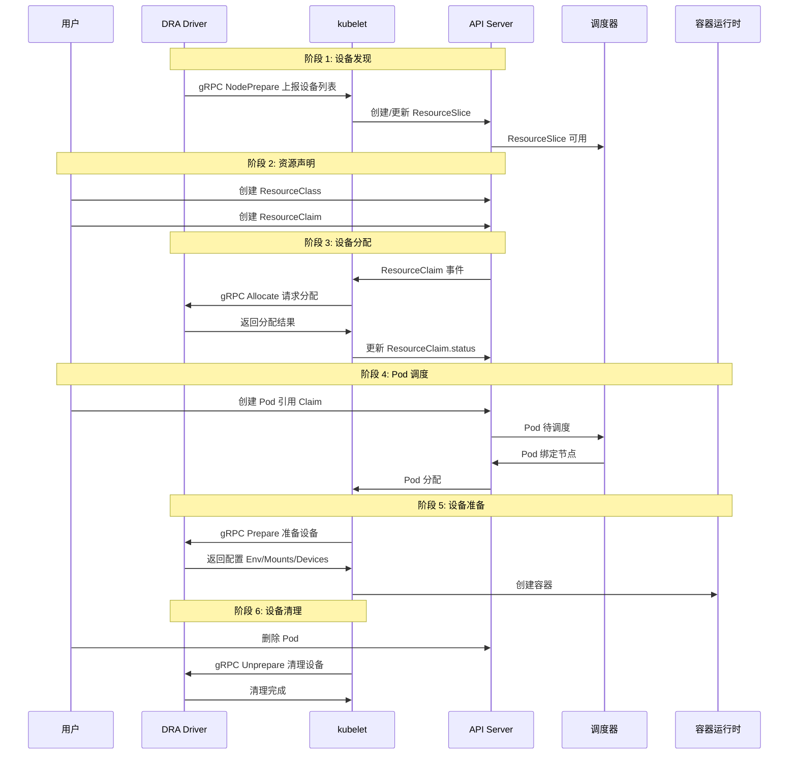

### 3.2 Driver 接口详解

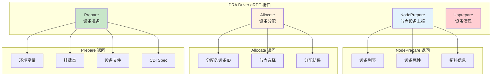

**接口对比：**

| 接口 | Device Plugin | DRA Driver | 增强点 |
|------|---------------|------------|--------|
| 设备发现 | `ListAndWatch` | `NodePrepare` | 结构化属性上报 |
| 设备分配 | `Allocate` | `Allocate` | 支持 ResourceClass 参数、约束 |
| 设备准备 | `Allocate` 同一接口 | `Prepare` 独立接口 | 更丰富的配置能力 |
| 设备清理 | Pod 删除自动清理 | `Unprepare` | 显式清理，支持状态管理 |

### 3.3 Prepare 接口能力（核心增强）

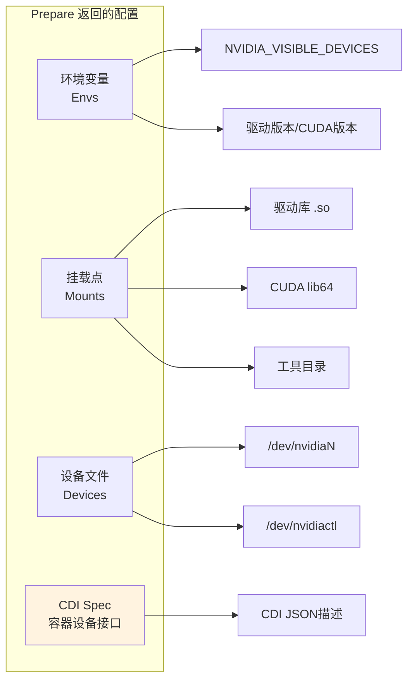

> **CDI (Container Device Interface)** 是 DRA 的重要特性，提供标准化的设备描述格式，支持跨容器运行时兼容。

---

## 4. DRA vs Device Plugin

### 4.1 架构对比

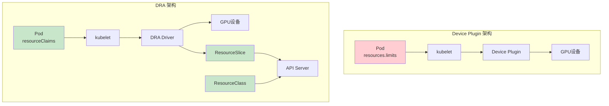

### 4.2 能力对比

| 维度 | Device Plugin | DRA | 说明 |
|------|---------------|-----|------|
| **资源声明方式** | Pod `resources.limits` | ResourceClaim API | DRA 支持声明式、独立的资源声明 |
| **资源生命周期** | Pod 绑定 | Claim 独立生命周期 | DRA 资源可脱离 Pod 使用、复用 |
| **节点本地资源** | ✅ 支持 | ✅ 支持 | 两者都支持 GPU、FPGA 等 |
| **跨节点资源** | ❌ 不支持 | ✅ 支持 | DRA 支持网络存储、远程设备 |
| **设备约束** | ❌ 仅数量 | ✅ CEL 表达式 | DRA 支持复杂约束（显存、型号等） |
| **NUMA 感知** | ⚠️ 有限 | ✅ 完整 | DRA 在 ResourceSlice 上报拓扑 |
| **参数配置** | ❌ 无 | ✅ ResourceClass | DRA 支持结构化参数传递 |
| **资源共享** | ❌ 独占 | ✅ `shareable` | DRA 支持多 Pod 共享同一设备 |
| **状态追踪** | ❌ 无 | ✅ `status.phase` | DRA 提供完整的生命周期状态 |

### 4.3 代码对比

**Device Plugin 方式：**

```yaml
# Pod 直接请求（简单，无法声明约束）
apiVersion: v1
kind: Pod
spec:
  containers:
    - name: gpu-container
      resources:
        limits:
          nvidia.com/gpu: 1  # 只能指定数量
```

**DRA 方式：**

```yaml
# 独立的资源声明（声明式，可约束）
apiVersion: resource.k8s.io/v1beta1
kind: ResourceClaim
spec:
  deviceClassName: gpu-class-a100
  devices:
    requests:
      - name: gpu-0
        allocationMode: ExactCount
        count: 1
    constraints:
      - cel:
          expression: "device.attributes['memory'] >= 65536"  # 约束显存
```

---

## 5. DRA 解决的业务场景

### 5.1 场景总览

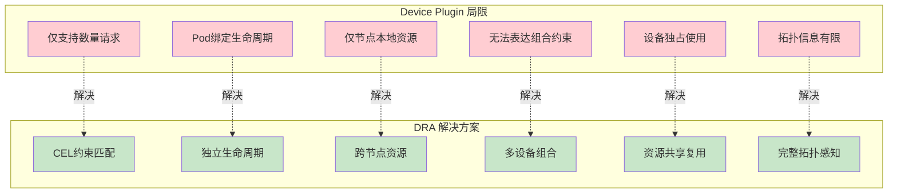

### 5.2 场景详解

#### 场景 1: 复杂约束匹配

**问题：** Device Plugin 只能指定设备数量，无法表达"显存>=64GB的A100"等约束。

**DRA 解决：**

```yaml
constraints:
  - cel:
      expression: "device.attributes['memory'] >= 65536"
  - cel:
      expression: "device.attributes['model'] == 'A100-80GB'"
```

#### 场景 2: 资源生命周期管理

**问题：** Device Plugin 资源随 Pod 释放，无法实现资源池化或预分配。

**DRA 解决：**

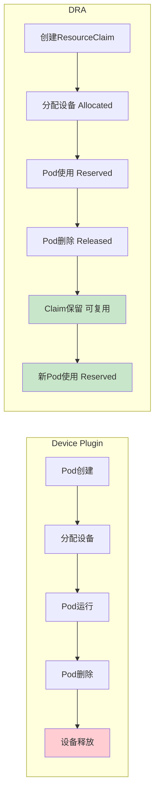

#### 场景 3: 跨节点资源分配

**问题：** Device Plugin 仅支持节点本地资源，无法分配网络存储、远程设备等。

**DRA 解决：**

```yaml
# 网络存储资源类（跨节点）
apiVersion: resource.k8s.io/v1beta1
kind: ResourceClass
metadata:
  name: network-storage-class
driverName: storage-driver.example.com  # 网络存储驱动

# ResourceClaim 请求远程存储
---
apiVersion: resource.k8s.io/v1beta1
kind: ResourceClaim
spec:
  deviceClassName: network-storage-class
  devices:
    requests:
      - name: storage-0
        allocationMode: ExactCount
        count: 1
```

#### 场景 4: 多设备组合约束

**问题：** Device Plugin 无法表达"GPU和RDMA NIC在同一NUMA节点"的组合需求。

**DRA 解决：**

```yaml
devices:
  requests:
    - name: gpu-0
      deviceClassName: gpu-class-a100
    - name: rdma-0
      deviceClassName: rdma-class-mlx5

# 跨设备约束：在同一NUMA节点
constraints:
  - cel:
      expression: |
        device.requests['gpu-0'].attributes['numaNode'] == 
        device.requests['rdma-0'].attributes['numaNode']
```

#### 场景 5: 资源共享与复用

**问题：** Device Plugin 设备独占使用，无法实现资源共享或按需分配。

**DRA 解决：**

```yaml
spec:
  allocation:
    shareable: true  # 允许多个Pod共享

# 多个Pod可引用同一ResourceClaim
```

#### 场景 6: 拓扑感知调度

**问题：** Device Plugin 拓扑信息有限，调度器难以优化NUMA分配。

**DRA 解决：**

```yaml
# ResourceSlice 包含完整拓扑
devices:
  - name: gpu-0
    attributes:
      numaNode: 0
      pciPath: "/sys/bus/pci/devices/0000:08:00.0"
      nvlink: true

# ResourceClaim约束NUMA匹配
constraints:
  - cel:
      expression: "device.attributes['numaNode'] == numaNode()"
```

### 5.3 与前文示例的呼应

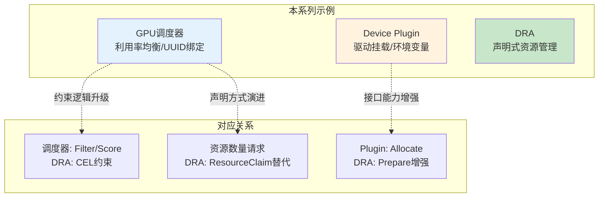

| 前文示例 | DRA 升级点 | 说明 |
|----------|------------|------|
| **GPU调度器 Filter/Score** | CEL 约束表达式 | 约束逻辑从调度器插件迁移到 ResourceClaim |
| **调度器优先低负载节点** | ResourceClass 参数 | 分配策略通过 ResourceClass 传递给 Driver |
| **Device Plugin Allocate** | DRA Prepare | 接口能力增强，支持 CDI Spec |
| **设备UUID绑定** | CEL 约束表达式 | UUID 匹配通过 CEL 表达式实现 |

---

## 6. 实践示例

### 6.1 GPU 资源声明完整示例

**步骤 1: 定义 ResourceClass**

```yaml
apiVersion: resource.k8s.io/v1beta1
kind: ResourceClass
metadata:
  name: gpu-class-a100
driverName: gpu-dra-driver.nvidia.com
parametersRef:
  kind: ConfigMap
  name: gpu-class-a100-config
  namespace: kube-system
```

**步骤 2: Pod 使用 ResourceClaimTemplate（推荐）**

```yaml
apiVersion: v1
kind: Pod
metadata:
  name: training-pod
spec:
  resourceClaims:
    - name: gpu-claim
      source:
        template:
          spec:
            deviceClassName: gpu-class-a100
            devices:
              requests:
                - name: gpu-0
                  allocationMode: ExactCount
                  count: 1
              constraints:
                - cel:
                    expression: "device.attributes['memory'] >= 65536"

  containers:
    - name: trainer
      image: pytorch/pytorch:latest
      resources:
        claims:
          - name: gpu-claim
```

### 6.2 Deployment 自动管理

```yaml
apiVersion: apps/v1
kind: Deployment
metadata:
  name: inference-deployment
spec:
  replicas: 3
  selector:
    matchLabels:
      app: inference
  template:
    spec:
      resourceClaims:
        - name: gpu-claim
          source:
            template:  # 每个Pod自动创建独立的ResourceClaim
              spec:
                deviceClassName: gpu-class-a100
                devices:
                  requests:
                    - name: gpu-0
                      allocationMode: ExactCount
                      count: 1
      containers:
        - name: inference
          image: tensorflow/serving:latest
          resources:
            claims:
              - name: gpu-claim
```

### 6.3 多设备组合

```yaml
apiVersion: v1
kind: Pod
metadata:
  name: distributed-training-pod
spec:
  resourceClaims:
    - name: gpu-claim
      source:
        template:
          spec:
            deviceClassName: gpu-class-a100
            devices:
              requests:
                - name: gpu-0
                  allocationMode: ExactCount
                  count: 1

    - name: rdma-claim
      source:
        template:
          spec:
            deviceClassName: rdma-class-mlx5
            devices:
              requests:
                - name: rdma-0
                  allocationMode: ExactCount
                  count: 1

  containers:
    - name: distributed-trainer
      image: pytorch/pytorch:latest
      resources:
        claims:
          - name: gpu-claim
          - name: rdma-claim
```

---

## 7. 最佳实践

### 7.1 ResourceClaimTemplate vs 直接 ResourceClaim

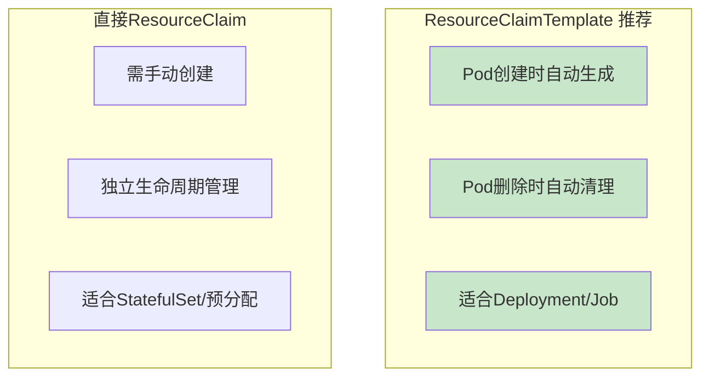

| 场景 | 推荐方式 | 原因 |
|------|----------|------|
| Deployment / Job | ResourceClaimTemplate | 自动管理，每个Pod独立声明 |
| StatefulSet | 预创建 ResourceClaim | 固定绑定，跨Pod状态保留 |
| 资源预分配 | 直接 ResourceClaim | 提前准备，减少分配延迟 |
| 资源共享 | 直接 ResourceClaim | 多Pod引用同一Claim |

### 7.2 CEL 约束最佳实践

```yaml
# 推荐：明确、可验证的约束
constraints:
  - cel:
      expression: "device.attributes['memory'] >= 65536"
      message: "需要显存至少64GB"

  - cel:
      expression: "device.attributes['healthy'] == true"
      message: "设备必须健康"

# 避免：过于复杂的约束（影响调度性能）
# - cel:
#     expression: "device.attributes['memory'] * 0.8 > request.memory"
```

### 7.3 ResourceClass 参数设计

```yaml
# ConfigMap 参数示例
data:
  parameters.json: |
    {
      "allocationStrategy": "balanced",   # 分配策略
      "minMemory": 40960,                 # 约束参数
      "mountOptions": {                   # Prepare配置
        "driverLibraries": true,
        "cudaToolkit": true
      }
    }
```

### 7.4 版本兼容性

| Kubernetes 版本 | DRA 状态 | 特性 |
|------------------|----------|------|
| 1.26 | Alpha | 基础 DRA API |
| 1.27 | Alpha | ResourceClaimTemplate |
| 1.28 | Beta | 参数结构化 |
| 1.29 | Beta | DeviceClass 稳定 |
| 1.30 | Stable | 完整 DRA 支持 |

---

## 附录

### A. API 资源对照表

| API 资源 | API 版本 | 作用 |
|----------|----------|------|
| `ResourceClass` | resource.k8s.io/v1beta1 | 资源类定义 |
| `ResourceClaim` | resource.k8s.io/v1beta1 | 资源声明 |
| `ResourceClaimTemplate` | resource.k8s.io/v1beta1 | Pod级别模板 |
| `ResourceSlice` | resource.k8s.io/v1beta1 | 节点设备信息 |

### B. CEL 表达式示例

```yaml
# 显存约束
expression: "device.attributes['memory'] >= 65536"

# 设备型号匹配
expression: "device.attributes['model'] == 'A100-80GB'"

# NUMA节点匹配
expression: "device.attributes['numaNode'] == numaNode()"

# 健康状态检查
expression: "device.attributes['healthy'] == true"

# VLink支持检查
expression: "device.attributes['nvlink'] == true"

# 跨设备约束
expression: |
  device.requests['gpu-0'].attributes['numaNode'] == 
  device.requests['rdma-0'].attributes['numaNode']
```

### C. 参考资料

- [DRA 官方文档](https://kubernetes.io/docs/concepts/scheduling-eviction/dynamic-resource-allocation/)
- [DRA 设计文档](https://github.com/kubernetes/enhancements/tree/master/keps/sig-node/3063-dynamic-resource-allocation)
- [CEL 表达式语言](https://github.com/google/cel-spec)
- [CDI 规范](https://github.com/cncf-tags/container-device-interface)
- [NVIDIA DRA Driver](https://github.com/NVIDIA/k8s-dra-driver-gpu)

---

> 本文档详细介绍了 Kubernetes DRA 机制，展示了三大组件 ResourceClass、ResourceClaim、ResourceSlice 的协作流程，以及 DRA 相比 Device Plugin 在约束匹配、生命周期管理、跨节点资源等方面的优势。