# Kubernetes AI基础设施资源分配技术演进总结

> 从 Device Plugin 到 DRA，深入理解 AI Infra 资源分配的"变"与"不变"。

---

## 目录

- [1. 技术演进全景图](#1-技术演进全景图)
- [2. 不变的底层逻辑](#2-不变的底层逻辑)
- [3. 持续演进的优化方向](#3-持续演进的优化方向)
- [4. 学习路径建议](#4-学习路径建议)
- [5. 开源项目推荐](#5-开源项目推荐)
- [6. 实践思考题](#6-实践思考题)

---

## 1. 技术演进全景图

### 1.1 三阶段演进

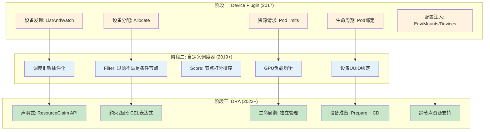

### 1.2 技术栈层次关系

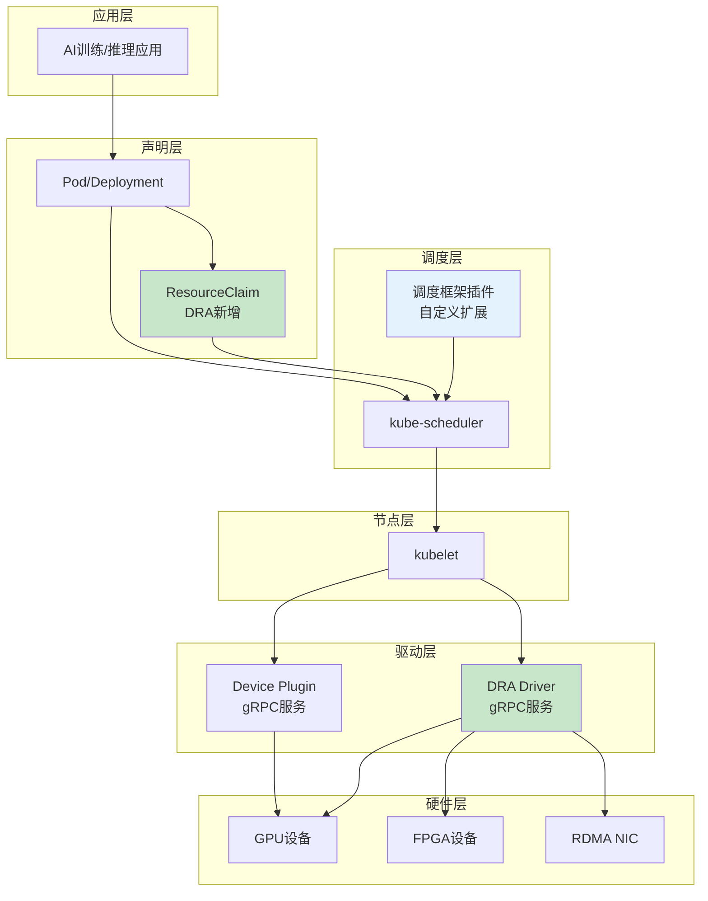

---

## 2. 不变的底层逻辑

### 2.1 核心认知（必须理解的本质）

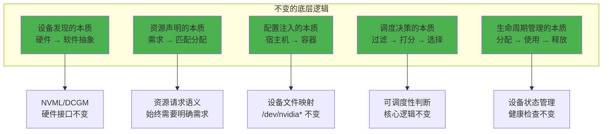

### 2.2 不变逻辑详解

#### ① 设备发现的本质不变

**底层逻辑：** 硊件设备必须通过某种机制被发现并抽象为软件可管理的对象。

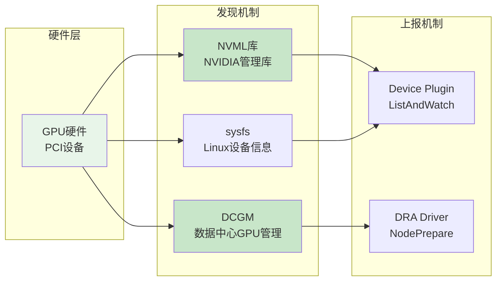

| 维度 | Device Plugin | DRA | 不变的本质 |
|------|---------------|-----|------------|
| 发现方式 | NVML/DCGM | NVML/DCGM | 硬件接口不变 |
| 上报机制 | gRPC ListAndWatch | gRPC NodePrepare | 上报语义不变 |
| 设备属性 | ID + Health | ID + Attributes | 核心属性不变 |

#### ② 配置注入的本质不变

**底层逻辑：** 容器需要访问宿主机的设备资源，必须通过环境变量、挂载点、设备文件三种方式注入。

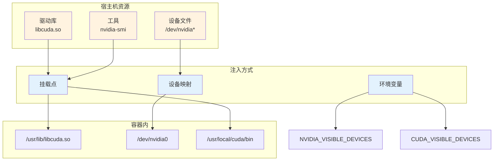

**注入能力对比（不变）：**

| 注入方式 | Device Plugin Allocate | DRA Prepare | 说明 |
|----------|------------------------|-------------|------|
| 环境变量 | `ContainerAllocateResponse.Envs` | `PrepareResult.Envs` | 告知容器设备信息 |
| 挂载点 | `ContainerAllocateResponse.Mounts` | `PrepareResult.Mounts` | 共享驱动库 |
| 设备文件 | `ContainerAllocateResponse.Devices` | `PrepareResult.Devices` | 硬件访问入口 |
| 元数据 | `Annotations` | `Annotations` | 状态记录 |

#### ③ 调度决策的本质不变

**底层逻辑：** 调度器必须通过"过滤→打分→选择"的流程决定Pod分配到哪个节点。

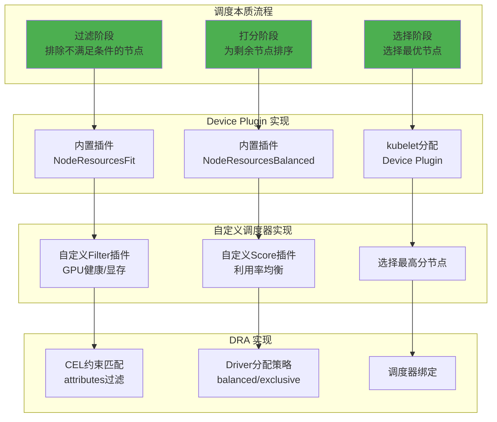

### 2.3 不变逻辑的学习要点

| 不变的逻辑 | 学习重点 | 理解方式 |
|------------|----------|----------|
| 设备发现 | NVML/DCGM 接口 | 阅读NVIDIA官方文档 |
| 配置注入 | Linux设备文件、挂载机制 | 理解容器运行时原理 |
| 调度决策 | 过滤-打分范式 | 掌握调度算法设计模式 |
| 资源声明 | 请求-分配语义 | 理解资源管理本质 |
| 状态管理 | 健康检查、生命周期 | 熟悉分布式系统设计 |

---

## 3. 持续演进的优化方向

### 3.1 演进维度总览

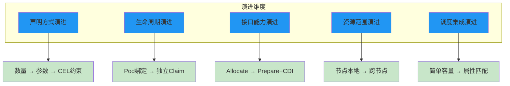

### 3.2 各维度演进详解

#### ① 声明方式演进：数量 → 参数 → CEL约束

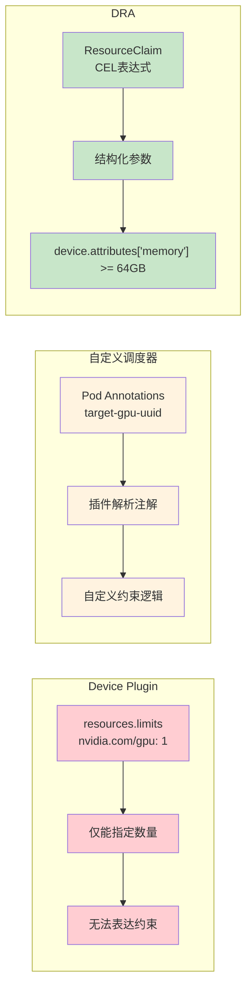

|演进阶段 | 能力 | 局限 | 解决的问题 |
|----------|------|------|------------|
| Device Plugin | 数量请求 | 无法约束设备属性 | 基础资源请求 |
| 自定义调度器 | 注解+插件解析 | 逻辑分散在调度器 | 特殊调度需求 |
| DRA | CEL约束表达式 | 需要学习CEL语法 | 统一声明式约束 |

#### ② 生命周期演进：Pod绑定 → 独立Claim

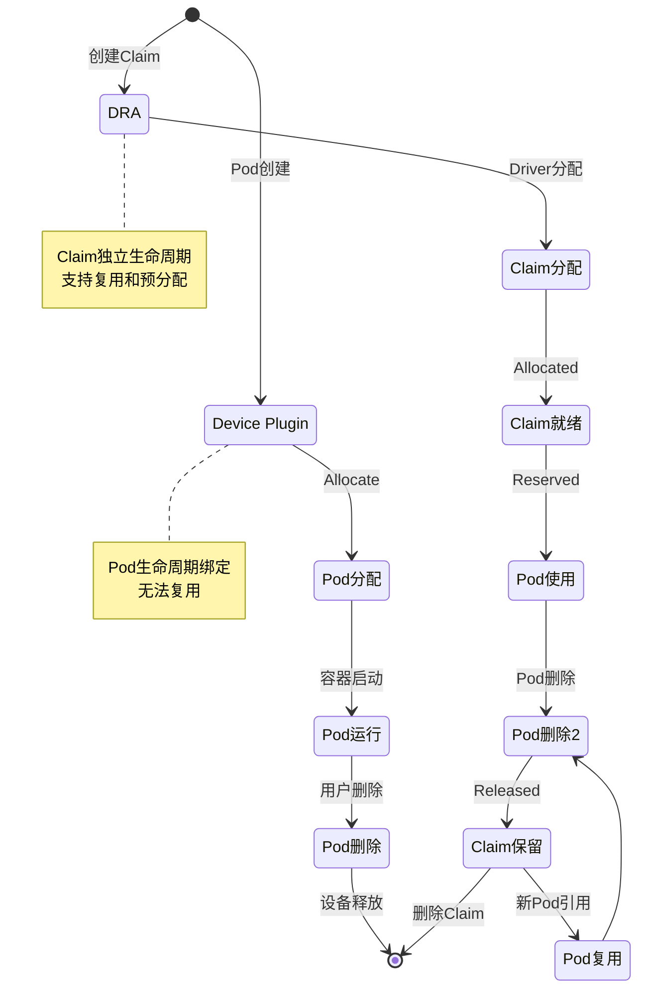

**演进价值：**

| 场景 | Device Plugin | DRA | 演进收益 |
|------|---------------|-----|----------|
| 资源预分配 | ❌ 不支持 | ✅ 预创建Claim | 减少分配延迟 |
| 资源复用 | ❌ Pod释放即释放 | ✅ Claim保留 | 跨Pod共享 |
| 有状态应用 | ⚠️ 需额外管理 | ✅ Claim固定绑定 | 状态保留 |

#### ③ 接口能力演进：Allocate → Prepare + CDI

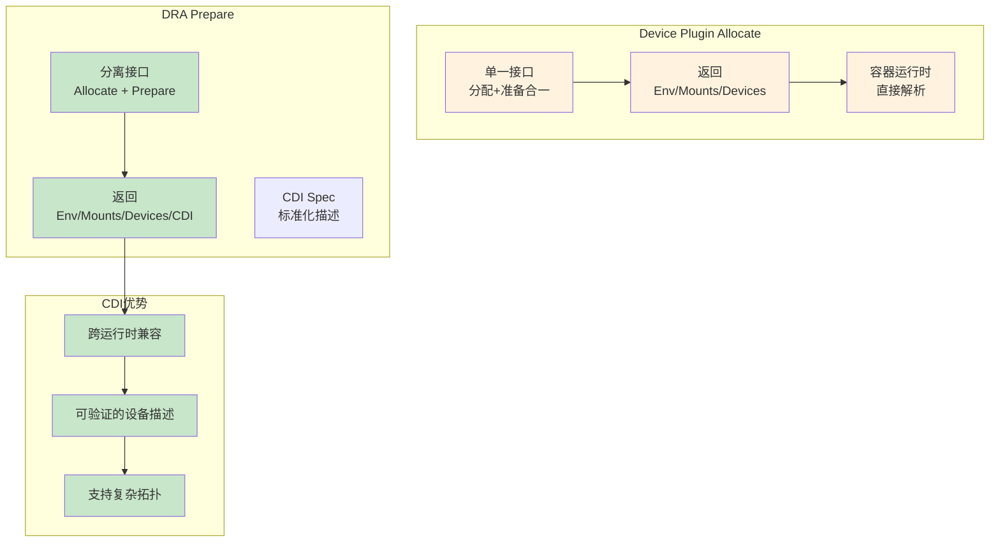

**CDI (Container Device Interface) 概念：**

```json
{
  "cdi_version": "0.5.0",
  "kind": "nvidia.com/gpu",
  "devices": [
    {
      "name": "gpu0",
      "attributes": {
        "uuid": "GPU-abc123-0001",
        "model": "A100"
      },
      "containerEdits": {
        "env": ["NVIDIA_VISIBLE_DEVICES=gpu0"],
        "mounts": [
          {"hostPath": "/usr/lib/libcuda.so", "containerPath": "/usr/lib/libcuda.so"}
        ],
        "deviceNodes": [
          {"path": "/dev/nvidia0"}
        ]
      }
    }
  ]
}
```

####④ 资源范围演进：节点本地 → 跨节点

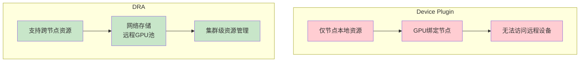

**跨节点资源示例：**

```yaml
# 网络存储资源类
apiVersion: resource.k8s.io/v1beta1
kind: ResourceClass
metadata:
  name: network-nvme-class
driverName: nvme-of-driver.example.com  # NVMe-over-Fabric驱动

# ResourceClaim 请求远程NVMe存储
---
apiVersion: resource.k8s.io/v1beta1
kind: ResourceClaim
spec:
  deviceClassName: network-nvme-class
  devices:
    requests:
      - name: nvme-0
        allocationMode: ExactCount
        count: 1
```

---

## 4. 学习路径建议

### 4.1 学习分类矩阵

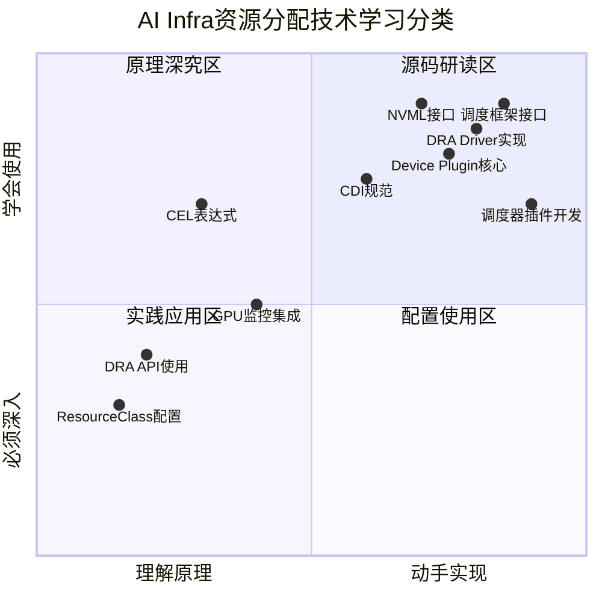

### 4.2 分层学习建议

| 学习层级 | 内容 | 学习方式 | 目标 |
|----------|------|----------|------|
| **原理层** | 设备发现、配置注入、调度决策 | 阅读文档、理解设计 | 理解不变的本质 |
| **接口层** | gRPC接口、K8s API | 阅读API定义、编写示例 | 掌握接口规范 |
| **实现层** | Driver实现、调度器插件 | 研读开源项目源码 | 理解实现细节 |
| **应用层** | 配置使用、问题排查 | 实际部署、调试 | 解决实际问题 |

### 4.3 学习优先级

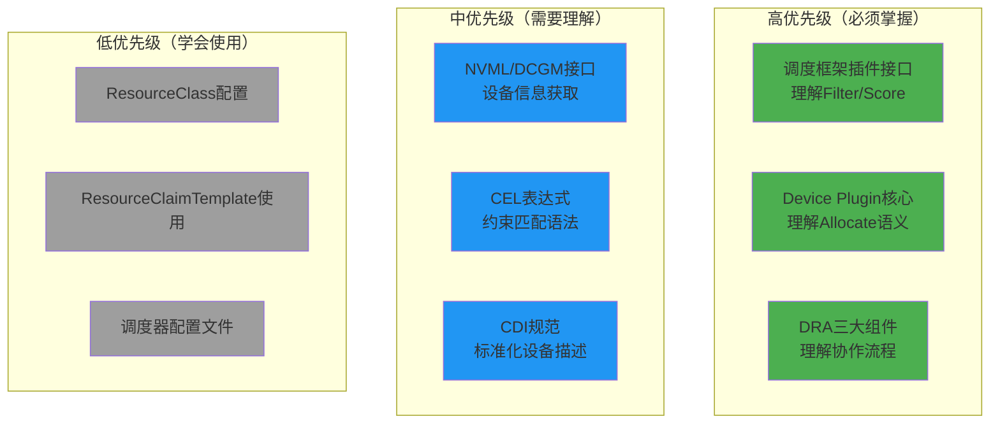

---

## 5. 开源项目推荐

### 5.1 需要研读源码的项目

| 项目 | GitHub链接 | 研读重点 | 学习价值 |
|------|------------|----------|----------|
| **NVIDIA k8s-device-plugin** | https://github.com/NVIDIA/k8s-device-plugin | Allocate实现、NVML调用 | 理解Device Plugin完整实现 |
| **NVIDIA k8s-dra-driver** | https://github.com/NVIDIA/k8s-dra-driver-gpu | NodePrepare、Allocate、Prepare | 理解DRA Driver实现范式 |
| **Kubernetes调度框架** | https://github.com/kubernetes/kubernetes/tree/master/pkg/scheduler/framework | Plugin接口、扩展点 | 理解调度插件设计模式 |
| **CDI规范** | https://github.com/cncf-tags/container-device-interface | CDI JSON Schema | 理解标准化设备描述 |
| **DCGM Exporter** | https://github.com/NVIDIA/dcgm-exporter | GPU指标采集 | 理解GPU监控集成 |

### 5.2 需要学会使用的工具

| 工具 | 链接 | 使用场景 | 学习重点 |
|------|------|----------|----------|
| **NVIDIA Container Toolkit** | https://github.com/NVIDIA/nvidia-container-toolkit | 容器GPU支持 | 配置和使用 |
| **DCGM** | https://github.com/NVIDIA/DCGM | GPU管理 | 监控和健康检查 |
| **Prometheus GPU监控** | https://github.com/NVIDIA/dcgm-exporter | 集群GPU监控 | 指标采集和查询 |
| **Kueue** | https://github.com/kubernetes-sigs/kueue | 任务队列管理 | GPU作业调度 |

### 5.3 源码研读路线

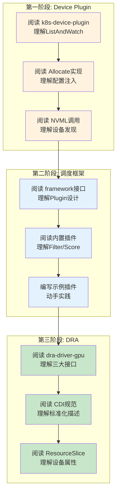

---

## 6. 实践思考题

### 6.1 业务场景思考题

---

#### 思考题一：大规模训练集群的GPU资源分配策略

**场景描述：**

你负责一个拥有100个节点、每个节点8张A100 GPU的大规模AI训练集群。集群需要同时支持：

1. **大模型训练任务**：需要独占多个节点，多GPU并行训练
2. **推理服务**：需要低延迟响应，单GPU即可
3. **开发调试任务**：需要指定特定GPU设备进行调试
4. **模型微调任务**：需要高显存GPU，但对延迟不敏感

**核心挑战：**

如何在保证各类任务需求的同时，最大化集群资源利用率？

**思考维度：**

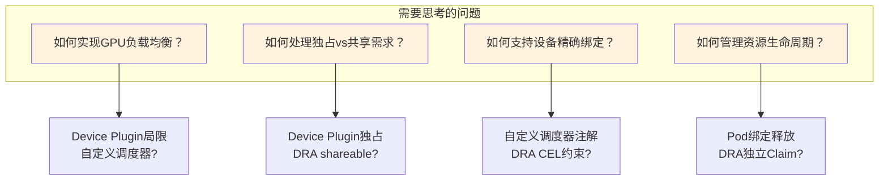

**思考要点：**

| 问题维度 | Device Plugin方案 | DRA方案 | 权衡考量 |
|----------|-------------------|---------|----------|
| **负载均衡** | 自定义Score插件（利用率感知） | ResourceClass allocationStrategy=balanced | DRA更声明式，但需Driver支持 |
| **独占分配** | 无法表达，靠调度器保证 | ResourceClass allocationStrategy=exclusive | DRA原生支持 |
| **设备绑定** | Pod注解 + 自定义Filter | CEL约束 device.attributes['uuid'] | CEL更标准化 |
| **生命周期** | 需额外控制器管理 | ResourceClaim独立生命周期 | DRA原生支持 |
| **多GPU任务** | 请求多个nvidia.com/gpu | ResourceClaim count=8 | 相同 |

**延伸思考：**

1. 如何结合监控数据（Prometheus GPU利用率）实现动态负载均衡调度？
2. 大模型训练任务如何保证多GPU在同一NUMA节点以优化通信？
3. 如何处理GPU故障时的任务迁移和恢复？

---

#### 思考题二：多租户GPU集群的资源隔离与公平分配

**场景描述：**

你的公司GPU集群需要支持多个业务团队：

- **团队A（核心业务）**：需要高优先级、预留GPU资源
- **团队B（研究团队）**：需要公平分配、按需使用
- **团队C（临时任务）**：需要低优先级、抢占式资源

**核心挑战：**

如何在多租户环境下实现资源隔离、公平分配和优先级管理？

**思考维度：**

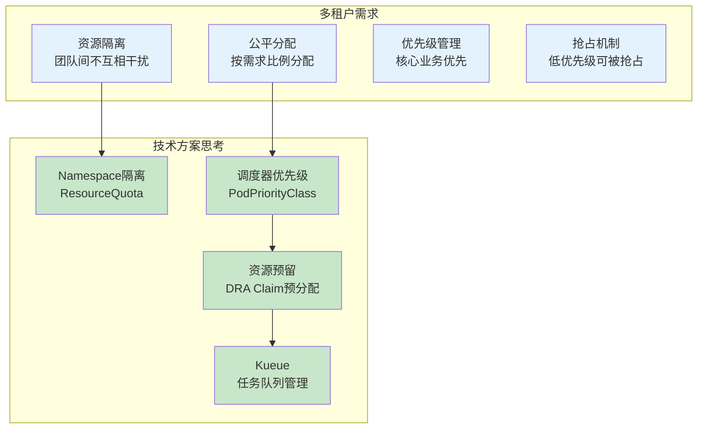

**思考要点：**

1. **Device Plugin vs DRA**：
   - Device Plugin无法区分租户，仅按Pod分配
   - DRA可以通过ResourceClaim实现团队级别的资源池化
   
2. **资源预留实现**：
   ```yaml
   # 团队A预留GPU资源池
   apiVersion: resource.k8s.io/v1beta1
   kind: ResourceClaim
   metadata:
     name: team-a-gpu-pool
     annotations:
       team: "team-a"
       priority: "high"
   spec:
     allocation:
       shareable: true  # 团队内共享
   ```

3. **公平分配策略**：
   - 如何结合调度器插件实现团队级别的公平分配？
   - 如何防止一个团队占用过多资源？

**延伸思考：**

1. 如何设计一个GPU资源配额系统，实现团队级别的资源限制和公平分配？
2. 如何实现GPU资源的"秒级抢占"机制，高优先级任务可以快速获取资源？
3. 如何记录GPU资源使用历史，实现按团队计费？

---

### 6.2 技术深度思考题

#### 思考题三：从源码理解设备注入的实现细节

**问题：** 阅读NVIDIA k8s-device-plugin源码，回答以下问题：

1. `Allocate`接口返回的配置是如何被kubelet解析并注入到容器的？
2. 为什么驱动库挂载需要`readOnly: true`？
3. 设备文件的`permissions: rwm`分别代表什么，为什么GPU需要全部权限？

**源码线索：**

- 查看路径：https://github.com/NVIDIA/k8s-device-plugin/blob/main/pkg/nvcdi/api.go
- 关键函数：`Allocate`, `Prepare`

**思考方向：**

```go
// 理解这段代码的作用
func (a *API) Prepare(ctx context.Context, claim *Claim) (*PrepareResult, error) {
    // 1. 如何生成CDI Spec?
    // 2. 如何确定挂载路径?
    // 3. 如何处理多GPU场景?
}
```

---

#### 思考题四：设计一个GPU利用率感知的调度器插件

**问题：** 基于调度框架，设计一个优先调度到低GPU利用率节点的插件。

**设计要求：**

1. Filter阶段：过滤掉显存不足的节点
2. Score阶段：利用率低的节点得高分
3. 如何获取实时GPU利用率数据？（从Prometheus查询）
4. 如何处理数据延迟和准确性问题？

**实现提示：**

```go
func (p *Plugin) Score(ctx context.Context, state *framework.CycleState, pod *v1.Pod, nodeName string) (int64, *framework.Status) {
    // 思考：如何从Prometheus获取GPU利用率?
    // query: avg(DCGM_FI_DEV_GPU_UTIL{node=~"nodeName"})
    
    // 思考：如何设计评分公式?
    // score = 100 - utilization
    
    // 思考：如何处理查询失败?
}
```

---

### 6.3 演进对比思考题

#### 思考题五：同一个业务需求的多种实现方式对比

**需求：** 将训练任务调度到显存>=64GB的A100 GPU上。

**请对比三种实现方式：**

```yaml
# 方式1: Device Plugin + 资源计数
resources:
  limits:
    nvidia.com/gpu: 1
# 问题：无法约束显存和型号

# 方式2: 自定义调度器 + Filter插件
func Filter(...) {
    if deviceMemory < 65536 {
        return Unschedulable
    }
    if deviceModel != "A100" {
        return Unschedulable
    }
}
# 问题：需要开发调度器插件

# 方式3: DRA + CEL约束
constraints:
  - cel:
      expression: "device.attributes['memory'] >= 65536"
  - cel:
      expression: "device.attributes['model'] == 'A100-80GB'"
# 问题：需要DRA Driver上报属性
```

**思考要点：**

1. 三种方式各自的优缺点？
2. 在什么场景下选择哪种方式？
3. DRA方式的Driver需要上报哪些属性才能支持此约束？

---

## 总结

### 学习要点回顾

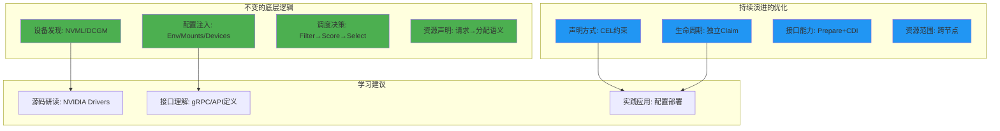

### 关键开源项目链接汇总

| 项目 | 链接 | 学习重点 |
|------|------|----------|
| NVIDIA Device Plugin | https://github.com/NVIDIA/k8s-device-plugin | Allocate实现 |
| NVIDIA DRA Driver | https://github.com/NVIDIA/k8s-dra-driver-gpu | DRA Driver实现 |
| Kubernetes Scheduler | https://github.com/kubernetes/kubernetes/tree/master/pkg/scheduler | 调度框架 |
| CDI Specification | https://github.com/cncf-tags/container-device-interface | 设备描述标准 |
| DCGM Exporter | https://github.com/NVIDIA/dcgm-exporter | GPU监控 |
| Kueue | https://github.com/kubernetes-sigs/kueue | 任务队列 |

---

> 本文档总结了从Device Plugin到DRA的技术演进，提炼了"不变的底层逻辑"和"持续演进的方向"，并提供了学习路径建议、开源项目推荐和实践思考题。