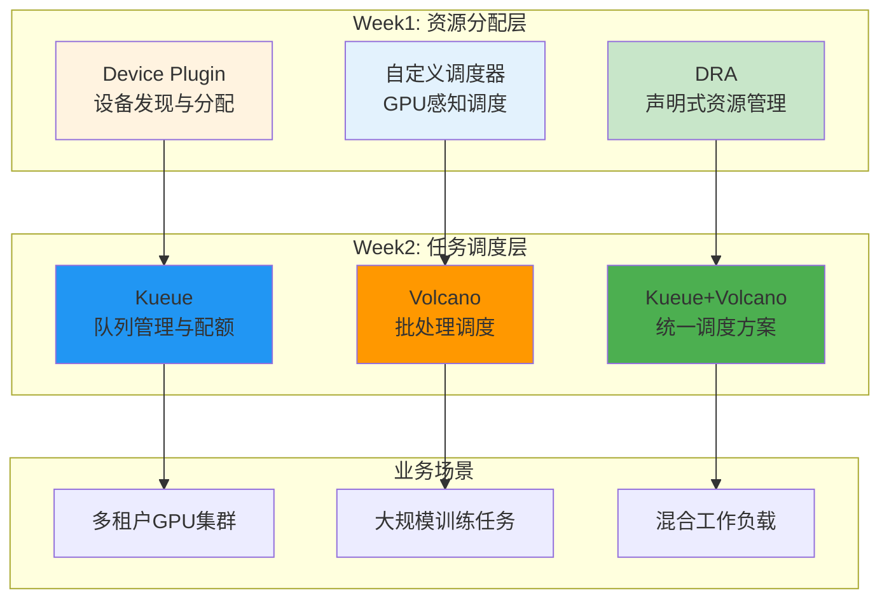
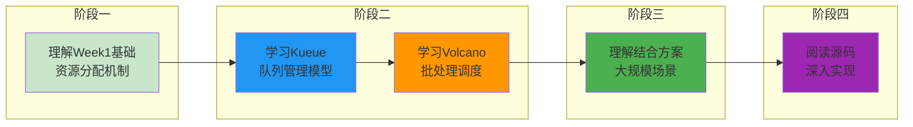

# Kueue + Volcano AI任务调度专题

> 从任务队列管理到批处理调度，系统学习 Kubernetes AI 工作负载调度的完整方案。

---

## 快速导航

| 文件 | 说明 |
|------|------|
| [docs/learning-guide.md](docs/learning-guide.md) | 📖 **学习指导文档** - 知识点分类、开源项目指引、学习路径 |
| [kueue/README.md](kueue/README.md) | 🔷 **Kueue专题** - 任务队列管理、多租户资源分配 |
| [volcano/README.md](volcano/README.md) | 🔶 **Volcano专题** - 批处理调度、Gang Scheduling |
| [kueue-volcano/README.md](kueue-volcano/README.md) | 🔗 **结合方案** - 大规模训练集群调度方案 |

---

## 核心特性

```
┌─────────────────────────────────────────────────────────────────┐
│                    AI任务调度核心能力                             │
├─────────────────────────────────────────────────────────────────┤
│  ✅ 任务队列管理    - Kueue实现多租户公平分配和优先级抢占           │
│  ✅ 批处理调度      - Volcano实现Gang Scheduling和任务依赖         │
│  ✅ 资源配额控制    - 团队级别资源限制和预留机制                    │
│  ✅ 分布式训练支持  - All-or-Nothing调度保证多GPU任务成功          │
│  ✅ 混合场景调度    - 训练/推理/开发任务统一调度框架               │
└─────────────────────────────────────────────────────────────────┘
```

---

## 技术定位



---

## 项目结构

```
week2-kueue-volcano/
│
├── kueue/                          # Kueue任务队列管理
│   ├── README.md                   # 概览：组件与特性
│   ├── docs/README.md              # 详解：队列模型、抢占机制
│   └── manifests/                  # 配置示例
│       ├── 01-clusterqueue.yaml    # 集群队列配置
│       ├── 02-localqueue.yaml      # 本地队列配置
│       └── 03-workload.yaml        # 工作负载示例
│
├── volcano/                        # Volcano批处理调度
│   ├── README.md                   # 概览：组件与特性
│   ├── docs/README.md              # 详解：Gang调度、公平分享
│   └── manifests/                  # 配置示例
│       ├── 01-queue.yaml           # 队列配置
│       ├── 02-job.yaml             # 批处理Job示例
│       └── 03-podgroup.yaml        # PodGroup配置
│
├── kueue-volcano/                  # Kueue+Volcano结合方案
│   ├── README.md                   # 概览：集成架构
│   ├── docs/README.md              # 详解：协作流程、业务场景
│   └── manifests/                  # 集成示例
│       ├── 01-integration.yaml     # 集成配置
│       └── 02-multi-cluster.yaml   # 多集群调度
│
├── docs/
│   └ learning-guide.md             # 学习指导文档
│
└── README.md                       # 本文档
```

---

## 使用示例

### Kueue多租户队列配置

```yaml
# ============================================================
# 示例: 团队级别GPU资源配额
# ============================================================
apiVersion: kueue.x-k8s.io/v1beta1
kind: ClusterQueue
metadata:
  name: team-a-gpu-queue
spec:
  namespaceSelector:
    matchLabels:
      team: team-a
  resourceGroups:
    - coveredResources: ["nvidia.com/gpu"]
      flavors:
        - name: gpu-flavor
          resources:
            - name: "nvidia.com/gpu"
              nominalQuota: 10    # 团队A配额：10张GPU
```

### Volcano分布式训练Job

```yaml
# ============================================================
# 示例: 4节点分布式训练任务
# ============================================================
apiVersion: batch.volcano.sh/v1alpha1
kind: Job
metadata:
  name: distributed-training
spec:
  minAvailable: 4    # Gang调度：必须4个Pod同时可用
  tasks:
    - replicas: 4
      name: worker
      template:
        spec:
          containers:
            - name: pytorch
              image: pytorch:latest
              resources:
                limits:
                  nvidia.com/gpu: 2
```

---

## 业务场景速览

| 场景 | 推荐方案 | 核心能力 |
|------|----------|----------|
| **多团队共享GPU集群** | Kueue | 配额管理、公平分配、优先级抢占 |
| **大规模分布式训练** | Volcano | Gang调度、任务依赖、公平分享 |
| **混合工作负载调度** | Kueue+Volcano | 队列管理 + 批处理调度 |
| **跨节点多GPU任务** | Volcano | All-or-Nothing调度保证 |
| **高优先级任务抢占** | Kueue | 优先级机制、资源抢占 |

---

## 学习路线



---

详见 **[docs/learning-guide.md](docs/learning-guide.md)** 获取完整学习指导和知识点分类。