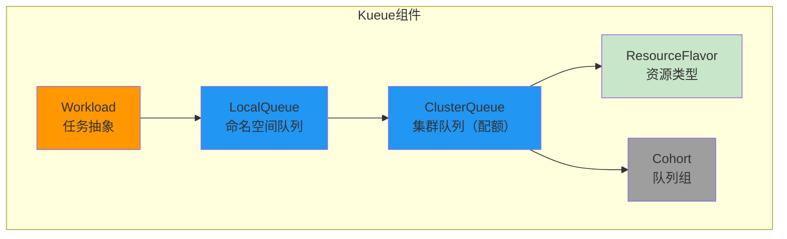

# Kueue任务队列管理

> Kubernetes原生任务队列系统，实现多租户资源公平分配和优先级抢占机制。

---

## 快速导航

| 文件 | 说明 |
|------|------|
| [docs/README.md](docs/README.md) | 📖 **完整学习文档** - 组件详解、分配算法、抢占机制 |
| [manifests/01-clusterqueue.yaml](manifests/01-clusterqueue.yaml) | 集群队列配置示例 |
| [manifests/02-localqueue.yaml](manifests/02-localqueue.yaml) | 本地队列配置示例 |
| [manifests/03-workload.yaml](manifests/03-workload.yaml) | 工作负载提交示例 |

---

## 核心特性

```
┌─────────────────────────────────────────────────────────────────┐
│                    Kueue队列管理核心能力                          │
├─────────────────────────────────────────────────────────────────┤
│  ✅ 多租户配额管理  - ClusterQueue实现团队级别资源限制              │
│  ✅ 两级队列模型    - 集群级配额 + 命名空间级提交入口               │
│  ✅ 优先级抢占      - 高优先级任务可抢占低优先级资源               │
│  ✅ 资源借用        - Cohort实现跨队列资源共享                     │
│  ✅ 资源类型区分    - ResourceFlavor标记不同GPU类型               │
└─────────────────────────────────────────────────────────────────┘
```

---

## 组件架构



---

## 项目结构

```
kueue/
├── README.md                       # 概览：组件与特性
├── docs/README.md                  # 详解：队列模型、分配算法
└── manifests/                      # 配置示例
    ├── 01-clusterqueue.yaml        # 集群队列：团队配额
    ├── 02-localqueue.yaml          # 本地队列：提交入口
    └── 03-workload.yaml            # 工作负载：任务提交
```

---

## 使用示例

```yaml
# ============================================================
# 示例: 团队GPU配额配置
# ============================================================
apiVersion: kueue.x-k8s.io/v1beta1
kind: ClusterQueue
metadata:
  name: team-a-gpu-queue
spec:
  namespaceSelector:
    matchLabels:
      team: team-a
  resourceGroups:
    - coveredResources: ["nvidia.com/gpu"]
      flavors:
        - name: gpu-flavor
          resources:
            - name: "nvidia.com/gpu"
              nominalQuota: 10    # 团队A固定配额：10张GPU
              borrowingLimit: 5   # 可借用其他队列最多5张
```

---

## 解决的核心问题

| 问题 | Kueue方案 | 解决方式 |
|------|-----------|----------|
| **多团队资源隔离** | ClusterQueue配额 | 团队级别nominalQuota |
| **公平分配** | 两级队列 + Cohort | 按配额和借用机制 |
| **高优先级任务** | 优先级抢占 | PriorityClass + preemption |
| **资源利用率** | 资源借用 | borrowingLimit机制 |

---

## 业务场景题

**场景：多团队共享GPU集群的公平分配**

> 公司GPU集群有100张GPU，需要支持3个团队：核心业务团队（高优先级）、研究团队（公平分配）、临时任务团队（低优先级可抢占）。

**一句话提示：**
> 用ClusterQueue为每个团队设置nominalQuota配额，Cohort实现团队间资源共享，PriorityClass定义三级优先级。

详见 **[docs/README.md](docs/README.md)** 获取组件详解、分配算法和抢占机制说明。