# Kueue详解：任务队列管理与多租户调度

> 深入理解 Kueue 的队列模型、分配算法、抢占机制，掌握多租户GPU集群调度方案。

---

## 目录

- [1. 概述](#1-概述)
- [2. 核心组件](#2-核心组件)
- [3. 队列模型设计](#3-队列模型设计)
- [4. 分配算法](#4-分配算法)
- [5. 抢占机制](#5-抢占机制)
- [6. 配额模型](#6-配额模型)
- [7. 业务场景应用](#7-业务场景应用)
- [8. 最佳实践](#8-最佳实践)
- [附录](#附录)

---

## 1. 概述

### 1.1 什么是Kueue

Kueue是Kubernetes原生的任务队列管理系统，专注于解决多租户环境下的资源公平分配问题。

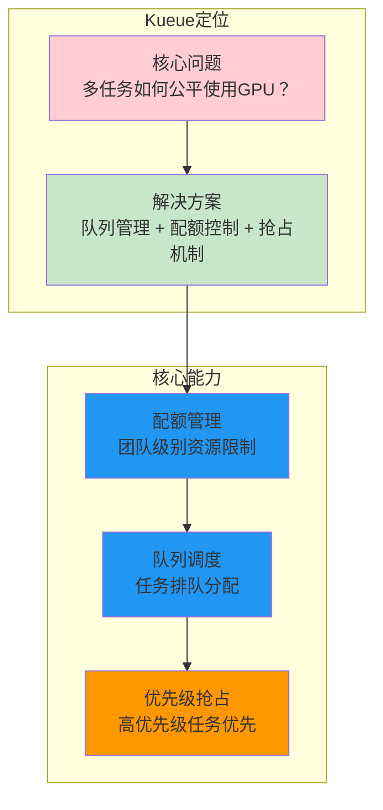

### 1.2 核心特性

| 特性 | 说明 | 解决的问题 |
|------|------|------------|
| **两级队列** | ClusterQueue + LocalQueue | 集群级配额 + 命名空间级提交 |
| **配额管理** | nominalQuota + borrowingLimit | 团队资源隔离和共享 |
| **优先级抢占** | PriorityClass + preemption | 高优先级任务快速获取资源 |
| **资源借用** | Cohort共享池 | 提高资源利用率 |
| **ResourceFlavor** | 资源类型标签 | 区分不同GPU型号 |

### 1.3 与Week1的关系

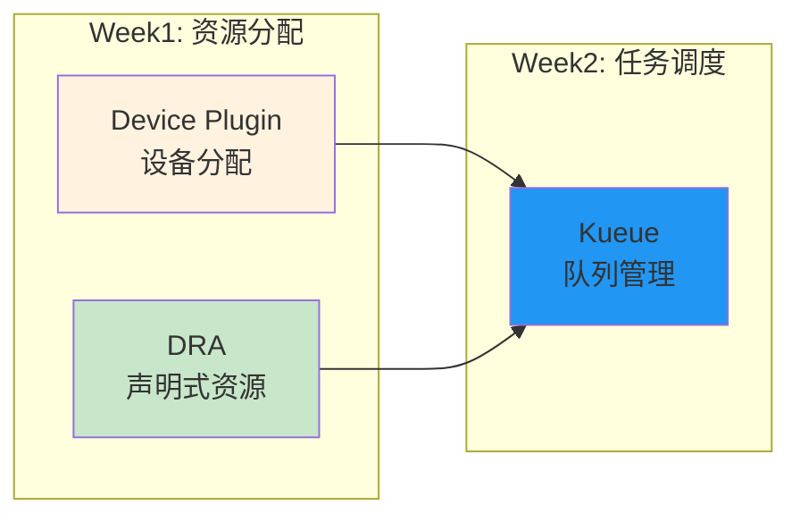

**关联说明：**

| Week1内容 | Kueue如何使用 |
|-----------|---------------|
| Device Plugin上报的GPU | Kueue管理nvidia.com/gpu配额 |
| DRA的ResourceClaim | Kueue管理Workload资源请求 |
| 自定义调度器 | Kueue可配合使用 |

---

## 2. 核心组件

### 2.1 组件总览

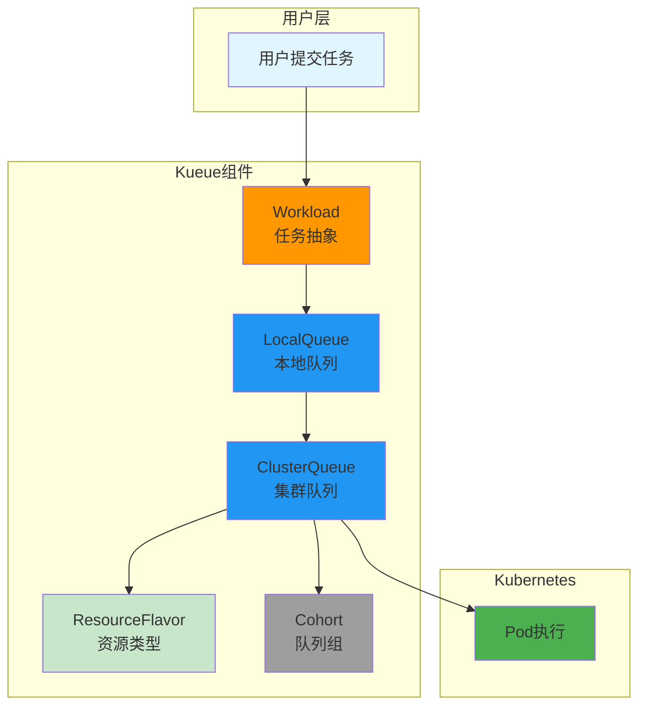

### 2.2 组件详解

#### Workload（任务抽象）

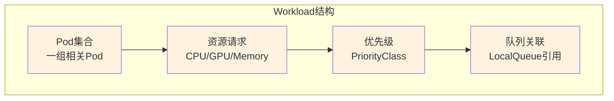

| 字段 | 说明 | 示例 |
|------|------|------|
| `spec.queueName` | 关联的LocalQueue | "team-a-queue" |
| `spec.podSets` | Pod集合定义 | worker: 4 replicas |
| `spec.priority` | 优先级 | high/medium/low |
| `spec.priorityClassName` | PriorityClass引用 | "high-priority" |

#### ClusterQueue（集群队列）

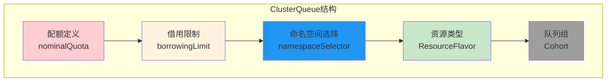

| 字段 | 说明 | 用途 |
|------|------|------|
| `spec.namespaceSelector` | 命名空间选择器 | 限定哪些命名空间可使用 |
| `spec.resourceGroups` | 资源配额组 | 定义GPU/CPU配额 |
| `spec.flavors` | ResourceFlavor列表 | 区分不同资源类型 |
| `spec.cohort` | 所属Cohort | 资源共享池 |
| `spec.preemption` | 抢占策略 | 配置抢占行为 |

#### LocalQueue（本地队列）

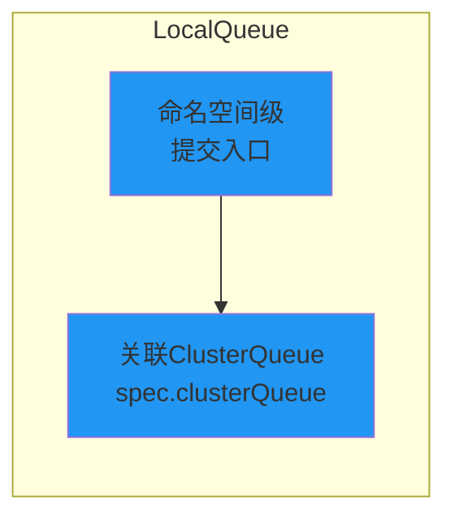

| 字段 | 说明 | 用途 |
|------|------|------|
| `spec.clusterQueue` | 关联的ClusterQueue | 路由到配额队列 |

#### ResourceFlavor（资源类型）

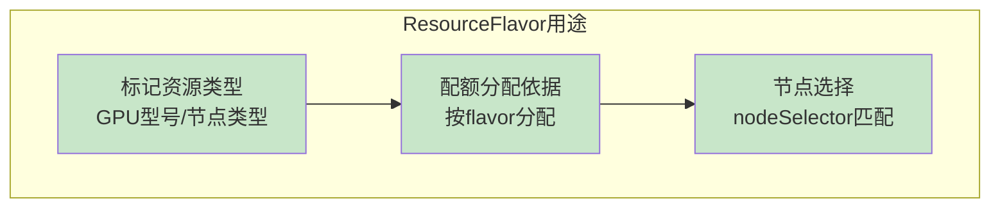

| 字段 | 说明 | 示例 |
|------|------|------|
| `spec.nodeLabels` | 节点标签匹配 | {"gpu-type": "a100"} |
| `spec.tolerations` | 容忍度配置 | A100节点污点容忍 |

#### Cohort（队列组）

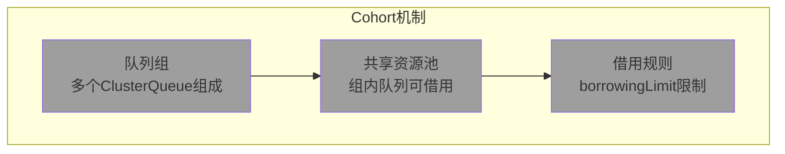

---

## 3. 队列模型设计

### 3.1 两级队列设计原理

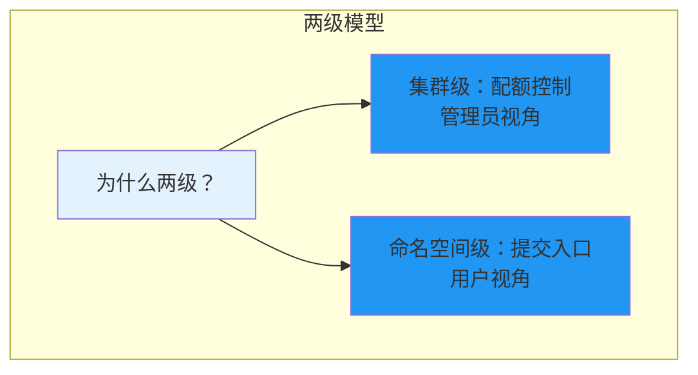

**设计原因：**

| 层级 | 责任 | 管理者 |
|------|------|--------|
| **ClusterQueue** | 配额定义、资源限制 | 集群管理员 |
| **LocalQueue** | 提交入口、命名空间隔离 | 团队用户 |

### 3.2 队列关系

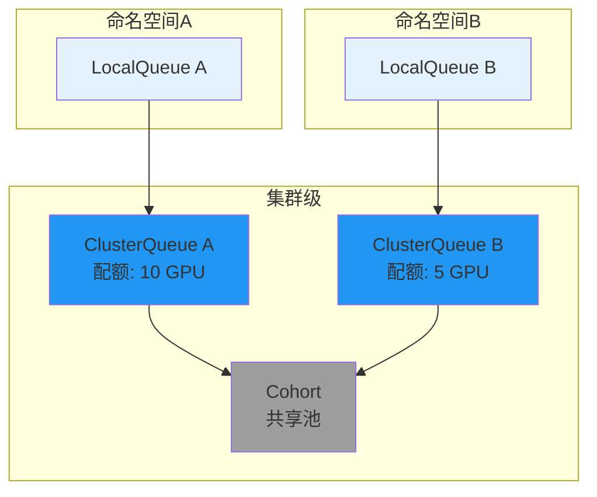

### 3.3 Workload状态变迁

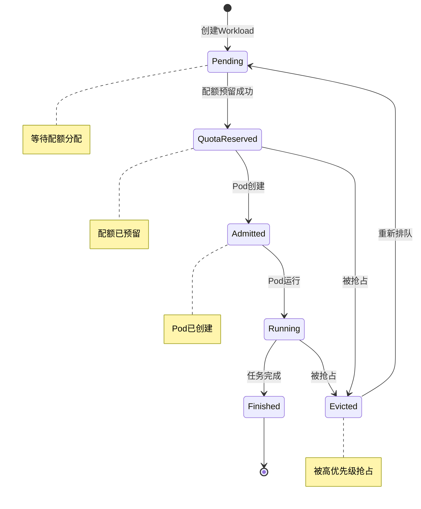

---

## 4. 分配算法

### 4.1 分配流程

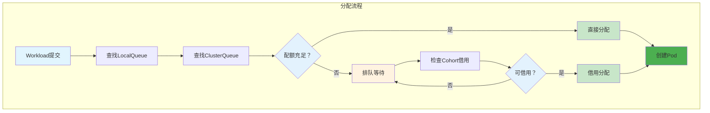

### 4.2 分配决策因素

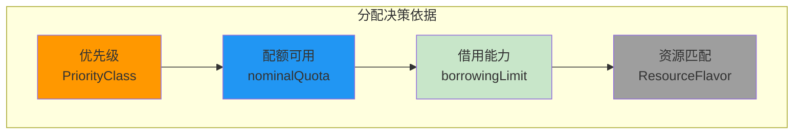

| 因素 | 作用 | 决策影响 |
|------|------|----------|
| **优先级** | 高优先级优先分配 | 抢占低优先级Workload |
| **配额可用** | nominalQuota剩余 | 决定是否能直接分配 |
| **借用能力** | borrowingLimit | 决定是否能跨队列借用 |
| **资源匹配** | ResourceFlavor | 匹配合适的资源类型 |

### 4.3 源码研读：scheduler.go

```go
// ============================================================
// Kueue分配算法核心逻辑
// ============================================================
// 文件位置: pkg/scheduler/scheduler.go
// 学习重点: 理解如何选择最优队列分配

func (s *Scheduler) schedule(ctx context.Context) {
    // === 步骤1: 获取待调度Workload ===
    workloads := s.getPendingWorkloads()

    // === 步骤2: 按优先级排序 ===
    sort.Sort(ByPriority(workloads))

    // === 歐骤3: 尝试分配 ===
    for _, wl := range workloads {
        // 查找关联的ClusterQueue
        cq := s.getClusterQueue(wl.QueueName)

        // 检查配额
        if cq.HasQuota(wl.ResourceRequests) {
            s.assignQuota(wl, cq)
        } else {
            // 检查Cohort借用
            if cq.CanBorrow(wl) {
                s.borrowAndAssign(wl, cq)
            } else {
                // 触发抢占（如果优先级足够高）
                s.tryPreemption(wl, cq)
            }
        }
    }
}
```

**源码研读重点：**

| 函数/方法 | 研读内容 | 理解目标 |
|-----------|----------|----------|
| `schedule()` | 分配入口 | 理解整体流程 |
| `getPendingWorkloads()` | 获取待分配任务 | 理解状态筛选 |
| `HasQuota()` | 配额检查 | 理解配额计算 |
| `CanBorrow()` | 借用检查 | 理解借用逻辑 |
| `assignQuota()` | 分配执行 | 理解状态变迁 |

---

## 5. 抢占机制

### 5.1 抢占触发条件

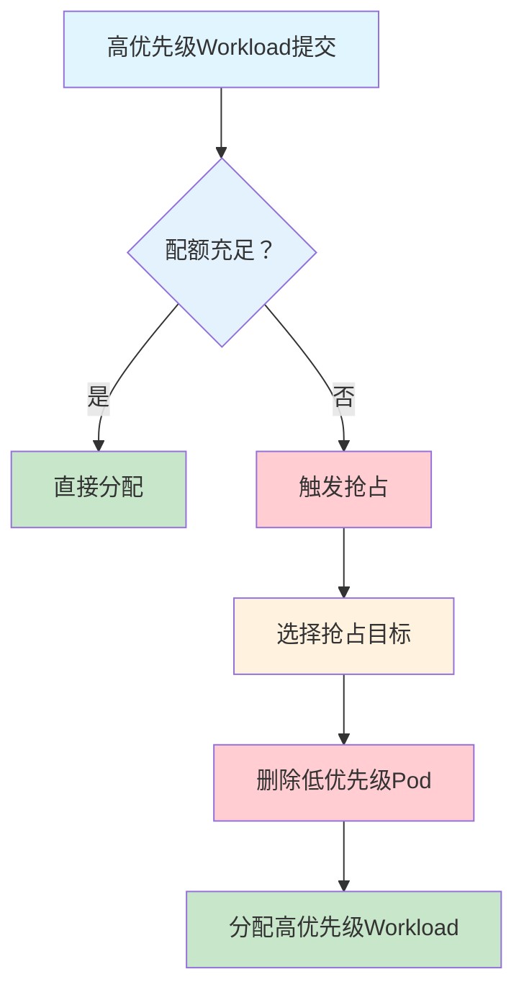

### 5.2 抢占策略配置

```yaml
# ============================================================
# 抢占策略配置示例
# ============================================================
apiVersion: kueue.x-k8s.io/v1beta1
kind: ClusterQueue
metadata:
  name: team-a-queue
spec:
  preemption:
    reclaimWithinCohort: Any  # 可抢占同Cohort内任意队列
    borrowWithinCohort:
      policy: LowerPriority    # 只抢占低优先级
    withinClusterQueue:
      policy: LowerPriority    # 队列内抢占低优先级
```

### 5.3 抢占目标选择

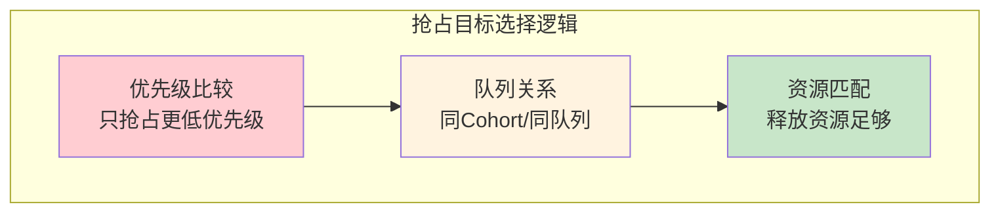

| 抢占范围 | 策略 | 说明 |
|----------|------|------|
| `withinClusterQueue` | LowerPriority | 队列内抢占低优先级 |
| `reclaimWithinCohort` | Any/LowerPriority | Cohort内抢占策略 |
| `borrowWithinCohort` | LowerPriority | 借用时抢占策略 |

### 5.4 源码研读：preemption.go

```go
// ============================================================
// Kueue抢占机制核心逻辑
// ============================================================
// 文件位置: pkg/preemption/preemption.go
// 学习重点: 理解抢占目标选择和执行逻辑

func (p *Preemption) tryPreempt(ctx context.Context, wl *Workload, cq *ClusterQueue) bool {
    // === 步骤1: 检查抢占策略配置 ===
    policy := cq.Spec.Preemption

    // === 步骤2: 查找可抢占目标 ===
    targets := p.findPreemptionTargets(wl, cq, policy)

    if len(targets) == 0 {
        return false
    }

    // === 骤3: 按优先级排序目标 ===
    sort.Sort(ByPriorityAsc(targets))

    // === 步骤4: 执行抢占 ===
    for _, target := range targets {
        if p.canFitAfterPreemption(wl, target) {
            p.evictWorkload(target)
            return true
        }
    }

    return false
}
```

**源码研读重点：**

| 函数/方法 | 研读内容 | 理解目标 |
|-----------|----------|----------|
| `tryPreempt()` | 抢占入口 | 理解触发条件 |
| `findPreemptionTargets()` | 目标查找 | 理解选择逻辑 |
| `canFitAfterPreemption()` | 资源匹配 | 理解释放后检查 |
| `evictWorkload()` | 执行抢占 | 理解Pod删除流程 |

---

## 6. 配额模型

### 6.1 配额计算


**配额计算公式：**

```
availableQuota = nominalQuota + min(borrowingLimit, cohortUnused) - usedQuota

其中:
- nominalQuota: 固定配额（团队保底）
- borrowingLimit: 借用上限（从Cohort借用）
- cohortUnused: Cohort内其他队列未使用配额
- usedQuota: 当前已分配配额
```

### 6.2 Cohort共享机制

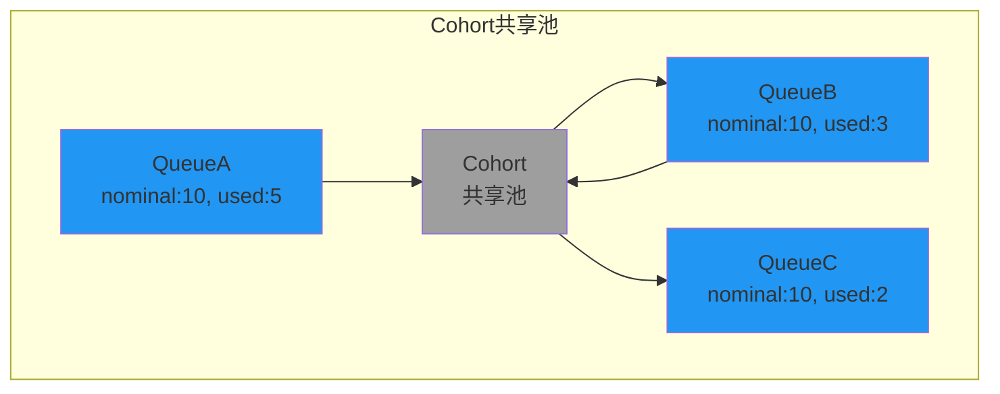

**共享计算示例：**

| 场景 | 计算 | 结果 |
|------|------|------|
| Cohort总配额 | 10 + 10 + 10 = 30 | 30张GPU |
| Cohort已用 | 5 + 3 + 2 = 10 | 10张已分配 |
| Cohort可借用 | 30 - 10 = 20 | 20张可借用 |
| QueueA可借用 | min(5, 20) = 5 | 可借用5张 |

### 6.3 ResourceFlavor配置

```yaml
# ============================================================
# ResourceFlavor: 区分GPU类型
# ============================================================
apiVersion: kueue.x-k8s.io/v1beta1
kind: ResourceFlavor
metadata:
  name: a100-flavor
spec:
  nodeLabels:
    gpu-type: a100-80gb    # 匹配A100节点
  tolerations:
    - key: "gpu-type"
      operator: "Equal"
      value: "a100-80gb"
```

---

## 7. 业务场景应用

### 7.1 多团队GPU集群

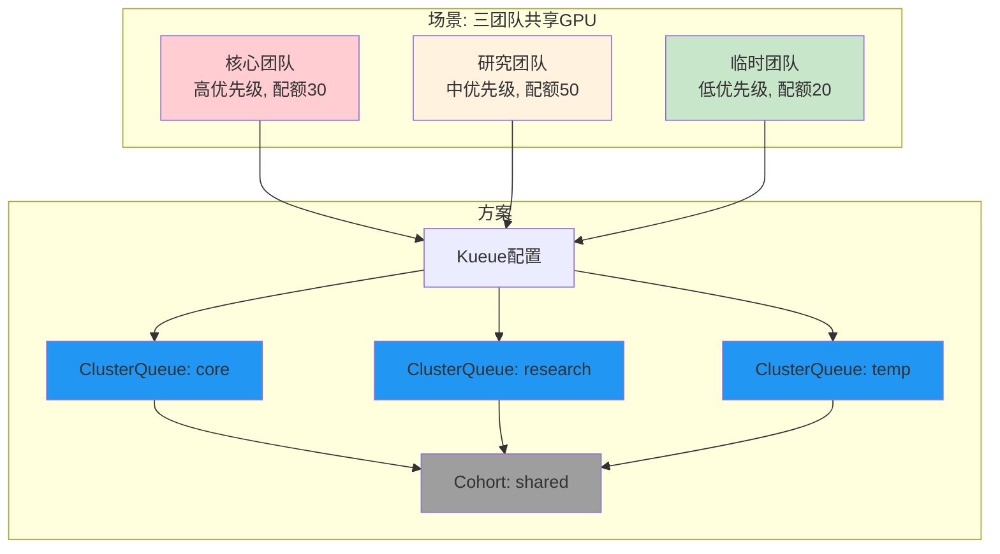

**配置要点：**

```yaml
# ============================================================
# 核心团队: 高优先级, 可抢占
# ============================================================
apiVersion: kueue.x-k8s.io/v1beta1
kind: ClusterQueue
metadata:
  name: core-team-queue
spec:
  cohort: shared
  resourceGroups:
    - flavors:
        - resources:
            - name: "nvidia.com/gpu"
              nominalQuota: 30
              borrowingLimit: 10    # 可借用10张
  preemption:
    reclaimWithinCohort: Any        # 可抢占任意队列
    withinClusterQueue: LowerPriority

---
# ============================================================
# 临时团队: 低优先级, 可被抢占
# ============================================================
apiVersion: kueue.x-k8s.io/v1beta1
kind: ClusterQueue
metadata:
  name: temp-team-queue
spec:
  cohort: shared
  resourceGroups:
    - flavors:
        - resources:
            - name: "nvidia.com/gpu"
              nominalQuota: 20
              borrowingLimit: 0     # 不可借用
  preemption:
    reclaimWithinCohort: Never      # 不可抢占其他队列
```

### 7.2 高优先级任务抢占

**场景：核心团队紧急任务需要立即获取资源**

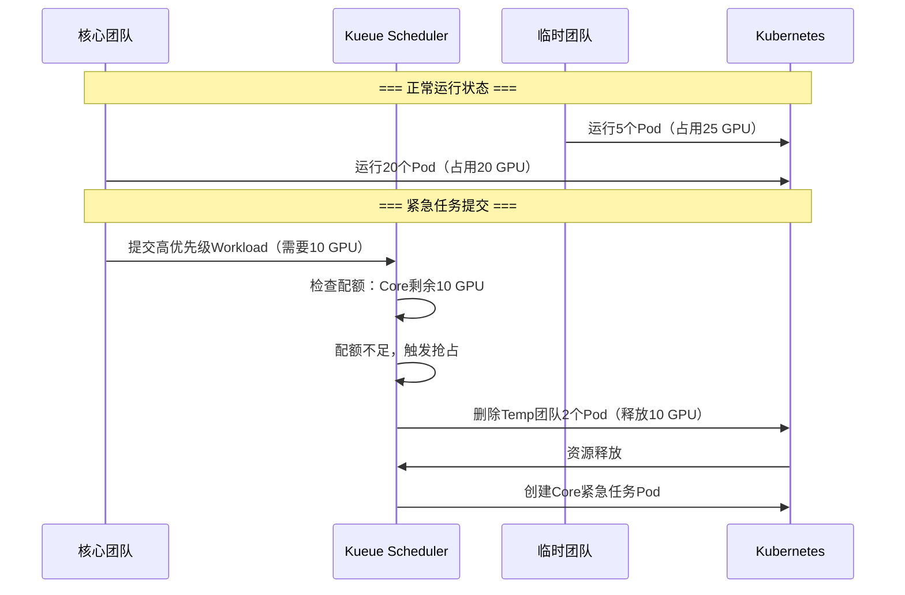

---

## 8. 最佳实践

### 8.1 配额设计建议

| 场景 | 配额建议 | 原因 |
|------|----------|------|
| **核心业务** | nominalQuota ≥ 日常需求 | 保证基础资源可用 |
| **研究团队** | nominalQuota + borrowingLimit | 平时借用，高峰时自有 |
| **临时任务** | 仅borrowingLimit | 避免占用固定配额 |

### 8.2 抢占策略建议

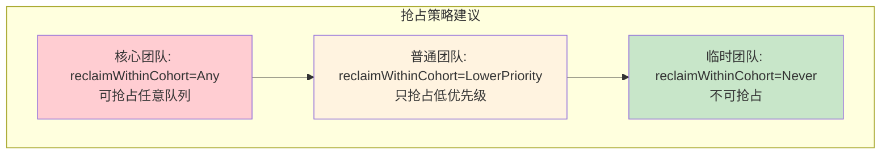

### 8.3 常见问题排查

| 问题 | 可能原因 | 解决方式 |
|------|----------|----------|
| Workload一直Pending | 配额不足、优先级低 | 检查ClusterQueue配额 |
| 任务被意外抢占 | 优先级过低 | 调整PriorityClass |
| 借用失败 | borrowingLimit=0 | 设置借用上限 |
| Flavor匹配失败 | nodeLabels不匹配 | 检查节点标签 |

---

## 附录

### A. CRD字段速查

**ClusterQueue核心字段：**

| 字段 | 类型 | 说明 |
|------|------|------|
| `spec.namespaceSelector` | LabelSelector | 命名空间选择 |
| `spec.resourceGroups[].flavors[].resources[].nominalQuota` | Quantity | 固定配额 |
| `spec.resourceGroups[].flavors[].resources[].borrowingLimit` | Quantity | 借用上限 |
| `spec.cohort` | string | Cohort名称 |
| `spec.preemption.reclaimWithinCohort` | PreemptionPolicy | 抢占策略 |

### B. 源码研读清单

| 文件 | 研读重点 | 预计时间 |
|------|----------|----------|
| `pkg/scheduler/scheduler.go` | 分配算法入口 | 2小时 |
| `pkg/preemption/preemption.go` | 抢占逻辑 | 2小时 |
| `pkg/queue/cluster_queue.go` | 队列状态管理 | 1小时 |
| `apis/kueue/v1beta1/*.go` | CRD定义 | 1小时 |

### C. 参考资料

- [Kueue官方文档](https://kueue.sigs.k8s.io/docs/)
- [Kueue源码](https://github.com/kubernetes-sigs/kueue)
- [Kueue设计文档](https://kueue.sigs.k8s.io/docs/concepts/)

---

> 本文档详解了Kueue的队列模型、分配算法和抢占机制，建议结合源码研读深入理解实现细节。