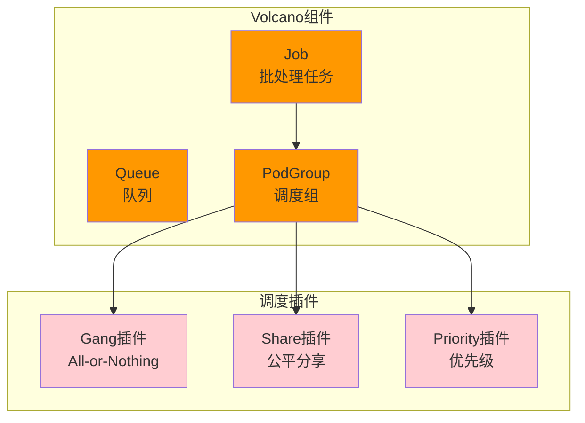

# Volcano批处理调度

> Kubernetes批处理任务调度系统，实现Gang Scheduling和分布式训练调度。

---

## 快速导航

| 文件 | 说明 |
|------|------|
| [docs/README.md](docs/README.md) | 📖 **完整学习文档** - Gang调度、公平分享、调度框架 |
| [manifests/01-queue.yaml](manifests/01-queue.yaml) | 队列配置示例 |
| [manifests/02-job.yaml](manifests/02-job.yaml) | 批处理Job示例 |
| [manifests/03-podgroup.yaml](manifests/03-podgroup.yaml) | PodGroup配置示例 |

---

## 核心特性

```
┌─────────────────────────────────────────────────────────────────┐
│                    Volcano批调度核心能力                          │
├─────────────────────────────────────────────────────────────────┤
│  ✅ Gang调度       - All-or-Nothing，多Pod必须同时可用            │
│  ✅ 公平分享       - DRF/SSJ算法，按需求比例公平分配               │
│  ✅ 任务依赖       - DAG依赖链，支持任务间依赖关系                 │
│  ✅ 批处理Job      - 统一的批处理任务抽象                          │
│  ✅ 调度框架       - 插件化扩展，支持自定义调度策略                │
└─────────────────────────────────────────────────────────────────┘
```

---

## 组件架构



---

## 项目结构

```
volcano/
├── README.md                       # 概览：组件与特性
├── docs/README.md                  # 详解：Gang调度、公平分享
└── manifests/                      # 配置示例
    ├── 01-queue.yaml               # 队列配置
    ├── 02-job.yaml                 # 批处理Job示例
    └── 03-podgroup.yaml            # PodGroup配置
```

---

## 使用示例

```yaml
# ============================================================
# 示例: 4节点分布式训练任务
# ============================================================
apiVersion: batch.volcano.sh/v1alpha1
kind: Job
metadata:
  name: distributed-training
spec:
  minAvailable: 4    # Gang调度：必须4个Pod同时可用才启动
  queue: training-queue
  tasks:
    - replicas: 4
      name: worker
      template:
        spec:
          containers:
            - name: pytorch
              image: pytorch/pytorch:latest
              resources:
                limits:
                  nvidia.com/gpu: 2
```

---

## 解决的核心问题

| 问题 | Volcano方案 | 解决方式 |
|------|-------------|----------|
| **分布式训练调度** | Gang调度 | minAvailable保证同时启动 |
| **多任务公平分配** | 公平分享 | DRF算法按需求比例 |
| **任务间依赖** | DAG依赖 | depends依赖链 |
| **批处理抽象** | Volcano Job | 统一的Job CRD |

---

## 业务场景题

**场景：大模型训练的跨节点多GPU调度**

> 大模型训练任务需要跨4个节点、每节点2张GPU，共8张GPU协同训练。如何保证调度成功率？

**一句话提示：**
> 用Volcano Job定义minAvailable=8（总共8个Worker），Gang调度保证8个Pod全部同时可用才启动任务。

详见 **[docs/README.md](docs/README.md)** 获取Gang调度实现、公平分享算法详解。