# Volcano详解：批处理调度与Gang Scheduling

> 深入理解 Volcano 的Gang调度、公平分享算法、调度框架，掌握分布式训练调度方案。

---

## 目录

- [1. 概述](#1-概述)
- [2. 核心组件](#2-核心组件)
- [3. Gang调度详解](#3-gang调度详解)
- [4. 公平分享算法](#4-公平分享算法)
- [5. 调度框架](#5-调度框架)
- [6. 任务依赖](#6-任务依赖)
- [7. 业务场景应用](#7-业务场景应用)
- [8. 最佳实践](#8-最佳实践)
- [附录](#附录)

---

## 1. 概述

### 1.1 什么是Volcano

Volcano是Kubernetes批处理任务调度系统，专注于解决分布式训练和批处理任务的调度问题。

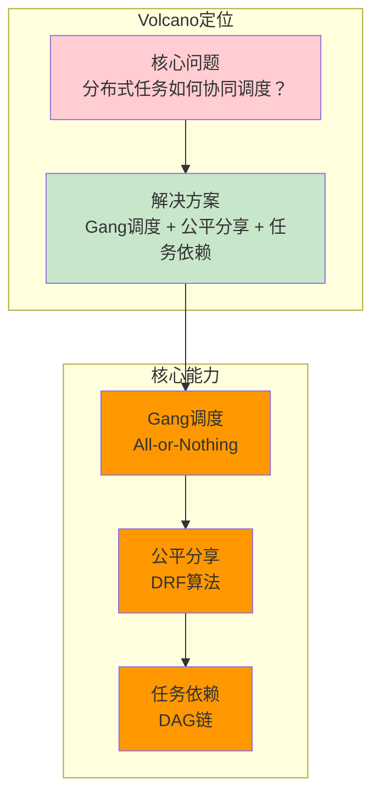

### 1.2 核心特性

| 特性 | 说明 | 解决的问题 |
|------|------|------------|
| **Gang调度** | All-or-Nothing调度语义 | 分布式训练同时启动 |
| **公平分享** | DRF/SSJ公平分配算法 | 多任务公平使用资源 |
| **任务依赖** | DAG依赖链 | 任务间依赖关系 |
| **批处理Job** | 统一的Job CRD | 批处理任务抽象 |
| **调度框架** | 插件化扩展 | 自定义调度策略 |

### 1.3 与Kueue的关系

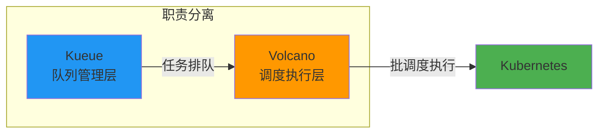

| 维度 | Kueue | Volcano |
|------|-------|---------|
| **职责** | 队列管理、配额控制 | 批调度执行 |
| **关注点** | 多租户公平分配 | 任务调度语义 |
| **场景** | 任务排队等待 | 分布式任务调度 |

---

## 2. 核心组件

### 2.1 组件总览

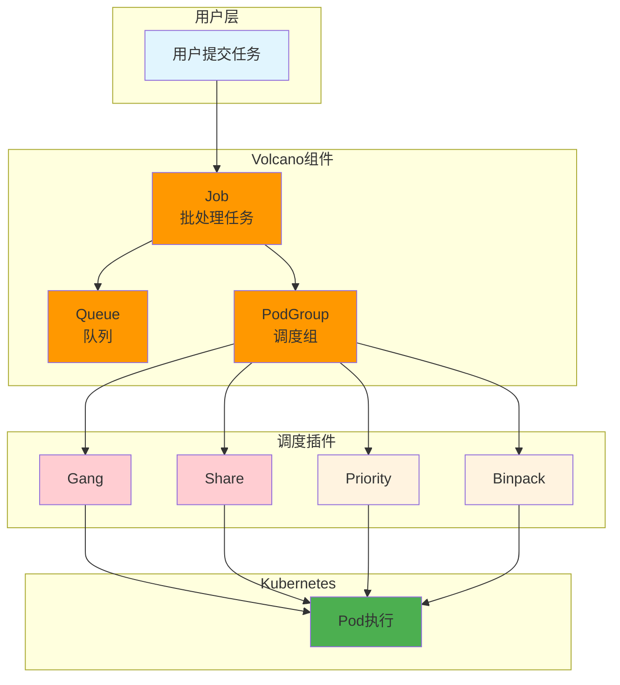

### 2.2 组件详解

#### Queue（队列）

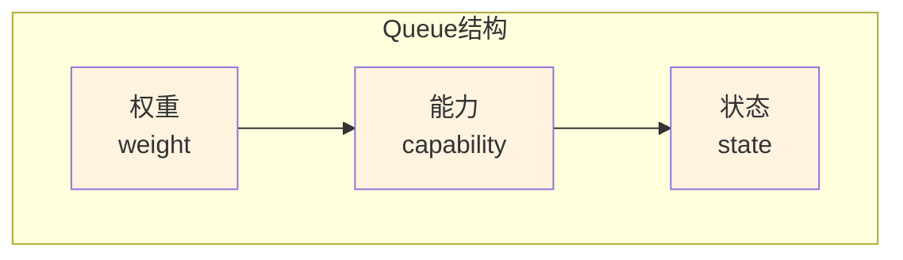

| 字段 | 说明 | 示例 |
|------|------|------|
| `spec.weight` | 队列权重 | 3（3倍资源分配） |
| `spec.capability` | 资源能力 | "nvidia.com/gpu: 10" |
| `spec.state` | 队列状态 | Open/Closed |

#### Job（批处理任务）

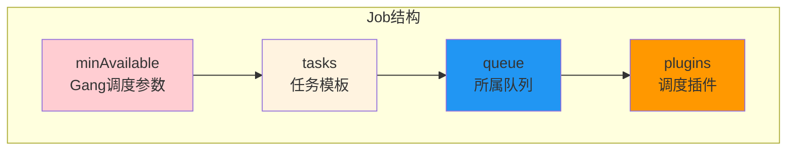

| 字段 | 说明 | 用途 |
|------|------|------|
| `spec.minAvailable` | 最少可用Pod数 | Gang调度核心参数 |
| `spec.tasks` | 任务模板列表 | 定义Worker/Master |
| `spec.queue` | 所属队列 | 资源分配依据 |
| `spec.plugins` | 调度插件配置 | 启用Gang/Share等 |

#### PodGroup（调度组）

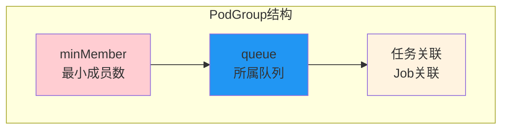

| 字段 | 说明 | 用途 |
|------|------|------|
| `spec.minMember` | 最小成员数 | Gang调度判断条件 |
| `spec.queue` | 所属队列 | 路由到Queue |

---

## 3. Gang调度详解

### 3.1 Gang调度原理

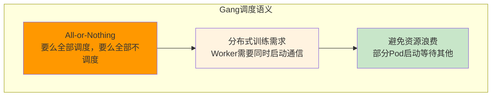

**为什么需要Gang调度：**

| 问题 | Gang调度解决 |
|------|-------------|
| 分布式训练Worker通信依赖 | 保证全部Worker同时启动 |
| 部分Pod启动等待其他Pod | 等待全部可用才启动 |
| 资源碎片导致任务失败 | 预留资源避免碎片 |

### 3.2 Gang调度流程

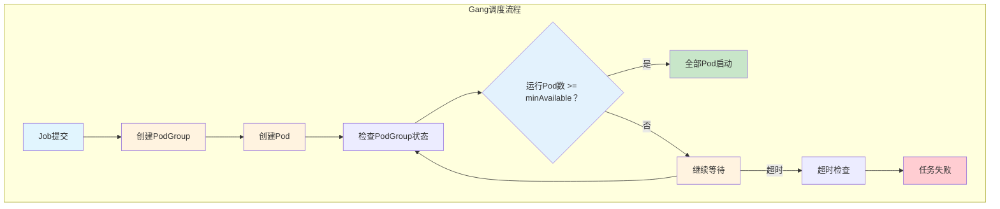

### 3.3 minAvailable设置

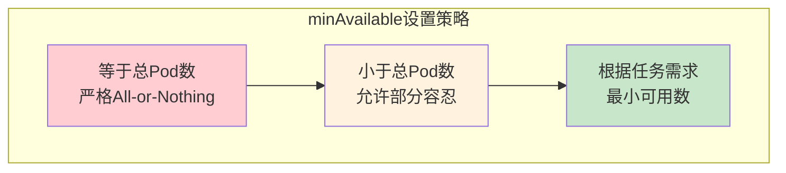

| 设置策略 | 示例 | 适用场景 |
|----------|------|----------|
| **等于总Pod数** | minAvailable=8, replicas=8 | 严格All-or-Nothing |
| **小于总Pod数** | minAvailable=6, replicas=8 | 允许部分节点故障 |
| **根据需求** | 训练需要最小Worker数 | 弹性训练 |

### 3.4 源码研读：gang.go

```go
// ============================================================
// Volcano Gang调度插件核心逻辑
// ============================================================
// 文件位置: pkg/scheduler/plugins/gang/gang.go
// 学习重点: 理解All-or-Nothing调度实现

func (g *Gang) OnSessionOpen(ssn *Session) {
    // === 步骤1: 注册PodGroup检查函数 ===
    ssn.AddPredicateFn(g.Name(), func(pod *v1.Pod) bool {
        pg := ssn.GetPodGroup(pod)

        // === 步骤2: 检查minMember条件 ===
        // 计算当前可调度Pod数
        readyPods := ssn.GetReadyPods(pg)

        // 如果已有足够Pod，继续调度
        if readyPods >= pg.Spec.MinMember {
            return true
        }

        // === 歐骤3: 检查资源是否足够调度全部 ===
        // 预留资源，避免碎片
        requiredResources := pg.GetTotalResources()
        availableResources := ssn.GetAvailableResources()

        if availableResources >= requiredResources {
            // 资源足够，允许调度
            return true
        }

        // 资源不足，拒绝调度
        return false
    })
}
```

**源码研读重点：**

| 函数/方法 | 研读内容 | 理解目标 |
|-----------|----------|----------|
| `OnSessionOpen()` | 插件初始化 | 理解插件注册机制 |
| `PredicateFn()` | 过滤函数 | 理解调度条件判断 |
| `GetReadyPods()` | 统计已调度Pod | 理解状态计算 |
| `GetAvailableResources()` | 计算可用资源 | 理解资源预留 |

---

## 4. 公平分享算法

### 4.1 DRF算法原理

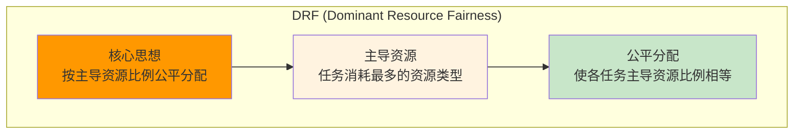

**DRF计算示例：**

| 任务 | GPU请求 | CPU请求 | 主导资源 | 主导比例 |
|------|---------|---------|----------|----------|
| 任务A | 4 GPU | 8 CPU | GPU | 4/100 = 4% |
| 任务B | 2 GPU | 32 CPU | CPU | 32/200 = 16% |
| 任务C | 8 GPU | 4 CPU | GPU | 8/100 = 8% |

**公平分配：** 使任务A、B、C的主导资源比例相等。

### 4.2 SSJ算法原理

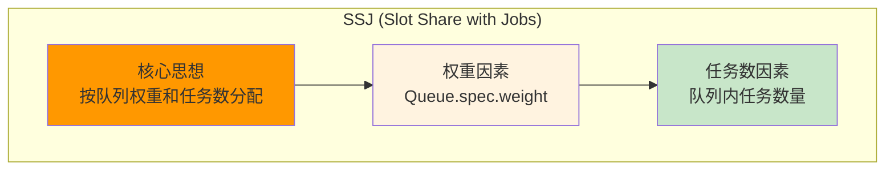

**SSJ计算公式：**

```
队列分配比例 = weight / (weight × jobCount)

其中:
- weight: Queue权重
- jobCount: 队列内任务数量
```

### 4.3 公平分享流程

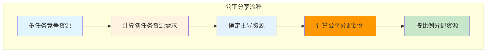

### 4.4 源码研读：share.go

```go
// ============================================================
// Volcano公平分享插件核心逻辑
// ============================================================
// 文件位置: pkg/scheduler/plugins/share/share.go
// 学习重点: 理解DRF/SSJ算法实现

func (s *Share) OnSessionOpen(ssn *Session) {
    // === 步骤1: 注册打分函数 ===
    ssn.AddScoreFn(g.Name(), func(pod *v1.Pod) int64 {
        pg := ssn.GetPodGroup(pod)
        queue := ssn.GetQueue(pg.Spec.Queue)

        // === 步骤2: 计算队列当前主导资源比例 ===
        dominantShare := s.calculateDominantShare(queue)

        // === 歧骤3: 主导比例低得高分 ===
        // 反比例打分：比例越低，分数越高
        score := maxScore - dominantShare * scoreFactor

        return score
    })
}

func (s *Share) calculateDominantShare(queue *Queue) float64 {
    // === 计算各资源使用比例 ===
    gpuShare := queue.UsedGPU / queue.TotalGPU
    cpuShare := queue.UsedCPU / queue.TotalCPU
    memShare := queue.UsedMemory / queue.TotalMemory

    // === 返回最大比例（主导资源） ===
    return max(gpuShare, cpuShare, memShare)
}
```

---

## 5. 调度框架

### 5.1 插件扩展点

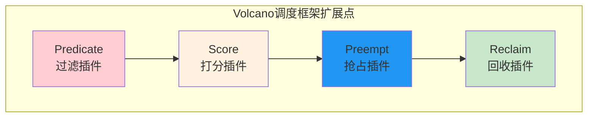

| 扩展点 | 作用 | 内置插件 |
|--------|------|----------|
| **Predicate** | 过滤不满足条件的节点 | Gang、NodePorts |
| **Score** | 为节点打分排序 | Share、Binpack |
| **Preempt** | 决定抢占目标 | Priority |
| **Reclaim** | 决定资源回收 | Share |

### 5.2 插件注册机制

```go
// ============================================================
// Volcano插件注册机制
// ============================================================
// 文件位置: pkg/scheduler/framework/framework.go

type Plugin interface {
    // 插件名称
    Name() string

    // Session开始时注册扩展点
    OnSessionOpen(ssn *Session)

    // Session结束时清理
    OnSessionClose(ssn *Session)
}

// ============================================================
// Session扩展点注册
// ============================================================
type Session struct {
    // Predicate函数列表
    predicates map[string]PredicateFn

    // Score函数列表
    scoreFn    map[string]ScoreFn

    // 抢占函数列表
    preemptFn  map[string]PreemptFn
}
```

### 5.3 自定义插件示例

```go
// ============================================================
// 示例: 自定义GPU拓扑感知调度插件
// ============================================================
package plugins

type GPUTopologyPlugin struct {}

func (p *GPUTopologyPlugin) Name() string {
    return "gpu-topology"
}

func (p *GPUTopologyPlugin) OnSessionOpen(ssn *Session) {
    // 注册打分函数
    ssn.AddScoreFn(p.Name(), func(pod *v1.Pod, node *v1.Node) int64 {
        // 检查GPU NUMA拓扑
        // 优先调度到NUMA亲和的节点
        return p.calculateTopologyScore(pod, node)
    })
}
```

---

## 6. 任务依赖

### 6.1 DAG依赖链

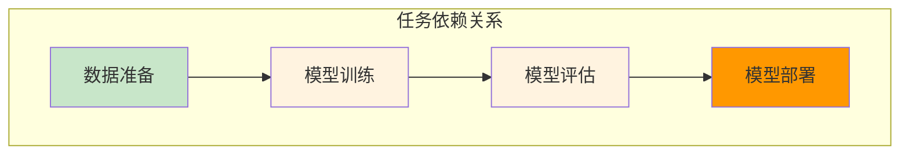

### 6.2 依赖配置示例

```yaml
# ============================================================
# 任务依赖配置示例
# ============================================================
apiVersion: batch.volcano.sh/v1alpha1
kind: Job
metadata:
  name: training-job
spec:
  depends:
    - name: data-prep-job      # 依赖数据准备任务
      status: Complete         # 状态必须完成
```

---

## 7. 业务场景应用

### 7.1 分布式训练场景

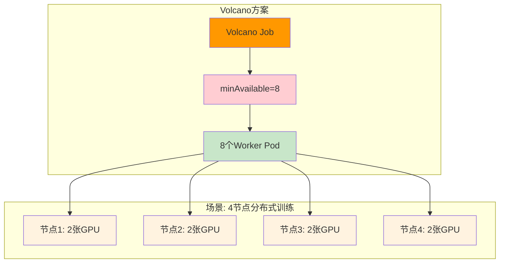

**配置要点：**

```yaml
# ============================================================
# 4节点8GPU分布式训练配置
# ============================================================
apiVersion: batch.volcano.sh/v1alpha1
kind: Job
metadata:
  name: distributed-training
spec:
  minAvailable: 8               # Gang调度：必须8个Pod同时可用
  queue: training-queue
  tasks:
    - replicas: 8
      name: worker
      template:
        spec:
          containers:
            - name: pytorch
              resources:
                limits:
                  nvidia.com/gpu: 1    # 每个Pod1张GPU
```

### 7.2 MPI分布式训练

```yaml
# ============================================================
# MPI分布式训练示例
# ============================================================
apiVersion: batch.volcano.sh/v1alpha1
kind: MPIJob
metadata:
  name: mpi-training
spec:
  minAvailable: 4               # 4个Worker必须同时可用
  queue: mpi-queue
  mpiReplicaSpecs:
    Launcher:
      replicas: 1
      template:
        spec:
          containers:
            - name: mpi-launcher
              image: mpi-image
    Worker:
      replicas: 4
      template:
        spec:
          containers:
            - name: mpi-worker
              resources:
                limits:
                  nvidia.com/gpu: 2
```

---

## 8. 最佳实践

### 8.1 minAvailable设置建议

| 任务类型 | minAvailable设置 | 原因 |
|----------|------------------|------|
| **严格分布式训练** | = replicas | 全部节点必须可用 |
| **弹性训练** | < replicas | 允许部分节点故障 |
| **单节点多GPU** | = 1 | 单节点即可 |

### 8.2 Queue配置建议

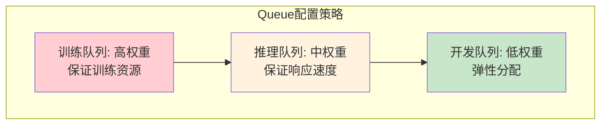

### 8.3 常见问题排查

| 问题 | 可能原因 | 解决方式 |
|------|----------|----------|
| Job一直Pending | minAvailable条件不满足 | 检查资源是否足够 |
| 部分Pod启动后等待 | Gang调度等待其他Pod | 正常现象，等待全部就绪 |
| 任务调度失败 | 资源碎片 | 检查minAvailable和资源总量 |
| 公平分享不生效 | 插件未启用 | 配置plugins启用share |

---

## 附录

### A. CRD字段速查

**Job核心字段：**

| 字段 | 类型 | 说明 |
|------|------|------|
| `spec.minAvailable` | int32 | Gang调度最小可用数 |
| `spec.tasks[].replicas` | int32 | 任务副本数 |
| `spec.queue` | string | 所属队列 |
| `spec.plugins` | []PluginConfig | 调度插件配置 |

**Queue核心字段：**

| 字段 | 类型 | 说明 |
|------|------|------|
| `spec.weight` | int64 | 队列权重 |
| `spec.capability` | string | 资源能力 |
| `spec.state` | QueueState | 队列状态 |

### B. 源码研读清单

| 文件 | 研读重点 | 预计时间 |
|------|----------|----------|
| `pkg/scheduler/plugins/gang/gang.go` | Gang调度实现 | 2小时 |
| `pkg/scheduler/plugins/share/share.go` | 公平分享算法 | 2小时 |
| `pkg/scheduler/framework/framework.go` | 调度框架 | 1小时 |
| `apis/batch/v1alpha1/*.go` | Job CRD定义 | 1小时 |

### C. 参考资料

- [Volcano官方文档](https://volcano.sh/en/docs/)
- [Volcano源码](https://github.com/volcano-sh/volcano)
- [Volcano设计文档](https://volcano.sh/en/docs/design/)

---

> 本文档详解了Volcano的Gang调度、公平分享算法和调度框架，建议结合源码研读深入理解实现细节。