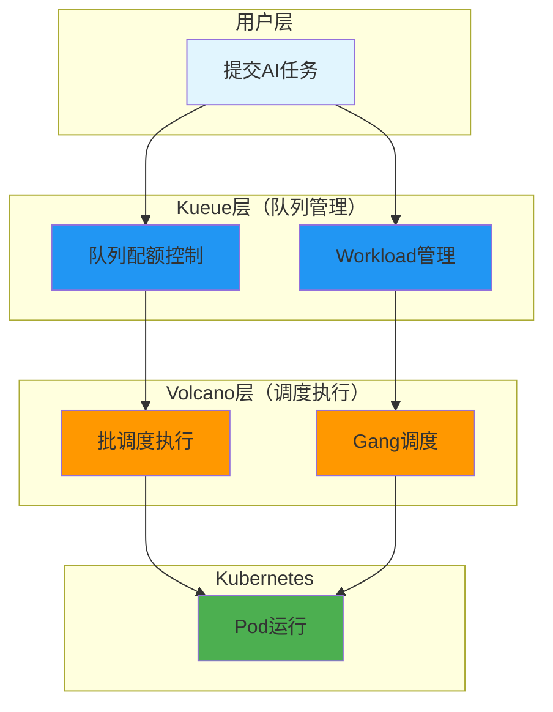

# Kueue + Volcano 结合方案

> 队列管理与批处理调度相结合，实现大规模AI训练集群的统一调度方案。

---

## 快速导航

| 文件 | 说明 |
|------|------|
| [docs/README.md](docs/README.md) | 📖 **完整学习文档** - 集成架构、协作流程、业务场景 |
| [manifests/01-integration.yaml](manifests/01-integration.yaml) | 集成配置示例 |
| [manifests/02-multi-cluster.yaml](manifests/02-multi-cluster.yaml) | 多集群调度示例 |

---

## 核心特性

```
┌─────────────────────────────────────────────────────────────────┐
│                Kueue+Volcano结合方案核心能力                      │
├─────────────────────────────────────────────────────────────────┤
│  ✅ 两层调度架构   - Kueue队列管理 + Volcano批调度执行             │
│  ✅ 统一调度入口   - 单一入口管理多种任务类型                      │
│  ✅ 资源配额控制   - Kueue管理团队配额                            │
│  ✅ 分布式调度     - Volcano保证Gang调度                          │
│  ✅ 混合场景支持   - 训练/推理/开发任务统一调度                    │
└─────────────────────────────────────────────────────────────────┘
```

---

## 集成架构



---

## 项目结构

```
kueue-volcano/
├── README.md                       # 概览：集成架构
├── docs/README.md                  # 详解：协作流程、业务场景
└── manifests/                      # 配置示例
    ├── 01-integration.yaml         # 集成配置
    └── 02-multi-cluster.yaml       # 多集群调度
```

---

## 使用示例

```yaml
# ============================================================
# 示例: Kueue管理Volcano Job
# ============================================================
apiVersion: batch.volcano.sh/v1alpha1
kind: Job
metadata:
  name: training-job
  annotations:
    # Kueue接管此Job的队列管理
    kueue.x-k8s.io/queue-name: training-local-queue
spec:
  minAvailable: 4    # Volcano负责Gang调度
  tasks:
    - replicas: 4
      name: worker
```

---

## 解决的核心问题

| 问题 | 结合方案 | 解决方式 |
|------|----------|----------|
| **多租户资源隔离** | Kueue配额 | ClusterQueue配额管理 |
| **分布式任务调度** | Volcano Gang | minAvailable保证 |
| **混合任务调度** | 两层分离 | 队列管理 + 执行分离 |
| **大规模集群** | 统一框架 | 单一调度入口 |

---

## 业务场景题

**场景：百节点GPU集群混合工作负载调度**

> 百节点GPU集群同时支持：大模型训练（独占多节点）、推理服务（低延迟）、开发调试（交互式）。

**一句话提示：**
> Kueue管理三类任务的队列配额（训练高配额、推理中配额、开发低配额），Volcano处理训练任务的Gang调度，实现队列管理与调度执行分离。

详见 **[docs/README.md](docs/README.md)** 获取集成架构详解和业务场景应用。