# Kueue + Volcano结合方案详解

> 理解两层调度架构的协作流程，掌握大规模AI训练集群的统一调度方案设计。

---

## 目录

- [1. 概述](#1-概述)
- [2. 集成架构](#2-集成架构)
- [3. 协作流程](#3-协作流程)
- [4. 配置方式](#4-配置方式)
- [5. 业务场景应用](#5-业务场景应用)
- [6. 最佳实践](#6-最佳实践)
- [附录](#附录)

---

## 1. 概述

### 1.1 为什么需要结合方案

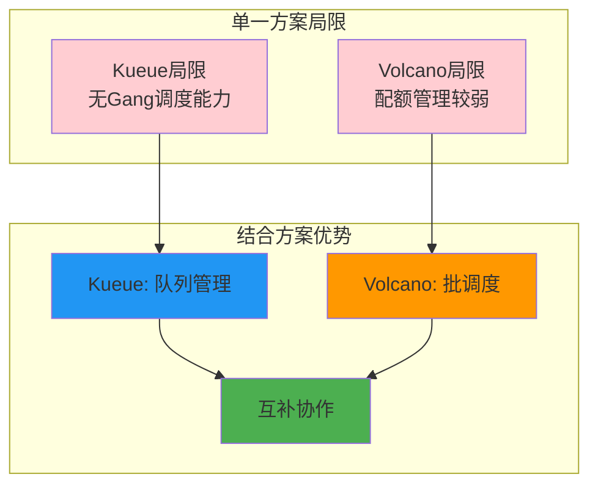

**单一方案局限：**

| 方案 | 局限 | 缺失能力 |
|------|------|----------|
| **Kueue** | 无Gang调度 | 分布式训练同时启动保证 |
| **Volcano** | 配额管理较弱 | 多租户公平分配、抢占 |

### 1.2 结合方案价值

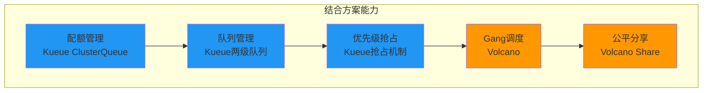

### 1.3 适用场景

| 场景 | 结合方案优势 |
|------|-------------|
| **大规模训练集群** | 配额管理 + Gang调度 |
| **多租户GPU集群** | 公平分配 + 抢占 |
| **混合工作负载** | 统一调度入口 |
| **跨节点分布式训练** | 队列管理 + 同时启动保证 |

---

## 2. 集成架构

### 2.1 两层调度架构

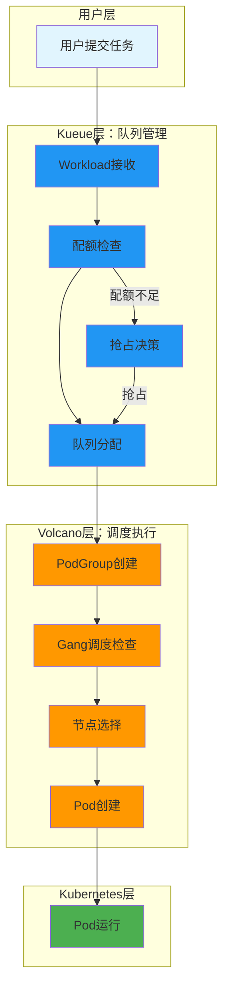

### 2.2 职责分离

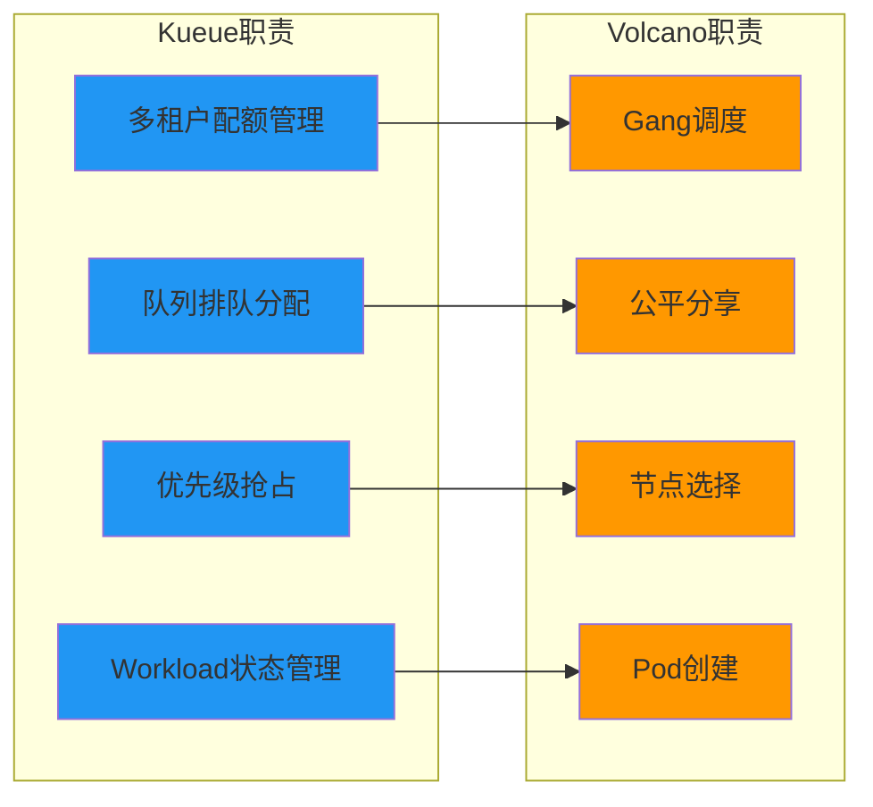

| 层级 | 职责 | 关注点 |
|------|------|--------|
| **Kueue** | 队列管理、配额控制 | 多租户公平分配 |
| **Volcano** | 批调度执行 | 任务调度语义 |

### 2.3 组件交互

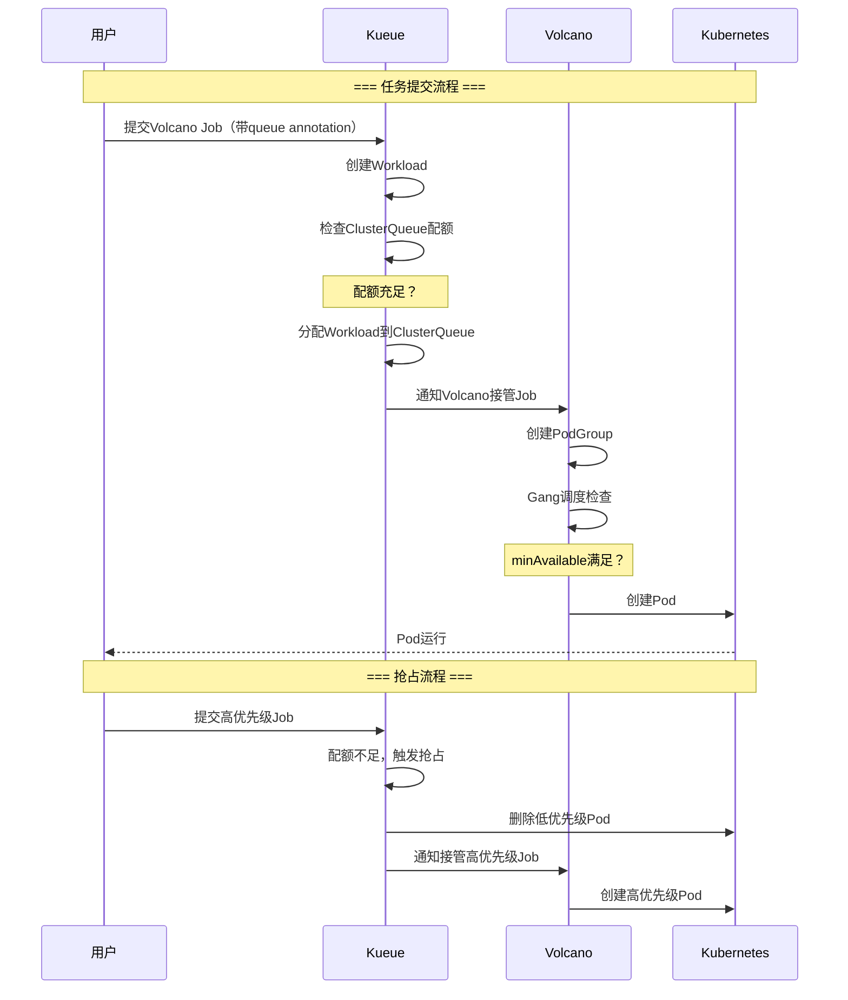

---

## 3. 协作流程

### 3.1 任务提交流程

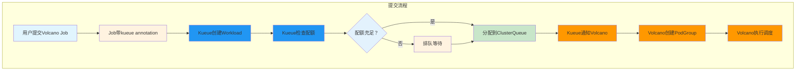

### 3.2 Gang调度协作

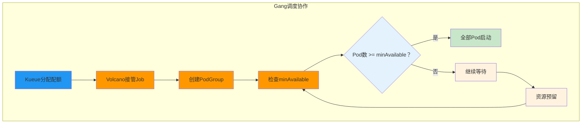

### 3.3 抢占协作

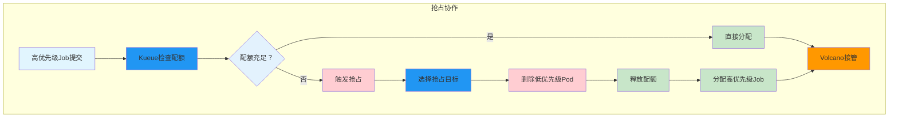

---

## 4. 配置方式

### 4.1 Kueue配置

```yaml
# ============================================================
# ClusterQueue: 配额管理
# ============================================================
apiVersion: kueue.x-k8s.io/v1beta1
kind: ClusterQueue
metadata:
  name: training-cluster-queue
spec:
  namespaceSelector:
    matchLabels:
      purpose: training

  cohort: gpu-cohort

  resourceGroups:
    - coveredResources: ["nvidia.com/gpu"]
      flavors:
        - name: default-flavor
          resources:
            - name: "nvidia.com/gpu"
              nominalQuota: 50
              borrowingLimit: 20

  preemption:
    reclaimWithinCohort: Any
    withinClusterQueue: LowerPriority
```

### 4.2 Volcano Job配置

```yaml
# ============================================================
# Volcano Job: Kueue接管队列管理
# ============================================================
apiVersion: batch.volcano.sh/v1alpha1
kind: Job
metadata:
  name: distributed-training
  annotations:
    # ============================================================
    # Kueue接管此Job的队列管理
    # ============================================================
    kueue.x-k8s.io/queue-name: training-local-queue
spec:
  # ============================================================
  # Volcano负责Gang调度
  # ============================================================
  minAvailable: 8

  plugins:
    gang:
      minAvailable: 8

  tasks:
    - replicas: 8
      name: worker
      template:
        spec:
          containers:
            - name: pytorch
              resources:
                limits:
                  nvidia.com/gpu: 1
```

### 4.3 LocalQueue配置

```yaml
# ============================================================
# LocalQueue: 命名空间提交入口
# ============================================================
apiVersion: kueue.x-k8s.io/v1beta1
kind: LocalQueue
metadata:
  name: training-local-queue
  namespace: training-ns
spec:
  clusterQueue: training-cluster-queue
```

---

## 5. 业务场景应用

### 5.1 百节点混合工作负载

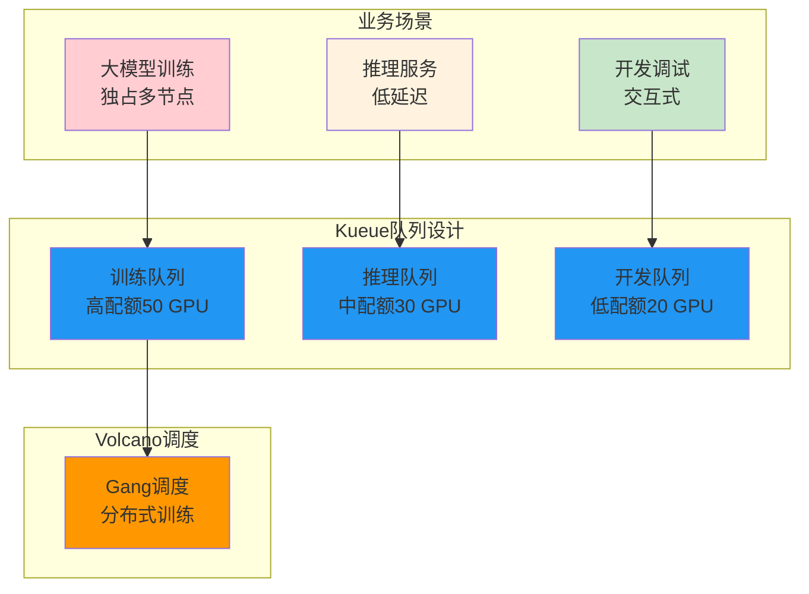

**配置方案：**

```yaml
# ============================================================
# 训练队列：高配额，支持Gang调度
# ============================================================
apiVersion: kueue.x-k8s.io/v1beta1
kind: ClusterQueue
metadata:
  name: training-queue
spec:
  cohort: shared-cohort
  resourceGroups:
    - flavors:
        - resources:
            - name: "nvidia.com/gpu"
              nominalQuota: 50

---
# ============================================================
# 推理队列：中配额，优先级抢占
# ============================================================
apiVersion: kueue.x-k8s.io/v1beta1
kind: ClusterQueue
metadata:
  name: inference-queue
spec:
  cohort: shared-cohort
  resourceGroups:
    - flavors:
        - resources:
            - name: "nvidia.com/gpu"
              nominalQuota: 30

  preemption:
    reclaimWithinCohort: LowerPriority

---
# ============================================================
# 开发队列：低配额，可被抢占
# ============================================================
apiVersion: kueue.x-k8s.io/v1beta1
kind: ClusterQueue
metadata:
  name: dev-queue
spec:
  cohort: shared-cohort
  resourceGroups:
    - flavors:
        - resources:
            - name: "nvidia.com/gpu"
              nominalQuota: 20

  preemption:
    reclaimWithinCohort: Never
```

### 5.2 分布式训练场景

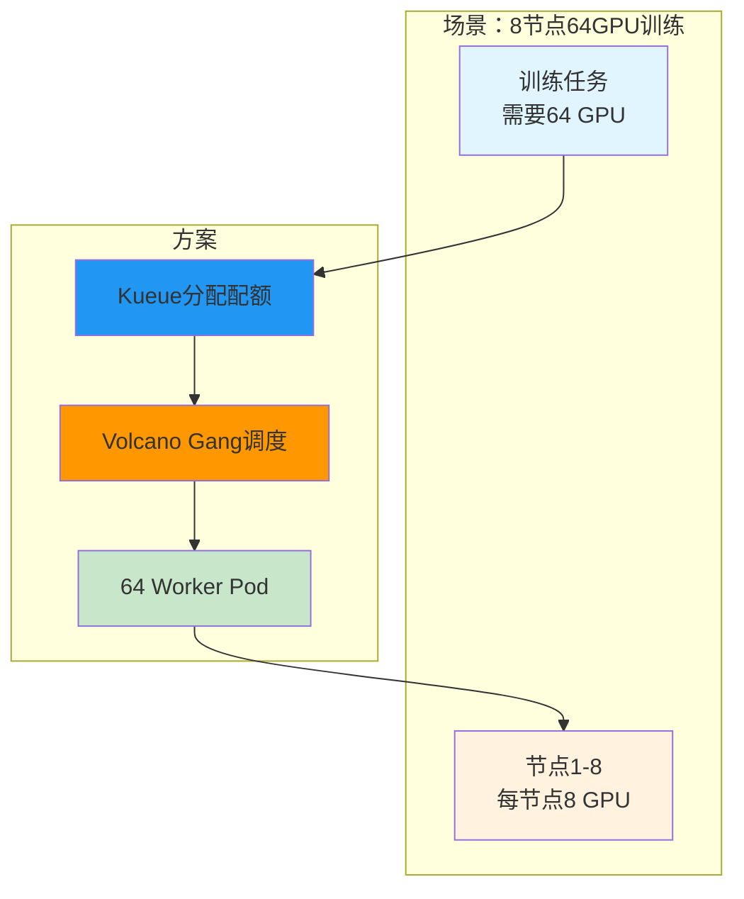

**配置方案：**

```yaml
# ============================================================
# 8节点64GPU分布式训练
# ============================================================
apiVersion: batch.volcano.sh/v1alpha1
kind: Job
metadata:
  name: large-scale-training
  annotations:
    kueue.x-k8s.io/queue-name: training-queue
spec:
  minAvailable: 64           # Gang调度：必须64个Pod同时可用
  tasks:
    - replicas: 64
      name: worker
      template:
        spec:
          containers:
            - name: pytorch
              resources:
                limits:
                  nvidia.com/gpu: 1    # 每个Pod1张GPU
```

### 5.3 多租户场景

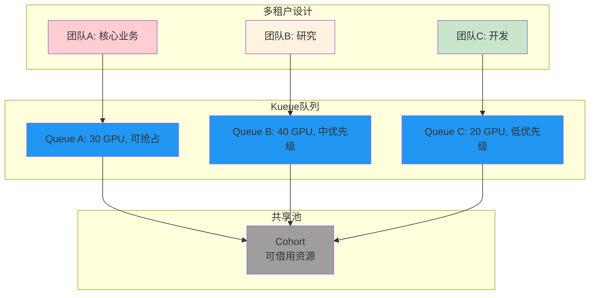

---

## 6. 最佳实践

### 6.1 配额设计建议

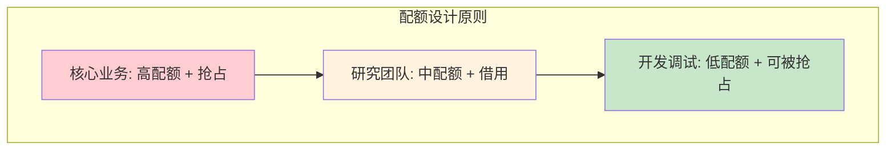

| 团队类型 | 配额策略 | 抢占策略 |
|----------|----------|----------|
| **核心业务** | nominalQuota ≥ 日常需求 | reclaimWithinCohort: Any |
| **研究团队** | nominalQuota + borrowingLimit | reclaimWithinCohort: LowerPriority |
| **开发调试** | 仅borrowingLimit | reclaimWithinCohort: Never |

### 6.2 Gang调度配置建议

| 任务类型 | minAvailable设置 | 说明 |
|----------|------------------|------|
| **严格分布式训练** | = 总Pod数 | 全部节点必须可用 |
| **弹性训练** | < 总Pod数 | 允许部分节点故障 |
| **单节点多GPU** | = 1 | 单节点即可 |

### 6.3 常见问题排查

| 问题 | 可能原因 | 解决方式 |
|------|----------|----------|
| Job一直Pending | Kueue配额不足 | 检查ClusterQueue配额 |
| Gang调度等待 | minAvailable不满足 | 检查资源是否足够 |
| Volcano未接管 | annotation缺失 | 添加kueue annotation |
| 抢占未触发 | preemption策略 | 检查preemption配置 |

---

## 附录

### A. 集成配置清单

| 配置项 | 来源 | 说明 |
|--------|------|------|
| ClusterQueue | Kueue | 团队配额 |
| LocalQueue | Kueue | 提交入口 |
| Volcano Job | Volcano | 批处理任务 |
| kueue annotation | Volcano Job | 关联LocalQueue |

### B. 参考资料

- [Kueue官方文档](https://kueue.sigs.k8s.io/docs/)
- [Volcano官方文档](https://volcano.sh/en/docs/)
- [Volcano-Kueue集成](https://volcano.sh/en/docs/integration/kueue/)

---

> 本文档详解了Kueue+Volcano结合方案的两层调度架构和协作流程，建议结合业务场景设计具体配置方案。