# AI任务调度学习指导文档

> 系统梳理 Kueue + Volcano 知识体系，明确学习重点、开源项目指引和分层学习路径。

---

## 目录

- [1. 知识体系总览](#1-知识体系总览)
- [2. 知识点分类矩阵](#2-知识点分类矩阵)
- [3. 开源项目学习指引](#3-开源项目学习指引)
- [4. 分层学习建议](#4-分层学习建议)
- [5. Kueue核心知识点](#5-kueue核心知识点)
- [6. Volcano核心知识点](#6-volcano核心知识点)
- [7. 结合方案核心知识点](#7-结合方案核心知识点)
- [8. 业务场景映射](#8-业务场景映射)
- [9. 学习路线图](#9-学习路线图)
- [附录](#附录)

---

## 1. 知识体系总览

### 1.1 技术栈定位

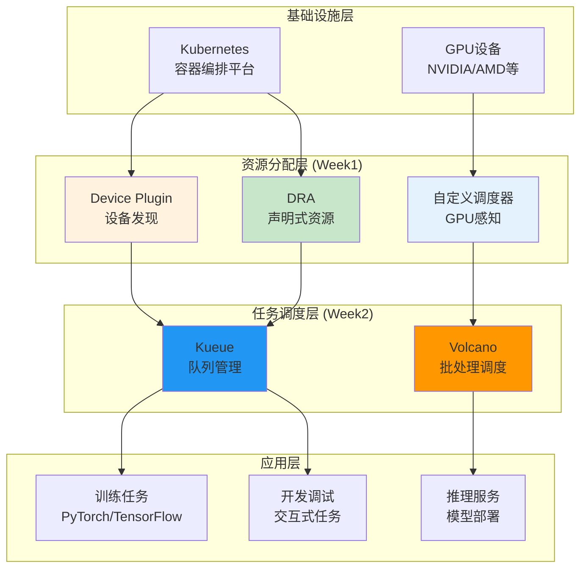

### 1.2 Week1与Week2的关系

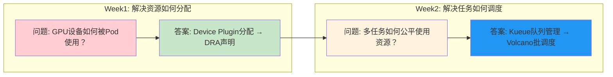

| 维度 | Week1 资源分配 | Week2 任务调度 |
|------|---------------|---------------|
| **核心问题** | GPU设备如何分配给Pod | 多任务如何公平使用GPU |
| **解决层面** | 设备层（节点本地） | 任务层（集群全局） |
| **关键技术** | Device Plugin、DRA、调度框架 | Kueue、Volcano |
| **业务价值** | 使GPU可被容器使用 | 使GPU资源高效利用 |

---

## 2. 知识点分类矩阵

### 2.1 四级分类体系

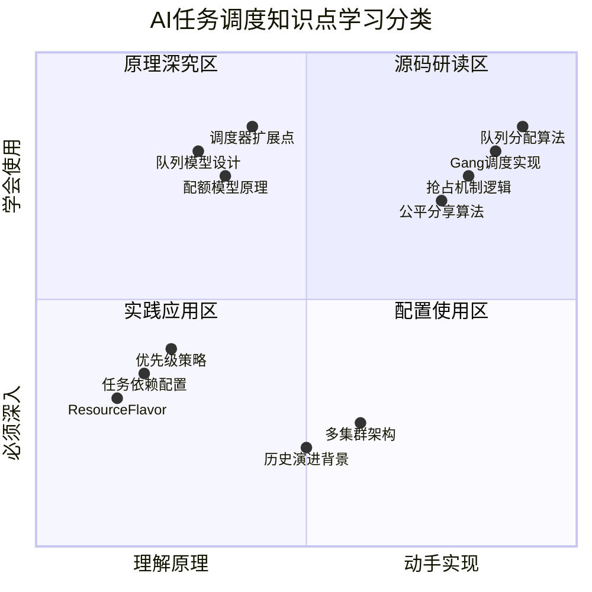

### 2.2 详细分类表

#### 🔴 必须深入实现（源码研读区）

| 知识点 | 所属项目 | 研读重点 | 学习价值 |
|--------|----------|----------|----------|
| **队列分配算法** | Kueue | `scheduler.go` 分配逻辑 | 理解如何选择最优队列分配 |
| **抢占机制实现** | Kueue | `preemption.go` 抢占逻辑 | 理解高优先级任务如何获取资源 |
| **Gang调度实现** | Volcano | `gang_scheduler.go` | 理解All-or-Nothing调度语义 |
| **公平分享算法** | Volcano | `share_scheduler.go` | 理解DRF/SSJ公平分配算法 |
| **调度器插件扩展** | Volcano | `plugins/` 目录 | 理解如何扩展调度能力 |

**源码研读路径：**

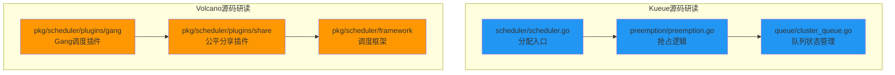

#### 🟠 需要理解原理（原理深究区）

| 知识点 | 原理说明 | 理解重点 |
|--------|----------|----------|
| **队列模型设计** | ClusterQueue + LocalQueue两级模型 | 理解为什么要分两级 |
| **配额模型原理** | nominalQuota + borrowingLimit | 理解配额与借用的关系 |
| **Cohort机制** | 队列组共享资源池 | 理解跨队列资源共享 |
| **PodGroup语义** | 一组Pod必须同时调度 | 理解分布式训练调度需求 |
| **优先级模型** | PriorityClass + preempting | 理解抢占决策逻辑 |

**原理理解要点：**

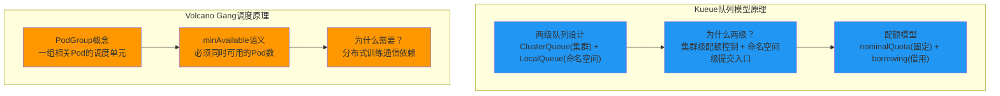

#### 🟢 学会配置使用（配置使用区）

| 配置项 | 所属项目 | 使用场景 | 配置重点 |
|--------|----------|----------|----------|
| **ClusterQueue配置** | Kueue | 团队配额管理 | nominalQuota、flavor配置 |
| **LocalQueue配置** | Kueue | 命名空间提交入口 | 关联ClusterQueue |
| **Workload提交** | Kueue | 任务提交 | resourceRequests、优先级 |
| **Queue配置** | Volcano | 队列能力分配 | weight、capability |
| **Job配置** | Volcano | 批处理任务 | minAvailable、tasks |
| **PodGroup配置** | Volcano | Gang调度 | minMember、queue |

**配置示例速查：**

```yaml
# ============================================================
# Kueue核心配置要素
# ============================================================
# ClusterQueue: 团队配额
spec:
  resourceGroups:
    - flavors:
        - resources:
            - name: "nvidia.com/gpu"
              nominalQuota: 10        # 固定配额
              borrowingLimit: 5       # 可借用上限

# ============================================================
# Volcano核心配置要素
# ============================================================
# Job: 批处理任务
spec:
  minAvailable: 4                     # Gang调度：必须4个Pod
  queue: "training-queue"             # 指定队列
  tasks:
    - replicas: 4                     # Pod数量
```

#### ⚪ 认知了解（背景了解区）

| 内容 | 了解价值 | 学习方式 |
|------|----------|----------|
| **历史演进背景** | 理解技术发展脉络 | 阅读官方博客、论文 |
| **多集群调度架构** | 了解跨集群调度方案 | 阅读Kueue多集群文档 |
| **其他调度系统对比** | 了解YARN/Slurm等 | 对比分析文章 |
| **社区发展趋势** | 了解未来发展方向 | 关注CNCF项目动态 |

---

## 3. 开源项目学习指引

### 3.1 项目分类

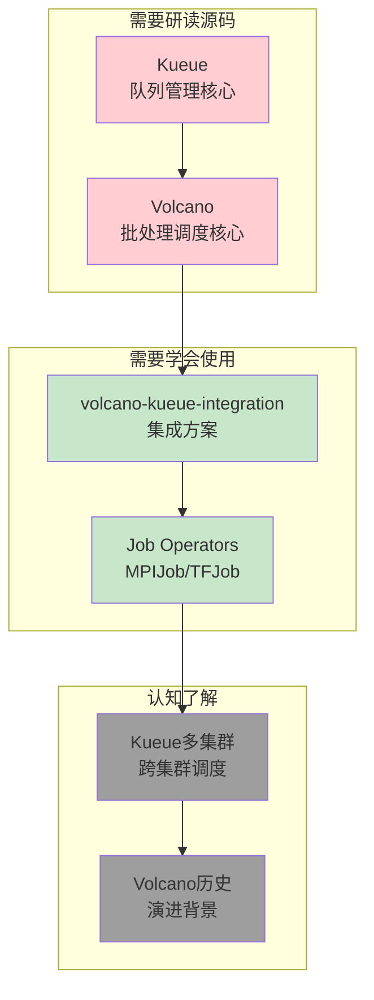

### 3.2 详细指引表

#### 需要研读源码的项目

| 项目 | GitHub链接 | 研读重点 | 研读哪些部分 |
|------|------------|----------|-------------|
| **Kueue** | https://github.com/kubernetes-sigs/kueue | 队列分配、抢占机制 | `pkg/scheduler/`, `pkg/preemption/` |
| **Volcano** | https://github.com/volcano-sh/volcano | Gang调度、公平分享 | `pkg/scheduler/plugins/` |

**Kueue源码研读清单：**

| 文件路径 | 研读内容 | 解决的问题 |
|----------|----------|------------|
| `pkg/scheduler/scheduler.go` | 分配算法入口 | 理解Workload如何被分配到ClusterQueue |
| `pkg/preemption/preemption.go` | 抢占逻辑实现 | 理解高优先级任务如何抢占资源 |
| `pkg/queue/cluster_queue.go` | 队列状态管理 | 理解配额计算和状态维护 |
| `pkg/workload/workload.go` | Workload生命周期 | 理解任务状态变迁 |
| `apis/kueue/v1beta1/` | CRD定义 | 理解API设计思路 |

**Volcano源码研读清单：**

| 文件路径 | 研读内容 | 解决的问题 |
|----------|----------|------------|
| `pkg/scheduler/plugins/gang/gang.go` | Gang调度插件 | 理解All-or-Nothing调度实现 |
| `pkg/scheduler/plugins/share/share.go` | 公平分享插件 | 理解DRF/SSJ算法实现 |
| `pkg/scheduler/plugins/priority/` | 优先级插件 | 理解优先级调度逻辑 |
| `pkg/scheduler/framework/framework.go` | 调度框架 | 理解插件扩展点设计 |
| `apis/batch/v1alpha1/` | Job CRD定义 | 理解批处理Job API设计 |

#### 需要学会使用的项目

| 项目 | GitHub链接 | 使用场景 | 学习重点 |
|------|------------|----------|----------|
| **volcano-kueue-integration** | https://github.com/volcano-sh/volcano | Volcano集成Kueue | 配置方式、兼容性处理 |
| **MPIJob Operator** | https://github.com/kubeflow/mpi-operator | MPI分布式训练 | Job提交、配置参数 |
| **TFJob Operator** | https://github.com/kubeflow/tf-training-operator | TensorFlow训练 | Job提交、Worker/PS配置 |

#### 认知了解的内容

| 内容 | 了解价值 | 参考资源 |
|------|----------|----------|
| **Kueue多集群调度** | 了解跨集群资源调度方案 | Kueue官方多集群文档 |
| **Volcano演进历史** | 理解批处理调度发展脉络 | Volcano设计文档 |
| **调度系统对比** | 了解不同调度系统特点 | YARN vs Kubernetes对比文章 |

---

## 4. 分层学习建议

### 4.1 四层学习模型

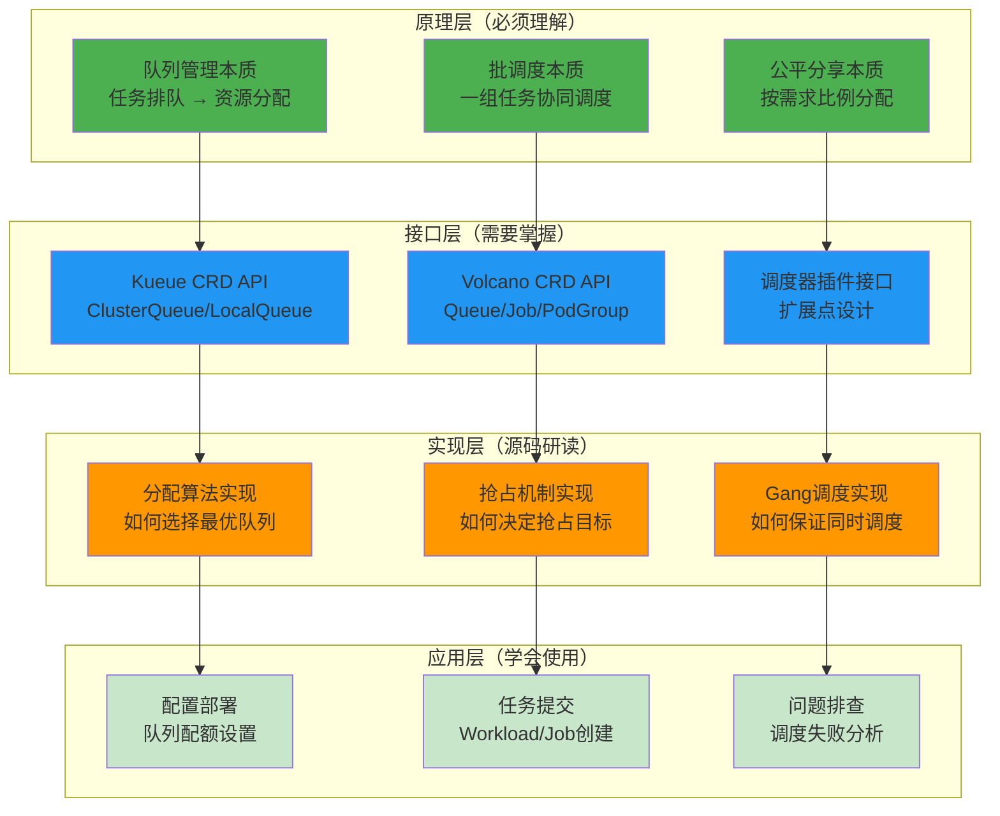

### 4.2 学习优先级

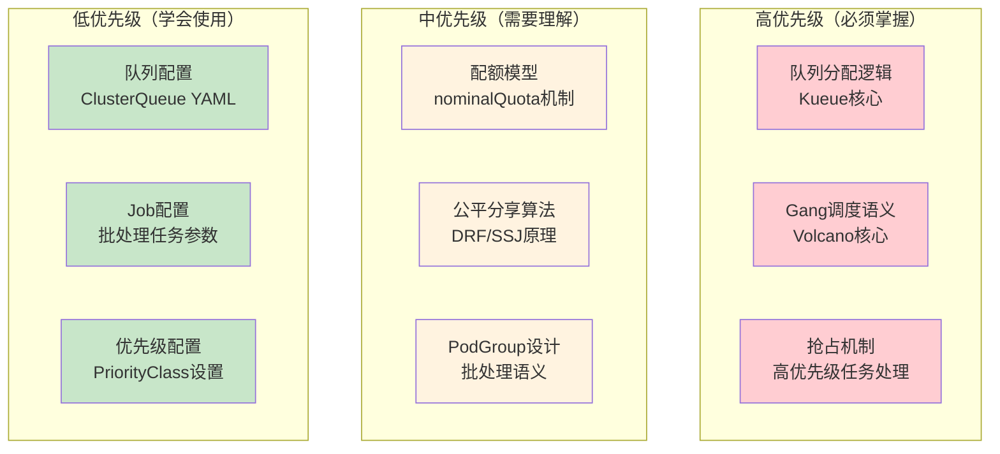

### 4.3 各层级学习方式

| 学习层级 | 推荐方式 | 时间占比 | 目标 |
|----------|----------|----------|------|
| **原理层** | 阅读设计文档、思考本质问题 | 20% | 理解设计动机和核心概念 |
| **接口层** | 阅读API定义、编写示例配置 | 25% | 掌握CRD结构和配置方法 |
| **实现层** | 研读源码、理解关键算法 | 35% | 理解核心实现细节 |
| **应用层** | 实际部署、调试问题 | 20% | 解决实际问题 |

---

## 5. Kueue核心知识点

### 5.1 组件架构

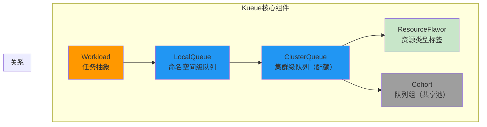

### 5.2 知识点详解

| 知识点 | 学习分类 | 学习重点 | 解决的问题 |
|--------|----------|----------|------------|
| **ClusterQueue** | 🟢 配置使用 | 配额配置、flavor选择 | 团队级别资源配额 |
| **LocalQueue** | 🟢 配置使用 | 关联ClusterQueue | 命名空间提交入口 |
| **Workload** | 🟠 理解原理 | 状态变迁、优先级 | 任务抽象和调度状态 |
| **队列分配算法** | 🔴 源码研读 | 分配决策逻辑 | 如何选择最优队列 |
| **抢占机制** | 🔴 源码研读 | 抢占目标选择 | 高优先级任务获取资源 |
| **Cohort共享** | 🟠 理解原理 | 跨队列借用机制 | 团队间资源共享 |
| **ResourceFlavor** | 🟢 配置使用 | 资源类型标签 | 区分不同GPU类型 |

### 5.3 核心流程

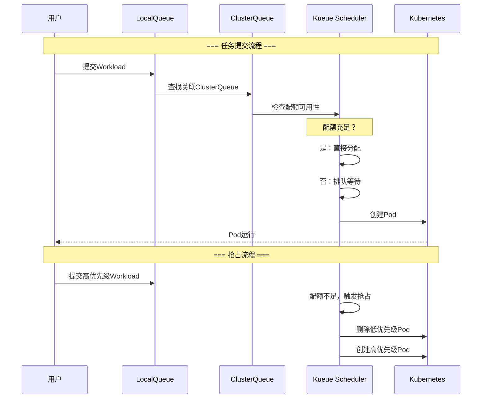

---

## 6. Volcano核心知识点

### 6.1 组件架构

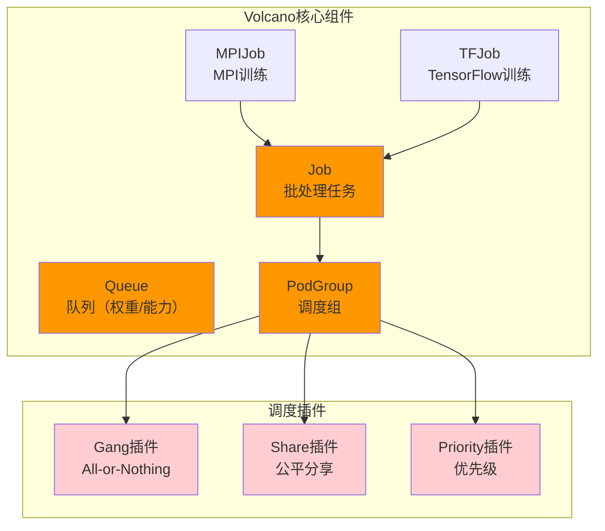

### 6.2 知识点详解

| 知识点 | 学习分类 | 学习重点 | 解决的问题 |
|--------|----------|----------|------------|
| **Queue** | 🟢 配置使用 | 权重、能力配置 | 队列级别资源分配 |
| **Job** | 🟢 配置使用 | tasks、minAvailable | 批处理任务定义 |
| **PodGroup** | 🔴 源码研读 | minMember、调度状态 | Gang调度核心语义 |
| **Gang调度** | 🔴 源码研读 | 算法实现 | All-or-Nothing调度保证 |
| **公平分享** | 🔴 源码研读 | DRF/SSJ算法 | 按需求比例公平分配 |
| **调度框架** | 🔴 源码研读 | 插件扩展点 | 如何扩展调度能力 |
| **MPIJob/TFJob** | 🟢 学会使用 | 配置和提交 | 分布式训练任务 |

### 6.3 Gang调度核心流程

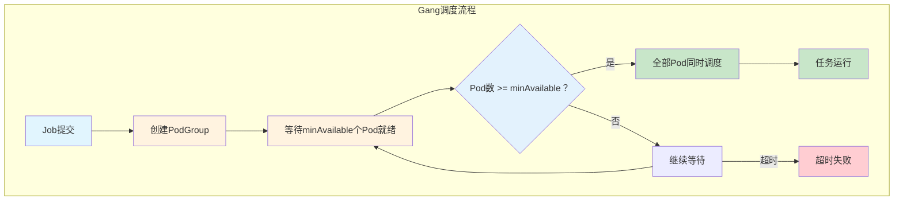

---

## 7. 结合方案核心知识点

### 7.1 集成架构

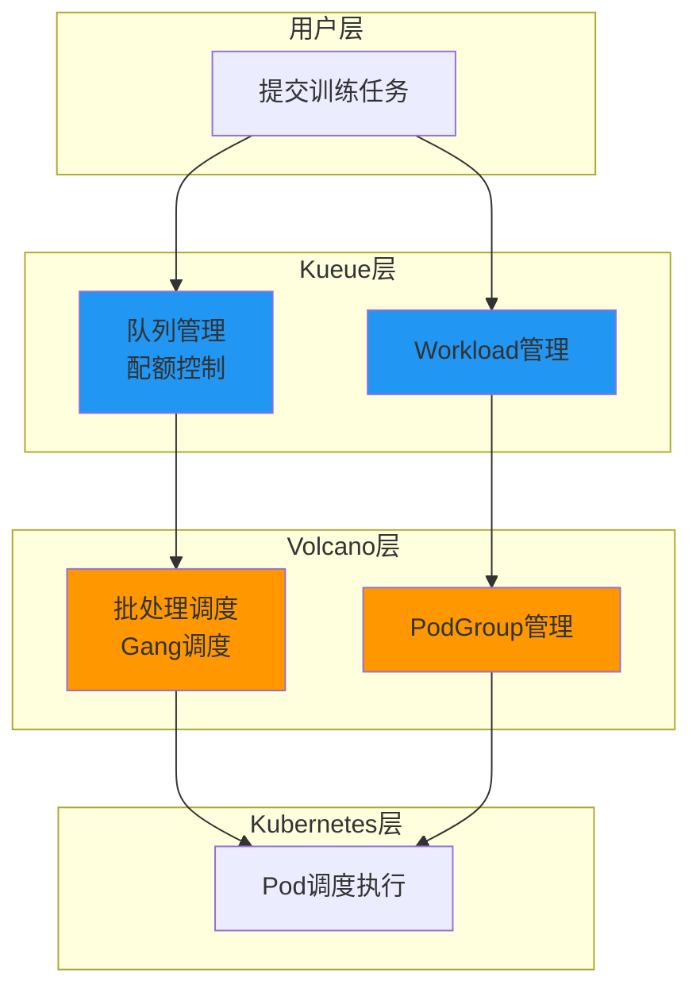

### 7.2 知识点详解

| 知识点 | 学习分类 | 学习重点 | 解决的问题 |
|--------|----------|----------|------------|
| **集成方式** | 🟢 学会使用 | 配置集成参数 | Kueue + Volcano协作 |
| **调度流程** | 🟠 理解原理 | 两层调度协作 | 队列管理 + 批调度分离 |
| **Workload映射** | 🟠 理解原理 | Workload → Job转换 | 任务抽象转换 |
| **大规模场景** | 🟢 配置使用 | 配额 + Gang结合 | 百节点训练集群 |

---

## 8. 业务场景映射

### 8.1 场景与方案对应

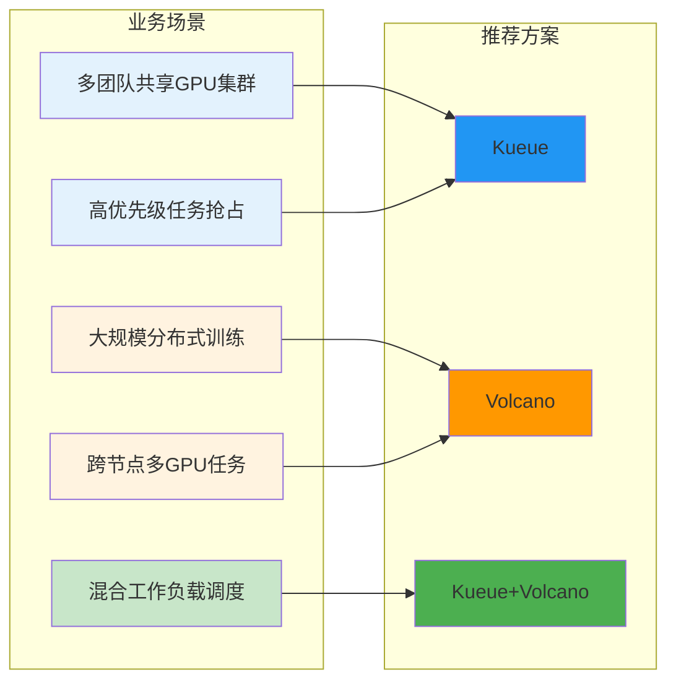

### 8.2 场景详解

| 场景 | 核心需求 | 推荐方案 | 关键能力 |
|------|----------|----------|----------|
| **多团队共享GPU集群** | 配额隔离、公平分配 | Kueue | ClusterQueue配额、优先级抢占 |
| **大规模分布式训练** | 多GPU协同、同时调度 | Volcano | Gang调度、minAvailable保证 |
| **混合工作负载调度** | 多类型任务统一管理 | Kueue+Volcano | 队列管理 + 批处理调度 |
| **高优先级任务抢占** | 紧急任务快速获取资源 | Kueue | PriorityClass、抢占机制 |
| **跨节点多GPU任务** | All-or-Nothing调度 | Volcano | PodGroup、minMember |

### 8.3 业务场景思考题

---

#### 场景一：多团队共享GPU集群的公平分配

**问题描述：**
公司GPU集群有100张GPU，需要支持3个团队：核心业务团队（需要高优先级）、研究团队（需要公平分配）、临时任务团队（低优先级、可抢占）。

**一句话提示：**
> 用Kueue的ClusterQueue为每个团队设置配额，Cohort实现资源共享，PriorityClass定义优先级层级。

**思考维度：**
- 如何设计配额模型？
- 如何实现团队间资源共享？
- 抢占策略如何配置？

---

#### 场景二：大模型训练的跨节点多GPU调度

**问题描述：**
大模型训练任务需要跨4个节点、每节点2张GPU，共8张GPU协同训练。如何保证调度成功率？

**一句话提示：**
> 用Volcano的Job定义minAvailable=8，Gang调度保证8个Pod同时可用才启动。

**思考维度：**
- Gang调度如何保证All-or-Nothing？
- minAvailable如何设置？
- 如何处理部分节点资源不足？

---

#### 场景三：百节点GPU集群混合工作负载调度

**问题描述：**
百节点GPU集群同时支持：大模型训练（独占多节点）、推理服务（低延迟）、开发调试（交互式）。

**一句话提示：**
> 用Kueue管理队列配额，Volcano处理批调度，分离队列管理和调度执行。

**思考维度：**
- 如何设计统一调度框架？
- 不同任务类型如何分配资源？
- 如何保证服务质量？

---

## 9. 学习路线图

### 9.1 推荐学习顺序

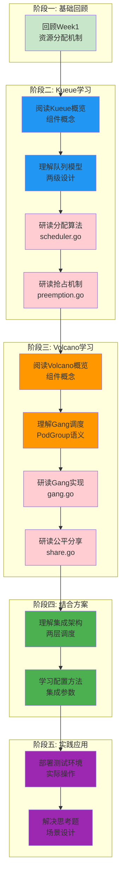

### 9.2 时间分配建议

| 学习阶段 | 内容 | 预计时间 | 学习方式 |
|----------|------|----------|----------|
| **阶段一** | Week1回顾 | 1小时 | 阅读文档 |
| **阶段二** | Kueue学习 | 6小时 | 文档 + 源码 |
| **阶段三** | Volcano学习 | 6小时 | 文档 + 源码 |
| **阶段四** | 结合方案 | 3小时 | 文档 + 配置 |
| **阶段五** | 实践应用 | 4小时 | 实际部署 |
| **总计** | | **20小时** | |

---

## 附录

### A. 开源项目链接汇总

| 项目 | 链接 | 学习方式 |
|------|------|----------|
| Kueue | https://github.com/kubernetes-sigs/kueue | 🔴 研读源码 |
| Volcano | https://github.com/volcano-sh/volcano | 🔴 研读源码 |
| volcano-kueue-integration | Volcano集成文档 | 🟢 学会使用 |
| MPIJob Operator | https://github.com/kubeflow/mpi-operator | 🟢 学会使用 |
| TFJob Operator | https://github.com/kubeflow/tf-training-operator | 🟢 学会使用 |

### B. 源码研读重点文件

**Kueue：**
- `pkg/scheduler/scheduler.go` - 分配入口
- `pkg/preemption/preemption.go` - 抢占逻辑
- `pkg/queue/cluster_queue.go` - 队列状态
- `apis/kueue/v1beta1/*.go` - CRD定义

**Volcano：**
- `pkg/scheduler/plugins/gang/gang.go` - Gang调度
- `pkg/scheduler/plugins/share/share.go` - 公平分享
- `pkg/scheduler/framework/framework.go` - 调度框架
- `apis/batch/v1alpha1/*.go` - Job CRD

### C. 参考资料

- [Kueue官方文档](https://kueue.sigs.k8s.io/docs/)
- [Volcano官方文档](https://volcano.sh/en/docs/)
- [Kubernetes调度框架](https://kubernetes.io/docs/concepts/scheduling-eviction/scheduling-framework/)
- [CNCF批量调度白皮书](https://www.cncf.io/blog/2023/11/27/batch-scheduling-in-kubernetes/)

---

> 本学习指导文档明确了知识点分类、开源项目研读指引和分层学习路径，建议按阶段顺序学习，重点研读源码部分。