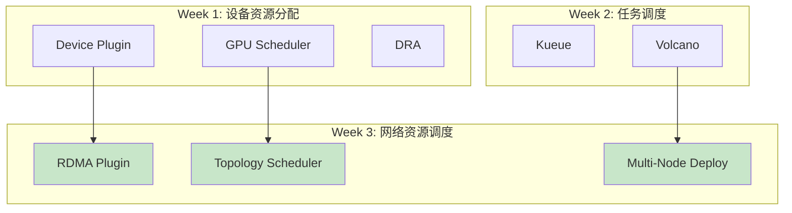
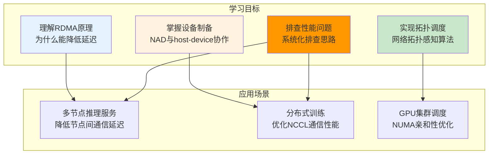
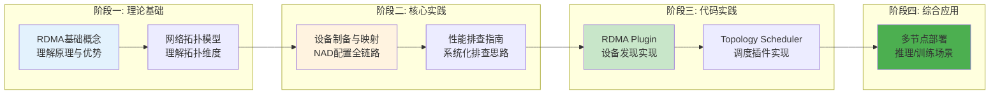
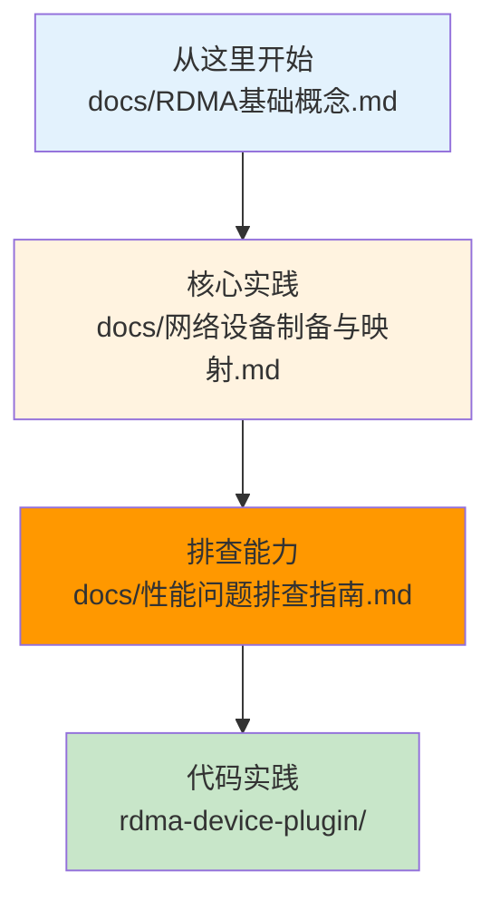

# Kubernetes 高性能网络调度专题

> 从 RDMA 网卡资源管理到拓扑感知调度，系统学习 Kubernetes 高性能网络在 AI 推理/训练场景中的应用。

---

## 学习系列总览

本项目是 Kubernetes AI Infra 学习系列的第三周内容，聚焦高性能网络资源调度：



---

## 快速导航

| 文档 | 核心内容 | 学习重点 |
|------|----------|----------|
| [docs/RDMA基础概念.md](docs/RDMA基础概念.md) | 📖 **理论基础** - RDMA/RoCE/IB 原理与场景 | 零拷贝、内核旁路、延迟优势 |
| [docs/网络设备制备与映射.md](docs/网络设备制备与映射.md) | ⭐ **核心实践** - NAD 与 host-device 协作 | 设备发现→NAD配置→Pod注入完整链路 |
| [docs/性能问题排查指南.md](docs/性能问题排查指南.md) | ⭐ **核心实践** - 系统化排查思路与工具 | 延迟/带宽问题的根因定位 |
| [docs/网络拓扑模型.md](docs/网络拓扑模型.md) | 📖 **理论基础** - NUMA/机架/交换机拓扑 | 拓扑感知调度的核心模型 |
| [docs/最佳实践总结.md](docs/最佳实践总结.md) | 📋 **实践总结** - 场景化配置建议 | 推理/训练场景的网络优化 |

| 子项目 | 核心技术 | 学习文档 |
|------|----------|----------|
| [rdma-device-plugin/](rdma-device-plugin/) | RDMA 设备发现与分配 | [docs/README.md](rdma-device-plugin/docs/README.md) |
| [network-topology-scheduler/](network-topology-scheduler/) | 网络拓扑感知调度 | [docs/README.md](network-topology-scheduler/docs/README.md) |
| [multi-node-deployment/](multi-node-deployment/) | 多节点部署实践 | [docs/README.md](multi-node-deployment/docs/README.md) |

---

## 核心特性

```
┌─────────────────────────────────────────────────────────────────────────┐
│                    高性能网络调度核心能力                                  │
├─────────────────────────────────────────────────────────────────────────┤
│  ✅ RDMA资源管理     - 在K8s中发现和管理IB/RoCE网卡资源                     │
│  ✅ 设备制备映射     - 从物理网卡到Pod内设备的完整配置链路                   │
│  ✅ 拓扑感知调度     - NUMA/机架/交换机维度优化部署位置                      │
│  ✅ 性能问题排查     - 系统化排查延迟/带宽问题的思路和工具                   │
│  ✅ 多节点低延迟     - 为推理/训练服务绑定高性能网卡降低通信延迟              │
└─────────────────────────────────────────────────────────────────────────┘
```

---

## 技术定位



---

## 项目结构

```
week3-高性能网络调度/
│
├── docs/                              # 📖 理论文档
│   ├── RDMA基础概念.md                 # RDMA/RoCE/IB原理
│   ├── 网络设备制备与映射.md            # ⭐ NAD与host-device协作（重点）
│   ├── 性能问题排查指南.md              # ⭐ 系统化排查思路（重点）
│   ├── 网络拓扑模型.md                 # NUMA/机架/交换机拓扑
│   └── 最佳实践总结.md                 # 场景化配置建议
│
├── rdma-device-plugin/               # 🔧 RDMA设备管理
│   ├── README.md                     # 概览：组件与特性
│   ├── docs/README.md                # 详解：设备发现与分配
│   ├── pkg/
│   │   ├── plugin/plugin.go         # Device Plugin实现
│   │   └── device/rdma.go           # RDMA设备发现
│   ├── manifests/
│   │   ├── 01-rdma-device-class.yaml
│   │   ├── 02-device-plugin.yaml
│   │   └── 03-pod-with-rdma.yaml
│   └── go.mod
│
├── network-topology-scheduler/       # 🔧 拓扑感知调度
│   ├── README.md                     # 概览：调度策略
│   ├── docs/README.md                # 详解：拓扑感知算法
│   ├── pkg/
│   │   ├── plugin/topology.go       # 拓扑感知插件
│   │   ├── numa/numa.go             # NUMA亲和性
│   │   └── rack/rack.go             # 机架感知
│   ├── config/
│   │   └── scheduler-config.yaml
│   └── go.mod
│
├── multi-node-deployment/            # 🔧 多节点部署实践
│   ├── README.md                     # 概览：部署方案
│   ├── docs/README.md                # 详解：网络配置优化
│   ├── manifests/
│   │   ├── 01-network-attachment.yaml
│   │   ├── 02-inference-service.yaml
│   │   └── 03-training-job.yaml
│   └── scripts/
│       ├── verify-rdma.sh           # RDMA验证脚本
│       └── benchmark-latency.sh     # 延迟测试脚本
│
└── README.md                         # 本文档
```

---

## 学习路线



---

## 前置知识

| 知识点 | 来源 | 在本专题中的应用 |
|--------|------|------------------|
| Device Plugin 机制 | Week 1 | RDMA Device Plugin 实现 |
| Filter/Score 调度框架 | Week 1 | 网络拓扑感知插件 |
| Gang Scheduling | Week 2 | 多节点训练任务调度 |

---

## 使用示例

### RDMA 网卡资源请求

```yaml
# ============================================================
# 示例: Pod请求RDMA网卡资源
# ============================================================
apiVersion: v1
kind: Pod
metadata:
  name: inference-server
  annotations:
    k8s.v1.cni.cncf.io/networks: rdma-network
spec:
  containers:
    - name: inference
      resources:
        limits:
          nvidia.com/gpu: 2     # GPU资源
          rdma/ib: 1            # RDMA网卡资源
```

### 网络拓扑感知调度

```yaml
# ============================================================
# 示例: 拓扑感知调度配置
# ============================================================
apiVersion: kubescheduler.config.k8s.io/v1
kind: KubeSchedulerConfiguration
profiles:
  - schedulerName: topology-scheduler
    plugins:
      filter:
        enabled:
          - name: NetworkTopologyFilter
      score:
        enabled:
          - name: NetworkTopologyScore
```

---

## 核心收获

完成本专题学习后，你将掌握：

| 能力维度 | 具体收获 |
|----------|----------|
| **概念理解** | RDMA/RoCE/IB 原理、网络拓扑模型 |
| **设备管理** | NAD 与 host-device 配置、设备制备完整链路 |
| **调度能力** | NUMA/机架/交换机拓扑感知调度算法 |
| **排查能力** | 系统化排查延迟/带宽问题的思路和工具 |
| **实践能力** | 多节点推理/训练服务的低延迟部署 |

---

## 推荐开源项目

| 项目 | 链接 | 研读重点 |
|------|------|----------|
| RDMA CNI | https://github.com/Mellanox/rdma-cni | RDMA设备发现与注入 |
| SR-IOV Device Plugin | https://github.com/k8snetworkplumbingwg/sriov-network-device-plugin | SR-IOV VF管理 |
| Network-Aware Scheduler | https://github.com/kubernetes-sigs/scheduler-plugins | 网络感知调度示例 |
| NVIDIA NCCL | https://github.com/NVIDIA/nccl | RDMA通信库实现 |
| Mellanox OFED | https://docs.nvidia.com/networking/ | RDMA驱动与工具 |

---

## 开始学习

**推荐路径：**



详见 **[docs/RDMA基础概念.md](docs/RDMA基础概念.md)** 开始学习。

---

> 本专题遵循 [AGENTS.md](../AGENTS.md) 中定义的风格规范。