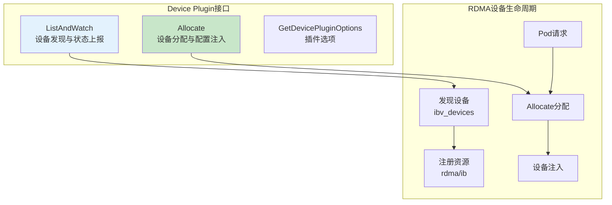

# RDMA Device Plugin

> Kubernetes Device Plugin 实现，用于发现和管理 RDMA/IB/RoCE 网卡资源。

---

## 快速导航

| 文件 | 说明 |
|------|------|
| [docs/README.md](docs/README.md) | 📖 **完整学习文档** - Device Plugin接口与RDMA设备发现 |
| [pkg/plugin/plugin.go](pkg/plugin/plugin.go) | Device Plugin核心实现 |
| [pkg/device/rdma.go](pkg/device/rdma.go) | RDMA设备发现逻辑 |

---

## 核心特性

```
┌─────────────────────────────────────────────────────────────────┐
│                  RDMA Device Plugin核心能力                       │
├─────────────────────────────────────────────────────────────────┤
│  ✅ 设备发现     - 自动发现节点上的IB/RoCE网卡                      │
│  ✅ 资源注册     - 向Kubernetes注册rdma/ib或rdma/roce资源           │
│  ✅ 设备分配     - Allocate接口分配网卡给Pod                        │
│  ✅ 配置注入     - 自动注入设备文件和环境变量                        │
│  ✅ NUMA感知     - 设备NUMA拓扑信息上报                             │
└─────────────────────────────────────────────────────────────────┘
```

---

## 项目结构

```
rdma-device-plugin/
│
├── pkg/
│   ├── plugin/plugin.go      # Device Plugin实现
│   └── device/rdma.go        # RDMA设备发现
│
├── manifests/
│   ├── 01-rdma-device-class.yaml    # 设备类定义（可选）
│   ├── 02-device-plugin.yaml        # DaemonSet部署
│   └── 03-pod-with-rdma.yaml        # 使用示例
│
├── docs/
│   └── README.md              # 详细文档
│
├── go.mod                     # Go模块定义
└── README.md                  # 本文档
```

---

## 使用示例

### 资源注册效果

```bash
# ============================================================
# Device Plugin注册后的节点资源
# ============================================================
kubectl describe node <node-name>

# 输出:
# Capacity:
#   nvidia.com/gpu:    2
#   rdma/ib:           2    ← RDMA设备资源
# 
# Allocatable:
#   rdma/ib:           2
```

### Pod请求RDMA资源

```yaml
# ============================================================
# 示例: Pod请求RDMA网卡
# ============================================================
apiVersion: v1
kind: Pod
metadata:
  name: inference-server
spec:
  containers:
    - name: inference
      resources:
        limits:
          nvidia.com/gpu: 1
          rdma/ib: 1       # ← 请求RDMA网卡
```

---

## 核心接口



---

## 与Week1的知识复用

| Week1知识点 | 本项目应用 |
|-------------|-----------|
| Device Plugin机制 | ListAndWatch/Allocate接口实现 |
| 设备注册流程 | 向kubelet注册rdma资源 |
| 配置注入能力 | 设备文件注入 |

详见 **[docs/README.md](docs/README.md)** 获取完整实现细节。