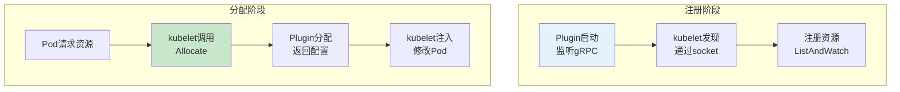
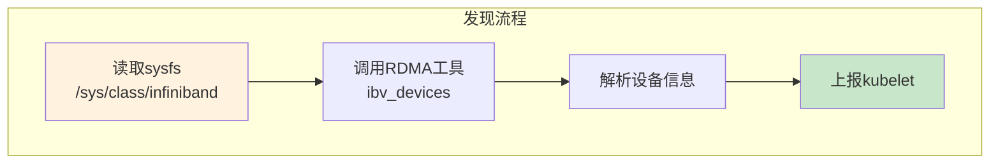
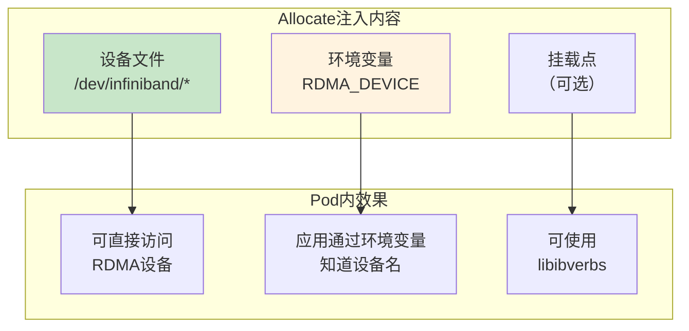

# RDMA Device Plugin 详解

> 理解 Device Plugin 如何发现和管理 RDMA 网卡资源，掌握 ListAndWatch 和 Allocate 接口的实现。

---

## 目录

- [1. Device Plugin 机制回顾](#1-device-plugin-机制回顾)
- [2. RDMA 设备发现](#2-rdma-设备发现)
- [3. 核心接口实现](#3-核心接口实现)
- [4. 设备分配与注入](#4-设备分配与注入)
- [5. 部署与使用](#5-部署与使用)

---

## 1. Device Plugin 机制回顾

### 1.1 核心流程



### 1.2 gRPC 接口定义

```go
// ============================================================
// Device Plugin gRPC接口（Kubernetes标准）
// ============================================================

// ListAndWatch 返回设备列表流
func (p *Plugin) ListAndWatch(stream *Stream) error {
    // 返回 DeviceListResponse 流
    // 包含设备ID、健康状态、拓扑信息
}

// Allocate 分配设备并返回配置
func (p *Plugin) Allocate(ctx context.Context, req *AllocateRequest) (*AllocateResponse, error) {
    // 返回 ContainerAllocateResponse
    // 包含设备文件、环境变量、挂载点
}
```

---

## 2. RDMA 设备发现

### 2.1 设备发现方法



### 2.2 设备信息结构

```go
// ============================================================
// RDMA设备信息结构
// ============================================================

// DeviceInfo RDMA设备详细信息
type DeviceInfo struct {
    // ID 设备唯一标识（如 mlx5_0）
    ID string

    // Type 设备类型（IB或RoCE）
    Type string    // "ib" 或 "roce"

    // Health 设备健康状态
    Health bool

    // Topology NUMA拓扑信息
    Topology *TopologyInfo
}

// TopologyInfo NUMA拓扑信息
type TopologyInfo struct {
    // NUMANode NUMA节点编号
    NUMANode int

    // PCIAddress PCI地址
    PCIAddress string
}
```

### 2.3 设备发现实现

```go
// ============================================================
// RDMA设备发现 - pkg/device/rdma.go
// ============================================================

// DiscoverDevices 发现节点上的RDMA设备
func DiscoverDevices() ([]*DeviceInfo, error) {
    // === 步骤1: 读取sysfs设备目录 ===
    devicesDir := "/sys/class/infiniband"
    entries, err := os.ReadDir(devicesDir)
    if err != nil {
        return nil, err
    }

    // === 步骤2: 解析每个设备信息 ===
    devices := make([]*DeviceInfo, 0)
    for _, entry := range entries {
        deviceName := entry.Name()

        // === 步骤3: 获取设备类型 ===
        deviceType := getDeviceType(deviceName)

        // === 步骤4: 获取NUMA拓扑 ===
        topology := getDeviceTopology(deviceName)

        // === 步骤5: 检查健康状态 ===
        health := checkDeviceHealth(deviceName)

        devices = append(devices, &DeviceInfo{
            ID:       deviceName,
            Type:     deviceType,
            Health:   health,
            Topology: topology,
        })
    }

    return devices, nil
}

// getDeviceType 判断设备类型（IB或RoCE）
func getDeviceType(deviceName string) string {
    // 检查链路层类型
    linkLayerPath := fmt.Sprintf("/sys/class/infiniband/%s/ports/1/link_layer", deviceName)
    content, _ := os.ReadFile(linkLayerPath)

    linkLayer := strings.TrimSpace(string(content))
    if linkLayer == "InfiniBand" {
        return "ib"
    }
    return "roce"    // Ethernet链路为RoCE
}

// getDeviceTopology 获取设备NUMA拓扑
func getDeviceTopology(deviceName string) *TopologyInfo {
    // 读取NUMA节点
    numaPath := fmt.Sprintf("/sys/class/infiniband/%s/device/numa_node", deviceName)
    content, _ := os.ReadFile(numaPath)

    numaNode := 0
    if n, err := strconv.Atoi(strings.TrimSpace(string(content))); err == nil {
        numaNode = n
    }

    // 读取PCI地址
    pciPath := fmt.Sprintf("/sys/class/infiniband/%s/device", deviceName)
    pciLink, _ := os.Readlink(pciPath)
    pciAddress := filepath.Base(pciLink)

    return &TopologyInfo{
        NUMANode:  numaNode,
        PCIAddress: pciAddress,
    }
}
```

---

## 3. 核心接口实现

### 3.1 ListAndWatch 实现

```go
// ============================================================
// ListAndWatch接口实现 - pkg/plugin/plugin.go
// ============================================================

// ListAndWatch 上报设备列表和状态变化
// 【调用时机】kubelet启动时建立连接，持续接收设备更新
func (p *RDADevicePlugin) ListAndWatch(req *v1beta1.Empty, stream v1beta1.DevicePlugin_ListAndWatchServer) error {
    // === 步骤1: 发送初始设备列表 ===
    devices := p.getDevices()
    resp := &v1beta1.ListAndWatchResponse{
        Devices: devices,
    }
    stream.Send(resp)

    // === 步骤2: 持续监听设备状态变化 ===
    for {
        select {
        case <-p.stopCh:
            return nil

        case <-time.After(10 * time.Second):
            // === 步骤3: 定期检查设备健康 ===
            p.updateDeviceHealth()
            
            // === 步骤4: 发送更新后的设备列表 ===
            devices := p.getDevices()
            stream.Send(&v1beta1.ListAndWatchResponse{
                Devices: devices,
            })
        }
    }
}

// getDevices 获取设备列表（转换为gRPC格式）
func (p *RDADevicePlugin) getDevices() []*v1beta1.Device {
    devices := make([]*v1beta1.Device, 0)
    
    for _, dev := range p.deviceList {
        devices = append(devices, &v1beta1.Device{
            ID:     dev.ID,
            Health: dev.Health ? v1beta1.Healthy : v1beta1.Unhealthy,
            Topology: &v1beta1.TopologyInfo{
                Node: int64(dev.Topology.NUMANode),
            },
        })
    }
    
    return devices
}
```

### 3.2 Allocate 实现

```go
// ============================================================
// Allocate接口实现
// ============================================================

// Allocate 分配设备并返回配置注入
// 【调用时机】Pod创建时，kubelet调用Allocate获取设备配置
func (p *RDADevicePlugin) Allocate(ctx context.Context, req *v1beta1.AllocateRequest) (*v1beta1.AllocateResponse, error) {
    // === 步骤1: 处理每个Container请求 ===
    responses := make([]*v1beta1.ContainerAllocateResponse, 0)
    
    for _, containerReq := range req.ContainerRequests {
        // === 步骤2: 获取请求的设备ID列表 ===
        devicesIDs := containerReq.DevicesIDs
        
        // === 步骤3: 生成设备配置 ===
        response := p.generateContainerResponse(devicesIDs)
        responses = append(responses, response)
    }

    return &v1beta1.AllocateResponse{
        ContainerResponses: responses,
    }, nil
}

// generateContainerResponse 生成容器配置注入
func (p *RDADevicePlugin) generateContainerResponse(deviceIDs []string) *v1beta1.ContainerAllocateResponse {
    // ============================================================
    // 设备文件注入
    // ============================================================
    devices := make([]*v1beta1.DeviceSpec, 0)
    
    for _, deviceID := range deviceIDs {
        // 主设备文件
        devices = append(devices, &v1beta1.DeviceSpec{
            HostPath:      fmt.Sprintf("/dev/infiniband/%s", deviceID),
            ContainerPath: fmt.Sprintf("/dev/infiniband/%s", deviceID),
            Permissions:   "mrw",    // 读、写、mmap
        })
        
        // umad设备（用户态管理设备）
        devices = append(devices, &v1beta1.DeviceSpec{
            HostPath:      "/dev/infiniband/umad",
            ContainerPath: "/dev/infiniband/umad",
            Permissions:   "rw",
        })
        
        // issm设备（IB子网管理）
        devices = append(devices, &v1beta1.DeviceSpec{
            HostPath:      "/dev/infiniband/issm",
            ContainerPath: "/dev/infiniband/issm",
            Permissions:   "rw",
        })
    }

    // ============================================================
    // 环境变量注入
    // ============================================================
    envs := map[string]string{
        "RDMA_DEVICE": strings.Join(deviceIDs, ","),
    }

    return &v1beta1.ContainerAllocateResponse{
        Devices: devices,
        Envs:    envs,
    }
}
```

---

## 4. 设备分配与注入

### 4.1 注入内容详解



### 4.2 设备文件列表

| 设备文件 | 用途 | 权限 |
|----------|------|------|
| `/dev/infiniband/{device}` | RDMA verbs接口 | mrw（读、写、mmap） |
| `/dev/infiniband/umad` | 用户态管理接口 | rw |
| `/dev/infiniband/issm` | IB子网管理接口 | rw |

### 4.3 环境变量说明

| 环境变量 | 说明 | 示例值 |
|----------|------|--------|
| `RDMA_DEVICE` | 分配的设备名列表 | `mlx5_0,mlx5_1` |

---

## 5. 部署与使用

### 5.1 DaemonSet 部署

```yaml
# ============================================================
# manifests/02-device-plugin.yaml
# ============================================================

apiVersion: apps/v1
kind: DaemonSet
metadata:
  name: rdma-device-plugin
  namespace: kube-system
spec:
  selector:
    matchLabels:
      app: rdma-device-plugin
  template:
    metadata:
      labels:
        app: rdma-device-plugin
    spec:
      containers:
        - name: device-plugin
          image: rdma-device-plugin:v1
          # ============================================================
          # 关键配置：挂载必要目录
          # ============================================================
          volumeMounts:
            - name: device-plugin
              mountPath: /var/lib/kubelet/device-plugins
            - name: infiniband
              mountPath: /dev/infiniband
            - name: sysfs
              mountPath: /sys
          securityContext:
            privileged: true    # 需要特权访问设备

      volumes:
        - name: device-plugin
          hostPath:
            path: /var/lib/kubelet/device-plugins
        - name: infiniband
          hostPath:
            path: /dev/infiniband
        - name: sysfs
          hostPath:
            path: /sys
```

### 5.2 Pod 使用示例

```yaml
# ============================================================
# manifests/03-pod-with-rdma.yaml
# ============================================================

apiVersion: v1
kind: Pod
metadata:
  name: inference-server
  annotations:
    k8s.v1.cni.cncf.io/networks: rdma-network
spec:
  containers:
    - name: inference
      image: inference:v1
      resources:
        limits:
          nvidia.com/gpu: 2
          rdma/ib: 1       # ← 请求RDMA设备

      # ============================================================
      # Device Plugin自动注入以下内容：
      # ============================================================
      # 1. 设备文件: /dev/infiniband/mlx5_0
      # 2. 环境变量: RDMA_DEVICE=mlx5_0
```

### 5.3 验证部署

```bash
# ============================================================
# 验证Device Plugin运行
# ============================================================

# 检查DaemonSet状态
kubectl get ds -n kube-system rdma-device-plugin

# 检查节点资源
kubectl describe node <node> | grep rdma

# 检查Pod内设备
kubectl exec <pod> -- ibv_devices
```

---

## 附录

### A. 资源类型命名

| 网卡类型 | 资源名称 | 说明 |
|----------|----------|------|
| **InfiniBand** | `rdma/ib` | IB网卡资源 |
| **RoCE** | `rdma/roce` | RoCE网卡资源 |
| **统一命名** | `rdma/nic` | 不区分类型 |

### B. 与NVIDIA GPU Device Plugin对比

| 维度 | GPU Plugin | RDMA Plugin |
|------|------------|-------------|
| **设备发现** | 通过NVML库 | 通过sysfs |
| **资源类型** | `nvidia.com/gpu` | `rdma/ib` |
| **注入内容** | 设备文件+Env | 设备文件+Env |
| **拓扑上报** | GPU拓扑 | NUMA拓扑 |

---

> 下一项目：[../network-topology-scheduler/](../network-topology-scheduler/) - 学习网络拓扑感知调度插件。