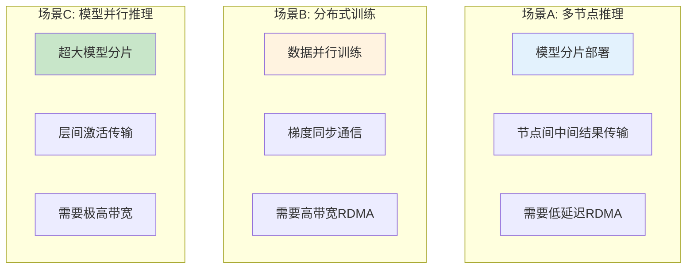
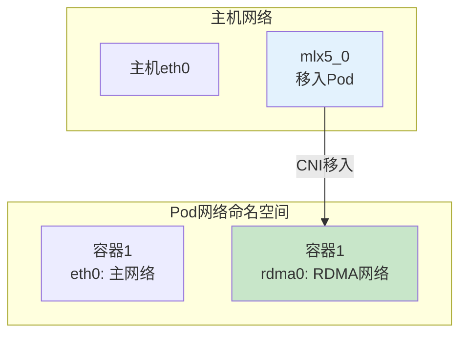

# Multi-Node Deployment 详解

> 掌握多节点推理/训练服务的网络配置方法，理解 NCCL 优化和拓扑感知调度实践。

---

## 目录

- [1. 多节点部署场景](#1-多节点部署场景)
- [2. 网络配置方案](#2-网络配置方案)
- [3. 推理服务部署](#3-推理服务部署)
- [4. 训练任务部署](#4-训练任务部署)
- [5. 性能验证脚本](#5-性能验证脚本)
- [6. 最佳实践](#6-最佳实践)

---

## 1. 多节点部署场景

### 1.1 场景分类



### 1.2 网络需求对比

| 场景 | 延迟敏感度 | 帖宽敏感度 | 推荐网络 |
|------|------------|------------|----------|
| **多节点推理** | 高（影响推理延迟） | 中 | IB或RoCE |
| **分布式训练** | 中 | 高（梯度同步） | IB（优先） |
| **模型并行** | 高 | 高 | IB |

---

## 2. 网络配置方案

### 2.1 NetworkAttachmentDefinition 配置

```yaml
# ============================================================
# manifests/01-network-attachment.yaml
# ============================================================
# 【核心字段】
# - type: host-device或sriov
# - device: 指定RDMA设备名
# 【使用方式】
# Pod通过annotation引用此NAD

apiVersion: k8s.cni.cncf.io/v1
kind: NetworkAttachmentDefinition
metadata:
  name: rdma-network
  namespace: ai-workloads
spec:
  config: |
    {
      "type": "host-device",
      "device": "mlx5_0",
      "name": "rdma-net",
      "ipam": {
        "type": "host-local",
        "subnet": "192.168.100.0/24",
        "rangeStart": "192.168.100.10",
        "rangeEnd": "192.168.100.200"
      }
    }

---
# ============================================================
# SR-IOV NAD配置（多Pod共享网卡）
# ============================================================
apiVersion: k8s.cni.cncf.io/v1
kind: NetworkAttachmentDefinition
metadata:
  name: sriov-rdma
spec:
  config: |
    {
      "type": "sriov",
      "deviceID": "mlx5_0",
      "vf": 0,
      "name": "sriov-rdma",
      "ipam": {
        "type": "host-local",
        "subnet": "192.168.101.0/24"
      }
    }
```

### 2.2 网络命名空间配置



---

## 3. 推理服务部署

### 3.1 多节点推理服务配置

```yaml
# ============================================================
# manifests/02-inference-service.yaml
# ============================================================
# 【核心配置】
# - Deployment: 多副本部署
# - 拓扑感知调度: 同机架优先
# - RDMA网络配置

apiVersion: apps/v1
kind: Deployment
metadata:
  name: inference-service
  namespace: ai-workloads
  labels:
    app: inference
    network: rdma
spec:
  replicas: 3

  # ============================================================
  # 拓扑感知部署策略
  # ============================================================
  strategy:
    type: RollingUpdate
    rollingUpdate:
      maxUnavailable: 1
      maxSurge: 1

  selector:
    matchLabels:
      app: inference

  template:
    metadata:
      labels:
        app: inference
        network: rdma
      annotations:
        # ============================================================
        # RDMA网络附加
        # ============================================================
        k8s.v1.cni.cncf.io/networks: rdma-network
        # 可指定多网络: rdma-network, backup-network

    spec:
      # ============================================================
      # 拓扑感知调度约束
      # ============================================================
      topologySpreadConstraints:
        - maxSkew: 1
          topologyKey: topology.kubernetes.io/zone    # 机架/区域拓扑
          whenUnsatisfiable: ScheduleAnyway
          labelSelector:
            matchLabels:
              app: inference

      # ============================================================
      # 节点选择器（可选：指定RDMA节点）
      # ============================================================
      nodeSelector:
        has-rdma: "true"

      containers:
        - name: inference
          image: inference-server:v1

          # ============================================================
          # 资源配置
          # ============================================================
          resources:
            limits:
              nvidia.com/gpu: 2
              rdma/ib: 1        # RDMA网卡资源
              cpu: "8"
              memory: "32Gi"
            requests:
              cpu: "8"
              memory: "32Gi"

          # ============================================================
          # 环境变量配置
          # ============================================================
          env:
            - name: RDMA_DEVICE
              valueFrom:
                fieldPath:
                  fieldPath: metadata.annotations['rdma-device']    # Device Plugin注入

            # 推理服务环境变量
            - name: MODEL_NAME
              value: "llama-70b"
            - name: SERVICE_PORT
              value: "8080"

          # ============================================================
          # 端口配置
          # ============================================================
          ports:
            - containerPort: 8080
              name: inference-port

          # ============================================================
          # 健康检查
          # ============================================================
          livenessProbe:
            httpGet:
              path: /health
              port: 8080
            initialDelaySeconds: 30
            periodSeconds: 10

---
# ============================================================
# 推理服务Service配置
# ============================================================
apiVersion: v1
kind: Service
metadata:
  name: inference-service
  namespace: ai-workloads
spec:
  type: ClusterIP
  selector:
    app: inference
  ports:
    - port: 8080
      targetPort: 8080
      name: inference-port