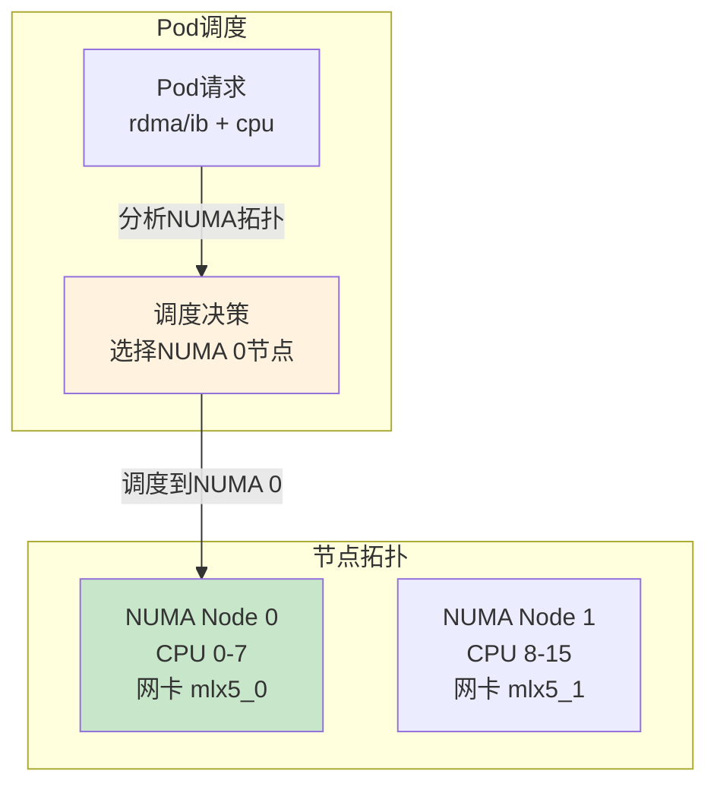
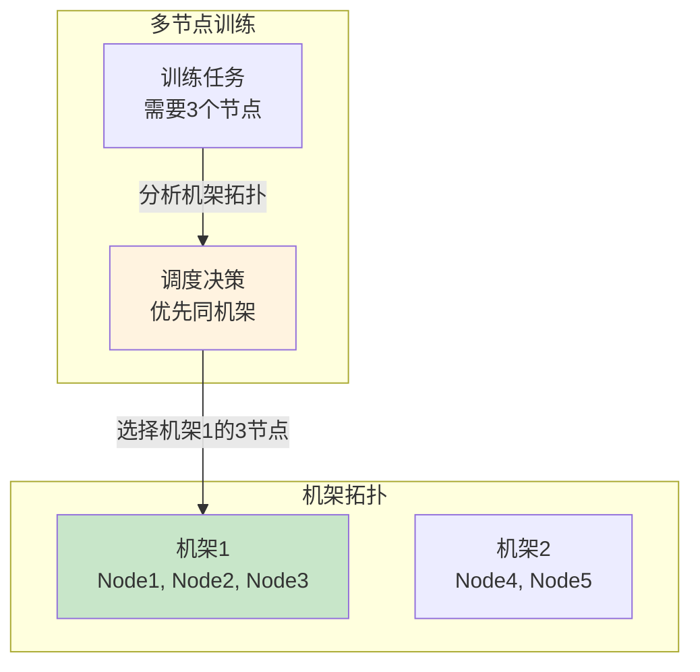
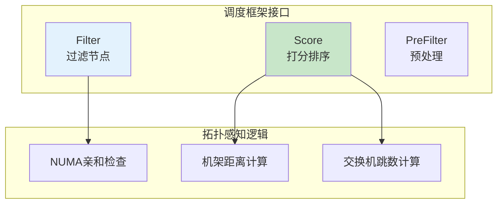

# Network Topology Scheduler

> Kubernetes 调度器插件，实现 NUMA/机架/交换机维度的网络拓扑感知调度。

---

## 快速导航

| 文件 | 说明 |
|------|------|
| [docs/README.md](docs/README.md) | 📖 **完整学习文档** - 拓扑感知调度算法与实现 |
| [pkg/plugin/topology.go](pkg/plugin/topology.go) | 调度插件核心实现 |
| [pkg/numa/numa.go](pkg/numa/numa.go) | NUMA亲和性算法 |
| [pkg/rack/rack.go](pkg/rack/rack.go) | 机架感知算法 |

---

## 核心特性

```
┌─────────────────────────────────────────────────────────────────┐
│                 网络拓扑感知调度核心能力                           │
├─────────────────────────────────────────────────────────────────┤
│  ✅ NUMA亲和      - 网卡与CPU同NUMA节点优先调度                   │
│  ✅ 机架感知      - 同机架节点优先（降低跨机架延迟）                │
│  ✅ 交换机感知    - 同交换机节点优先（降低网络跳数）                │
│  ✅ Filter过滤    - 过滤不符合拓扑要求的节点                       │
│  ✅ Score打分     - 根据拓扑距离打分，优先低延迟节点                │
└─────────────────────────────────────────────────────────────────┘
```

---

## 项目结构

```
network-topology-scheduler/
│
├── pkg/
│   ├── plugin/topology.go    # 调度插件实现
│   ├── numa/numa.go         # NUMA亲和性
│   └── rack/rack.go         # 机架感知
│
├── config/
│   └── scheduler-config.yaml    # 调度器配置
│
├── docs/
│   └── README.md            # 详细文档
│
├── go.mod                   # Go模块定义
└── README.md                # 本文档
```

---

## 调度效果示例

### NUMA 亲和调度



### 机架感知调度



---

## 核心接口



---

## 与Week1的知识复用

| Week1知识点 | 本项目应用 |
|-------------|-----------|
| Filter接口 | NUMA/拓扑条件过滤 |
| Score接口 | 拓扑距离打分算法 |
| 调度框架扩展 | 插件注册与配置 |

详见 **[docs/README.md](docs/README.md)** 获取完整实现细节。