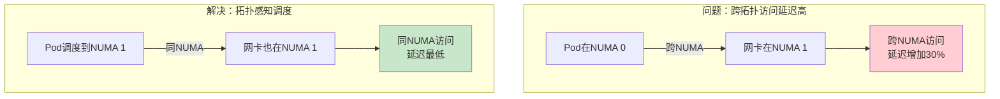
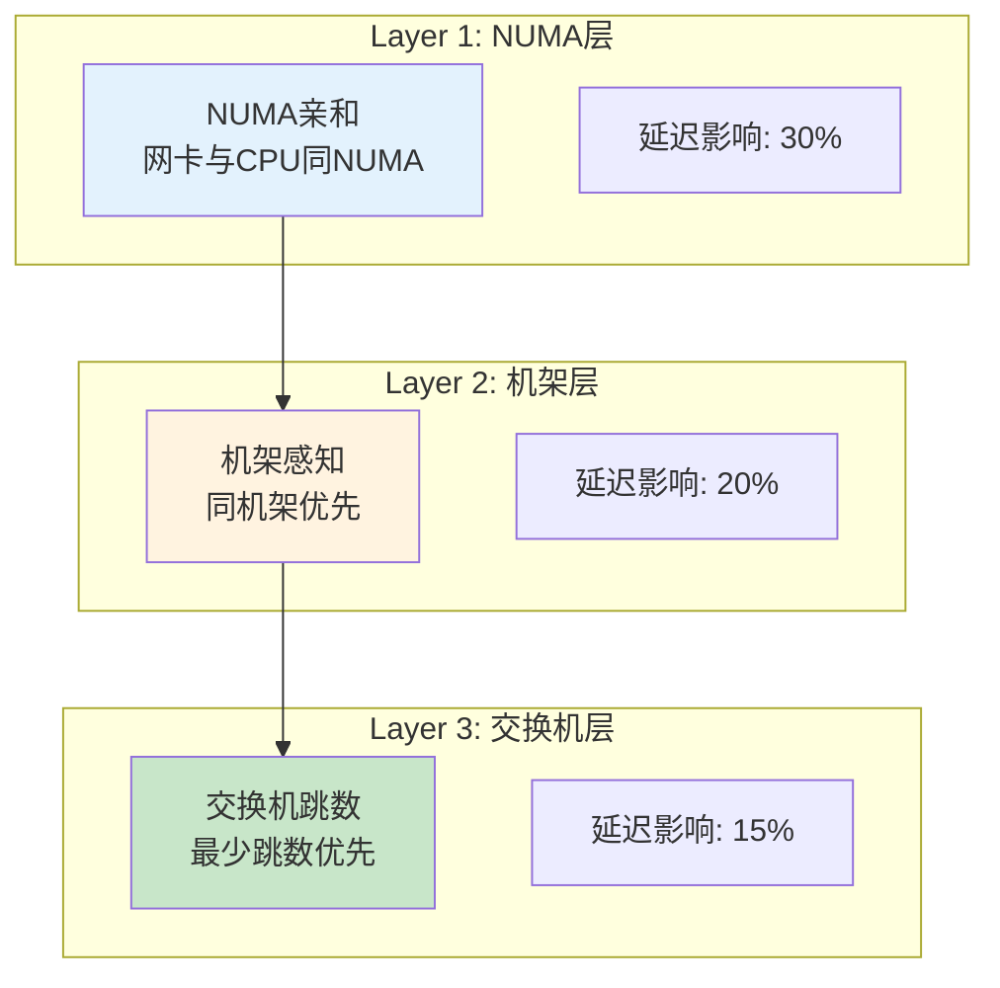
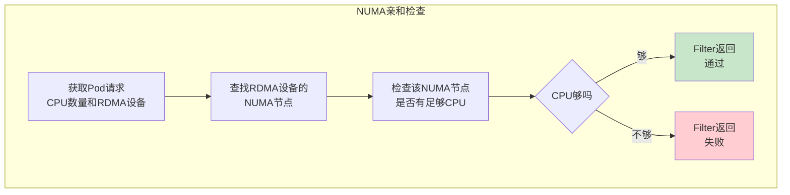
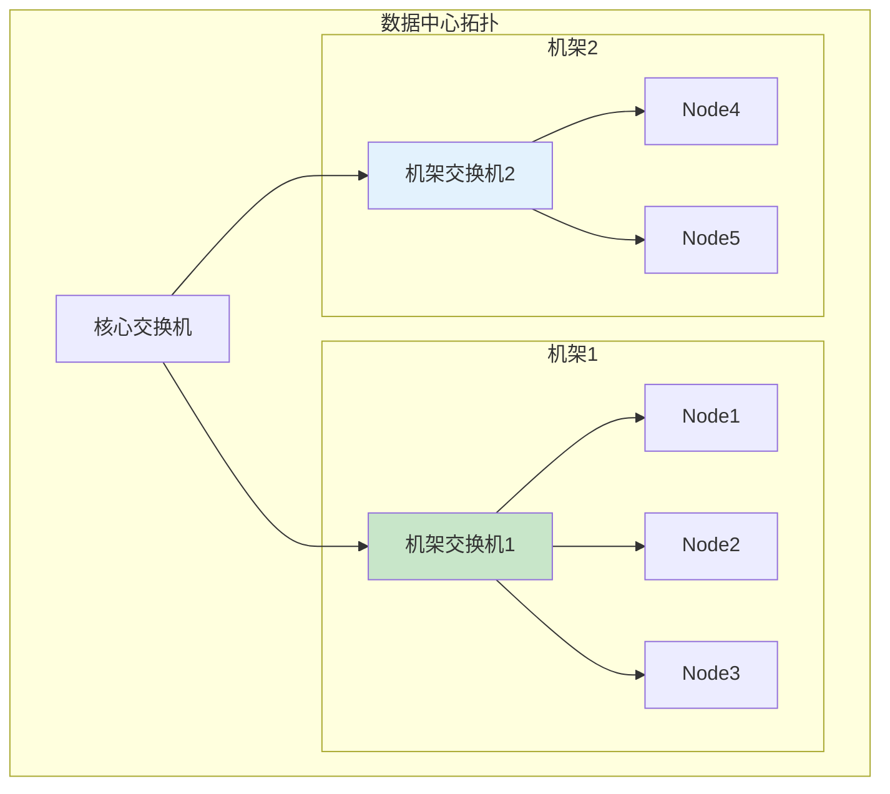
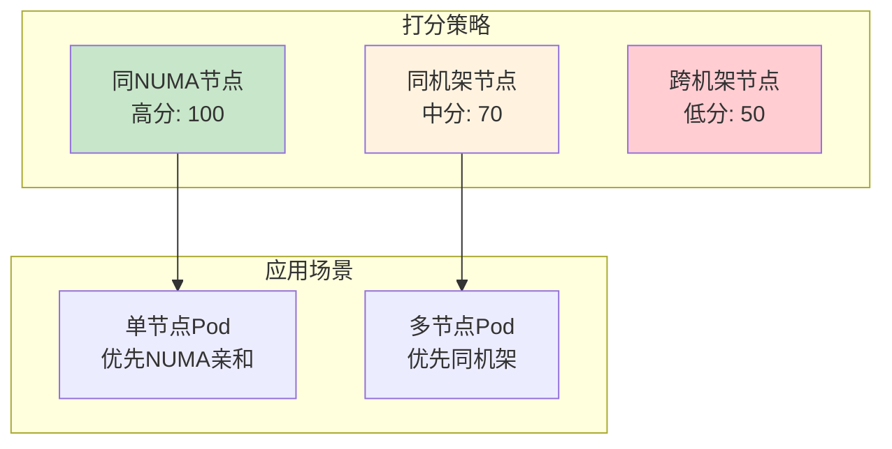

# Network Topology Scheduler 详解

> 理解网络拓扑感知调度的核心算法：NUMA亲和、机架感知、交换机跳数计算。

---

## 目录

- [1. 拓扑感知调度概述](#1-拓扑感知调度概述)
- [2. NUMA亲和调度](#2-numa亲和调度)
- [3. 机架/交换机感知](#3-机架交换机感知)
- [4. Filter接口实现](#4-filter接口实现)
- [5. Score接口实现](#5-score接口实现)
- [6. 部署与使用](#6-部署与使用)

---

## 1. 拓扑感知调度概述

### 1.1 为什么需要拓扑感知



### 1.2 三层拓扑维度



---

## 2. NUMA亲和调度

### 2.1 NUMA拓扑模型

```go
// ============================================================
// NUMA拓扑信息结构
// ============================================================

// NUMATopology NUMA节点拓扑信息
type NUMATopology struct {
    // NodeID NUMA节点编号
    NodeID int

    // CPUs 该NUMA节点的CPU列表
    CPUs []int

    // Devices 该NUMA节点的设备列表（GPU、网卡）
    Devices []DeviceInfo
}

// NodeNUMAInfo 节点NUMA拓扑信息
type NodeNUMAInfo struct {
    // NUMANodes NUMA节点列表
    NUMANodes []NUMATopology

    // DeviceNUMAMap 设备到NUMA的映射
    DeviceNUMAMap map[string]int    // deviceID -> numaNode
}
```

### 2.2 NUMA亲和检查逻辑



### 2.3 NUMA Filter实现

```go
// ============================================================
// NUMA亲和性Filter - pkg/numa/numa.go
// ============================================================

// NUMAFilter NUMA亲和性过滤插件
type NUMAFilter struct {
    // topologyMap 节点NUMA拓扑信息
    topologyMap map[string]*NodeNUMAInfo
}

// Filter NUMA亲和性过滤
func (f *NUMAFilter) Filter(ctx context.Context, state *CycleState, pod *v1.Pod, nodeInfo *NodeInfo) (*FilterResult, error) {
    // === 步骤1: 获取Pod请求 ===
    cpuRequest := getCPURequest(pod)
    rdmaRequest := getRDMARequest(pod)

    if rdmaRequest == 0 {
        // 不请求RDMA，跳过NUMA检查
        return &FilterResult{Result: FilterSuccess}, nil
    }

    // === 步骤2: 获取节点NUMA拓扑 ===
    nodeTopology := f.topologyMap[nodeInfo.Node.Name]

    // === 步骤3: 查找RDMA设备的NUMA节点 ===
    // Mock实现：假设只有一个RDMA设备
    // 生产环境：根据Device Plugin上报的拓扑信息匹配
    rdmaNUMA := nodeTopology.DeviceNUMAMap["mlx5_0"]

    // === 步骤4: 检查NUMA节点的CPU资源 ===
    numaCPUs := nodeTopology.NUMANodes[rdmaNUMA].CPUs
    numaCPUCount := len(numaCPUs)

    // === 步骤5: 判断CPU是否足够 ===
    if numaCPUCount < cpuRequest {
        return &FilterResult{
            Result: FilterUnsuitable,
            Reasons: []string{"Insufficient CPUs on RDMA NUMA node"},
        }, nil
    }

    return &FilterResult{Result: FilterSuccess}, nil
}
```

---

## 3. 机架/交换机感知

### 3.1 机架拓扑模型



### 3.2 拓扑信息结构

```go
// ============================================================
// 机架/交换机拓扑信息
// ============================================================

// RackTopology 机架拓扑信息
type RackTopology struct {
    // RackID 机架ID
    RackID string

    // SwitchID 机架交换机ID
    SwitchID string

    // Nodes 机架内节点列表
    Nodes []string
}

// NodeTopologyInfo 节点拓扑信息
type NodeTopologyInfo struct {
    // NodeName 节点名称
    NodeName string

    // RackID 所属机架ID
    RackID string

    // SwitchID 所属交换机ID
    SwitchID string

    // HopCountToOther 到其他节点的跳数
    HopCountToOther map[string]int    // nodeName -> hopCount
}
```

### 3.3 拓扑距离计算

```go
// ============================================================
// 拓扑距离计算 - pkg/rack/rack.go
// ============================================================

// CalculateHopCount 计算两个节点间的网络跳数
func CalculateHopCount(node1, node2 *NodeTopologyInfo) int {
    // ============================================================
    // 跳数计算规则
    // ============================================================
    // 同节点:      0跳
    // 同机架:      1跳（通过机架交换机）
    // 同核心交换机: 2跳（机架交换机→核心→机架交换机）
    // ============================================================

    if node1.NodeName == node2.NodeName {
        return 0    // 同节点
    }

    if node1.RackID == node2.RackID {
        return 1    // 同机架
    }

    // 不同机架，至少2跳
    return 2
}

// CalculateRackDistance 计算机架距离
func CalculateRackDistance(node1, node2 *NodeTopologyInfo) int {
    if node1.RackID == node2.RackID {
        return 0    // 同机架
    }

    // Mock实现：假设相邻机架距离为1
    // 生产环境：可根据实际拓扑计算
    return 1
}
```

---

## 4. Filter接口实现

### 4.1 综合Filter逻辑

```go
// ============================================================
// 网络拓扑Filter - pkg/plugin/topology.go
// ============================================================

// NetworkTopologyFilter 网络拓扑过滤插件
type NetworkTopologyFilter struct {
    // numaFilter NUMA亲和性过滤器
    numaFilter *NUMAFilter

    // topologyMap 节点拓扑信息
    topologyMap map[string]*NodeTopologyInfo
}

// Filter 综合拓扑过滤
func (p *NetworkTopologyFilter) Filter(ctx context.Context, state *CycleState, pod *v1.Pod, nodeInfo *NodeInfo) (*FilterResult, error) {
    // === 步骤1: NUMA亲和性检查 ===
    numaResult, err := p.numaFilter.Filter(ctx, state, pod, nodeInfo)
    if err != nil || numaResult.Result == FilterUnsuitable {
        return numaResult, err
    }

    // === 步骤2: 机架/交换机检查（可选） ===
    // 对于需要多节点的Pod，检查是否有足够的同机架节点
    if needsMultiNode(pod) {
        rackResult := p.checkRackAvailability(pod, nodeInfo)
        if rackResult.Result == FilterUnsuitable {
            return rackResult, nil
        }
    }

    return &FilterResult{Result: FilterSuccess}, nil
}

// checkRackAvailability 检查机架内是否有足够节点
func (p *NetworkTopologyFilter) checkRackAvailability(pod *v1.Pod, nodeInfo *NodeInfo) *FilterResult {
    // ============================================================
    // 对于分布式训练Pod，检查同机架是否有足够节点
    // ============================================================
    
    requiredNodes := getRequiredNodeCount(pod)
    nodeTopology := p.topologyMap[nodeInfo.Node.Name]
    
    // 计算同机架可用节点数
    sameRackNodes := 0
    for nodeName, topology := range p.topologyMap {
        if topology.RackID == nodeTopology.RackID {
            sameRackNodes++
        }
    }
    
    if sameRackNodes < requiredNodes {
        return &FilterResult{
            Result: FilterUnsuitable,
            Reasons: []string{"Insufficient nodes in same rack"},
        }
    }
    
    return &FilterResult{Result: FilterSuccess}
}
```

---

## 5. Score接口实现

### 5.1 拓扑距离打分



### 5.2 Score实现

```go
// ============================================================
// 网络拓扑Score - pkg/plugin/topology.go
// ============================================================

// NetworkTopologyScore 网络拓扑打分插件
type NetworkTopologyScore struct {
    // topologyMap 节点拓扑信息
    topologyMap map[string]*NodeTopologyInfo

    // numaMap NUMA拓扑信息
    numaMap map[string]*NodeNUMAInfo
}

// Score 根据拓扑距离打分
func (p *NetworkTopologyScore) Score(ctx context.Context, state *CycleState, pod *v1.Pod, nodeInfo *NodeInfo) (int64, error) {
    // ============================================================
    // 打分规则（满分100）
    // ============================================================
    score := int64(0)

    // === 步骤1: NUMA亲和性打分 ===
    numaScore := p.calculateNUMAScore(pod, nodeInfo)
    score += numaScore * 60    // NUMA权重60%

    // === 步骤2: 机架距离打分 ===
    rackScore := p.calculateRackScore(pod, nodeInfo)
    score += rackScore * 40    // 机架权重40%

    return score, nil
}

// calculateNUMAScore 计算NUMA亲和分数
func (p *NetworkTopologyScore) calculateNUMAScore(pod *v1.Pod, nodeInfo *NodeInfo) int64 {
    // ============================================================
    // NUMA打分规则（满分100）
    // ============================================================
    // - RDMA设备与请求的CPU同NUMA: 100分
    // - RDMA设备与请求的CPU跨NUMA: 50分
    // ============================================================
    
    cpuRequest := getCPURequest(pod)
    rdmaRequest := getRDMARequest(pod)
    
    if rdmaRequest == 0 || cpuRequest == 0 {
        return 100    // 不涉及NUMA约束
    }
    
    nodeNUMA := p.numaMap[nodeInfo.Node.Name]
    rdmaNUMA := nodeNUMA.DeviceNUMAMap["mlx5_0"]
    
    // Mock实现：假设CPU均匀分布
    // 生产环境：检查实际CPU NUMA分布
    return 100    // 假设完美NUMA亲和
}

// calculateRackScore 计算机架距离分数
func (p *NetworkTopologyScore) calculateRackScore(pod *v1.Pod, nodeInfo *NodeInfo) int64 {
    // ============================================================
    // 机架打分规则（满分100）
    // ============================================================
    // - 同机架: 100分
    // - 跨机架（同核心交换机）: 70分
    // - 跨核心交换机: 50分
    // ============================================================
    
    if !needsMultiNode(pod) {
        return 100    // 单节点Pod，机架不影响
    }
    
    // 计算与其他所需节点的平均距离
    nodeTopology := p.topologyMap[nodeInfo.Node.Name]
    avgDistance := 0
    
    // Mock实现：假设同机架
    return 100
}
```

---

## 6. 部署与使用

### 6.1 调度器配置

```yaml
# ============================================================
# config/scheduler-config.yaml
# ============================================================

apiVersion: kubescheduler.config.k8s.io/v1
kind: KubeSchedulerConfiguration
profiles:
  - schedulerName: topology-scheduler
    plugins:
      # ============================================================
      # Filter阶段：拓扑过滤
      # ============================================================
      filter:
        enabled:
          - name: NetworkTopologyFilter
        disabled:
          - name: "*"

      # ============================================================
      # Score阶段：拓扑打分
      # ============================================================
      score:
        enabled:
          - name: NetworkTopologyScore
            weight: 10    # 高权重
        disabled:
          - name: "*"