# RDMA 基础概念详解

> 理解 RDMA 如何通过零拷贝和内核旁路实现低延迟，以及在 AI 推理/训练场景中的应用价值。

---

## 目录

- [1. 什么是 RDMA](#1-什么是-rdma)
- [2. RDMA 的核心优势](#2-rdma-的核心优势)
- [3. RoCE vs InfiniBand](#3-roce-vs-infiniband)
- [4. RDMA 在 AI 场景的应用](#4-rdma-在-ai-场景的应用)
- [5. Kubernetes 中的 RDMA](#5-kubernetes-中的-rdma)

---

## 1. 什么是 RDMA

### 1.1 定义

**RDMA (Remote Direct Memory Access)**：远程直接内存访问，是一种让网络设备直接读写远程主机内存的技术，无需操作系统内核参与。

### 1.2 传统网络 vs RDMA

```mermaid
graph TB
    subgraph "传统网络传输"
        T1["应用层<br/>用户缓冲区"]
        T2["内核层<br/>Socket缓冲区"]
        T3["内核层<br/>TCP/IP协议栈"]
        T4["驱动层<br/>网卡驱动"]
        T5["硬件层<br/>网卡"]
        T6["网络传输"]
        T7["对方网卡"]
        T8["对方内核"]
        T9["对方应用"]
        
        T1 -->|"数据拷贝1"| T2
        T2 -->|"协议处理"| T3
        T3 -->|"数据拷贝2"| T4
        T4 --> T5
        T5 --> T6 --> T7
        T7 --> T8 --> T9
    end

    subgraph "RDMA传输"
        R1["应用层<br/>用户缓冲区"]
        R2["硬件层<br/>RDMA网卡"]
        R3["网络传输"]
        R4["对方网卡"]
        R5["对方内存"]
        R6["对方应用"]
        
        R1 -->|"直接DMA"| R2
        R2 --> R3 --> R4
        R4 -->|"直接写入"| R5
        R5 --> R6
    end

    style T1 fill:#ffcdd2
    style T2 fill:#ffcdd2
    style T3 fill:#ffcdd2
    style T4 fill:#ffcdd2
    
    style R1 fill:#c8e6c9
    style R2 fill:#c8e6c9
```

### 1.3 关键差异对比

| 特性 | 传统网络 | RDMA |
|------|----------|------|
| **数据拷贝** | 至少 2 次（用户→内核→网卡） | 0 次（直接 DMA） |
| **内核参与** | 每次传输都需要 | 完全旁路 |
| **上下文切换** | 需要切换到内核态 | 无切换 |
| **CPU 开销** | 高（处理协议栈） | 低（网卡硬件处理） |
| **延迟** | 50-100μs | 1-2μs |
| **带宽利用率** | 60-70% | 95%+ |

---

## 2. RDMA 的核心优势

### 2.1 零拷贝 (Zero Copy)

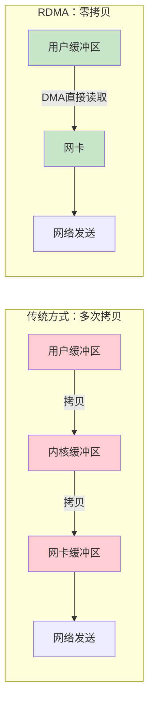

**核心原理：**
- 应用程序直接在内存中准备数据
- RDMA 网卡通过 DMA 直接读取该内存区域
- 无需经过内核缓冲区

### 2.2 内核旁路 (Kernel Bypass)

```mermaid
graph TB
    subgraph "传统网络路径"
        K1["应用程序"]
        K2["系统调用<br/>send()/recv()"]
        K3["内核态"]
        K4["Socket缓冲区"]
        K5["TCP/IP协议栈"]
        K6["网卡驱动"]
        K7["网卡"]
        
        K1 --> K2 --> K3
        K3 --> K4 --> K5 --> K6 --> K7
    end

    subgraph "RDMA路径"
        R1["应用程序"]
        R2["RDMA库<br/>ibv_post_send()"]
        R3["用户态"]
        R4["RDMA网卡"]
        
        R1 --> R2 --> R3
        R3 -->|"直接命令"| R4
    end

    style K2 fill:#ffcdd2
    style K3 fill:#ffcdd2
    style K4 fill:#ffcdd2
    style K5 fill:#ffcdd2
    style K6 fill:#ffcdd2

    style R2 fill:#c8e6c9
    style R3 fill:#c8e6c9
    style R4 fill:#c8e6c9
```

**核心原理：**
- 应用程序通过用户态库（如 libibverbs）直接操作网卡
- 无需系统调用进入内核
- 无需内核协议栈处理

### 2.3 延迟优势

| 场景 | 传统 TCP | RDMA | 优势倍数 |
|------|----------|------|----------|
| **单节点内存访问** | ~100μs | ~1μs | 100x |
| **跨节点小消息** | ~50μs | ~2μs | 25x |
| **大块数据传输** | 带宽利用率 60% | 带宽利用率 95%+ | 1.5x+ |

---

## 3. RoCE vs InfiniBand

### 3.1 两种 RDMA 网络

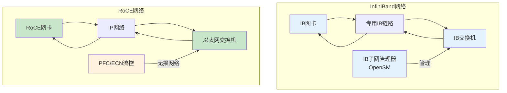

### 3.2 核心差异对比

| 特性 | InfiniBand | RoCE |
|------|------------|------|
| **网络类型** | 专用网络 | 以太网（需无损配置） |
| **协议** | IB协议（原生RDMA） | UDP封装RDMA |
| **流控** | 链路层流控（内置） | 需配置PFC/ECN |
| **成本** | 高（专用设备） | 低（以太网设备） |
| **带宽** | 100G-400G | 25G-100G（常见） |
| **延迟** | ~1μs | ~2μs |
| **部署复杂度** | 中（需SM） | 高（需无损以太网） |

### 3.3 适用场景

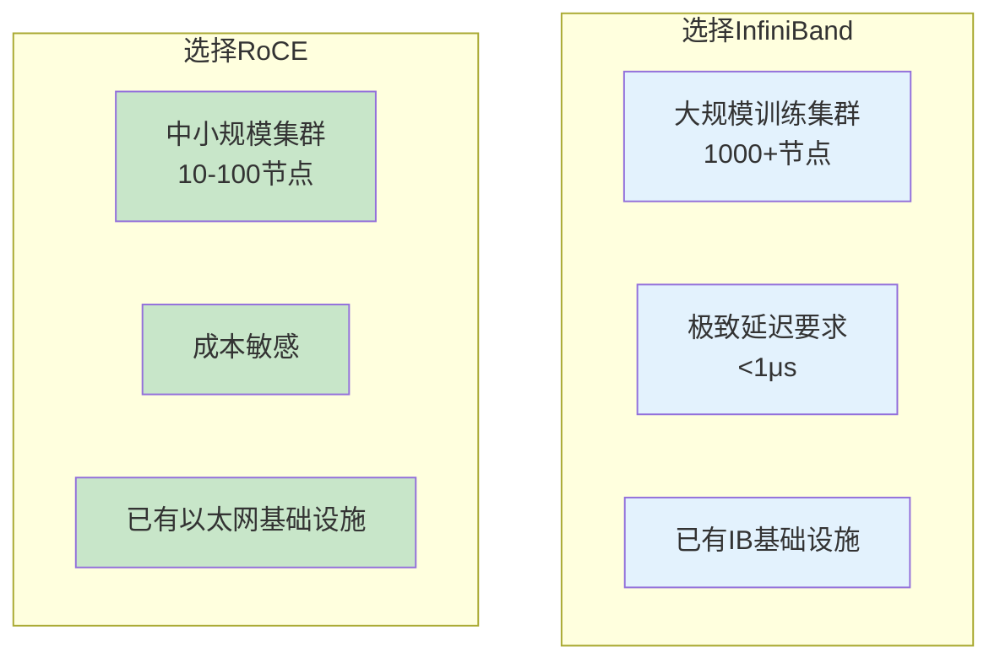

### 3.4 RoCE 的无损网络要求

**为什么 RoCE 需要无损网络？**

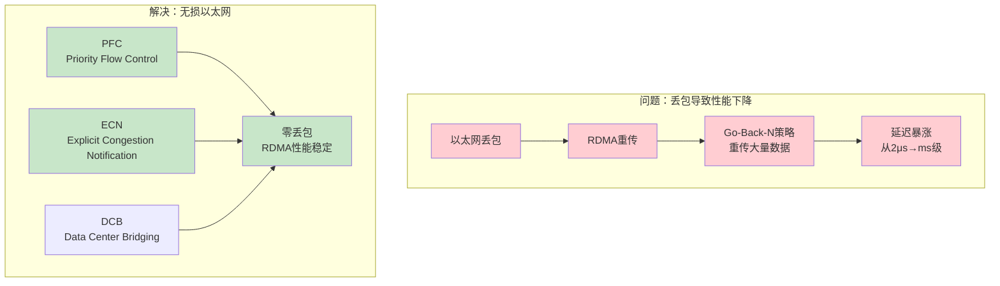

---

## 4. RDMA 在 AI 场景的应用

### 4.1 多节点推理服务

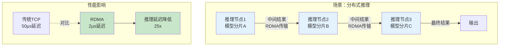

### 4.2 分布式训练

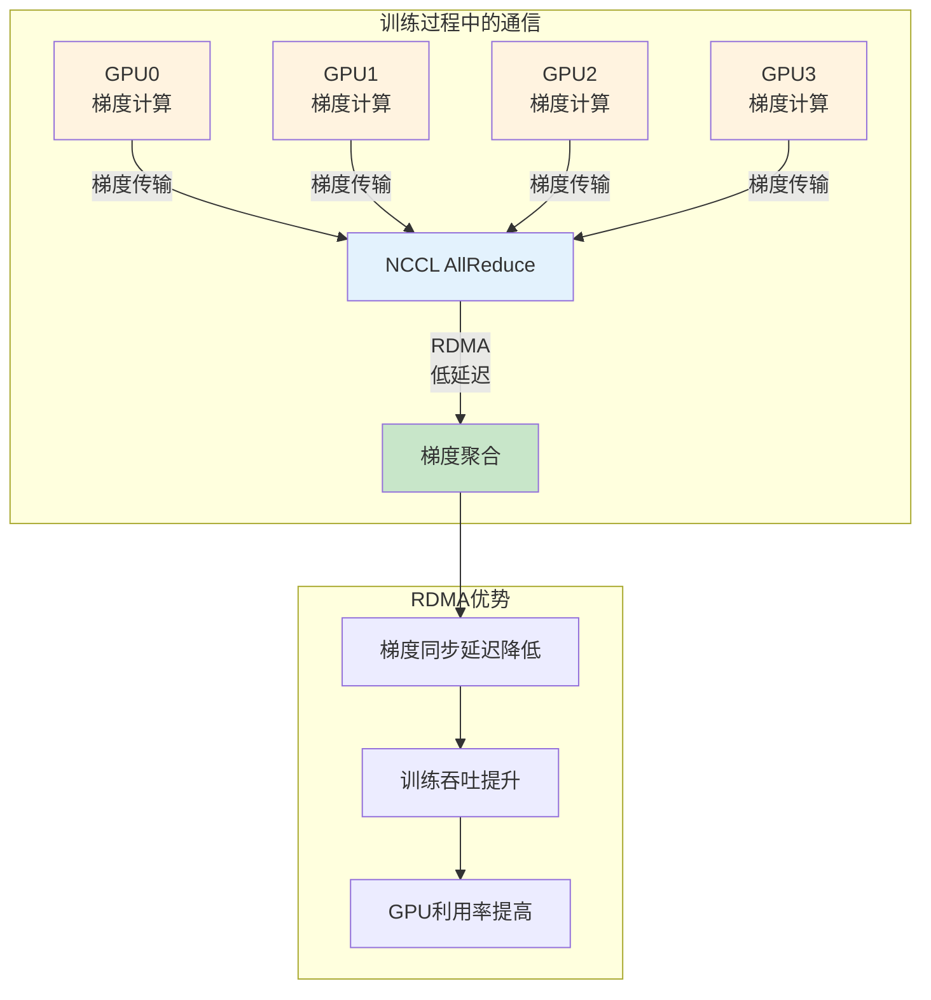

### 4.3 NCCL 与 RDMA

**NCCL (NVIDIA Collective Communication Library)** 是 NVIDIA 提供的集合通信库，专门优化 GPU 集群间的通信。

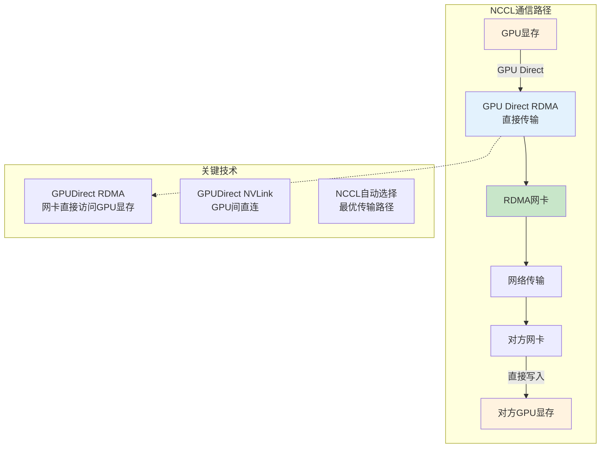

---

## 5. Kubernetes 中的 RDMA

### 5.1 核心挑战

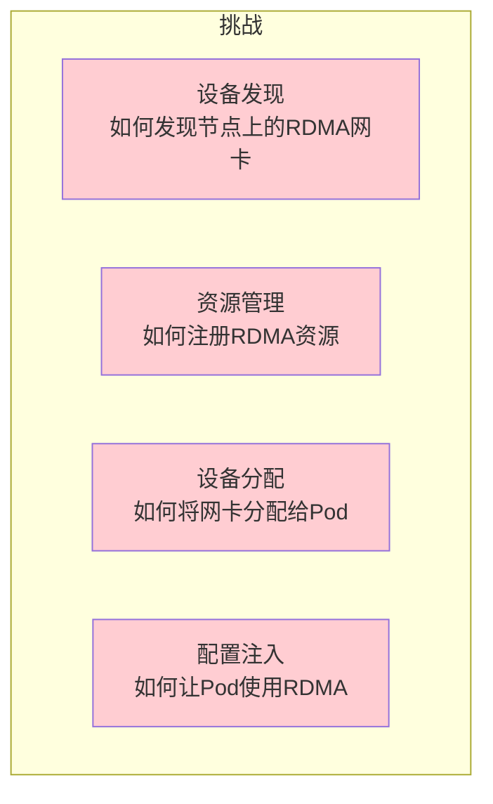

### 5.2 解决方案概览

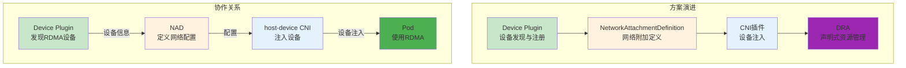

### 5.3 与 GPU 资源管理的类比

| 概念 | GPU 资源管理 | RDMA 资源管理 |
|------|-------------|---------------|
| **设备发现** | NVIDIA Device Plugin | RDMA Device Plugin |
| **资源注册** | `nvidia.com/gpu` | `rdma/ib` 或 `rdma/roce` |
| **设备分配** | Allocate 接口 | Allocate 接口 |
| **配置注入** | 设备文件 + Env | 设备文件 + NAD |
| **调度扩展** | GPU 拓扑感知 | 网络拓扑感知 |

---

## 附录

### A. RDMA 核心术语

| 术语 | 英文 | 说明 |
|------|------|------|
| **QP** | Queue Pair | RDMA通信的端点，包含发送队列和接收队列 |
| **CQ** | Completion Queue | 完成队列，用于通知操作完成 |
| **MR** | Memory Region | 注册的内存区域，允许网卡访问 |
| **PD** | Protection Domain | 保护域，隔离不同进程的RDMA资源 |
| **WR** | Work Request | 工作请求，描述要执行的RDMA操作 |
| **LID** | Local Identifier | IB网络中的节点标识符 |

### B. 常见 RDMA 设备

| 设备类型 | 设备名示例 | 说明 |
|----------|-----------|------|
| **Mellanox IB** | `mlx5_0`, `mlx5_1` | ConnectX系列IB网卡 |
| **Mellanox RoCE** | `mlx5_0` | ConnectX系列RoCE网卡 |
| **Intel Omni-Path** | `hfi1_0` | Intel OPA网卡 |

### C. 参考资源

- [RDMA-aware Networks Programming User Manual](https://docs.nvidia.com/networking/)
- [NVIDIA NCCL Documentation](https://docs.nvidia.com/deeplearning/nccl/)
- [Mellanox OFED Documentation](https://docs.nvidia.com/networking/software/)
- [RDMA CNI GitHub](https://github.com/Mellanox/rdma-cni)

---

> 下一章：[网络设备制备与映射.md](网络设备制备与映射.md) - 学习 NAD 与 host-device 的完整协作链路。