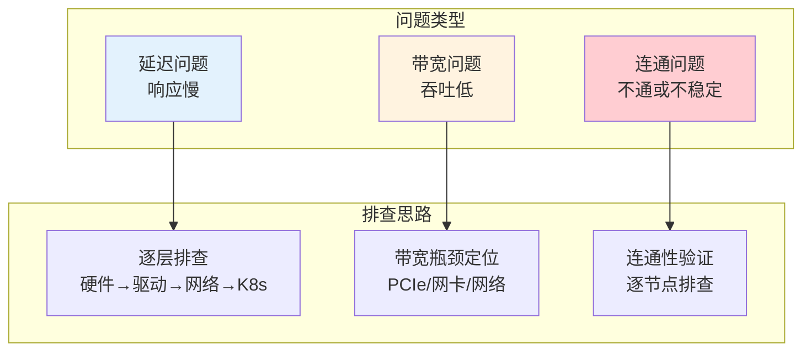
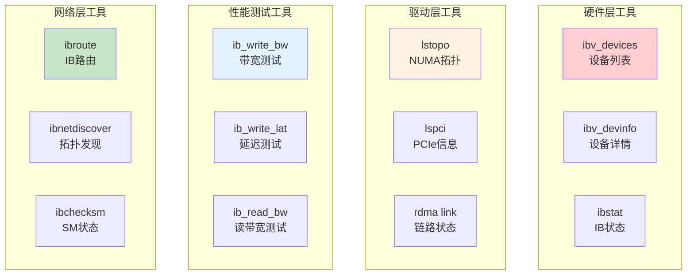
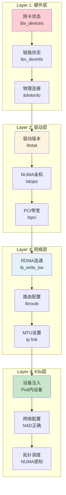
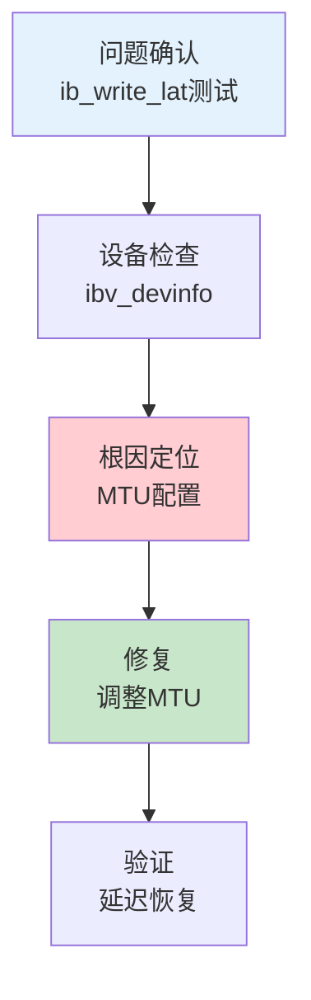
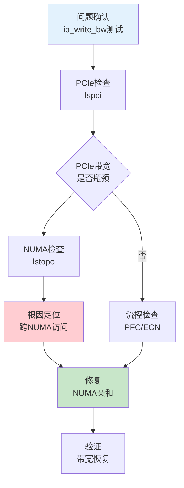
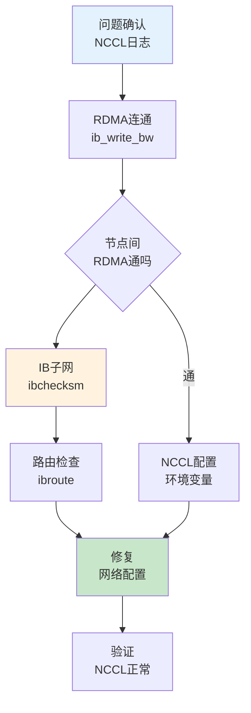

# RDMA 性能问题排查指南

> 系统化的排查思路：从硬件层到 Kubernetes 层，快速定位延迟/带宽问题的根因。

---

## 目录

- [1. 排查框架总览](#1-排查框架总览)
- [2. 核心工具箱](#2-核心工具箱)
- [3. 分层排查模型](#3-分层排查模型)
- [4. 案例1：延迟过高](#4-案例1延迟过高)
- [5. 案例2：带宽不达预期](#5-案例2带宽不达预期)
- [6. 案例3：NCCL通信问题](#6-案例3nccl通信问题)
- [7. 常见根因速查表](#7-常见根因速查表)

---

## 1. 排查框架总览

### 1.1 问题分类



### 1.2 排查原则

| 原则 | 说明 |
|------|------|
| **先验证再排查** | 先用工具确认问题存在，再深入排查 |
| **分层递进** | 从底层（硬件）到上层（K8s）逐层排查 |
| **对比验证** | 对比正常与异常，找出差异点 |
| **工具组合** | 多工具交叉验证，避免误判 |

---

## 2. 核心工具箱

### 2.1 工具速查表

| 工具 | 用途 | 关键命令 | 输出解读 |
|------|------|----------|----------|
| **ibv_devices** | 查看RDMA设备列表 | `ibv_devices` | 设备名、节点GUID |
| **ibv_devinfo** | 设备详细信息 | `ibv_devinfo -v` | 端口状态、MTU、带宽 |
| **ibstat** | IB网卡状态 | `ibstat` | Link状态、速率 |
| **ib_write_bw** | 测试写带宽 | `ib_write_bw -d mlx5_0 -a` | 带宽值（MB/s） |
| **ib_write_lat** | 测试写延迟 | `ib_write_lat -d mlx5_0 -a` | 延迟值（μs） |
| **ib_read_bw** | 测试读带宽 | `ib_read_bw -d mlx5_0 -a` | 带宽值 |
| **lstopo** | NUMA拓扑 | `lstopo` | 网卡NUMA位置 |
| **lspci** | PCIe信息 | `lspci -vv -s <addr>` | PCIe带宽、版本 |
| **rdma link** | RDMA链路状态 | `rdma link show` | 链路状态 |
| **ibroute** | IB路由 | `ibroute <lid>` | 路径信息 |
| **ibnetdiscover** | IB网络拓扑 | `ibnetdiscover` | 网络拓扑图 |

### 2.2 工具分类



---

## 3. 分层排查模型

### 3.1 四层排查架构



### 3.2 各层检查点

#### 硬件层检查

```bash
# ============================================================
# Layer 1: 硬件层检查
# ============================================================

# Step1: 查看RDMA设备是否存在
ibv_devices

# 期望输出: 设备列表（如 mlx5_0）
# 异常: 无设备 → 网卡故障或驱动未安装

# Step2: 查看设备详细信息
ibv_devinfo -v

# 关键信息:
# - state: PORT_ACTIVE（正常）
# - max_msg_sz: 最大消息大小
# - mtu: 4096（IB）或 1500（RoCE可能）

# Step3: IB网卡状态（IB网络）
ibstat

# 关键信息:
# - State: Active
# - Rate: 100（100Gbps）
```

#### 驱动层检查

```bash
# ============================================================
# Layer 2: 驱动层检查
# ============================================================

# Step1: NUMA拓扑
lstopo --output-format text | grep -i mlx

# 关键信息: 网卡的NUMA节点（如 NUMANode: 1）

# Step2: PCIe带宽
lspci -vv -s <pci-address> | grep LnkCap

# 关键信息:
# - LnkCap: Port x16, Speed 8GT/s  ← PCIe 3.0 x16
# - 计算: x16 * 8GT/s * 128/130 ≈ 16GB/s

# Step3: 验证PCI地址
lspci | grep Mellanox

# 输出: 05:00.0 Network controller: Mellanox...
```

#### 网络层检查

```bash
# ============================================================
# Layer 3: 网络层检查
# ============================================================

# Step1: 测试RDMA连通（双节点）
# 在节点1执行（服务端）
ib_write_bw -d mlx5_0 -a

# 在节点2执行（客户端）
ib_write_bw -d mlx5_0 -a <node1-ip>

# 期望输出: 带宽值接近网卡规格
# 异常: 无法连接 → 网络配置问题

# Step2: IB路由（IB网络）
ibroute <destination-lid>

# Step3: MTU配置
# IB网络
ibv_devinfo | grep mtu

# RoCE网络
ip link show eth0 | grep mtu
```

#### Kubernetes层检查

```bash
# ============================================================
# Layer 4: K8s层检查
# ============================================================

# Step1: Pod内设备验证
kubectl exec <pod> -- ibv_devices

# 期望: 显示RDMA设备
# 异常: 无设备 → NAD配置错误

# Step2: NAD配置检查
kubectl get networkattachmentdefinition <nad> -o yaml

# 关键检查:
# - device字段是否正确
# - type是否为host-device或sriov

# Step3: NUMA调度验证
kubectl describe node <node> | grep -A5 Topology

# 检查Pod是否调度到正确的NUMA节点
```

---

## 4. 案例1：延迟过高

### 4.1 问题现象

**症状**：RDMA延迟从预期的 2μs 变成 50μs，性能下降 25 倍。

### 4.2 排查步骤



### 4.3 详细排查命令

```bash
# ============================================================
# 案例1: 延迟过高排查
# ============================================================

# Step1: 测试延迟（双节点）
# 服务端
ib_write_lat -d mlx5_0 -a

# 客户端
ib_write_lat -d mlx5_0 -a <server-ip>

# 输出:
# #bytes   #iterations    t_min[μs]   t_max[μs]  t_typical[μs]
# 64       1000           50.2        52.1       50.5
# ← 异常！应该是 ~2μs

# Step2: 检查设备配置
ibv_devinfo -v | grep -E "mtu|state"

# 输出:
# state:         PORT_ACTIVE
# mtu:           1500  ← 问题！IB网络MTU应该是4096

# Step3: 调整MTU（IB网络）
# 方法A: 通过驱动参数
echo options mlx5_core mtu=4096 > /etc/modprobe.d/mlx5.conf
modprobe -r mlx5_core && modprobe mlx5_core

# 方法B: RoCE网络通过ip命令
ip link set eth0 mtu 9000

# Step4: 验证修复
ib_write_lat -d mlx5_0 -a <server-ip>

# 期望输出: t_typical[μs] ≈ 2
```

### 4.4 根因分析

| 配置项 | 错误值 | 正确值 | 影响 |
|--------|--------|--------|------|
| **MTU** | 1500 | 4096（IB）/ 9000（RoCE） | 小包传输效率低，延迟升高 |

**原因解释**：
- MTU 小导致大消息需要分片传输
- 每个分片都需要独立的 RDMA 操作
- 操作数量增加 → 延迟累加

---

## 5. 案例2：带宽不达预期

### 5.1 问题现象

**症状**：100Gbps网卡实测只有 40Gbps，带宽利用率仅 40%。

### 5.2 排查步骤



### 5.3 详细排查命令

```bash
# ============================================================
# 案例2: 帖宽不达预期排查
# ============================================================

# Step1: 测试带宽
ib_write_bw -d mlx5_0 -a --size=1048576

# 输出:
# #bytes     #iterations    BW[MB/s]   BW[Gb/s]
# 1048576    1000           5000       40
# ← 异常！100Gbps网卡应该是 ~12GB/s ≈ 100Gbps

# Step2: PCIe带宽检查
lspci -vv -s 05:00.0 | grep LnkCap

# 输出:
# LnkCap: Port x16, Speed 8GT/s, Width x16
# ← PCIe 3.0 x16 ≈ 16GB/s，理论够用

# Step3: NUMA拓扑检查
lstopo | grep -i mlx

# 输出:
# PCI 05:00.0 (mlx5_0) NUMANode: 1
# ← 网卡在NUMA节点1

# Step4: 检查进程NUMA绑定
# 在Pod内执行
numactl --hardware

# 输出:
# available: 2 nodes (0-1)
# Node 0: CPUs 0-15
# Node 1: CPUs 16-31

# 检查进程当前CPU
ps -eo pid,psr,comm | grep pytorch

# 如果进程在CPU 0-15（NUMA 0），但网卡在NUMA 1 → 跨NUMA访问！

# Step5: 修复NUMA亲和
# 方法A: 在Pod spec中指定CPU亲和
spec:
  containers:
    - name: pytorch
      resources:
        limits:
          cpu: "8"
      # 指定NUMA节点1的CPU
```

### 5.4 Kubernetes NUMA 亲和配置

```yaml
# ============================================================
# Pod NUMA亲和配置
# ============================================================

apiVersion: v1
kind: Pod
metadata:
  name: training-pod
spec:
  containers:
    - name: pytorch
      resources:
        limits:
          cpu: "8"
          nvidia.com/gpu: 2
          rdma/ib: 1
      # ============================================================
      # 通过Device Plugin或Topology Manager实现NUMA亲和
      # ============================================================
  # 启用Topology Manager（节点级配置）
  topologySpreadConstraints:
    - maxSkew: 1
      topologyKey: kubernetes.io/hostname
```

### 5.5 根因分析

| 配置项 | 问题 | 影响 |
|--------|------|------|
| **NUMA亲和** | 进程与网卡跨NUMA | 跨NUMA内存访问延迟高 |
| **PCIe带宽** | PCIe x4（而不是x16） | 硬件带宽瓶颈 |
| **流控配置** | PFC/ECN未配置（RoCE） | 丢包导致重传 |

---

## 6. 案例3：NCCL通信问题

### 6.1 问题现象

**症状**：分布式训练 NCCL 初始化超时，或训练过程中通信慢。

### 6.2 排查步骤



### 6.3 详细排查命令

```bash
# ============================================================
# 案例3: NCCL通信问题排查
# ============================================================

# Step1: 开启NCCL调试日志
export NCCL_DEBUG=INFO
export NCCL_DEBUG_FILE=/tmp/nccl.log

# 运行训练，查看日志
cat /tmp/nccl.log

# 关键信息:
# NCCL INFO Bootstrap : Using mlx5_0
# NCCL INFO NET/IB : Using device mlx5_0
# NCCL ERROR Failed to connect to node-2
# ← 问题：节点间RDMA不通

# Step2: 测试节点间RDMA连通
# 在节点1（服务端）
ib_write_bw -d mlx5_0 -a -F

# 在节点2（客户端）
ib_write_bw -d mlx5_0 -a <node1-ip> -F

# 如果失败:
# - IB网络: 检查SM和路由
# - RoCE网络: 检查IP连通和PFC配置

# Step3: IB子网管理器检查（IB网络）
ibchecksm

# 输出:
# ibchecksm: SM not found
# ← 问题：IB子网需要SM

# 启动SM（在某节点上）
systemctl start opensm

# Step4: IB路由检查
ibroute <destination-lid>

# 输出应该显示路径
# 异常: 无路径 → 网络配置错误

# Step5: NCCL配置验证
# 检查环境变量
echo $NCCL_IB_DISABLE
# 期望: 0（启用RDMA）

echo $NCCL_IB_HCA
# 期望: mlx5_0 或 ^mlx5_0
```

### 6.4 NCCL 调优配置

```yaml
# ============================================================
# NCCL环境变量配置（Pod内）
# ============================================================

apiVersion: v1
kind: Pod
spec:
  containers:
    - name: pytorch
      env:
        # ============================================================
        # 启用RDMA传输
        # ============================================================
        - name: NCCL_IB_DISABLE
          value: "0"              # 启用IB/RDMA
        
        - name: NCCL_IB_HCA
          value: "^mlx5_0"        # 优先使用mlx5_0
        
        # ============================================================
        # 调试与日志
        # ============================================================
        - name: NCCL_DEBUG
          value: INFO             # 调试级别
        
        - name: NCCL_DEBUG_FILE
          value: /tmp/nccl.log    # 日志文件
        
        # ============================================================
        # 性能优化
        # ============================================================
        - name: NCCL_P2P_LEVEL
          value: SYS              # 跨节点P2P
        
        - name: NCCL_ALGO
          value: Ring             # Ring算法（适合大集群）
```

### 6.5 根因分析

| 问题类型 | 常见根因 | 解决方法 |
|----------|----------|----------|
| **NCCL初始化超时** | 节点间RDMA不通 | 检查IB SM或RoCE配置 |
| **NCCL通信慢** | 未使用RDMA | 设置 `NCCL_IB_DISABLE=0` |
| **NCCL选择错误设备** | 多网卡混淆 | 设置 `NCCL_IB_HCA` |
| **跨节点P2P失败** | GPUDirect未启用 | 检查驱动和NCCL版本 |

---

## 7. 常见根因速查表

### 7.1 延迟问题

| 症状 | 常见根因 | 验证命令 | 修复方法 |
|------|----------|----------|----------|
| **延迟 > 10μs** | MTU配置小 | `ibv_devinfo | grep mtu` | 设置 MTU=4096 |
| **延迟波动大** | NUMA不亲和 | `lstopo` + `numactl` | CPU NUMA限制 |
| **延迟偶尔高** | 网络拥塞 | `ibstat` 检查流控 | 配置 PFC/ECN |
| **延迟异常高** | 使用TCP而非RDMA | `NCCL_DEBUG=INFO` | 强制 RDMA |

### 7.2 帖宽问题

| 症状 | 常见根因 | 验证命令 | 修复方法 |
|------|----------|----------|----------|
| **带宽 < 50%** | PCIe带宽限制 | `lspci -vv` | 更换PCIe槽位 |
| **带宽不稳定** | NUMA跨节点 | `lstopo` | NUMA亲和调度 |
| **带宽低且丢包** | RoCE无损未配置 | `iperf` 测试 | 配置 PFC/ECN |
| **单向带宽低** | 流控不对称 | 检查交换机 | 对称流控配置 |

### 7.3 连通问题

| 症状 | 常见根因 | 验证命令 | 修复方法 |
|------|----------|----------|----------|
| **节点间不通** | IB子网SM未启动 | `ibchecksm` | 启动 opensm |
| **部分节点不通** | IB路由错误 | `ibroute` | 重新配置SM |
| **RoCE不通** | IP网络问题 | `ping` + `iperf` | 检查IP连通 |
| **Pod内不通** | NAD配置错误 | `kubectl exec` | 检查NAD |

---

## 附录

### A. 性能基线参考

| 网卡类型 | 延迟基线 | 帖宽基线 | 测试命令 |
|----------|----------|----------|----------|
| **IB 100G** | ~1μs | ~95Gbps | `ib_write_lat/bw` |
| **RoCE 100G** | ~2μs | ~90Gbps | `ib_write_lat/bw` |
| **IB 200G** | ~0.5μs | ~190Gbps | `ib_write_lat/bw` |

### B. 常用测试命令模板

```bash
# ============================================================
# 延迟测试模板
# ============================================================
# 服务端
ib_write_lat -d mlx5_0 -a -F

# 客户端
ib_write_lat -d mlx5_0 -a <server-ip> -F

# ============================================================
# 帖宽测试模板
# ============================================================
# 服务端
ib_write_bw -d mlx5_0 -a -F --size=1048576

# 客户端
ib_write_bw -d mlx5_0 -a <server-ip> -F --size=1048576

# ============================================================
# 全量性能测试
# ============================================================
# 使用perftest工具包
ib_write_bw -d mlx5_0 -a -F --size_range=64:1048576:2
```

### C. 参考资源

- [perftest 工具包](https://github.com/linux-rdma/perftest)
- [NCCL Documentation](https://docs.nvidia.com/deeplearning/nccl/)
- [Mellanox Performance Tuning](https://docs.nvidia.com/networking/software/)
- [RDMA Performance Guide](https://docs.nvidia.com/networking/spbn-ethernet-software/)

---

> 下一章：[网络拓扑模型.md](网络拓扑模型.md) - 学习 NUMA/机架/交换机拓扑感知调度的核心模型。