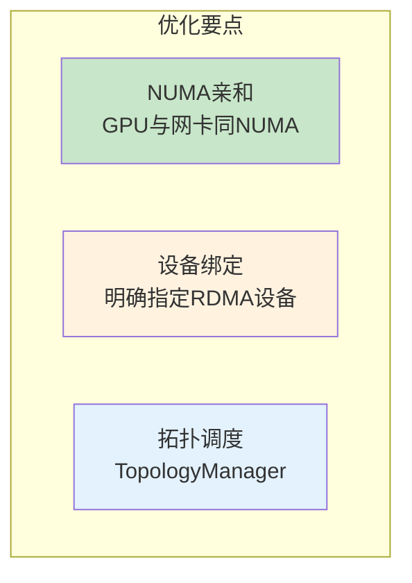
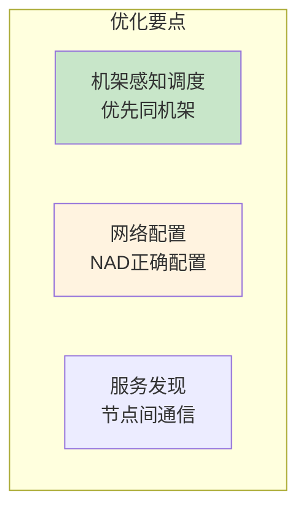
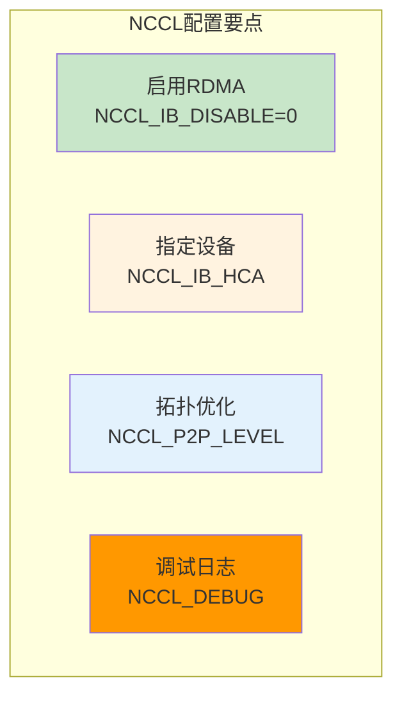
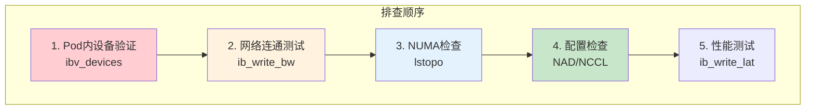

# 最佳实践总结

> 场景化配置建议：推理服务、训练任务、混合工作负载的高性能网络优化方案。

---

## 目录

- [1. 推理服务最佳实践](#1-推理服务最佳实践)
- [2. 训练任务最佳实践](#2-训练任务最佳实践)
- [3. 网络配置最佳实践](#3-网络配置最佳实践)
- [4. 排查最佳实践](#4-排查最佳实践)
- [5. 配置清单速查](#5-配置清单速查)

---

## 1. 推理服务最佳实践

### 1.1 单节点多卡推理



**推荐配置：**

```yaml
# ============================================================
# 单节点多卡推理服务最佳配置
# ============================================================

apiVersion: v1
kind: Pod
metadata:
  name: inference-server
  annotations:
    k8s.v1.cni.cncf.io/networks: rdma-network
spec:
  containers:
    - name: inference
      resources:
        limits:
          nvidia.com/gpu: 2       # 多GPU
          rdma/ib: 1              # RDMA网卡
          cpu: "8"                # 明确CPU请求

  # ============================================================
  # TopologyManager配置（节点级）
  # ============================================================
  # 需在kubelet配置中启用:
  # topologyManagerPolicy: best-effort
```

**关键检查项：**

| 检查项 | 验证方法 | 期望结果 |
|--------|----------|----------|
| NUMA亲和 | `lstopo` 对比GPU和网卡 | 同NUMA节点 |
| 设备可用 | `ibv_devices`（Pod内） | 设备存在 |
| 延迟正常 | `ib_write_lat` | < 5μs |

### 1.2 多节点分布式推理



**推荐配置：**

```yaml
# ============================================================
# 多节点推理服务最佳配置
# ============================================================

apiVersion: apps/v1
kind: Deployment
spec:
  replicas: 3

  template:
    spec:
      # ============================================================
      # 拓扑感知调度：优先同机架
      # ============================================================
      topologySpreadConstraints:
        - maxSkew: 1
          topologyKey: topology.kubernetes.io/zone
          whenUnsatisfiable: ScheduleAnyway

      affinity:
        podAffinity:
          preferredDuringSchedulingIgnoredDuringExecution:
            - weight: 100
              podAffinityTerm:
                labelSelector:
                  matchLabels:
                    app: inference
                topologyKey: topology.kubernetes.io/zone
```

---

## 2. 训练任务最佳实践

### 2.1 NCCL 配置优化



**推荐环境变量：**

```yaml
# ============================================================
# NCCL最优环境变量配置
# ============================================================

env:
  # ============================================================
  # RDMA传输（必须）
  # ============================================================
  - name: NCCL_IB_DISABLE
    value: "0"              # ← 启用IB/RDMA

  - name: NCCL_IB_HCA
    value: "^mlx5_0"        # ← 指定设备（优先）

  # ============================================================
  # 拓扑优化
  # ============================================================
  - name: NCCL_P2P_DISABLE
    value: "0"              # ← 启用P2P

  - name: NCCL_P2P_LEVEL
    value: SYS              # ← 跨节点P2P

  # ============================================================
  # 算法选择
  # ============================================================
  - name: NCCL_ALGO
    value: Ring             # ← Ring算法（大集群）

  # ============================================================
  # 调试（可选）
  # ============================================================
  - name: NCCL_DEBUG
    value: INFO             # ← 调试级别
```

### 2.2 多节点训练调度

```yaml
# ============================================================
# 多节点训练最佳配置
# ============================================================

apiVersion: batch/v1
kind: Job
spec:
  parallelism: 4            # ← 节点数

  template:
    spec:
      # ============================================================
      # 反亲和：分散到不同节点
      # ============================================================
      affinity:
        podAntiAffinity:
          requiredDuringSchedulingIgnoredDuringExecution:
            - labelSelector:
                matchLabels:
                  app: training
              topologyKey: kubernetes.io/hostname

      # ============================================================
      # 优先同机架（可选）
      # ============================================================
      podAffinity:
        preferredDuringSchedulingIgnoredDuringExecution:
          - weight: 50
            podAffinityTerm:
              labelSelector:
                matchLabels:
                  app: training
              topologyKey: topology.kubernetes.io/zone
```

---

## 3. 网络配置最佳实践

### 3.1 NAD 配置建议

```yaml
# ============================================================
# NAD最优配置模板
# ============================================================

apiVersion: k8s.cni.cncf.io/v1
kind: NetworkAttachmentDefinition
metadata:
  name: rdma-network
spec:
  config: |
    {
      "type": "host-device",

      # ============================================================
      # 设备指定（推荐：明确指定）
      # ============================================================
      "device": "mlx5_0",      # ← 明确设备名

      # ============================================================
      # IPAM配置（推荐：host-local）
      # ============================================================
      "ipam": {
        "type": "host-local",
        "subnet": "192.168.100.0/24",
        "rangeStart": "192.168.100.10",
        "rangeEnd": "192.168.100.200"
      }
    }
```

### 3.2 方案选择建议

| 场景 | 推荐方案 | 理由 |
|------|----------|------|
| **单Pod独占网卡** | host-device | 简单、性能最优 |
| **多Pod共享网卡** | SR-IOV | 硬件隔离、支持共享 |
| **测试环境** | macvlan | 配置简单、低成本 |
| **生产环境** | SR-IOV或host-device | 性能和稳定性保障 |

---

## 4. 排查最佳实践

### 4.1 排查优先级



### 4.2 快速诊断清单

| 问题症状 | 快速诊断 | 修复建议 |
|----------|----------|----------|
| **Pod内无设备** | `kubectl exec pod -- ibv_devices` | 检查NAD配置 |
| **NCCL不通** | `NCCL_DEBUG=INFO` | 检查IB_HCA配置 |
| **延迟高** | `ib_write_lat` | 检查MTU、NUMA |
| **带宽低** | `ib_write_bw` | 检查PCIe、NUMA |

---

## 5. 配置清单速查

### 5.1 Pod 资源配置

```yaml
resources:
  limits:
    nvidia.com/gpu: N       # GPU数量
    rdma/ib: M              # RDMA网卡数量
    cpu: "C"                # CPU核心数
    memory: "MEM"           # 内存大小
```

### 5.2 NCCL 环境变量

```bash
NCCL_IB_DISABLE=0          # 启用RDMA
NCCL_IB_HCA=mlx5_0         # 指定设备
NCCL_DEBUG=INFO            # 调试日志
NCCL_P2P_LEVEL=SYS         # 跨节点P2P
NCCL_ALGO=Ring             # Ring算法
```

### 5.3 节点标签

```yaml
labels:
  has-rdma: "true"                    # 有RDMA设备
  topology.kubernetes.io/zone: rack-1  # 机架拓扑
  rdma-device: mlx5_0                  # 设备名
  rdma-numa: "0"                       # NUMA位置
```

### 5.4 性能基线

| 网卡类型 | 延迟基线 | 帖宽基线 |
|----------|----------|----------|
| **IB 100G** | < 2μs | > 90Gbps |
| **RoCE 100G** | < 5μs | > 80Gbps |

---

## 附录

### A. 常见问题快速修复

| 问题 | 修复方法 |
|------|----------|
| Pod无RDMA设备 | 检查NAD的device字段是否正确 |
| NCCL使用TCP | 设置 `NCCL_IB_DISABLE=0` |
| 延迟过高 | 检查MTU配置，设置4096或9000 |
| NUMA跨节点 | 启用Topology Manager |

### B. 参考资源

- [NCCL环境变量文档](https://docs.nvidia.com/deeplearning/nccl/user-guide/docs/env.html)
- [Kubernetes Topology Manager](https://kubernetes.io/docs/tasks/administer-cluster/topology-manager/)
- [SR-IOV Device Plugin](https://github.com/k8snetworkplumbingwg/sriov-network-device-plugin)