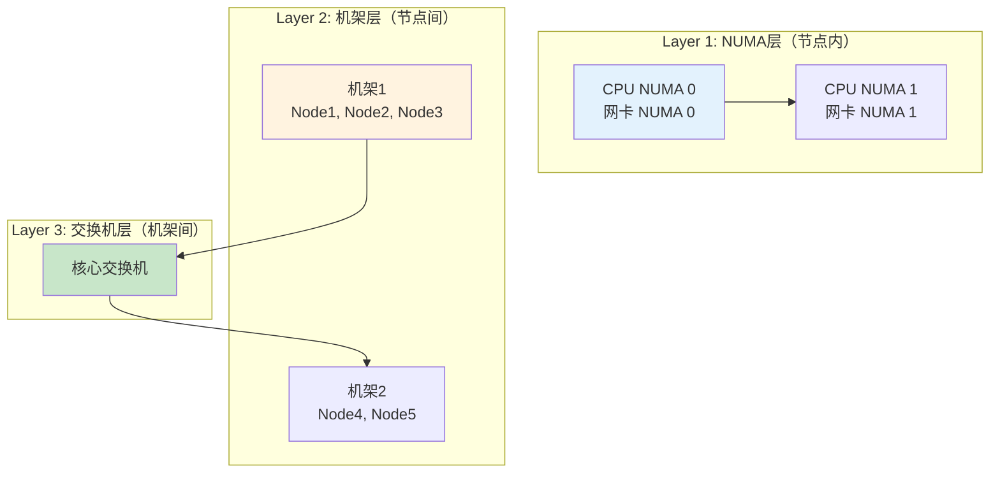
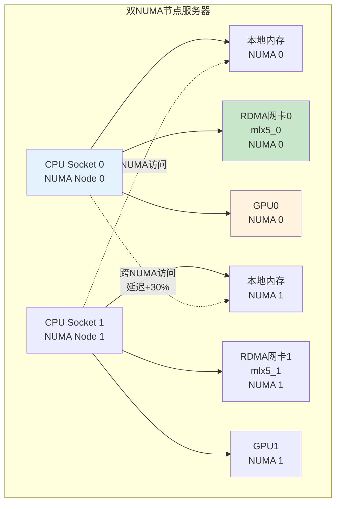
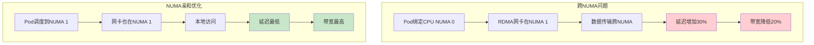
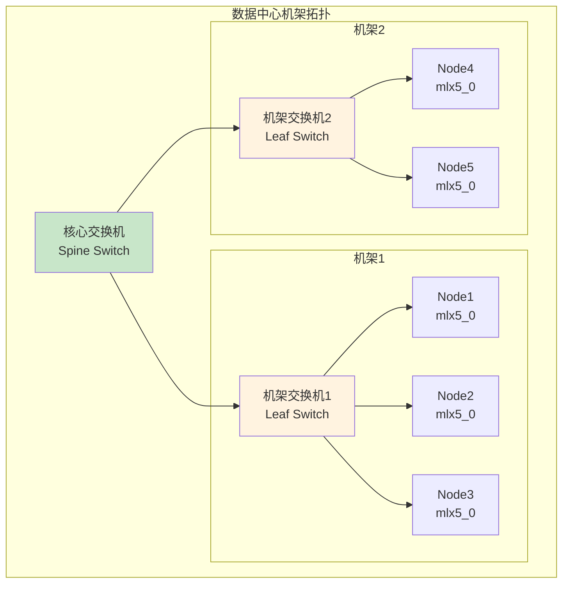
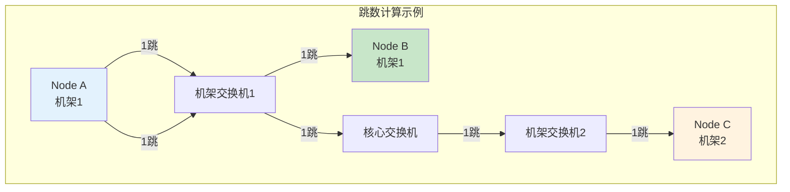

# 网络拓扑模型详解

> 理解 NUMA、机架、交换机三层拓扑模型，为拓扑感知调度提供理论基础。

---

## 目录

- [1. 拓扑模型概述](#1-拓扑模型概述)
- [2. NUMA层拓扑](#2-numa层拓扑)
- [3. 机架层拓扑](#3-机架层拓扑)
- [4. 交换机层拓扑](#4-交换机层拓扑)
- [5. 拓扑信息收集](#5-拓扑信息收集)

---

## 1. 拓扑模型概述

### 1.1 三层拓扑架构



### 1.2 拓扑影响分析

| 拓扑层级 | 延迟影响 | 帖宽影响 | 优化重点 |
|----------|----------|----------|----------|
| **NUMA层** | 跨NUMA增加30% | 跨NUMA带宽降低 | CPU与网卡NUMA一致 |
| **机架层** | 跨机架增加20% | 帖宽基本不变 | 多节点任务同机架 |
| **交换机层** | 增加网络跳数 | 帖宽不变 | 减少网络跳数 |

---

## 2. NUMA层拓扑

### 2.1 NUMA架构示意图



### 2.2 NUMA亲和重要性



### 2.3 NUMA拓扑信息结构

```go
// ============================================================
// NUMA拓扑信息结构
// ============================================================

type NUMATopology struct {
    // NUMA节点列表
    Nodes []NUMANodeInfo
}

type NUMANodeInfo struct {
    // NUMA节点ID
    ID int

    // CPU列表
    CPUs []int

    // 内存大小（MB）
    Memory int64

    // 设备列表（GPU、网卡）
    Devices []DeviceInfo
}

type DeviceInfo struct {
    // 设备ID
    ID string

    // 设备类型（GPU、NIC）
    Type string

    // 所属NUMA节点
    NUMANode int
}
```

---

## 3. 机架层拓扑

### 3.1 机架架构示意图



### 3.2 机架距离计算

| 距离类型 | 跳数 | 延迟影响 | 说明 |
|----------|------|----------|------|
| **同节点** | 0 | 0 | 无网络延迟 |
| **同机架** | 1 | +20% | 通过机架交换机 |
| **跨机架（同核心）** | 2 | +40% | 机架→核心→机架 |
| **跨核心交换机** | 3+ | +60%+ | 多跳传输 |

### 3.3 机架拓扑信息结构

```go
// ============================================================
// 机架拓扑信息结构
// ============================================================

type RackTopology struct {
    // 机架ID
    RackID string

    // 机架交换机ID
    SwitchID string

    // 核心交换机ID
    CoreSwitchID string

    // 机架内节点列表
    Nodes []string

    // 机架位置（可选）
    Location string
}

type NodeRackInfo struct {
    // 节点名称
    NodeName string

    // 所属机架ID
    RackID string

    // 机架交换机ID
    RackSwitchID string

    // 到其他节点的跳数
    HopCount map[string]int
}
```

---

## 4. 交换机层拓扑

### 4.1 网络跳数计算



### 4.2 最短路径选择

```go
// ============================================================
// 最短路径计算算法
// ============================================================

func CalculateShortestPath(source, target *NodeInfo) []string {
    // ============================================================
    // 路径选择规则
    // ============================================================
    // 1. 同节点: 直接访问
    // 2. 同机架: 通过机架交换机
    // 3. 跨机架: 通过核心交换机
    // ============================================================

    if source.NodeName == target.NodeName {
        return []string{source.NodeName}
    }

    if source.RackID == target.RackID {
        return []string{
            source.NodeName,
            source.RackSwitchID,
            target.NodeName,
        }
    }

    return []string{
        source.NodeName,
        source.RackSwitchID,
        source.CoreSwitchID,
        target.RackSwitchID,
        target.NodeName,
    }
}
```

---

## 5. 拓扑信息收集

### 5.1 NUMA信息收集

```bash
# ============================================================
# NUMA拓扑信息收集命令
# ============================================================

# 查看NUMA拓扑
lstopo

# 查看NUMA节点
numactl --hardware

# 查看设备NUMA位置
cat /sys/class/infiniband/mlx5_0/device/numa_node

# 查看GPU NUMA位置
nvidia-smi topo -m
```

### 5.2 机架信息收集

```bash
# ============================================================
# 机架拓扑信息收集方法
# ============================================================

# 方法1: 通过节点标签（推荐）
kubectl get nodes --show-labels | grep topology.kubernetes.io/zone

# 方法2: IB网络拓扑（IB网络）
ibnetdiscover

# 方法3: 手动配置（通过CMDB）
# 维护机架拓扑的CMDB系统
```

### 5.3 拓扑信息上报

```yaml
# ============================================================
# 节点拓扑标签配置（推荐方式）
# ============================================================

apiVersion: v1
kind: Node
metadata:
  name: node-1
  labels:
    # 机架拓扑标签
    topology.kubernetes.io/zone: "rack-1"
    topology.kubernetes.io/region: "datacenter-1"

    # NUMA拓扑标签（自定义）
    numa-topology.kubernetes.io/node-0: "cpus:0-7,devices:mlx5_0"
    numa-topology.kubernetes.io/node-1: "cpus:8-15,devices:mlx5_1"

    # RDMA设备标签
    has-rdma: "true"
    rdma-device: "mlx5_0"
    rdma-numa: "0"
```

---

## 附录

### A. 拓扑信息来源

| 信息类型 | 收集方法 | 更新频率 |
|----------|----------|----------|
| **NUMA拓扑** | lstopo、sysfs | 静态（硬件固定） |
| **机架拓扑** | 节点标签、CMDB | 静态或动态 |
| **交换机拓扑** | IB工具、LLDP | 动态（网络变化） |

### B. 参考资源

- [NUMA Architecture](https://www.kernel.org/doc/html/latest/admin-guide/mm/numa_memory.html)
- [Kubernetes Topology Manager](https://kubernetes.io/docs/tasks/administer-cluster/topology-manager/)
- [LLDP Protocol](https://en.wikipedia.org/wiki/Link_Layer_Discovery_Protocol)