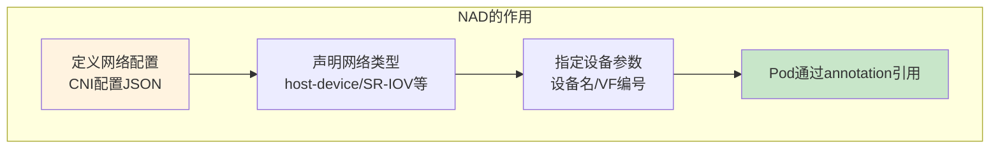
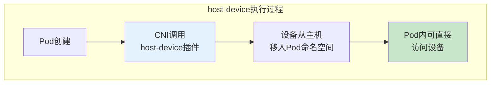
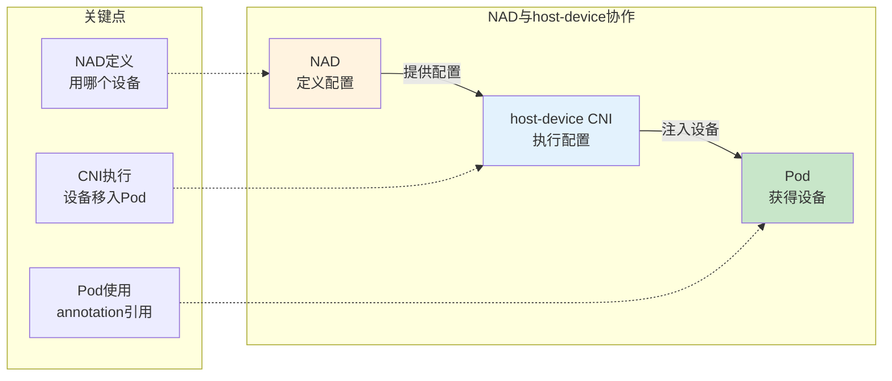
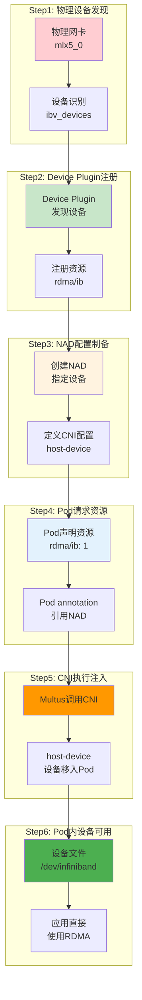
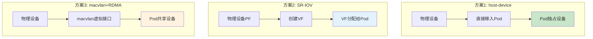
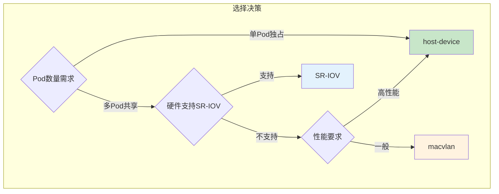
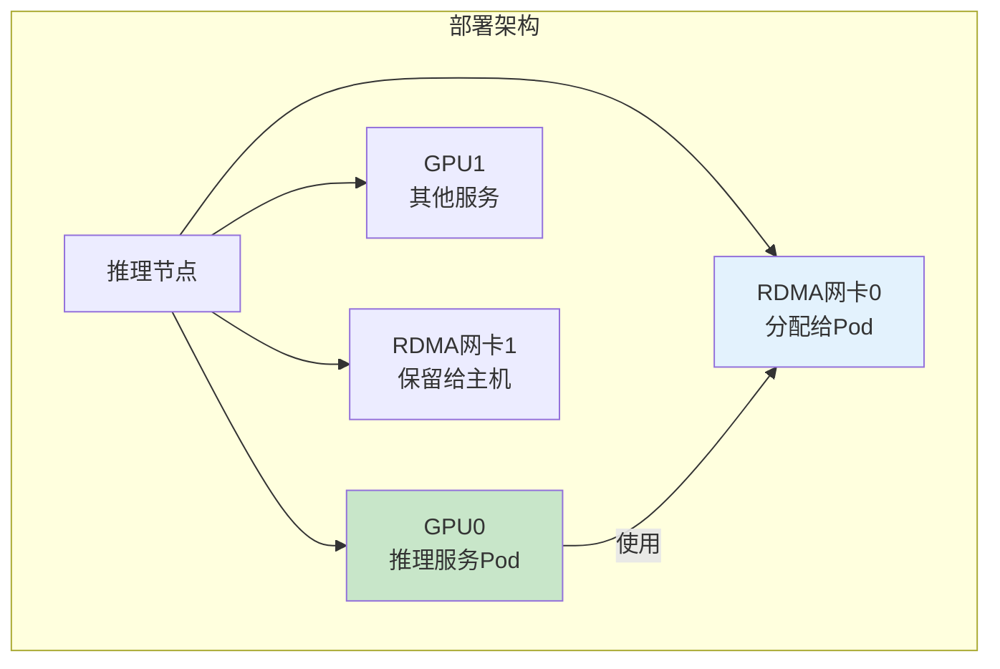
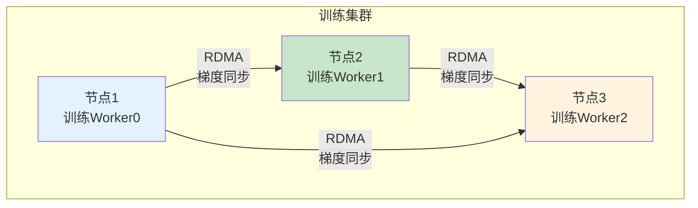
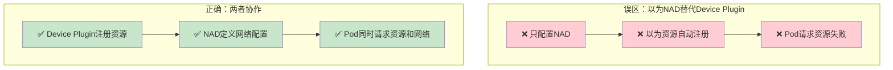
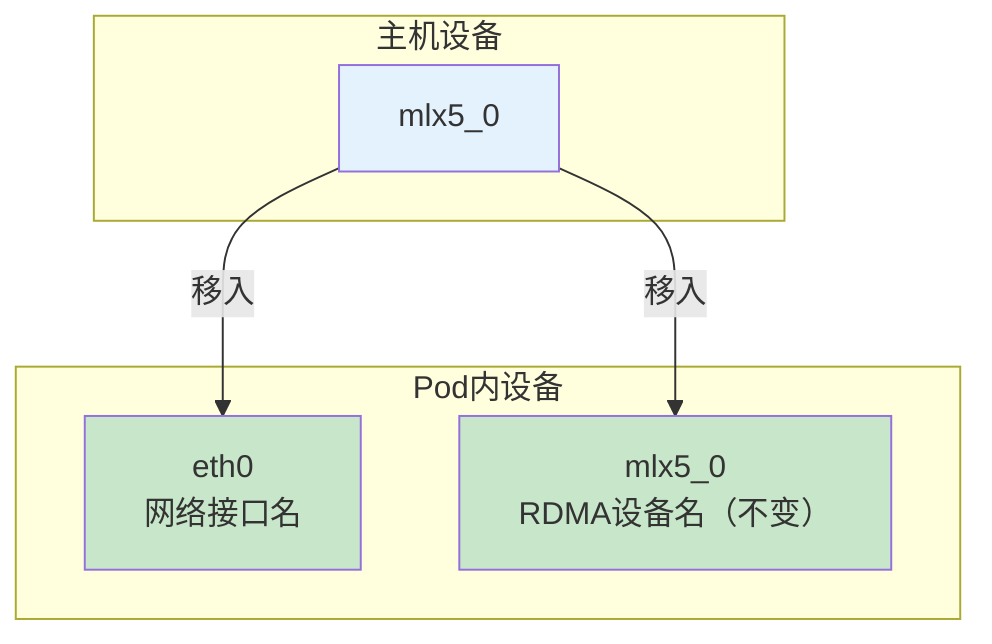

# 网络设备制备与映射详解

> 从物理网卡到 Pod 内设备的完整配置链路：理解 NetworkAttachmentDefinition 与 host-device CNI 的协作关系。

---

## 目录

- [1. 核心概念区分](#1-核心概念区分)
- [2. 完整映射链路](#2-完整映射链路)
- [3. 三种主流方案对比](#3-三种主流方案对比)
- [4. 场景A：单节点多卡推理](#4-场景a单节点多卡推理)
- [5. 场景B：多节点分布式训练](#5-场景b多节点分布式训练)
- [6. 常见误区与排查](#6-常见误区与排查)

---

## 1. 核心概念区分

### 1.1 NetworkAttachmentDefinition (NAD) 是什么

**定义**：Multus CNI 提供的 CRD，用于定义 Pod 可以附加的网络配置。



**NAD 配置示例：**

```yaml
apiVersion: k8s.cni.cncf.io/v1
kind: NetworkAttachmentDefinition
metadata:
  name: rdma-network        # ← NAD名称
spec:
  config: |
    {
      "type": "host-device",      # ← CNI插件类型
      "device": "mlx5_0",         # ← 物理设备名
      "name": "rdma-net"          # ← 网络名称
    }
```

### 1.2 host-device CNI 是什么

**定义**：一种 CNI 插件，将主机的网络设备直接移入 Pod 的网络命名空间。



**关键特性：**

| 特性 | 说明 |
|------|------|
| **设备类型** | 支持以太网设备、RDMA设备 |
| **设备移入** | 整个设备移入Pod（不是共享） |
| **设备名** | 可指定设备名或设备ID |
| **使用后恢复** | Pod删除后设备返回主机 |

### 1.3 两者的协作关系



---

## 2. 完整映射链路

### 2.1 从物理设备到 Pod 的完整流程



### 2.2 各层职责表

| 层级 | 负责内容 | 关键配置 |
|------|----------|----------|
| **物理层** | RDMA网卡硬件 | 设备名：`mlx5_0` |
| **发现层** | Device Plugin发现设备 | 注册资源：`rdma/ib` |
| **定义层** | NAD定义网络配置 | 配置：`device: mlx5_0` |
| **请求层** | Pod请求资源 | annotation: `k8s.v1.cni.cncf.io/networks` |
| **执行层** | CNI插件注入设备 | 执行：设备移入Pod |
| **使用层** | 应用访问设备 | 访问：`/dev/infiniband/mlx5_0` |

---

## 3. 三种主流方案对比

### 3.1 方案概览



### 3.2 详细对比

| 维度 | host-device | SR-IOV | macvlan + RDMA |
|------|-------------|--------|----------------|
| **设备映射方式** | 整个设备移入Pod | VF（虚拟功能）分配 | 虚拟接口共享 |
| **性能** | 最优（原生） | 高（硬件隔离） | 中（软件共享） |
| **隔离性** | 无隔离（独占） | 硬件隔离 | 软件隔离 |
| **共享能力** | 不支持 | 支持（多个VF） | 支持 |
| **硬件要求** | 无特殊要求 | 需SR-IOV支持 | 无特殊要求 |
| **配置复杂度** | 简单 | 中等 | 简单 |
| **适用场景** | 单Pod独占网卡 | 多Pod共享网卡 | 测试环境 |

### 3.3 选择建议



---

## 4. 场景A：单节点多卡推理

### 4.1 场景描述

**需求**：推理服务需要独占一张 RDMA 网卡，用于与其他节点的高速通信。



### 4.2 完整配置流程

#### Step 1: Device Plugin 注册设备

```yaml
# ============================================================
# Device Plugin 自动发现并注册 RDMA 设备
# ============================================================
# 资源类型: rdma/ib
# 设备列表: mlx5_0, mlx5_1
# 
# 注册后可通过以下命令验证:
# kubectl describe node <node-name> | grep rdma
```

#### Step 2: 创建 NetworkAttachmentDefinition

```yaml
# ============================================================
# NetworkAttachmentDefinition: RDMA网络配置
# ============================================================
# 【核心字段】
# - type: CNI插件类型
# - device: 指定物理设备名
#
# 【使用方式】
# Pod通过annotation引用此NAD

apiVersion: k8s.cni.cncf.io/v1
kind: NetworkAttachmentDefinition
metadata:
  name: rdma-network
  namespace: default
spec:
  config: |
    {
      "type": "host-device",
      "device": "mlx5_0",          # ← 指定物理RDMA设备
      "name": "rdma-net"
    }
```

#### Step 3: Pod 使用 RDMA 网络

```yaml
# ============================================================
# 推理服务Pod: 使用RDMA网卡
# ============================================================
# 【核心配置】
# - annotation引用NAD
# - resources请求RDMA资源
#
# 【结果】
# Pod内自动获得 /dev/infiniband/mlx5_0

apiVersion: v1
kind: Pod
metadata:
  name: inference-server
  annotations:
    k8s.v1.cni.cncf.io/networks: rdma-network    # ← 引用NAD名称
    # 多网络时格式: network1,network2
spec:
  containers:
    - name: inference
      image: inference-image:v1
      resources:
        limits:
          nvidia.com/gpu: 1      # GPU资源
          rdma/ib: 1             # ← RDMA网卡资源
      # ============================================================
      # 设备自动注入，无需手动配置volume
      # ============================================================
      # CNI执行后，Pod内自动存在:
      # /dev/infiniband/mlx5_0
      # /dev/infiniband/umad
      # /dev/infiniband/issm
```

### 4.3 验证设备注入

```bash
# ============================================================
# 在Pod内验证RDMA设备可用
# ============================================================

# 查看RDMA设备
ibv_devices

# 输出示例:
#    device                 node_guid
#    mlx5_0                 506b4bffff000000

# 查看设备详情
ibv_devinfo -v

# 测试RDMA通信（如果有对端节点）
ib_write_lat -d mlx5_0 -a
```

---

## 5. 场景B：多节点分布式训练

### 5.1 场景描述

**需求**：分布式训练需要多个节点，每个节点的训练 Pod 使用 RDMA 网卡进行高速梯度同步。



### 5.2 SR-IOV 方案配置（多Pod共享网卡）

#### Step 1: 创建 SR-IOV VF

```bash
# ============================================================
# 在主机上创建VF
# ============================================================

# 查看当前设备
ibv_devices
# 输出: mlx5_0

# 创建2个VF（示例）
echo 2 > /sys/class/net/mlx5_0/device/sriov_numvfs

# 验证VF创建
ibv_devices
# 输出:
#    mlx5_0        (PF)
#    mlx5_0v0      (VF0)
#    mlx5_0v1      (VF1)
```

#### Step 2: 创建 SR-IOV NAD

```yaml
# ============================================================
# SR-IOV NetworkAttachmentDefinition
# ============================================================
# 【核心字段】
# - type: sriov
# - deviceID: PF设备名
# - vf: VF编号

apiVersion: k8s.cni.cncf.io/v1
kind: NetworkAttachmentDefinition
metadata:
  name: sriov-rdma-0
spec:
  config: |
    {
      "type": "sriov",
      "deviceID": "mlx5_0",       # ← PF设备
      "vf": 0,                    # ← 使用VF0
      "name": "sriov-rdma"
    }

---
apiVersion: k8s.cni.cncf.io/v1
kind: NetworkAttachmentDefinition
metadata:
  name: sriov-rdma-1
spec:
  config: |
    {
      "type": "sriov",
      "deviceID": "mlx5_0",
      "vf": 1,                    # ← 使用VF1
      "name": "sriov-rdma"
    }
```

#### Step 3: 训练 Pod 配置

```yaml
# ============================================================
# 分布式训练Pod: 使用SR-IOV VF
# ============================================================

apiVersion: v1
kind: Pod
metadata:
  name: training-worker-0
  annotations:
    k8s.v1.cni.cncf.io/networks: sriov-rdma-0    # ← 使用VF0
spec:
  containers:
    - name: pytorch
      image: pytorch:latest
      resources:
        limits:
          nvidia.com/gpu: 2
          rdma/ib: 1
      env:
        - name: NCCL_DEBUG
          value: INFO              # ← NCCL调试日志
        - name: NCCL_IB_DISABLE
          value: "0"               # ← 启用IB/RDMA
        - name: NCCL_IB_HCA
          value: mlx5_0            # ← 指定RDMA设备
```

### 5.3 NCCL 配置优化

```yaml
# ============================================================
# NCCL环境变量配置（关键）
# ============================================================

env:
  # ============================================================
  # RDMA相关配置
  # ============================================================
  - name: NCCL_IB_DISABLE
    value: "0"                    # 启用IB/RDMA（默认）
  
  - name: NCCL_IB_HCA
    value: "^mlx5_0"              # 优先使用mlx5_0
  
  - name: NCCL_DEBUG
    value: INFO                   # 调试日志级别
  
  - name: NCCL_SOCKET_IFNAME
    value: "^eth0"                # Socket通信接口（备用）
  
  # ============================================================
  # 拓扑优化
  # ============================================================
  - name: NCCL_P2P_DISABLE
    value: "0"                    # 启用P2P传输
  
  - name: NCCL_SHM_DISABLE
    value: "0"                    # 启用共享内存
```

---

## 6. 常见误区与排查

### 6.1 误区：NAD 和 Device Plugin 的关系



**正确理解：**

| 组件 | 职责 | 不可替代 |
|------|------|----------|
| Device Plugin | 发现设备、注册资源、分配设备 | ✅ 必须 |
| NAD | 定义网络配置、CNI参数 | ✅ 必须 |
| CNI 插件 | 执行设备注入 | ✅ 必须 |

### 6.2 误区：以为设备名可以随意指定

```yaml
# ❌ 错误示例：随意指定设备名
spec:
  config: |
    {
      "type": "host-device",
      "device": "my-rdma-card"    # ← 设备不存在！
    }
```

**正确做法：**

```bash
# 先在主机上查看真实设备名
ibv_devices

# 输出: mlx5_0, mlx5_1
# 使用真实设备名配置NAD
```

### 6.3 误区：以为 Pod 内设备名与主机一致



**关键说明：**
- 网络接口名可能变化（如变为 `eth0`）
- RDMA 设备名保持不变（如 `mlx5_0`）
- 应用使用 RDMA 设备名（不是网络接口名）

### 6.4 排查检查清单

| 检查项 | 验证命令 | 期望结果 |
|--------|----------|----------|
| **主机设备存在** | `ibv_devices` | 显示设备列表 |
| **资源已注册** | `kubectl describe node` | 显示 `rdma/ib` |
| **NAD已创建** | `kubectl get nad` | 显示NAD |
| **Pod annotation正确** | `kubectl get pod -o yaml` | 显示正确引用 |
| **Pod内设备可用** | `ibv_devices`（Pod内） | 显示设备 |

---

## 附录

### A. NAD 配置参数详解

```json
{
  "type": "host-device",           // CNI插件类型
  
  "device": "mlx5_0",              // 设备名（必填）
  
  // 或使用设备ID
  "deviceID": "0000:05:00.0",      // PCI地址
  
  // 或使用驱动名
  "driver": "mlx5_core",           // 驱动名
  
  "name": "rdma-net",              // 网络名称
  
  "ipam": {                        // IP地址管理（可选）
    "type": "host-local",
    "subnet": "192.168.1.0/24"
  }
}
```

### B. 相关工具命令

```bash
# ============================================================
# 设备发现与验证
# ============================================================

# 查看RDMA设备
ibv_devices

# 查看设备详情
ibv_devinfo -v

# 查看设备PCI地址
lspci | grep Mellanox

# 查看设备NUMA位置
lstopo | grep -i mlx

# ============================================================
# Kubernetes验证
# ============================================================

# 查看节点资源
kubectl describe node <node> | grep rdma

# 查看NAD
kubectl get networkattachmentdefinition

# 查看Pod网络annotation
kubectl get pod <pod> -o jsonpath='{.metadata.annotations}'
```

---

> 下一章：[性能问题排查指南.md](性能问题排查指南.md) - 学习系统化的 RDMA 性能排查思路。