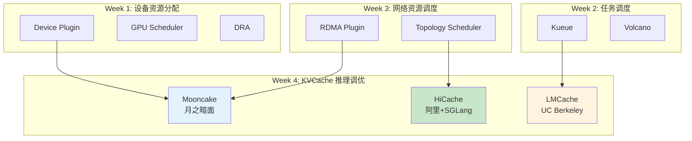
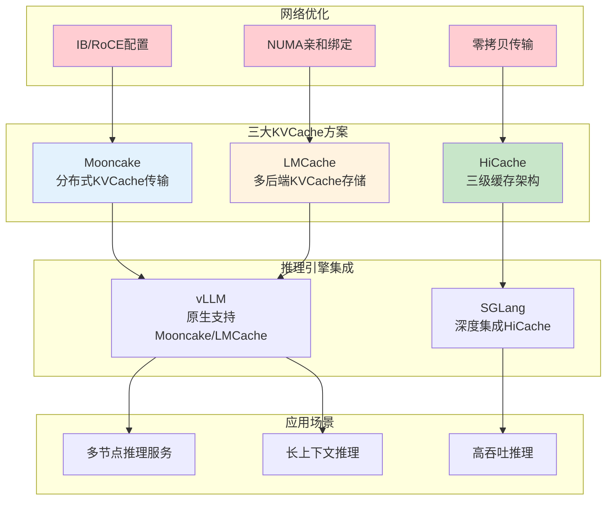
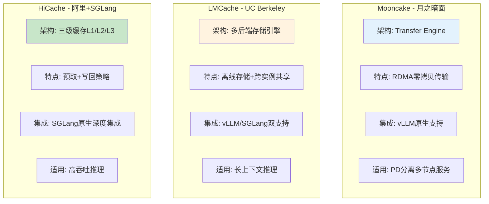
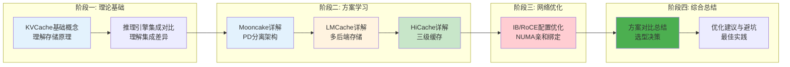
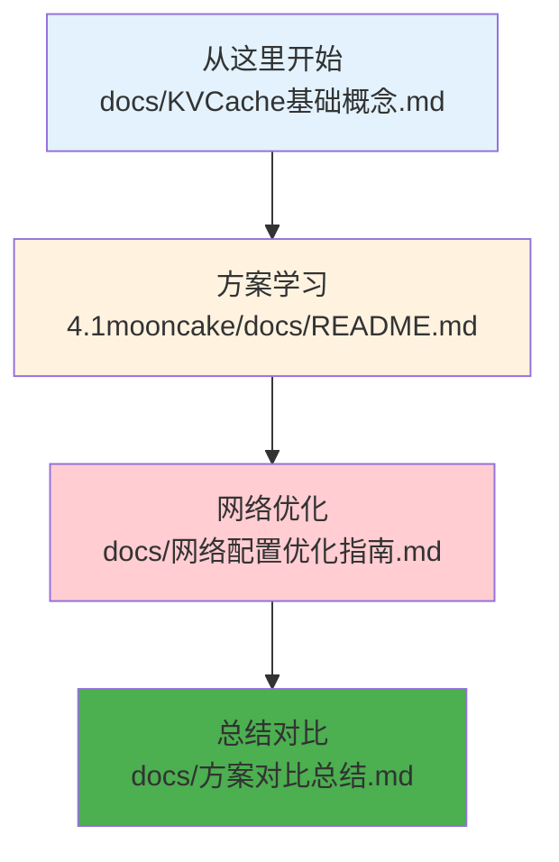

# KVCache 推理部署调优专题

> 从 Mooncake/LMCache/HiCache 三大方案，系统学习 LLM 推理中 KVCache 存储、共享与传输的完整优化路径。

---

## 学习系列总览

本项目是 Kubernetes AI Infra 学习系列的第四周内容，聚焦 KVCache 推理部署调优：



---

## 快速导航

| 文档 | 核心内容 | 学习重点 |
|------|----------|----------|
| [docs/KVCache基础概念.md](docs/KVCache基础概念.md) | 📖 **理论基础** - KVCache原理、存储架构、作用机制 | 零拷贝传输、缓存复用原理 |
| [docs/推理引擎集成对比.md](docs/推理引擎集成对比.md) | 🔗 **集成对比** - vLLM/SGLang集成方式差异 | Connector配置、角色划分 |
| [docs/网络配置优化指南.md](docs/网络配置优化指南.md) | ⭐ **核心实践** - IB/RoCE网卡配置优化 | NUMA亲和、RDMA零拷贝 |
| [docs/优化建议与避坑指南.md](docs/优化建议与避坑指南.md) | ⭐ **核心实践** - 通用优化建议与常见坑 | 性能调优、故障排查 |
| [docs/方案对比总结.md](docs/方案对比总结.md) | 📋 **总结对比** - 三方案相同思路与差异 | 选型决策、部署差异 |

| 子专题 | 开源方 | 学习文档 |
|------|----------|----------|
| [4.1mooncake/](4.1mooncake/) | 月之暗面 (kvcache-ai) | [docs/README.md](4.1mooncake/docs/README.md) |
| [4.2lmcache/](4.2lmcache/) | UC Berkeley | [docs/README.md](4.2lmcache/docs/README.md) |
| [4.3hicache/](4.3hicache/) | 阿里 + SGLang | [docs/README.md](4.3hicache/docs/README.md) |

---

## 核心特性

```
┌─────────────────────────────────────────────────────────────────────────┐
│                    KVCache 推理部署调优核心能力                             │
├─────────────────────────────────────────────────────────────────────────┤
│  ✅ KVCache存储卸载    - GPU内存卸载到CPU/分布式存储，突破显存瓶颈            │
│  ✅ 跨实例缓存共享     - 多推理实例共享KVCache，避免重复计算                  │
│  ✅ RDMA零拷贝传输     - 利用IB/RoCE实现高效KVCache传输                      │
│  ✅ PD分离架构         - Prefill与Decode分离，优化资源利用                   │
│  ✅ 多级缓存策略       - GPU/CPU/分布式三级缓存，按需预取与写回               │
└─────────────────────────────────────────────────────────────────────────┘
```

---

## 技术定位



---

## 项目结构

```
week4-kvcache推理部署调优/
│
├── docs/                              # 📖 理论文档
│   ├── KVCache基础概念.md              # KVCache原理、存储架构
│   ├── 推理引擎集成对比.md              # vLLM/SGLang集成方式对比
│   ├── 网络配置优化指南.md              # IB/RoCE网卡配置优化
│   ├── 优化建议与避坑指南.md            # 通用优化建议和常见坑
│   └── 方案对比总结.md                  # 三方案相同思路与差异对比
│
├── 4.1mooncake/                       # Mooncake子专题
│   ├── README.md                       # 概览：核心特性、快速导航
│   ├── docs/README.md                  # 详解：架构、部署、集成、优化
│   ├── manifests/                      # Kubernetes部署清单
│   │   ├── 01-mooncake-deployment.yaml
│   │   ├── 02-vllm-prefill.yaml
│   │   ├── 03-vllm-decode.yaml
│   │   ├── 04-proxy-service.yaml
│   │   └── 05-network-config.yaml
│   └── scripts/                        # 部署与测试脚本
│       ├── deploy-mooncake.sh
│       ├── verify-connection.sh
│       └── benchmark-kvcache.sh
│
├── 4.2lmcache/                         # LMCache子专题
│   ├── README.md                       # 概览
│   ├── docs/README.md                  # 详解
│   ├── manifests/
│   │   ├── 01-lmcache-server.yaml
│   │   ├── 02-vllm-integration.yaml
│   │   ├── 03-sglang-integration.yaml
│   │   └── 04-storage-backend.yaml
│   └── scripts/
│       ├── deploy-lmache.sh
│       └── benchmark-kvcache.sh
│
├── 4.3hicache/                         # HiCache子专题
│   ├── README.md                       # 概览
│   ├── docs/README.md                  # 详解
│   ├── manifests/
│   │   ├── 01-sglang-hicache.yaml
│   │   ├── 02-storage-backend.yaml
│   │   └── 03-pd-disaggregation.yaml
│   └── scripts/
│       ├── deploy-hicache.sh
│       └── test-hicache.sh
│
└── README.md                           # 本文档
```

---

## 三方案核心对比



| 维度 | Mooncake | LMCache | HiCache |
|------|----------|---------|---------|
| **开源方** | 月之暗面 (kvcache-ai) | UC Berkeley | 阿里 + SGLang |
| **核心架构** | Transfer Engine + Storage | 多后端存储引擎 | 三级缓存 L1/L2/L3 |
| **传输方式** | RDMA零拷贝 | 多协议支持 | 零拷贝+GPU辅助 |
| **vLLM集成** | MooncakeConnector | LMCacheMPConnector | 有限支持 |
| **SGLang集成** | 作为存储后端 | --enable-lmcache | 原生深度集成 |
| **适用场景** | PD分离多节点服务 | 长上下文+多实例共享 | 高吞吐单节点 |

---

## 使用示例

### Mooncake PD分离部署

```yaml
# ============================================================
# 示例: vLLM Prefill节点配置
# ============================================================
apiVersion: v1
kind: Pod
metadata:
  name: vllm-prefill
spec:
  containers:
    - name: vllm
      command:
        - vllm
        - serve
        - Qwen/Qwen2.5-7B-Instruct
        - --port=8010
        - --kv-transfer-config
        - '{"kv_connector":"MooncakeConnector","kv_role":"kv_producer"}'
```

### HiCache SGLang集成

```yaml
# ============================================================
# 示例: SGLang启用HiCache三级缓存
# ============================================================
apiVersion: v1
kind: Pod
metadata:
  name: sglang-hicache
spec:
  containers:
    - name: sglang
      command:
        - python
        - -m
        - sglang.launch_server
        - --model-path
        - Qwen/Qwen3-8B
        - --enable-hierarchical-cache
        - --hicache-ratio=2
        - --hicache-storage-backend=mooncake
```

### LMCache vLLM集成

```yaml
# ============================================================
# 示例: vLLM启用LMCache KV卸载
# ============================================================
apiVersion: v1
kind: Pod
metadata:
  name: vllm-lmcache
spec:
  containers:
    - name: vllm
      command:
        - vllm
        - serve
        - Qwen/Qwen3-8B
        - --kv-transfer-config
        - '{"kv_connector":"LMCacheMPConnector","kv_role":"kv_both"}'
      env:
        - name: LMCACHE_CONFIG_FILE
          value: /config/lmc_config.yaml
```

---

## 学习路线



---

## 前置知识

| 知识点 | 来源 | 在本专题中的应用 |
|--------|------|------------------|
| Device Plugin 机制 | Week 1 | RDMA设备注入Pod |
| RDMA/RoCE 网络 | Week 3 | KVCache传输优化 |
| NUMA拓扑感知 | Week 3 | 网卡与CPU亲和绑定 |

---

## 核心收获

完成本专题学习后，你将掌握：

| 能力维度 | 具体收获 |
|----------|----------|
| **概念理解** | KVCache存储架构、三级缓存原理、PD分离机制 |
| **方案选型** | Mooncake/LMCache/HiCache三方案的适用场景 |
| **集成能力** | vLLM/SGLang与KVCache方案的集成配置 |
| **网络优化** | IB/RoCE网卡配置、NUMA亲和绑定、零拷贝传输 |
| **实践能力** | 多节点推理服务部署、长上下文优化、高吞吐配置 |

---

## 推荐资源

### 官方文档

| 项目 | 链接 | 核心内容 |
|------|------|----------|
| Mooncake | https://github.com/kvcache-ai/Mooncake | GitHub仓库 |
| Mooncake vLLM集成 | https://docs.vllm.com.cn/en/latest/features/mooncake_connector_usage/ | vLLM Connector配置 |
| LMCache | https://docs.lmcache.ai/getting_started/quickstart.html | 快速入门 |
| HiCache设计 | https://docs.sglang.io/docs/advanced_features/hicache_design | 架构设计 |
| HiCache最佳实践 | https://docs.sglang.io/docs/advanced_features/hicache_best_practices | 配置优化 |

---

## 开始学习

**推荐路径：**



详见 **[docs/KVCache基础概念.md](docs/KVCache基础概念.md)** 开始学习。

---

> 本专题遵循 [../AGENTS.md](../AGENTS.md) 中定义的风格规范。