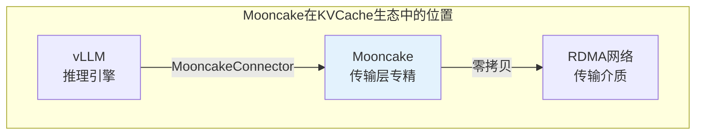
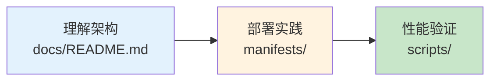

# Mooncake 子专题

> 月之暗面开源的分布式 KVCache 传输引擎，专注 RDMA 零拷贝高效传输，原生支持 vLLM PD 分离架构。

---

## 快速导航

| 文件 | 说明 |
|------|------|
| [docs/README.md](docs/README.md) | 📖 **完整详解** - 架构、部署、集成、优化 |
| [manifests/01-mooncake-deployment.yaml](manifests/01-mooncake-deployment.yaml) | 🔧 Mooncake Transfer Engine 部署 |
| [manifests/02-vllm-prefill.yaml](manifests/02-vllm-prefill.yaml) | 🔧 vLLM Prefill 节点配置 |
| [manifests/03-vllm-decode.yaml](manifests/03-vllm-decode.yaml) | 🔧 vLLM Decode 节点配置 |
| [manifests/04-proxy-service.yaml](manifests/04-proxy-service.yaml) | 🔧 Proxy 代理服务配置 |
| [manifests/05-network-config.yaml](manifests/05-network-config.yaml) | 🔧 RDMA 网络配置 |

---

## 核心特性

```
┌─────────────────────────────────────────────────────────────────┐
│              Mooncake 核心能力                                    │
├─────────────────────────────────────────────────────────────────┤
│  ✅ RDMA零拷贝传输    - 利用GPUDirect实现高效KVCache传输           │
│  ✅ PD分离原生支持    - vLLM原生Connector，Prefill/Decode分离      │
│  ✅ 分布式架构        - Transfer Engine跨节点传输                  │
│  ✅ 角色明确划分      - kv_producer/kv_consumer清晰分工            │
└─────────────────────────────────────────────────────────────────┘
```

---

## 项目定位



| 定位维度 | 说明 |
|----------|------|
| **核心能力** | RDMA零拷贝KVCache传输 |
| **设计重点** | 传输效率优先 |
| **推理引擎** | vLLM原生集成 |
| **适用场景** | PD分离多节点服务 |

---

## 项目结构

```
4.1mooncake/
│
├── README.md                       # 本文档
├── docs/
│   └── README.md                   # 完整详解文档
│
├── manifests/                      # Kubernetes部署清单
│   ├── 01-mooncake-deployment.yaml # Transfer Engine部署
│   ├── 02-vllm-prefill.yaml        # Prefill节点配置
│   ├── 03-vllm-decode.yaml         # Decode节点配置
│   ├── 04-proxy-service.yaml       # Proxy代理服务
│   └── 05-network-config.yaml      # RDMA网络配置
│
└── scripts/                        # 部署与测试脚本
    ├── deploy-mooncake.sh          # 部署脚本
    ├── verify-connection.sh        # 连接验证
    └── benchmark-kvcache.sh        # 性能测试
```

---

## 使用示例

### PD分离架构部署

```yaml
# ============================================================
# 示例: vLLM Prefill节点配置
# ============================================================
apiVersion: v1
kind: Pod
metadata:
  name: vllm-prefill
spec:
  containers:
    - name: vllm
      command:
        - vllm
        - serve
        - Qwen/Qwen2.5-7B-Instruct
        - --port=8010
        - --kv-transfer-config
        - '{"kv_connector":"MooncakeConnector","kv_role":"kv_producer"}'
      env:
        - name: VLLM_MOONCAKE_BOOTSTRAP_PORT
          value: "8998"
```

---

## 关键配置参数

| 参数 | 说明 | 推荐值 |
|------|------|--------|
| `kv_connector` | 连接器类型 | `MooncakeConnector` |
| `kv_role` | 实例角色 | `kv_producer`/`kv_consumer` |
| `mooncake_protocol` | 传输协议 | `rdma` |
| `VLLM_MOONCAKE_BOOTSTRAP_PORT` | 引导端口 | `8998` |
| `num_workers` | 工作线程数 | `10` |

---

## 学习路线



---

详见 **[docs/README.md](docs/README.md)** 获取完整架构与部署详解。