# Mooncake 架构与部署详解

> 深入理解 Mooncake Transfer Engine 架构、vLLM PD分离集成、RDMA网络配置与性能优化。

---

## 目录

- [1. 项目概述](#1-项目概述)
- [2. 核心架构](#2-核心架构)
- [3. 部署与配置](#3-部署与配置)
- [4. 推理引擎集成](#4-推理引擎集成)
- [5. 网络配置优化](#5-网络配置优化)
- [6. 优化建议与避坑](#6-优化建议与避坑)
- [附录](#附录)

---

## 1. 项目概述

### 1.1 项目定位

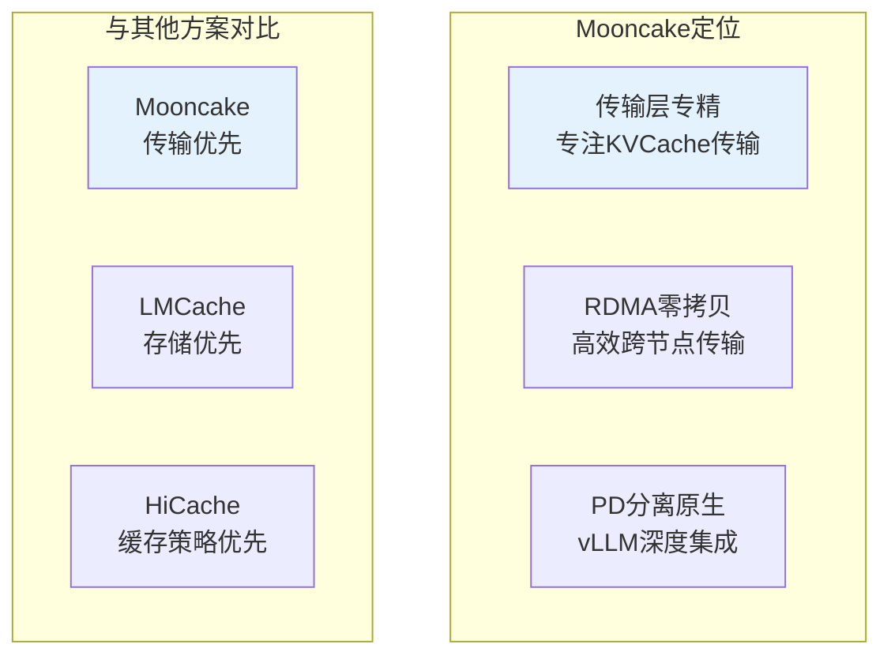

**核心定位：**

| 定位维度 | Mooncake特点 |
|----------|-------------|
| **功能聚焦** | KVCache传输引擎，不涉及存储策略 |
| **传输方式** | RDMA零拷贝，专精高效传输 |
| **推理引擎** | vLLM原生集成，SGLang作为存储后端 |
| **适用场景** | PD分离架构、多节点推理服务 |

### 1.2 适用场景分析

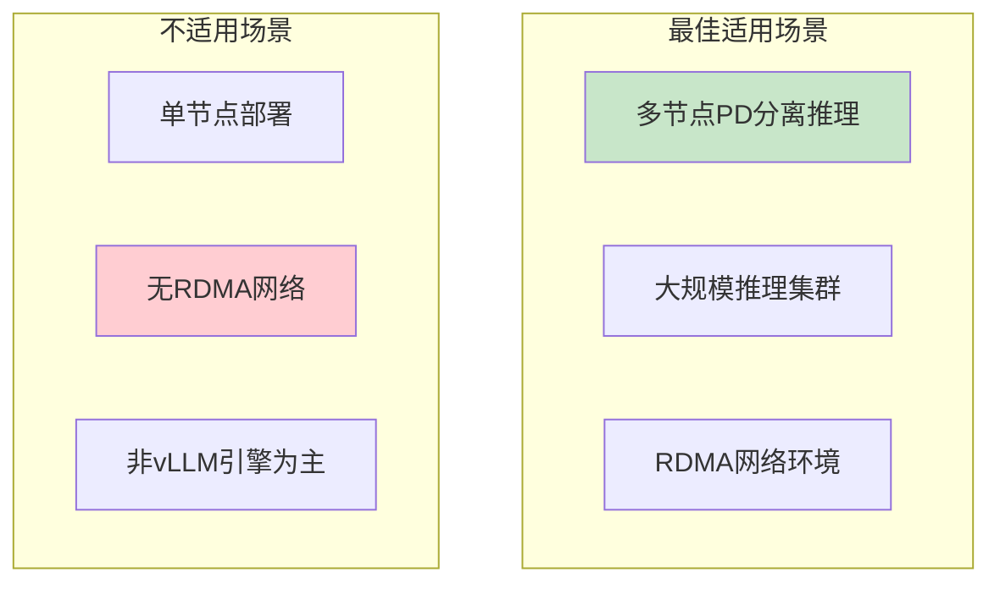

**场景适用性：**

| 场景 | 适用度 | 说明 |
|------|--------|------|
| **vLLM PD分离** | ⭐⭐⭐⭐⭐ | 原生支持，最佳选择 |
| **多节点推理集群** | ⭐⭐⭐⭐⭐ | RDMA传输专精 |
| **RDMA网络环境** | ⭐⭐⭐⭐⭐ | 必须有RDMA设备 |
| **单节点部署** | ⭐⭐ | 不需要，收益有限 |
| **SGLang为主** | ⭐⭐⭐ | 作为存储后端支持 |

---

## 2. 核心架构

### 2.1 Transfer Engine架构

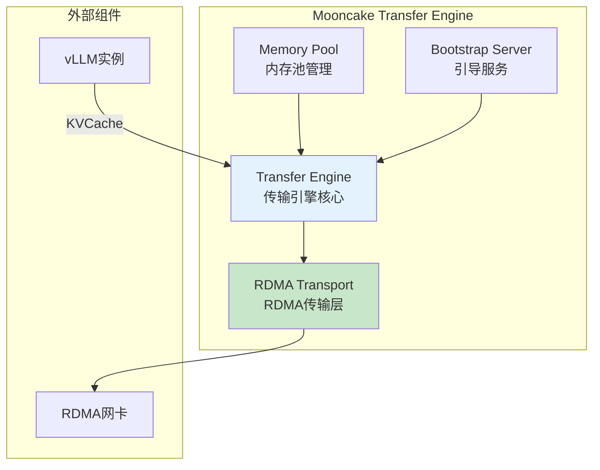

**核心组件说明：**

| 组件 | 功能 | 说明 |
|------|------|------|
| **Transfer Engine** | 传输引擎核心 | 管理KVCache传输任务 |
| **RDMA Transport** | RDMA传输层 | 零拷贝内存传输 |
| **Memory Pool** | 内存池 | 预分配内存避免动态开销 |
| **Bootstrap Server** | 引导服务 | Prefill节点启动，端口8998 |

### 2.2 PD分离架构

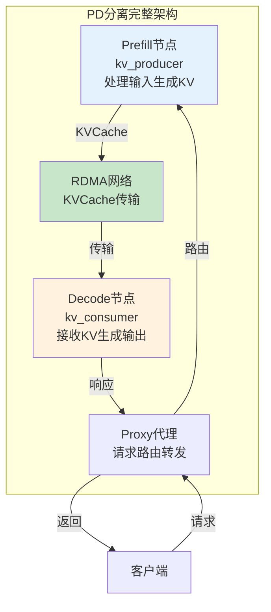

**PD分离流程：**

| 步骤 | 组件 | 操作 |
|------|------|------|
| 1 | 客户端 | 发送请求到Proxy端口8000 |
| 2 | Proxy | 路由请求到Prefill节点 |
| 3 | Prefill | 执行Prefill计算，生成KVCache |
| 4 | Transfer Engine | RDMA传输KVCache到Decode节点 |
| 5 | Decode | 加载KVCache，执行Decode生成 |
| 6 | Proxy | 返回响应给客户端 |

### 2.3 kv_role角色机制

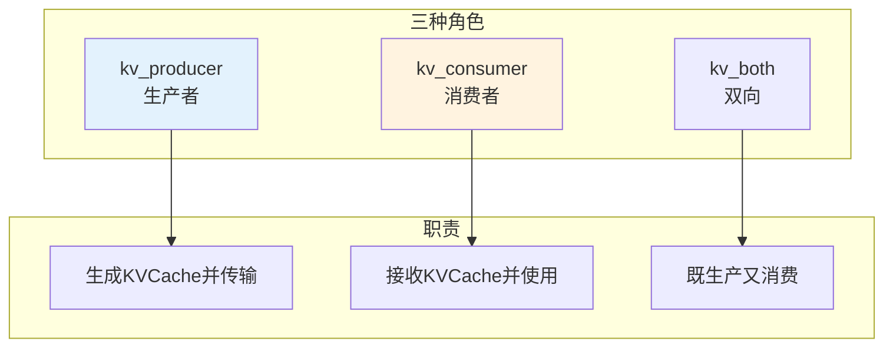

**角色职责对比：**

| 角色 | 职责 | 适用节点 | 传输方向 |
|------|------|----------|----------|
| `kv_producer` | 生成KVCache并传输出去 | Prefill节点 | → 发送 |
| `kv_consumer` | 接收KVCache并使用 | Decode节点 | ← 接收 |
| `kv_both` | 双向能力 | 实验性、角色未确定 | ↔ 双向 |

---

## 3. 部署与配置

### 3.1 部署模式选择

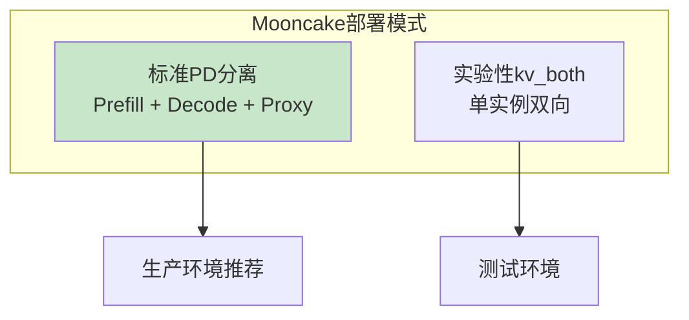

**部署模式对比：**

| 模式 | 组件数量 | 适用场景 | 配置复杂度 |
|------|----------|----------|-----------|
| **标准PD分离** | Prefill + Decode + Proxy | 生产环境 | 中等 |
| **kv_both单实例** | 单vLLM实例 | 测试实验 | 低 |

### 3.2 安装步骤

```bash
# ============================================================
# Mooncake安装步骤
# ============================================================

# Step1: 安装Mooncake Transfer Engine
uv pip install mooncake-transfer-engine

# Step2: 验证安装
python -c "import mooncake; print('Mooncake OK')"

# Step3: 验证RDMA设备（必须）
ibv_devices
ibv_devinfo
```

### 3.3 核心配置参数

**环境变量：**

| 环境变量 | 默认值 | 说明 | 设置节点 |
|----------|--------|------|----------|
| `VLLM_MOONCAKE_BOOTSTRAP_PORT` | 8998 | 引导服务器端口 | Prefill节点 |
| `VLLM_MOONCAKE_ABORT_REQUEST_TIMEOUT` | 480 | KV缓存超时释放 | 所有节点 |

**kv-transfer-config参数：**

```json
{
    "kv_connector": "MooncakeConnector",
    "kv_role": "kv_producer",  // 或 kv_consumer
    "kv_connector_extra_config": {
        "num_workers": 10,          // Prefill工作线程数
        "mooncake_protocol": "rdma" // 传输协议：rdma或tcp
    }
}
```

| 参数 | 说明 | 推荐值 |
|------|------|--------|
| `kv_connector` | 连接器类型 | `MooncakeConnector` |
| `kv_role` | 实例角色 | 根据节点类型选择 |
| `num_workers` | 工作线程数 | 10（根据网卡数调整） |
| `mooncake_protocol` | 传输协议 | `rdma`（首选） |

---

## 4. 推理引擎集成

### 4.1 与vLLM集成

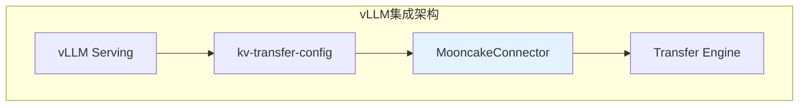

**集成方式：**

| 集成层面 | 方式 | 说明 |
|----------|------|------|
| **Connector** | `MooncakeConnector` | vLLM原生Connector |
| **配置** | `--kv-transfer-config` | JSON参数配置 |
| **角色** | `kv_role` | producer/consumer/both |

### 4.2 vLLM Prefill节点启动

```bash
# ============================================================
# vLLM Prefill节点（kv_producer）启动命令
# ============================================================

# 基础启动
vllm serve Qwen/Qwen2.5-7B-Instruct \
    --port 8010 \
    --kv-transfer-config '{
        "kv_connector": "MooncakeConnector",
        "kv_role": "kv_producer"
    }'

# 生产环境推荐配置
vllm serve Qwen/Qwen2.5-7B-Instruct \
    --port 8010 \
    --gpu-memory-utilization 0.85 \
    --enable-prefix-caching \
    --kv-transfer-config '{
        "kv_connector": "MooncakeConnector",
        "kv_role": "kv_producer",
        "kv_connector_extra_config": {
            "num_workers": 10,
            "mooncake_protocol": "rdma"
        }
    }'

# 环境变量设置
export VLLM_MOONCAKE_BOOTSTRAP_PORT=8998
export VLLM_MOONCAKE_ABORT_REQUEST_TIMEOUT=480
```

### 4.3 vLLM Decode节点启动

```bash
# ============================================================
# vLLM Decode节点（kv_consumer）启动命令
# ============================================================

# 基础启动
vllm serve Qwen/Qwen2.5-7B-Instruct \
    --port 8020 \
    --kv-transfer-config '{
        "kv_connector": "MooncakeConnector",
        "kv_role": "kv_consumer"
    }'

# 生产环境推荐配置
vllm serve Qwen/Qwen2.5-7B-Instruct \
    --port 8020 \
    --gpu-memory-utilization 0.85 \
    --kv-transfer-config '{
        "kv_connector": "MooncakeConnector",
        "kv_role": "kv_consumer",
        "kv_connector_extra_config": {
            "mooncake_protocol": "rdma"
        }
    }'
```

### 4.4 Proxy代理服务启动

```bash
# ============================================================
# Mooncake Proxy代理服务（必须启动）
# ============================================================

# 下载Proxy脚本
# 参考：vLLM examples/online_serving/disaggregated_serving/mooncake_connector/

# 启动Proxy
python mooncake_connector_proxy.py \
    --prefill http://192.168.0.2:8010 \
    --decode http://192.168.0.3:8020 \
    --port 8000

# 客户端请求发送到Proxy端口8000
curl http://proxy-server:8000/v1/completions \
    -H "Content-Type: application/json" \
    -d '{"model": "Qwen/Qwen2.5-7B-Instruct", "prompt": "Hello"}'
```

**Proxy作用：**

| 功能 | 说明 |
|------|------|
| **请求路由** | 将请求路由到Prefill节点 |
| **响应返回** | 收集Decode节点响应返回客户端 |
| **协调传输** | 协调KVCache传输时机 |

### 4.5 与SGLang集成（作为存储后端）

```bash
# ============================================================
# SGLang使用Mooncake作为L3存储后端
# ============================================================

python -m sglang.launch_server \
    --model-path Qwen/Qwen3-8B \
    --enable-hierarchical-cache \
    --hicache-storage-backend mooncake \
    --hicache-ratio 2
```

---

## 5. 网络配置优化

### 5.1 RDMA网络要求

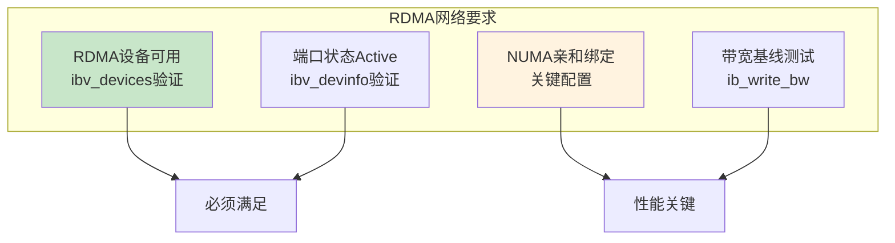

**RDMA检查清单：**

| 检查项 | 命令 | 期望结果 |
|--------|------|----------|
| RDMA设备 | `ibv_devices` | 列出mlx5_0等设备 |
| 端口状态 | `ibv_devinfo` | port_state: PORT_ACTIVE |
| NUMA位置 | `cat /sys/class/net/eth0/device/numa_node` | 与GPU同NUMA |

### 5.2 NUMA亲和配置

```bash
# ============================================================
# Mooncake NUMA亲和配置（关键优化）
# ============================================================

# Step1: 确认网卡NUMA位置
NIC_NUMA=$(cat /sys/class/net/eth0/device/numa_node)
echo "网卡NUMA: $NIC_NUMA"

# Step2: 确认GPU NUMA位置
nvidia-smi topo -m

# Step3: 启动vLLM绑定到网卡NUMA
numactl --cpunodebind=$NIC_NUMA --membind=$NIC_NUMA \
    vllm serve Qwen/Qwen2.5-7B-Instruct \
    --port 8010 \
    --kv-transfer-config '{"kv_connector":"MooncakeConnector","kv_role":"kv_producer"}'
```

### 5.3 性能基线测试

```bash
# ============================================================
# RDMA性能基线测试（部署前必须）
# ============================================================

# 带宽测试
# Server端（Prefill节点）
ib_write_bw -d mlx5_0 -a --size=1048576

# Client端（Decode节点）
ib_write_bw -d mlx5_0 -a <prefill_ip> --size=1048576

# 期望结果：IB 100G网卡 ~95-100Gbps

# 延迟测试
# Server端
ib_write_lat -d mlx5_0 -a

# Client端
ib_write_lat -d mlx5_0 -a <prefill_ip>

# 期望结果：IB ~1-2μs，NUMA亲和后保持低延迟
```

---

## 6. 优化建议与避坑

### 6.1 Mooncake特有优化建议

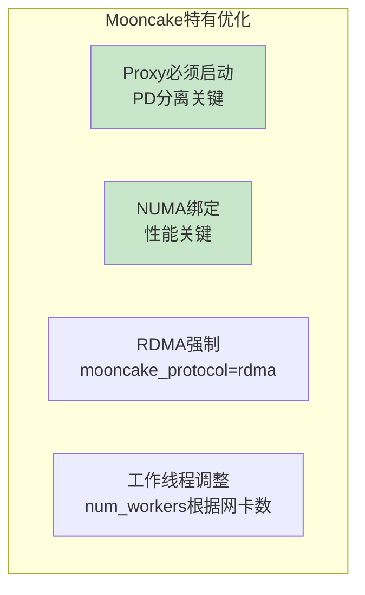

**优化建议清单：**

| 建议 | 优先级 | 说明 | 配置方法 |
|------|--------|------|----------|
| **Proxy必须启动** | P0 | PD分离架构必须组件 | `mooncake_connector_proxy.py` |
| **NUMA亲和绑定** | P0 | 性能关键，延迟影响10x | `numactl --cpunodebind` |
| **RDMA协议强制** | P1 | 避免回退到TCP | `mooncake_protocol: rdma` |
| **工作线程调整** | P2 | 多网卡场景 | `num_workers: 网卡数×2` |

### 6.2 Mooncake常见坑

**坑1：忘记启动Proxy**

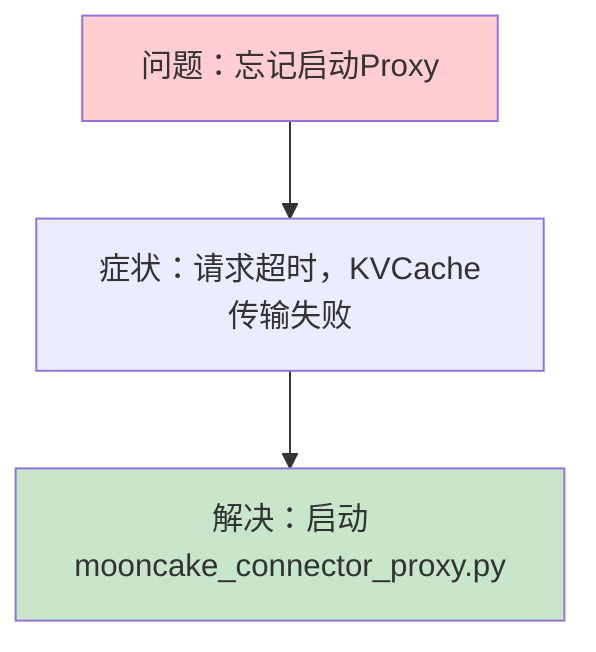

**坑2：NUMA不亲和**

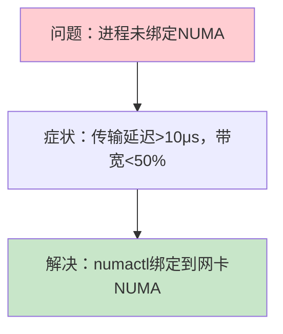

**坑3：RDMA设备未Active**

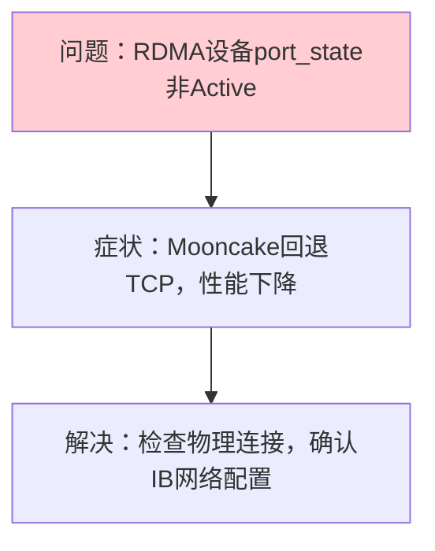

**坑4：kv_role配置错误**

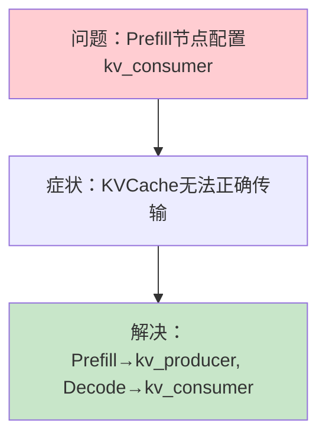

---

## 附录

### A. 配置参数速查表

| 参数类型 | 参数名 | 默认值 | 说明 |
|----------|--------|--------|------|
| 环境变量 | `VLLM_MOONCAKE_BOOTSTRAP_PORT` | 8998 | Prefill引导端口 |
| 环境变量 | `VLLM_MOONCAKE_ABORT_REQUEST_TIMEOUT` | 480 | KV缓存超时 |
| kv-transfer-config | `kv_connector` | - | MooncakeConnector |
| kv-transfer-config | `kv_role` | - | kv_producer/kv_consumer |
| kv_connector_extra_config | `num_workers` | 10 | 工作线程数 |
| kv_connector_extra_config | `mooncake_protocol` | rdma | 传输协议 |

### B. 部署命令速查

**Prefill节点：**
```bash
export VLLM_MOONCAKE_BOOTSTRAP_PORT=8998
numactl --cpunodebind=0 --membind=0 \
    vllm serve <MODEL> --port 8010 \
    --kv-transfer-config '{"kv_connector":"MooncakeConnector","kv_role":"kv_producer"}'
```

**Decode节点：**
```bash
numactl --cpunodebind=0 --membind=0 \
    vllm serve <MODEL> --port 8020 \
    --kv-transfer-config '{"kv_connector":"MooncakeConnector","kv_role":"kv_consumer"}'
```

**Proxy代理：**
```bash
python mooncake_connector_proxy.py \
    --prefill http://<PREFILL_IP>:8010 \
    --decode http://<DECODE_IP>:8020 \
    --port 8000
```

### C. 问题排查清单

| 问题 | 排查步骤 | 解决方法 |
|------|----------|----------|
| 请求超时 | 检查Proxy是否启动 | 启动Proxy服务 |
| 传输延迟高 | `ib_write_lat`测试 | NUMA绑定 |
| 带宽低 | `ib_write_bw`测试 | NUMA绑定、检查RDMA |
| KVCache传输失败 | 检查kv_role配置 | 确认角色正确 |
| RDMA连接失败 | `ibv_devinfo`检查 | 检查物理连接 |

### D. 参考资料

- [Mooncake GitHub](https://github.com/kvcache-ai/Mooncake)
- [vLLM Mooncake Connector Documentation](https://docs.vllm.com.cn/en/latest/features/mooncake_connector_usage/)
- [Mooncake Transfer Engine](https://github.com/kvcache-ai/Mooncake)

---

> 返回：[../README.md](../README.md) | 下一专题：[../4.2lmcache/](../4.2lmcache/)