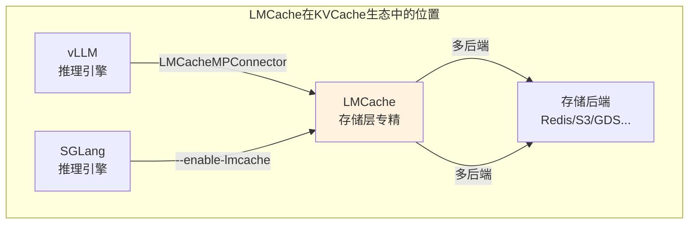
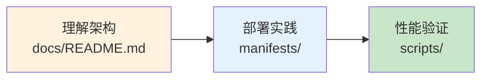

# LMCache 子专题

> UC Berkeley 开源的多后端 KVCache 存储系统，支持 vLLM/SGLang 双引擎，存储后端丰富（15+），适合长上下文与多实例共享场景。

---

## 快速导航

| 文件 | 说明 |
|------|------|
| [docs/README.md](docs/README.md) | 📖 **完整详解** - 架构、部署、集成、优化 |
| [manifests/01-lmcache-server.yaml](manifests/01-lmcache-server.yaml) | 🔧 LMCache Server 部署（MP模式） |
| [manifests/02-vllm-integration.yaml](manifests/02-vllm-integration.yaml) | 🔧 vLLM 集成配置 |
| [manifests/03-sglang-integration.yaml](manifests/03-sglang-integration.yaml) | 🔧 SGLang 集成配置 |
| [manifests/04-storage-backend.yaml](manifests/04-storage-backend.yaml) | 🔧 存储后端配置 |

---

## 核心特性

```
┌─────────────────────────────────────────────────────────────────┐
│              LMCache 核心能力                                     │
├─────────────────────────────────────────────────────────────────┤
│  ✅ 多存储后端        - 支持15+存储后端（Redis/S3/GDS/Mooncake等）  │
│  ✅ MP模式独立服务    - 多实例共享KVCache，监控端点                 │
│  ✅ 双引擎支持        - vLLM/SGLang均可集成                        │
│  ✅ 长上下文优化      - 离线存储+多模态支持                        │
└─────────────────────────────────────────────────────────────────┘
```

---

## 项目定位



| 定位维度 | 说明 |
|----------|------|
| **核心能力** | 多后端KVCache存储与跨实例共享 |
| **设计重点** | 存储灵活性优先 |
| **推理引擎** | vLLM/SGLang双支持 |
| **适用场景** | 长上下文、多实例共享 |

---

## 项目结构

```
4.2lmcache/
│
├── README.md                       # 本文档
├── docs/
│   └── README.md                   # 完整详解文档
│
├── manifests/                      # Kubernetes部署清单
│   ├── 01-lmcache-server.yaml      # LMCache Server部署
│   ├── 02-vllm-integration.yaml    # vLLM集成配置
│   ├── 03-sglang-integration.yaml  # SGLang集成配置
│   └── 04-storage-backend.yaml     # 存储后端配置
│
└── scripts/                        # 部署与测试脚本
    ├── deploy-lmache.sh            # 部署脚本
    └── benchmark-kvcache.sh        # 性能测试
```

---

## 使用示例

### MP模式部署（推荐生产）

```yaml
# ============================================================
# 示例: LMCache Server部署
# ============================================================
apiVersion: v1
kind: Pod
metadata:
  name: lmcache-server
spec:
  containers:
    - name: lmcache
      command:
        - lmcache
        - server
        - --l1-size-gb=20
        - --eviction-policy=LRU
        - --chunk-size=256
```

### vLLM集成

```bash
vllm serve Qwen/Qwen3-8B \
    --kv-transfer-config '{"kv_connector":"LMCacheMPConnector","kv_role":"kv_both"}'
```

---

## 关键配置参数

| 参数 | 说明 | 推荐值 |
|------|------|--------|
| `--l1-size-gb` | L1缓存大小 | 20GB |
| `--chunk-size` | 分块大小 | 256（生产） |
| `--eviction-policy` | 驱逐策略 | LRU |
| `kv_connector` | 连接器类型 | `LMCacheMPConnector` |
| `LMCACHE_CONFIG_FILE` | 配置文件路径 | `lmc_config.yaml` |

---

## 学习路线



---

详见 **[docs/README.md](docs/README.md)** 获取完整架构与部署详解。