# LMCache 架构与部署详解

> 深入理解 LMCache 多后端存储架构、MP/In-process模式、vLLM/SGLang集成与存储后端配置。

---

## 目录

- [1. 项目概述](#1-项目概述)
- [2. 核心架构](#2-核心架构)
- [3. 部署与配置](#3-部署与配置)
- [4. 推理引擎集成](#4-推理引擎集成)
- [5. 存储后端配置](#5-存储后端配置)
- [6. 优化建议与避坑](#6-优化建议与避坑)
- [附录](#附录)

---

## 1. 项目概述

### 1.1 项目定位

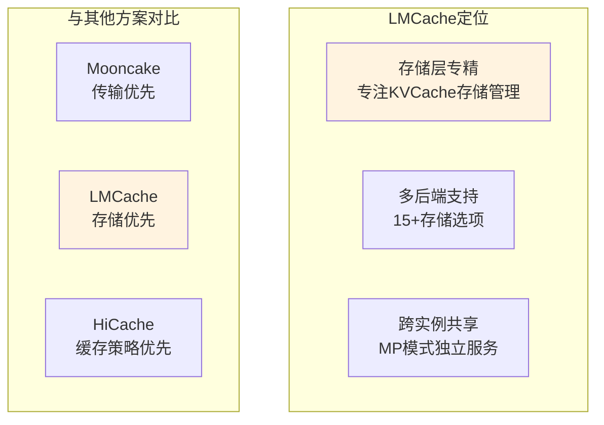

**核心定位：**

| 定位维度 | LMCache特点 |
|----------|-------------|
| **功能聚焦** | KVCache存储管理，多后端支持 |
| **存储方式** | 15+存储后端，覆盖各类场景 |
| **推理引擎** | vLLM/SGLang双引擎支持 |
| **适用场景** | 长上下文、多实例共享、多模态 |

### 1.2 适用场景分析

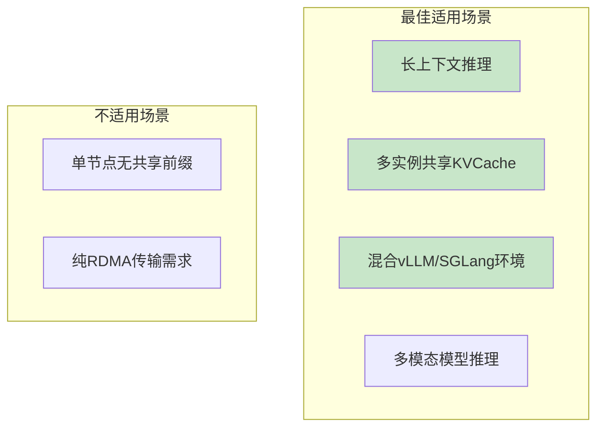

**场景适用性：**

| 场景 | 适用度 | 说明 |
|------|--------|------|
| **长上下文推理** | ⭐⭐⭐⭐⭐ | 多后端存储容量大 |
| **多实例共享** | ⭐⭐⭐⭐⭐ | MP模式专门支持 |
| **双引擎环境** | ⭐⭐⭐⭐⭐ | vLLM/SGLang均支持 |
| **多模态模型** | ⭐⭐⭐⭐⭐ | 唯一支持多模态KV |
| **PD分离** | ⭐⭐⭐⭐ | 支持，但Mooncake更专精 |

---

## 2. 核心架构

### 2.1 多后端存储架构

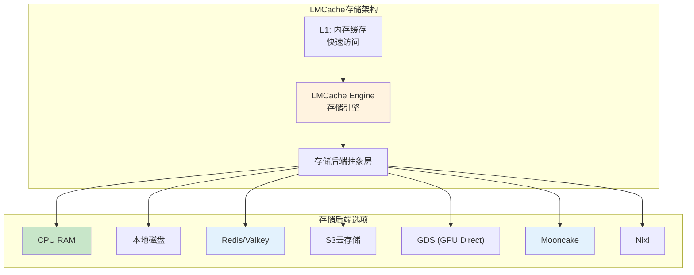

**存储后端分类：**

| 类别 | 后端 | 特点 | 适用场景 |
|------|------|------|----------|
| **本地存储** | CPU RAM、本地磁盘 | 低延迟、容量受限 | 单节点快速 |
| **分布式缓存** | Redis、Valkey、RESP | 分布式共享 | 多实例集群 |
| **云存储** | S3、GDS | 大容量、持久化 | 长上下文 |
| **高性能传输** | Mooncake、Nixl、InfiniStore | RDMA优化 | 高性能场景 |
| **企业存储** | Weka、Maru、Device-DAX | 生产级 | 企业部署 |

### 2.2 MP模式架构

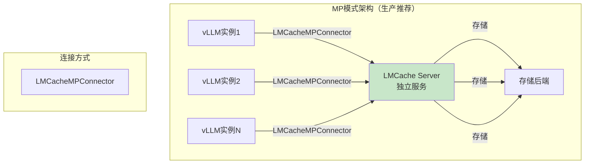

**MP模式优势：**

| 优势 | 说明 |
|------|------|
| **跨实例共享** | 多个推理实例共享同一KVCache存储 |
| **独立管理** | LMCache Server独立运行，便于管理 |
| **监控端点** | 提供/metrics监控端点 |
| **持久化** | 支持持久化存储配置 |

### 2.3 In-process模式架构

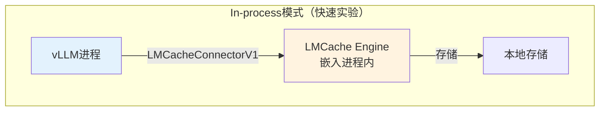

**In-process模式特点：**

| 特点 | 说明 |
|------|------|
| **单命令启动** | 不需要独立LMCache Server |
| **快速实验** | 适合单节点测试验证 |
| **无跨实例共享** | 无法跨实例共享KVCache |
| **无监控端点** | 不提供独立监控 |

---

## 3. 部署与配置

### 3.1 MP模式 vs In-process模式选择

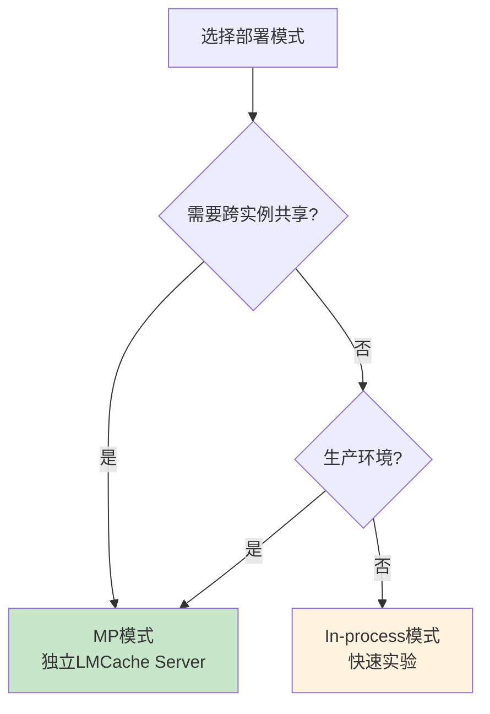

**模式选择建议：**

| 场景 | 推荐模式 | 原因 |
|------|----------|------|
| **生产环境** | MP模式 | 独立服务、监控、跨实例共享 |
| **多实例集群** | MP模式 | 跨实例共享KVCache |
| **单节点测试** | In-process | 快速部署、无额外组件 |
| **长上下文持久化** | MP模式 | 支持持久化存储 |

### 3.2 安装步骤

```bash
# ============================================================
# LMCache安装步骤
# ============================================================

# vLLM集成安装
uv pip install lmcache vllm

# SGLang集成安装
uv pip install --prerelease=allow lmcache "sglang"
```

### 3.3 MP模式部署

**启动LMCache Server：**

```bash
# ============================================================
# LMCache Server启动（MP模式核心）
# ============================================================

# 基础启动
lmcache server --l1-size-gb 20 --eviction-policy LRU --chunk-size 256

# 生产环境推荐配置
lmcache server \
    --l1-size-gb 20 \
    --eviction-policy LRU \
    --chunk-size 256 \
    --port 8000

# 使用配置文件
export LMCACHE_CONFIG_FILE=$PWD/lmc_config.yaml
lmcache server
```

**LMCache配置文件示例：**

```yaml
# ============================================================
# lmc_config.yaml - LMCache配置文件
# ============================================================

# 分块大小（生产环境推荐256）
chunk_size: 256

# 本地CPU存储
local_cpu: true
max_local_cpu_size: 20  # GB

# 分层传输
use_layerwise: true

# 存储后端配置（可选）
# storage_backend: redis
# redis_host: localhost
# redis_port: 6379
```

### 3.4 核心配置参数

**LMCache Server参数：**

| 参数 | 默认值 | 说明 | 推荐值 |
|------|--------|------|--------|
| `--l1-size-gb` | - | L1缓存大小（GB） | 20 |
| `--eviction-policy` | - | 驱逐策略 | LRU |
| `--chunk-size` | - | 分块大小 | 256（生产） |
| `--port` | - | 监控端口 | 8000 |

**环境变量：**

| 环境变量 | 说明 |
|----------|------|
| `LMCACHE_CONFIG_FILE` | 配置文件路径 |
| `LMCACHE_CHUNK_SIZE` | 分块大小 |
| `LMCACHE_LOCAL_CPU` | 启用本地CPU存储 |
| `LMCACHE_MAX_LOCAL_CPU_SIZE` | CPU存储容量（GB） |

---

## 4. 推理引擎集成

### 4.1 与vLLM集成

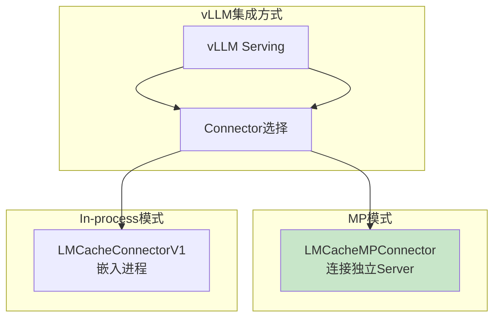

**Connector选择：**

| Connector | 模式 | 特点 | 适用场景 |
|-----------|------|------|----------|
| `LMCacheMPConnector` | MP模式 | 独立服务、多实例共享 | 生产环境 |
| `LMCacheConnectorV1` | In-process | 单命令启动 | 单节点测试 |

**MP模式vLLM集成：**

```bash
# ============================================================
# vLLM + LMCache MP模式集成
# ============================================================

# Step1: 启动LMCache Server（独立运行）
lmcache server --l1-size-gb 20 --chunk-size 256 --port 8000

# Step2: 启动vLLM连接LMCache
vllm serve Qwen/Qwen3-8B \
    --port 8001 \
    --gpu-memory-utilization 0.85 \
    --kv-transfer-config '{"kv_connector":"LMCacheMPConnector","kv_role":"kv_both"}'
```

**In-process模式vLLM集成：**

```bash
# ============================================================
# vLLM + LMCache In-process模式（快速实验）
# ============================================================

# 单命令启动，无需LMCache Server
LMCACHE_CHUNK_SIZE=256 \
LMCACHE_LOCAL_CPU=true \
LMCACHE_MAX_LOCAL_CPU_SIZE=20 \
vllm serve Qwen/Qwen3-8B \
    --port 8000 \
    --kv-transfer-config '{"kv_connector":"LMCacheConnectorV1","kv_role":"kv_both"}'
```

**vLLM简化命令（0.6.0+）：**

```bash
# ============================================================
# vLLM内置KV卸载参数（简化）
# ============================================================

vllm serve Qwen/Qwen3-8B \
    --kv-offloading-backend lmcache \
    --kv-offloading-size 20 \
    --disable-hybrid-kv-cache-manager
```

### 4.2 与SGLang集成

```bash
# ============================================================
# SGLang + LMCache集成
# ============================================================

# 使用配置文件
export LMCACHE_CONFIG_FILE=$PWD/lmc_config.yaml

# 启动SGLang
python -m sglang.launch_server \
    --model-path Qwen/Qwen3-8B \
    --port 30000 \
    --enable-lmcache
```

---

## 5. 存储后端配置

### 5.1 存储后端选择

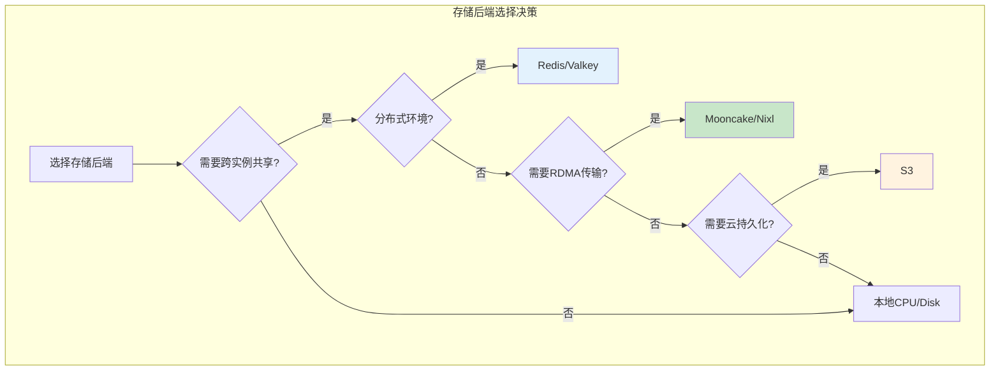

**存储后端对比：**

| 后端 | 延迟 | 容量 | 共享能力 | 适用场景 |
|------|------|------|----------|----------|
| **CPU RAM** | ~10μs | 中 | 单实例 | 单节点快速 |
| **本地磁盘** | ~100μs | 大 | 单实例 | 长上下文单节点 |
| **Redis** | ~50μs | 大 | 多实例 | 分布式共享 |
| **S3** | ~ms级 | 无限 | 多实例 | 云持久化 |
| **Mooncake** | ~2μs | 中 | 多实例 | RDMA高性能 |
| **GDS** | ~μs级 | 大 | 单实例 | GPU直存 |

### 5.2 Redis后端配置

```yaml
# ============================================================
# LMCache Redis后端配置
# ============================================================

# lmc_config.yaml
chunk_size: 256
local_cpu: false

# Redis后端
storage_backend: redis
redis_host: redis-server
redis_port: 6379
redis_password: ""  # 可选
```

### 5.3 Mooncake后端配置

```yaml
# ============================================================
# LMCache Mooncake后端配置（RDMA传输）
# ============================================================

chunk_size: 256
storage_backend: mooncake

# Mooncake配置
mooncake_protocol: rdma
mooncake_segment_size: 1073741824  # 1GB
```

### 5.4 S3后端配置

```yaml
# ============================================================
# LMCache S3后端配置（云持久化）
# ============================================================

chunk_size: 256
storage_backend: s3

# S3配置
s3_endpoint: https://s3.amazonaws.com
s3_bucket: kvcache-storage
s3_access_key: YOUR_ACCESS_KEY
s3_secret_key: YOUR_SECRET_KEY
```

---

## 6. 优化建议与避坑

### 6.1 LMCache特有优化建议

**优化建议清单：**

| 建议 | 优先级 | 说明 | 配置方法 |
|------|--------|------|----------|
| **MP模式优先** | P0 | 生产环境必须MP模式 | 使用LMCacheMPConnector |
| **chunk_size=256** | P1 | 生产环境分块大小 | `--chunk-size 256` |
| **LRU驱逐策略** | P1 | 合理的驱逐策略 | `--eviction-policy LRU` |
| **存储后端选择** | P1 | 根据场景选择后端 | 配置文件指定 |
| **监控端点利用** | P2 | MP模式监控 | `/metrics`端点 |

### 6.2 LMCache常见坑

**坑1：In-process模式误用于生产**

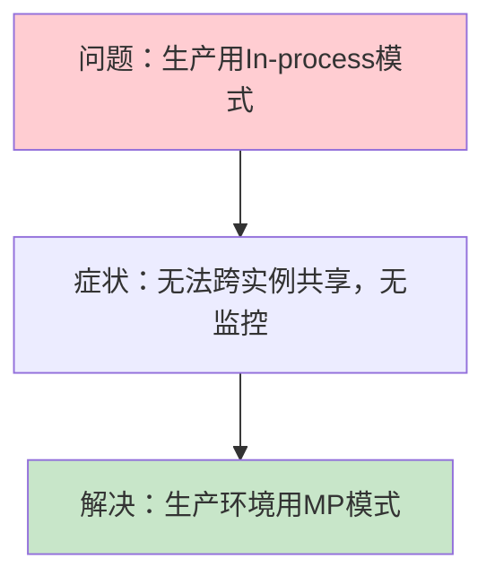

**坑2：chunk_size配置过小**

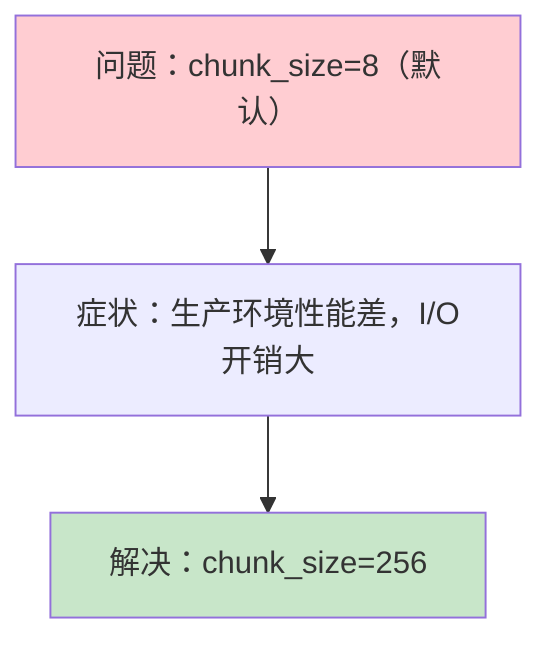

**坑3：存储容量不足**

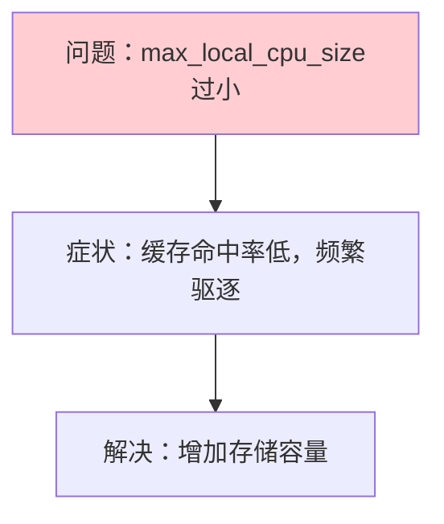

---

## 附录

### A. 配置参数速查表

| 参数类型 | 参数名 | 推荐值 | 说明 |
|----------|--------|--------|------|
| Server参数 | `--l1-size-gb` | 20 | L1缓存大小 |
| Server参数 | `--chunk-size` | 256 | 分块大小 |
| Server参数 | `--eviction-policy` | LRU | 驱逐策略 |
| 环境变量 | `LMCACHE_CHUNK_SIZE` | 256 | 分块大小 |
| 环境变量 | `LMCACHE_MAX_LOCAL_CPU_SIZE` | 20 | CPU存储容量 |
| kv-transfer-config | `kv_connector` | LMCacheMPConnector | MP模式 |
| kv-transfer-config | `kv_connector` | LMCacheConnectorV1 | In-process |

### B. 部署命令速查

**MP模式：**
```bash
# LMCache Server
lmcache server --l1-size-gb 20 --chunk-size 256

# vLLM
vllm serve <MODEL> --kv-transfer-config '{"kv_connector":"LMCacheMPConnector","kv_role":"kv_both"}'
```

**In-process模式：**
```bash
LMCACHE_CHUNK_SIZE=256 LMCACHE_LOCAL_CPU=true \
vllm serve <MODEL> --kv-transfer-config '{"kv_connector":"LMCacheConnectorV1","kv_role":"kv_both"}'
```

**SGLang：**
```bash
export LMCACHE_CONFIG_FILE=$PWD/lmc_config.yaml
python -m sglang.launch_server --model-path <MODEL> --enable-lmcache
```

### C. 参考资料

- [LMCache Documentation](https://docs.lmcache.ai/)
- [LMCache GitHub](https://github.com/LMCache/LMCache)
- [LMCache Quick Start](https://docs.lmcache.ai/getting_started/quickstart.html)

---

> 返回：[../README.md](../README.md) | 下一专题：[../4.3hicache/](../4.3hicache/)