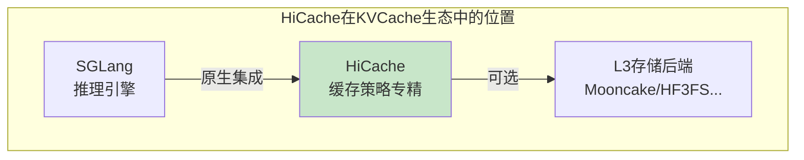
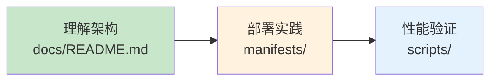

# HiCache 子专题

> 阿里参与开源、与 SGLang 深度集成的三级缓存架构，原生支持 L1/L2/L3 分层缓存，适合高吞吐推理场景。

---

## 快速导航

| 文件 | 说明 |
|------|------|
| [docs/README.md](docs/README.md) | 📖 **完整详解** - 架构、部署、集成、优化 |
| [manifests/01-sglang-hicache.yaml](manifests/01-sglang-hicache.yaml) | 🔧 SGLang HiCache 配置 |
| [manifests/02-storage-backend.yaml](manifests/02-storage-backend.yaml) | 🔧 L3 存储后端配置 |
| [manifests/03-pd-disaggregation.yaml](manifests/03-pd-disaggregation.yaml) | 🔧 PD 分离配置 |

---

## 核心特性

```
┌─────────────────────────────────────────────────────────────────┐
│              HiCache 核心能力                                     │
├─────────────────────────────────────────────────────────────────┤
│  ✅ 三级缓存架构      - L1(GPU)/L2(CPU)/L3(分布式)分层管理          │
│  ✅ SGLang原生集成    - 内置集成，参数简洁                         │
│  ✅ 预取写回策略      - 多种策略选择，灵活优化                      │
│  ✅ 异构TP支持        - 跨集群KV复用，tp_lcm_size配置               │
└─────────────────────────────────────────────────────────────────┘
```

---

## 项目定位



| 定位维度 | 说明 |
|----------|------|
| **核心能力** | 三级缓存分层管理，预取写回策略 |
| **设计重点** | 缓存策略优化，与SGLang深度集成 |
| **推理引擎** | SGLang原生集成 |
| **适用场景** | 高吞吐推理、多轮对话 |

---

## 项目结构

```
4.3hicache/
│
├── README.md                       # 本文档
├── docs/
│   └── README.md                   # 完整详解文档
│
├── manifests/                      # Kubernetes部署清单
│   ├── 01-sglang-hicache.yaml      # SGLang HiCache配置
│   ├── 02-storage-backend.yaml     # L3存储后端配置
│   └── 03-pd-disaggregation.yaml   # PD分离配置
│
└── scripts/                        # 部署与测试脚本
    ├── deploy-hicache.sh           # 部署脚本
    └── test-hicache.sh             # 测试脚本
```

---

## 使用示例

### SGLang启用HiCache

```yaml
# ============================================================
# 示例: SGLang启用三级缓存
# ============================================================
apiVersion: v1
kind: Pod
metadata:
  name: sglang-hicache
spec:
  containers:
    - name: sglang
      command:
        - python
        - -m
        - sglang.launch_server
        - --model-path=Qwen/Qwen3-8B
        - --enable-hierarchical-cache
        - --hicache-ratio=2
        - --hicache-storage-backend=mooncake
```

---

## 关键配置参数

| 参数 | 说明 | 推荐值 |
|------|------|--------|
| `--enable-hierarchical-cache` | 启用分层缓存 | 必须启用 |
| `--hicache-ratio` | L2/GPU内存比例 | 2 |
| `--page-size` | 缓存页粒度 | 64 |
| `--hicache-io-backend` | CPU-GPU传输后端 | kernel / direct |
| `--hicache-storage-backend` | L3存储后端 | mooncake / hf3fs |
| `--hicache-write-policy` | 写回策略 | write_through |
| `--hicache-storage-prefetch-policy` | 预取策略 | timeout |

---

## 学习路线



---

详见 **[docs/README.md](docs/README.md)** 获取完整架构与部署详解。