# HiCache 架构与部署详解

> 深入理解 HiCache 三级缓存架构、预取写回策略、SGLang原生集成与L3存储后端配置。

---

## 目录

- [1. 项目概述](#1-项目概述)
- [2. 核心架构](#2-核心架构)
- [3. 部署与配置](#3-部署与配置)
- [4. 推理引擎集成](#4-推理引擎集成)
- [5. 存储后端配置](#5-存储后端配置)
- [6. 优化建议与避坑](#6-优化建议与避坑)
- [附录](#附录)

---

## 1. 项目概述

### 1.1 项目定位

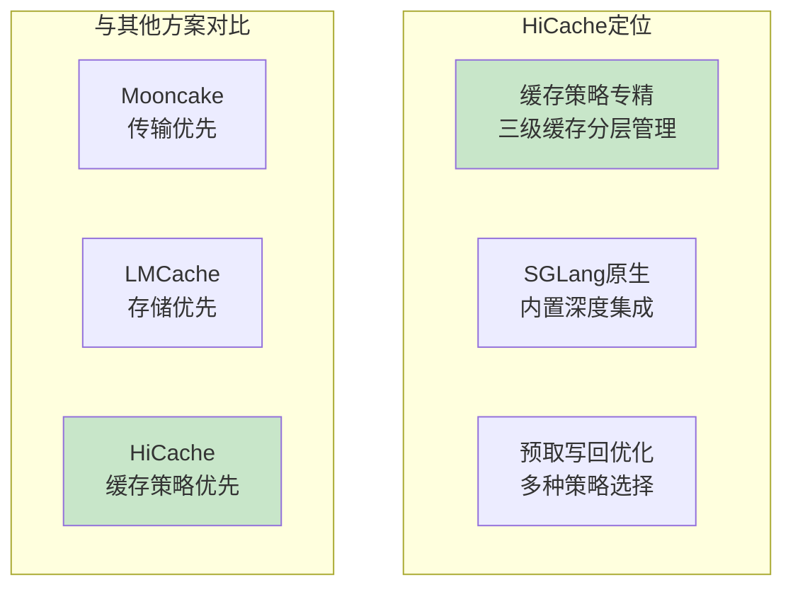

**核心定位：**

| 定位维度 | HiCache特点 |
|----------|-------------|
| **功能聚焦** | 三级缓存分层管理与策略优化 |
| **缓存架构** | L1(GPU)/L2(CPU)/L3(分布式) |
| **推理引擎** | SGLang原生深度集成 |
| **适用场景** | 高吞吐推理、多轮对话、SystemPrompt共享 |

### 1.2 适用场景分析

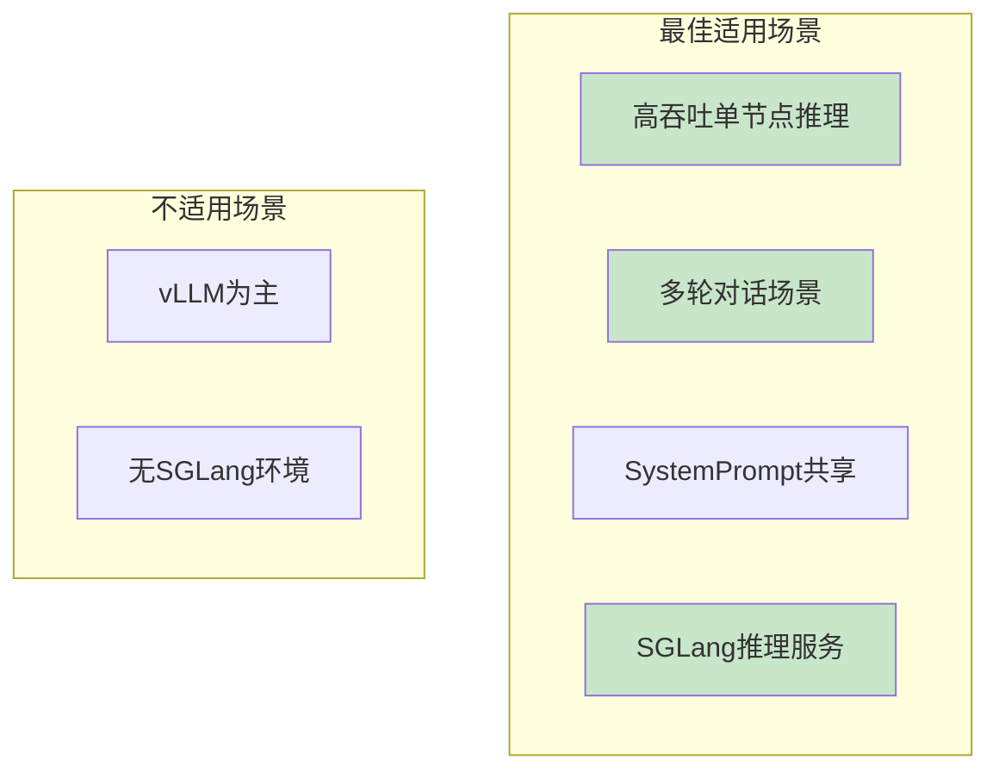

**场景适用性：**

| 场景 | 适用度 | 说明 |
|------|--------|------|
| **SGLang高吞吐** | ⭐⭐⭐⭐⭐ | 原生集成，最佳选择 |
| **多轮对话** | ⭐⭐⭐⭐⭐ | 预取优化，缓存命中率高 |
| **SystemPrompt共享** | ⭐⭐⭐⭐⭐ | wait_complete策略收益大 |
| **异构TP集群** | ⭐⭐⭐⭐⭐ | tp_lcm_size跨集群复用 |
| **vLLM环境** | ⭐⭐ | 有限支持，非主方向 |

---

## 2. 核心架构

### 2.1 三级缓存架构

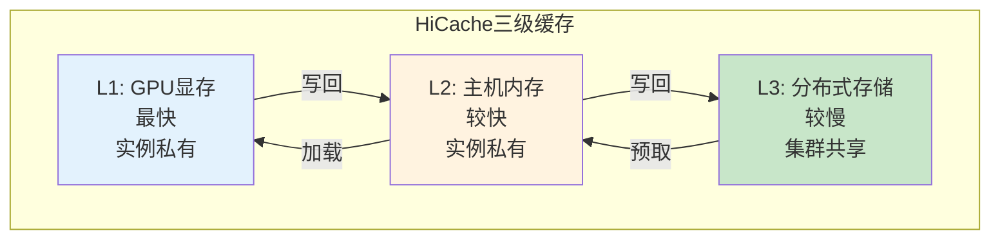

**各级缓存特性：**

| 层级 | 位置 | 带宽 | 容量 | 共享范围 |
|------|------|------|------|----------|
| **L1** | GPU显存 | ~1TB/s | 小（24-80GB） | 实例私有 |
| **L2** | 主机内存 | ~100GB/s | 中（128-512GB） | 实例私有 |
| **L3** | 分布式存储 | ~10GB/s | 大（TB级） | 集群共享 |

### 2.2 HiRadixTree元数据组织

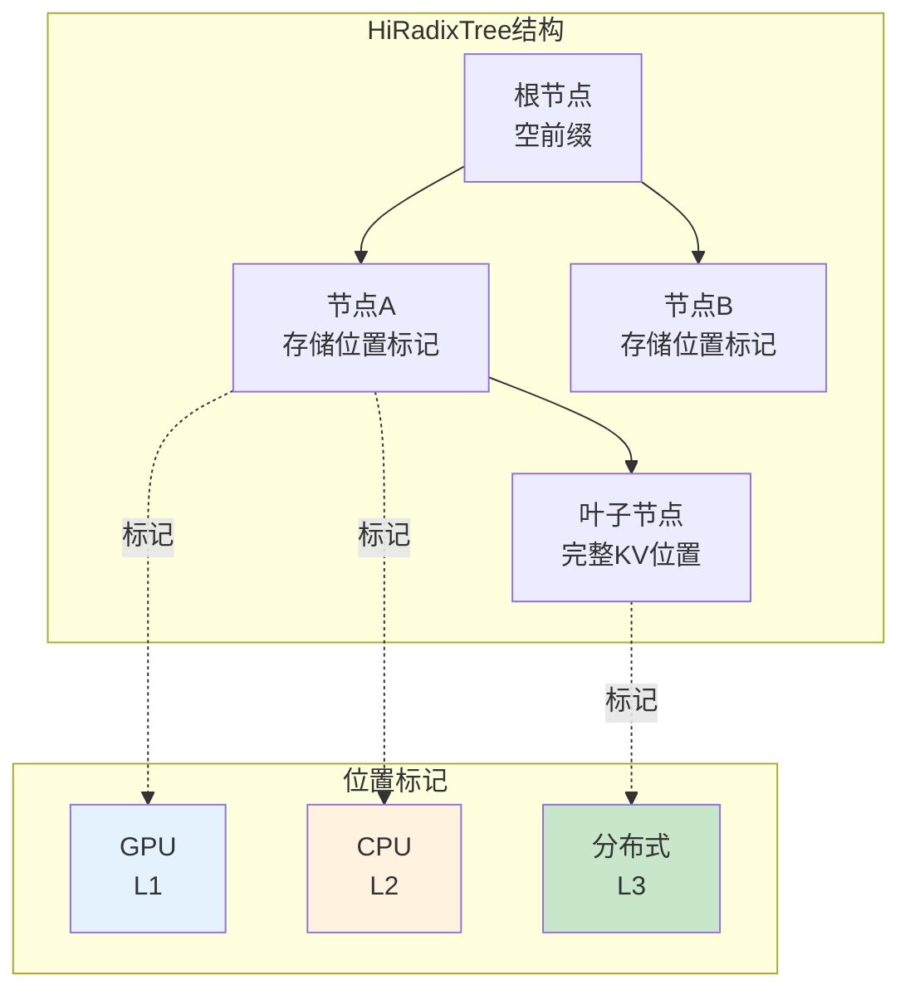

**元数据功能：**

| 功能 | 说明 |
|------|------|
| **位置记录** | 记录每个KVCache节点的存储位置（GPU/CPU/L3） |
| **快速匹配** | 基于RadixAttention快速匹配共享前缀 |
| **预取决策** | 根据L3元数据决定预取策略 |

### 2.3 预取与写回模块

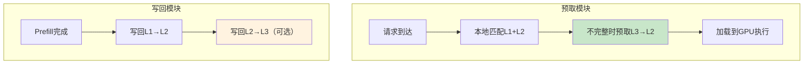

---

## 3. 部署与配置

### 3.1 安装与启用

```bash
# ============================================================
# HiCache启用（SGLang内置，无需额外安装）
# ============================================================

# 基本启用
python -m sglang.launch_server \
    --model-path Qwen/Qwen3-8B \
    --enable-hierarchical-cache \
    --hicache-ratio 2
```

### 3.2 核心配置参数

**基本参数：**

| 参数 | 默认值 | 说明 | 推荐值 |
|------|--------|------|--------|
| `--enable-hierarchical-cache` | false | 启用分层缓存 | 必须启用 |
| `--hicache-ratio` | - | L2/GPU内存比例 | 2 |
| `--hicache-size` | 0 | L2大小（GB），0则用ratio | 0（自动） |
| `--page-size` | 模型相关 | 缓存页粒度（tokens） | 64 |

**I/O与内存布局：**

| 参数 | 默认值 | 说明 | 推荐值 |
|------|--------|------|--------|
| `--hicache-io-backend` | kernel | CPU-GPU传输后端 | kernel / direct |
| `--hicache-mem-layout` | layer_first | 内存布局 | page_first_direct |

**写回与预取策略：**

| 参数 | 默认值 | 说明 | 推荐值 |
|------|--------|------|--------|
| `--hicache-write-policy` | write_through | 写回策略 | write_through |
| `--hicache-storage-prefetch-policy` | best_effort | 预取策略 | timeout |

**L3存储后端：**

| 参数 | 说明 | 可选值 |
|------|------|--------|
| `--hicache-storage-backend` | L3存储后端 | mooncake, hf3fs, nixl, aibrix, lmcache, file |

### 3.3 生产环境推荐配置

```bash
# ============================================================
# HiCache生产环境推荐配置
# ============================================================

python -m sglang.launch_server \
    --model-path Qwen/Qwen3-8B \
    --tp 2 \
    --port 30000 \
    --mem-fraction-static 0.85 \
    # ============================================================
    # HiCache核心配置
    # ============================================================
    --enable-hierarchical-cache \
    --hicache-ratio 2 \
    --page-size 64 \
    --hicache-mem-layout page_first_direct \
    --hicache-io-backend direct \
    --hicache-write-policy write_through \
    # ============================================================
    # L3存储后端配置（可选）
    # ============================================================
    --hicache-storage-backend mooncake \
    --hicache-storage-prefetch-policy timeout
```

---

## 4. 推理引擎集成

### 4.1 SGLang原生集成

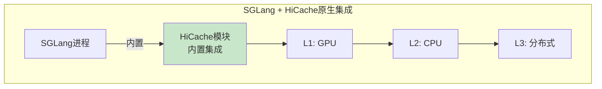

**集成特点：**

| 特点 | 说明 |
|------|------|
| **原生内置** | 无需额外安装，参数启用即可 |
| **参数简洁** | 核心参数少，配置简单 |
| **深度优化** | 与SGLang深度协同优化 |

### 4.2 预取策略详解

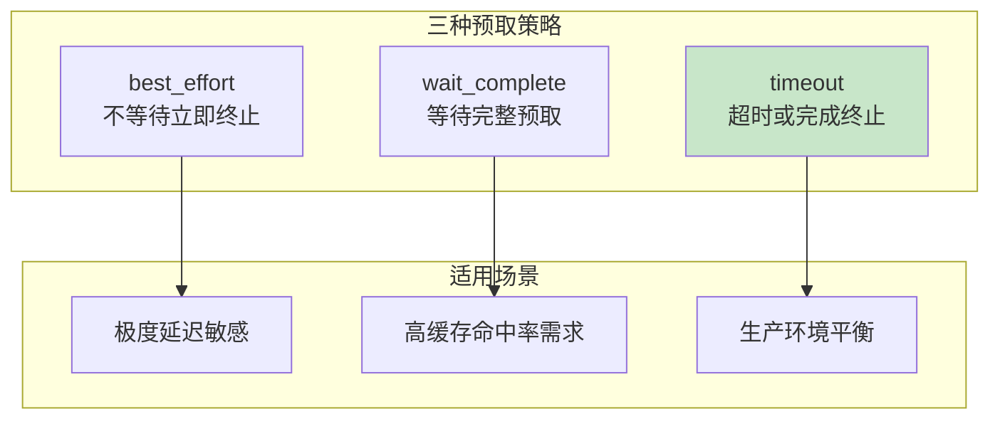

**策略选择建议：**

| 策略 | 行为 | 适用场景 | 推荐 |
|------|------|----------|------|
| `best_effort` | GPU可计算时立即终止预取 | 极度延迟敏感 | 低 |
| `wait_complete` | 等待所有预取完成 | SystemPrompt共享、高命中率 | 高 |
| `timeout` | 指定时间或完成后终止 | 生产环境推荐 | 推荐 |

### 4.3 写回策略详解

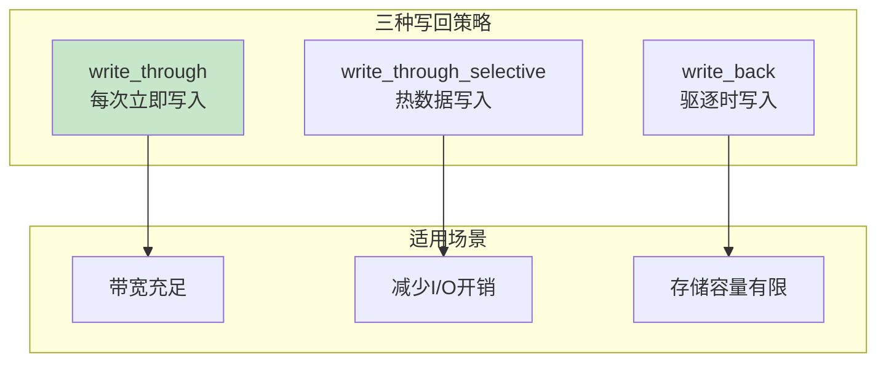

**策略选择建议：**

| 策略 | 行为 | 适用场景 | 推荐 |
|------|------|----------|------|
| `write_through` | 每次访问立即写入下一级 | 带宽充足、最大缓存收益 | 推荐 |
| `write_through_selective` | 仅热数据写入下一级 | 减少I/O开销 | 中 |
| `write_back` | 仅驱逐时写入下一级 | 存储容量有限 | 低 |

---

## 5. 存储后端配置

### 5.1 L3存储后端选择

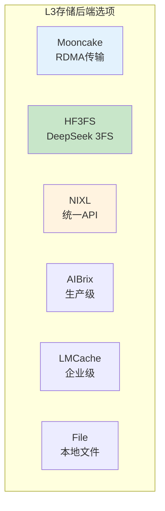

**存储后端对比：**

| 后端 | 特点 | 适用场景 | 配置复杂度 |
|------|------|----------|-----------|
| **mooncake** | RDMA+多NIC，零拷贝 | 高性能分布式 | 中 |
| **hf3fs** | DeepSeek 3FS，K8s原生 | 大规模集群 | 高 |
| **nixl** | 统一API，支持多存储 | 混合存储 | 中 |
| **aibrix** | 生产级KVCache卸载 | 生产环境 | 中 |
| **lmcache** | 企业级存储方案 | 企业部署 | 中 |
| **file** | 简单本地文件 | 测试演示 | 低 |

### 5.2 Mooncake后端配置

```bash
# ============================================================
# HiCache + Mooncake后端配置
# ============================================================

python -m sglang.launch_server \
    --model-path Qwen/Qwen3-235B-A22B-Instruct \
    --tp 8 \
    --enable-hierarchical-cache \
    --hicache-ratio 2 \
    --hicache-mem-layout page_first_direct \
    --hicache-io-backend direct \
    --hicache-storage-backend mooncake \
    --hicache-write-policy write_through \
    --hicache-storage-prefetch-policy timeout
```

### 5.3 HF3FS后端配置（DeepSeek-R1）

```bash
# ============================================================
# HiCache + HF3FS后端配置
# ============================================================

python -m sglang.launch_server \
    --model-path /path/to/DeepSeek-R1/ \
    --tp 8 \
    --enable-hierarchical-cache \
    --hicache-ratio 2 \
    --hicache-mem-layout page_first_direct \
    --hicache-io-backend direct \
    --hicache-storage-backend hf3fs \
    --hicache-storage-prefetch-policy wait_complete \
    --hicache-write-policy write_through
```

### 5.4 异构TP配置

```bash
# ============================================================
# 异构TP配置（跨集群KV复用）
# ============================================================
# 当不同TP大小的集群需要共享KVCache时

python -m sglang.launch_server \
    --model-path Qwen/Qwen3-8B \
    --tp 4 \
    --enable-hierarchical-cache \
    --hicache-storage-backend mooncake \
    # ============================================================
    # 异构TP配置：设置所有TP大小的最小公倍数
    # ============================================================
    --hicache-storage-backend-extra-config '{"tp_lcm_size": 8}'
```

---

## 6. 优化建议与避坑

### 6.1 HiCache特有优化建议

**优化建议清单：**

| 建议 | 优先级 | 说明 | 配置方法 |
|------|--------|------|----------|
| **启用L3后端** | P1 | 多节点共享需要L3存储 | `--hicache-storage-backend` |
| **预取策略timeout** | P1 | 生产环境平衡选择 | `--hicache-storage-prefetch-policy=timeout` |
| **写回策略write_through** | P1 | 最大缓存收益 | `--hicache-write-policy=write_through` |
| **内存布局优化** | P2 | 配合direct后端 | `--hicache-mem-layout=page_first_direct` |
| **异构TP配置** | P2 | 跨集群复用时 | `tp_lcm_size`配置 |

### 6.2 HiCache常见坑

**坑1：内存布局不匹配**

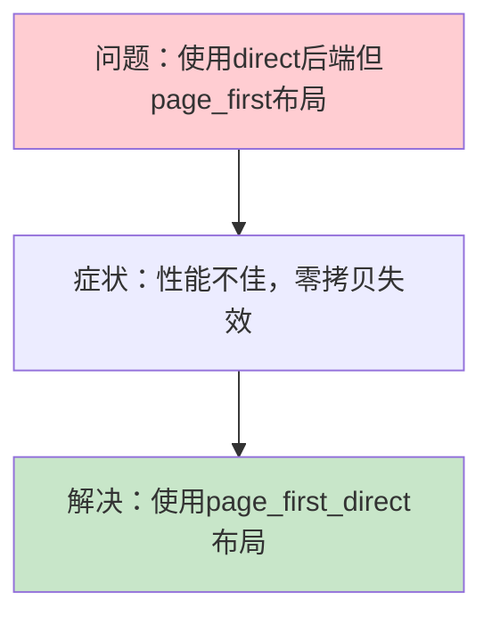

**坑2：跨集群TP不一致**

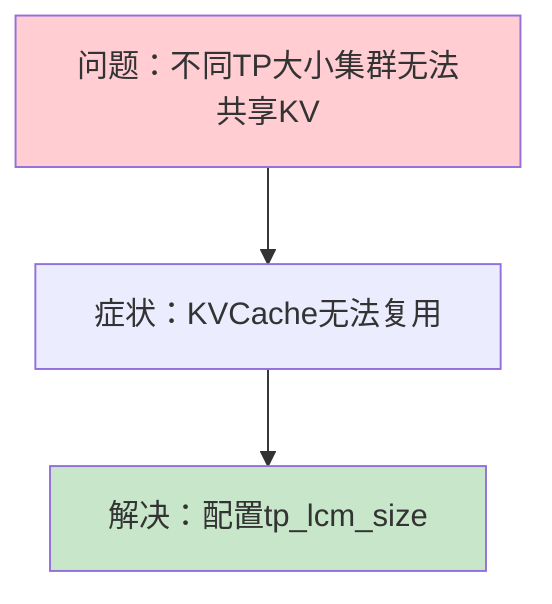

**坑3：预取策略不适合场景**

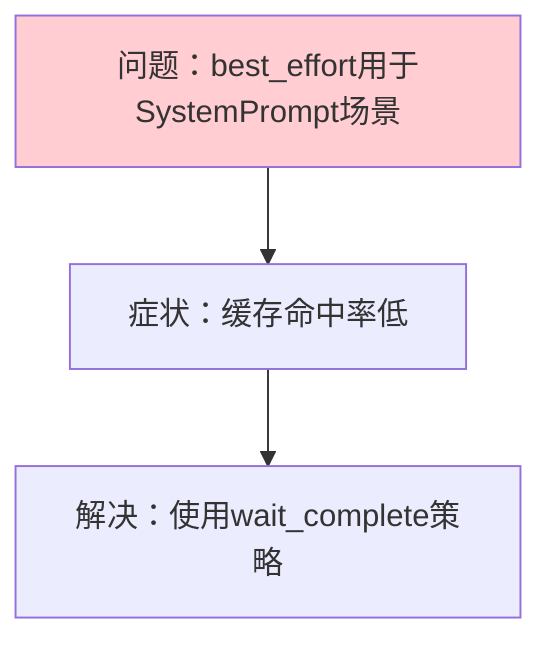

---

## 附录

### A. 配置参数速查表

| 参数类型 | 参数名 | 推荐值 | 说明 |
|----------|--------|--------|------|
| 基本参数 | `--enable-hierarchical-cache` | 启用 | 必须启用 |
| 基本参数 | `--hicache-ratio` | 2 | L2/GPU比例 |
| 基本参数 | `--page-size` | 64 | 缓存页粒度 |
| I/O参数 | `--hicache-io-backend` | direct | CPU-GPU传输 |
| I/O参数 | `--hicache-mem-layout` | page_first_direct | 内存布局 |
| 策略参数 | `--hicache-write-policy` | write_through | 写回策略 |
| 策略参数 | `--hicache-storage-prefetch-policy` | timeout | 预取策略 |
| 存储参数 | `--hicache-storage-backend` | mooncake | L3后端 |

### B. 部署命令速查

**基本启用：**
```bash
python -m sglang.launch_server --model-path <MODEL> \
  --enable-hierarchical-cache --hicache-ratio 2
```

**生产推荐：**
```bash
python -m sglang.launch_server --model-path <MODEL> \
  --enable-hierarchical-cache \
  --hicache-ratio 2 \
  --hicache-mem-layout page_first_direct \
  --hicache-io-backend direct \
  --hicache-storage-backend mooncake \
  --hicache-write-policy write_through \
  --hicache-storage-prefetch-policy timeout
```

### C. 参考资料

- [HiCache Design](https://docs.sglang.io/docs/advanced_features/hicache_design)
- [HiCache Best Practices](https://docs.sglang.io/docs/advanced_features/hicache_best_practices)
- [SGLang Documentation](https://docs.sglang.io/)

---

> 返回：[../README.md](../README.md) | 完成全部学习后返回：[../../README.md](../../README.md)