# KVCache 基础概念详解

> 理解 KVCache 存储原理、缓存复用机制以及在 LLM 推理中的关键作用。

---

## 目录

- [1. KVCache 概述](#1-kvcache-概述)
- [2. KVCache 存储架构](#2-kvcache-存储架构)
- [3. 缓存复用原理](#3-缓存复用原理)
- [4. PD 分离架构](#4-pd-分离架构)
- [5. 性能影响分析](#5-性能影响分析)
- [附录](#附录)

---

## 1. KVCache 概述

### 1.1 什么是 KVCache

KVCache（Key-Value Cache）是 Transformer 模型推理过程中的核心优化技术。在自回归生成过程中，模型需要反复访问之前计算过的 Key 和 Value 状态。

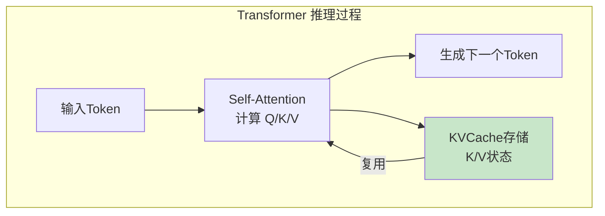

**核心作用：**

| 作用 | 说明 |
|------|------|
| **避免重复计算** | 已计算的 K/V 状态缓存后可直接复用 |
| **降低计算量** | 每次推理只需计算新 Token 的 Attention |
| **加速生成** | 显著减少 Prefill 后的 Decode 时间 |

### 1.2 KVCache 的内存消耗

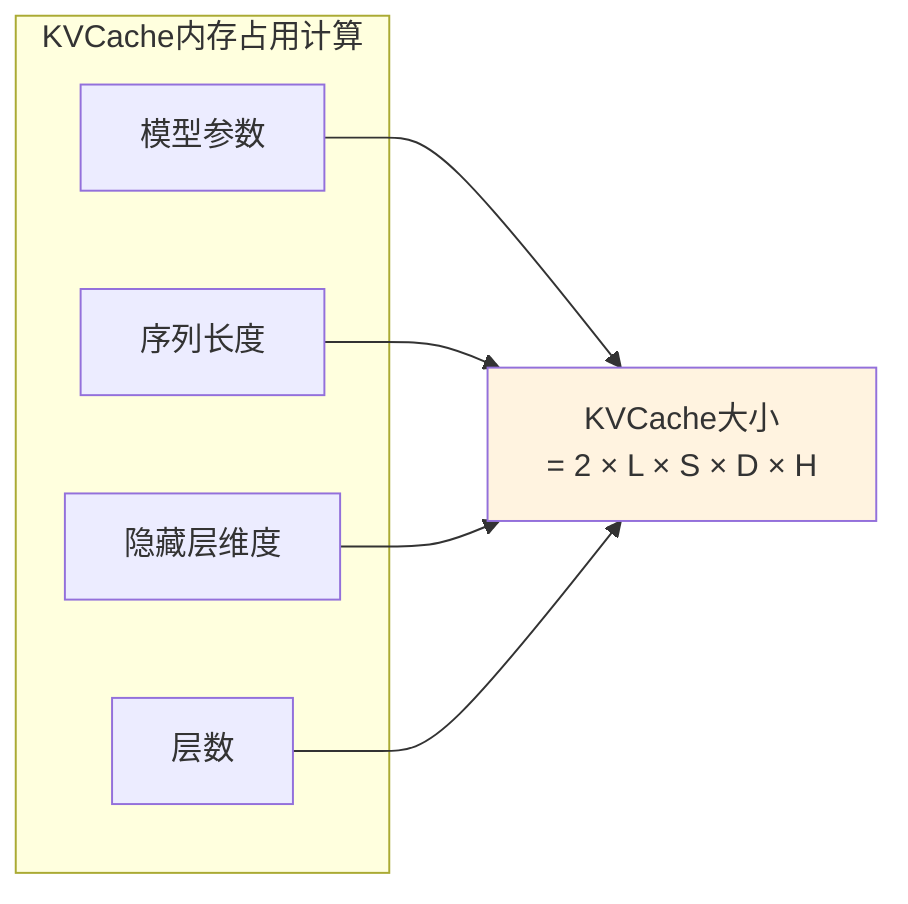

**计算公式：**

```
KVCache大小 = 2 × 层数(L) × 序列长度(S) × 隐藏维度(D) × 头数(H) × 精度(bytes)

示例：Qwen2.5-7B，序列长度4096，FP16
- 层数 L = 28
- 隐藏维度 D = 3584
- 头数 H = 28
- 精度 = 2 bytes (FP16)

KVCache ≈ 2 × 28 × 4096 × 3584 × 28 × 2 ≈ 16.4 GB
```

**内存压力分析：**

| 序列长度 | KVCache大小 (Qwen2.5-7B FP16) | GPU显存占比 (24GB) |
|----------|-------------------------------|---------------------|
| 1024 | ~4.1 GB | 17% |
| 4096 | ~16.4 GB | 68% |
| 8192 | ~32.8 GB | **超出显存** |
| 32768 | ~131 GB | **严重超出** |

> **结论：** 长上下文场景下，KVCache 成为 GPU 显存的主要瓶颈。

---

## 2. KVCache 存储架构

### 2.1 多级存储层次

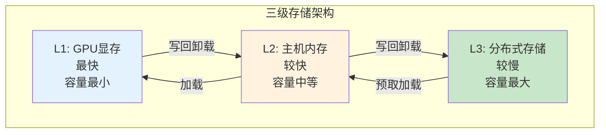

**各级存储特性：**

| 存储层级 | 容量 | 带宽 | 延迟 | 成本 |
|----------|------|------|------|------|
| **L1 GPU显存** | 24-80GB | ~1TB/s | ~1μs | 最高 |
| **L2 主机内存** | 128-512GB | ~100GB/s | ~10μs | 中等 |
| **L3 分布式存储** | TB-PB级 | ~10GB/s | ~100μs | 较低 |

### 2.2 为什么需要 KVCache 卸载

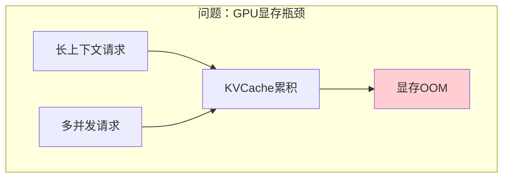

**核心痛点：**

| 痛点 | 说明 | 影响 |
|------|------|------|
| **显存容量限制** | GPU显存无法容纳长序列KVCache | 长上下文请求失败 |
| **并发受限** | 多请求KVCache共享显存空间 | 吞吐量下降 |
| **成本高昂** | 大显存GPU价格昂贵 | 部署成本增加 |

**解决方案：KVCache卸载**

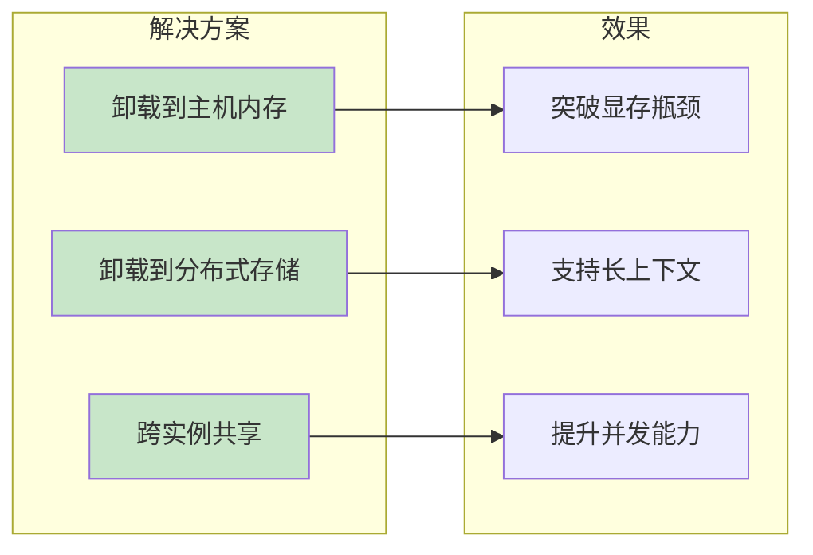

---

## 3. 缓存复用原理

### 3.1 Prefix Caching 机制

当多个请求共享相同的前缀（如 System Prompt、聊天历史）时，KVCache 完全相同，可以复用。

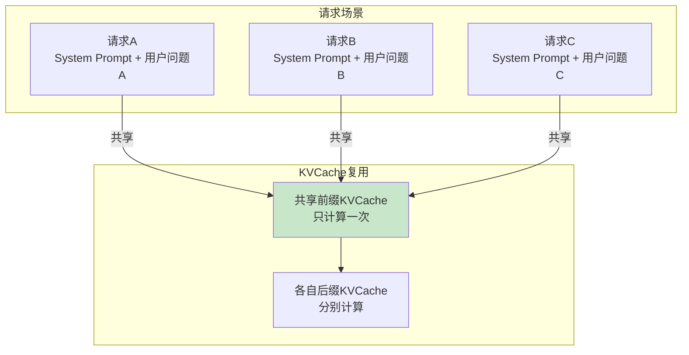

**复用收益：**

| 场景 | 无复用计算量 | 有复用计算量 | 收益 |
|------|-------------|-------------|------|
| 100个请求共享1000 tokens前缀 | 100×1000 = 100K tokens | 1000 + 100×100 = 11K tokens | **91%减少** |
| 多轮对话（10轮，每轮+500 tokens） | 500+1000+...+5000 = 27500 | 累计复用 | **显著减少** |

### 3.2 RadixAttention 原理

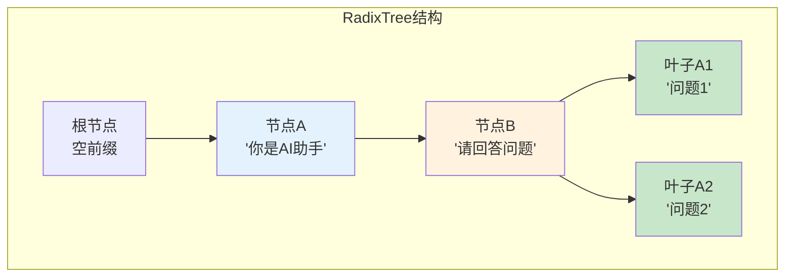

**RadixAttention 特点：**

| 特点 | 说明 |
|------|------|
| **前缀树组织** | KVCache按前缀树结构组织 |
| **自动匹配** | 新请求自动匹配最长公共前缀 |
| **增量计算** | 只需计算前缀后的新Token |
| **内存共享** | 相同前缀共享同一份KVCache |

---

## 4. PD 分离架构

### 4.1 Prefill 与 Decode 的差异

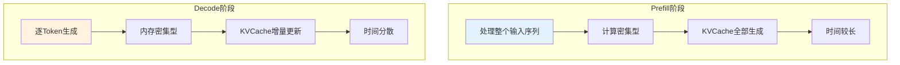

**阶段特性对比：**

| 特性 | Prefill | Decode |
|------|---------|--------|
| **计算模式** | 批量并行计算 | 逐Token串行计算 |
| **资源需求** | GPU计算能力 | GPU显存容量 |
| **时间分布** | 集中在前 | 分散在整个生成过程 |
| **KVCache** | 全量生成 | 增量更新 |

### 4.2 PD分离架构原理

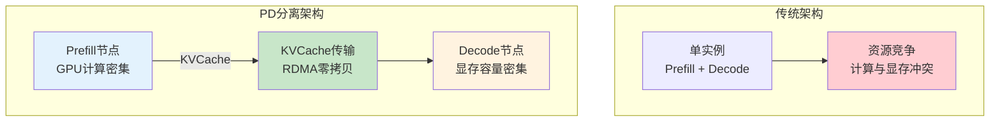

**PD分离优势：**

| 优势 | 说明 |
|------|------|
| **资源独立** | Prefill节点专注计算，Decode节点专注显存 |
| **性能稳定** | Decode阶段不受Prefill计算干扰 |
| **弹性扩展** | 可独立扩展Prefill或Decode节点数量 |
| **KVCache共享** | 多Decode节点可共享同一Prefill结果 |

### 4.3 KVCache传输机制

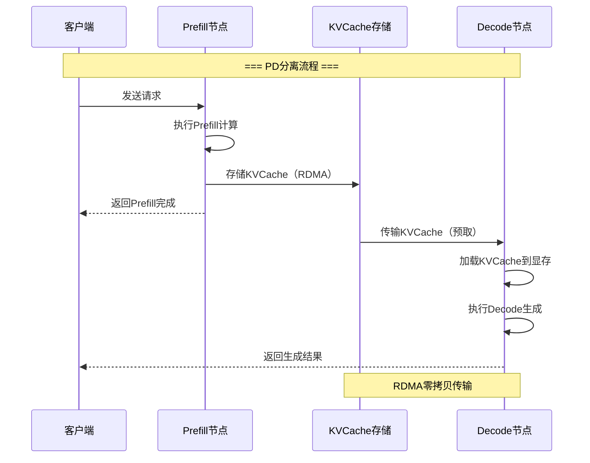

**传输关键技术：**

| 技术 | 说明 | 效果 |
|------|------|------|
| **RDMA零拷贝** | 直接内存到内存传输 | 延迟~2μs，带宽~100Gbps |
| **GPUDirect** | GPU显存直接参与RDMA | 避免CPU中转开销 |
| **NUMA亲和** | 网卡与KVCache进程同NUMA | 避免跨NUMA延迟 |

---

## 5. 性能影响分析

### 5.1 KVCache对推理性能的影响

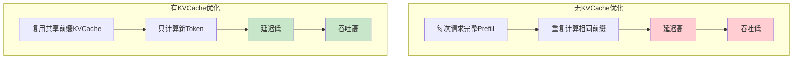

**性能提升案例：**

| 场景 | 无KVCache复用 | 有KVCache复用 | 提升 |
|------|--------------|--------------|------|
| 1000 tokens共享前缀 + 100 tokens问题 | Prefill 1100 tokens | Prefill 100 tokens | **91%延迟降低** |
| 10轮多轮对话 | 每轮完整Prefill | 累积复用历史KV | **延迟递减** |
| 100并发共享前缀 | 100×Prefill | 1×Prefill + 100×Decode | **吞吐提升10x** |

### 5.2 存储层级对性能的影响

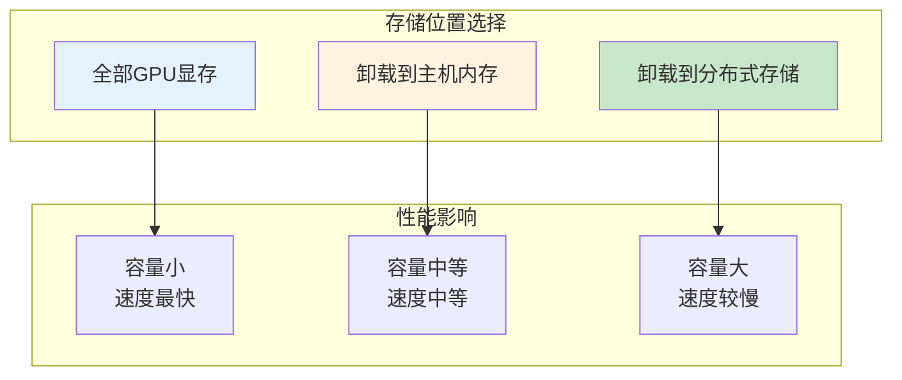

**选择策略：**

| 场景 | 推荐存储位置 | 原因 |
|------|-------------|------|
| 短序列单请求 | GPU显存 | 延迟最低 |
| 长序列单请求 | 主机内存 | 突破显存限制 |
| 多实例共享前缀 | 分布式存储 | 跨实例复用 |
| PD分离架构 | RDMA传输 | 高效跨节点传输 |

---

## 附录

### A. KVCache相关术语

| 术语 | 说明 |
|------|------|
| **KVCache** | Key-Value Cache，Transformer中的注意力状态缓存 |
| **Prefill** | 预填充阶段，处理输入序列并生成初始KVCache |
| **Decode** | 解码阶段，逐Token生成并更新KVCache |
| **Prefix Caching** | 前缀缓存，共享前缀的KVCache复用 |
| **RadixAttention** | 基于前缀树组织的KVCache匹配机制 |
| **PD分离** | Prefill与Decode阶段分离到不同节点 |
| **KV卸载** | 将KVCache从GPU卸载到其他存储 |
| **RDMA** | Remote Direct Memory Access，远程直接内存访问 |

### B. 性能指标速查

| 指标 | GPU显存 | 主机内存 | 分布式存储 |
|------|---------|----------|-----------|
| **带宽** | ~1TB/s | ~100GB/s | ~10GB/s |
| **延迟** | ~1μs | ~10μs | ~100μs |
| **容量** | 24-80GB | 128-512GB | TB-PB |

### C. 参考资料

- [Mooncake GitHub](https://github.com/kvcache-ai/Mooncake)
- [LMCache Documentation](https://docs.lmcache.ai/)
- [HiCache Design](https://docs.sglang.io/docs/advanced_features/hicache_design)
- [vLLM KVCache Documentation](https://docs.vllm.ai/)

---

> 下一节：[推理引擎集成对比.md](推理引擎集成对比.md) - 了解 vLLM/SGLang 与 KVCache方案的集成方式。