# 优化建议与避坑指南

> 总结 KVCache 部署优化中的通用建议、常见问题与解决方案，避免踩坑。

---

## 目录

- [1. 通用优化建议](#1-通用优化建议)
- [2. 常见坑与解决方案](#2-常见坑与解决方案)
- [3. 生产环境最佳实践](#3-生产环境最佳实践)
- [4. 问题排查清单](#4-问题排查清单)
- [附录](#附录)

---

## 1. 通用优化建议

### 1.1 网络层优化

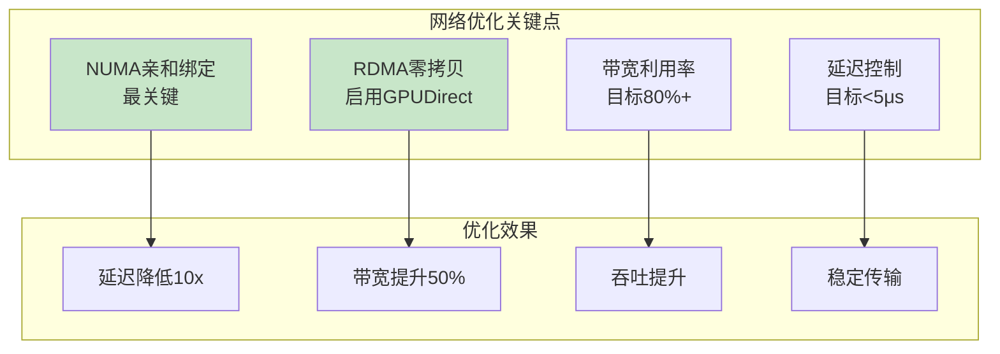

**网络优化建议：**

| 建议 | 优先级 | 说明 | 验证方法 |
|------|--------|------|----------|
| **NUMA亲和绑定** | P0（最高） | 网卡与进程同NUMA节点 | `numactl -H` + 进程绑定 |
| **RDMA零拷贝启用** | P0 | 确保使用RDMA而非TCP | Mooncake默认RDMA |
| **带宽基线测试** | P1 | 先测带宽再部署服务 | `ib_write_bw` |
| **延迟基线测试** | P1 | 先测延迟再部署服务 | `ib_write_lat` |
| **MTU优化** | P2 | IB: 4096, RoCE: 9000 | `ibv_devinfo` |

### 1.2 存储层优化

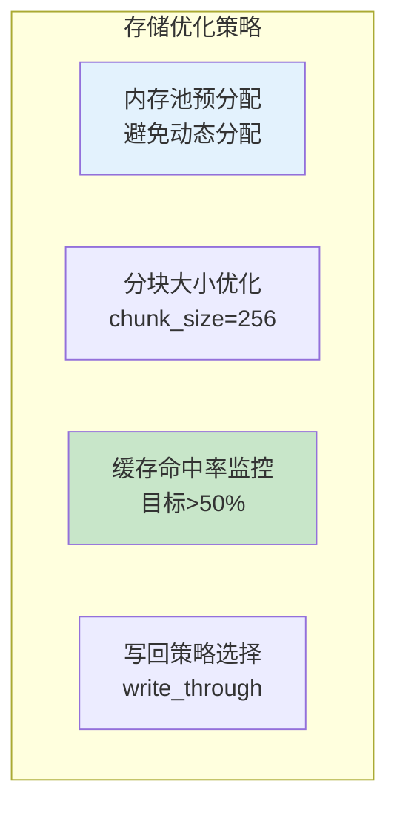

**存储优化建议：**

| 建议 | 优先级 | 适用方案 | 配置方法 |
|------|--------|----------|----------|
| **内存预分配** | P1 | LMCache | `--l1-size-gb` 指定大小 |
| **分块大小优化** | P1 | LMCache/HiCache | `chunk_size=256` / `page-size=64` |
| **缓存命中率监控** | P1 | 所有方案 | 监控端点或日志 |
| **写回策略优化** | P2 | HiCache | `--hicache-write-policy=write_through` |
| **存储后端选择** | P2 | HiCache/LMCache | 根据场景选择后端 |

### 1.3 推理引擎优化

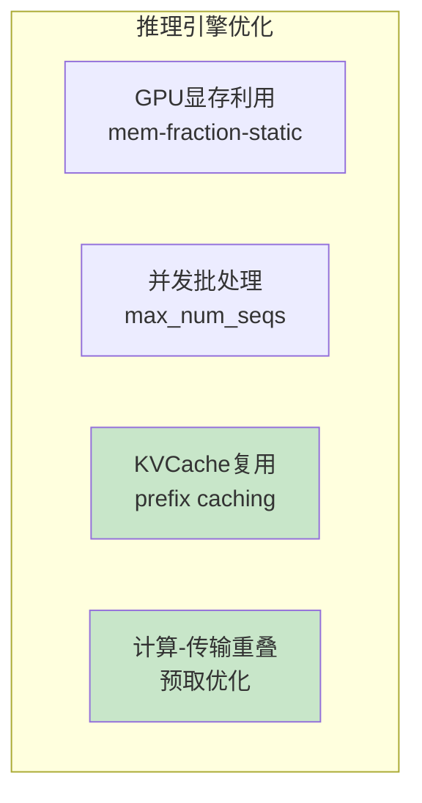

**推理引擎优化建议：**

| 建议 | 优先级 | vLLM参数 | SGLang参数 |
|------|--------|----------|-----------|
| **GPU显存预留** | P1 | `--gpu-memory-utilization 0.85` | `--mem-fraction-static 0.85` |
| **启用Prefix Caching** | P1 | `--enable-prefix-caching` | 内置RadixAttention |
| **并发优化** | P2 | `--max-num-seqs` | `--max-running-requests` |
| **计算-传输重叠** | P2 | KV方案内部优化 | `--hicache-storage-prefetch-policy=timeout` |

### 1.4 监控与调优

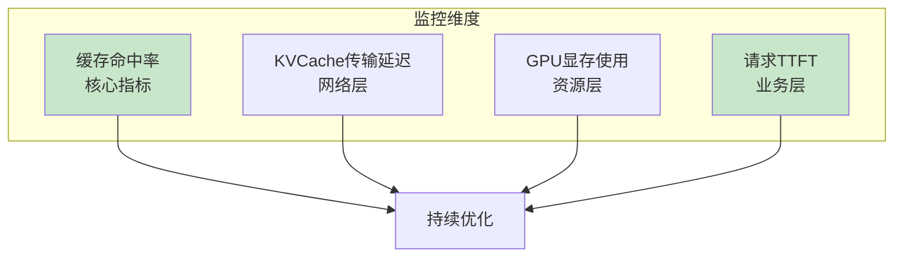

**监控建议：**

| 监控项 | 目标值 | 监控方法 | 异常阈值 |
|--------|--------|----------|----------|
| **缓存命中率** | >50% | LMCache MP端点 | <20%需优化 |
| **KV传输延迟** | <5μs | ib_write_lat | >10μs需排查 |
| **GPU显存使用** | <90% | nvidia-smi | >95%需扩容 |
| **TTFT（首字延迟）** | 场景相关 | Prometheus | 突然增加需排查 |

---

## 2. 常见坑与解决方案

### 2.1 NUMA不亲和坑（最常见）

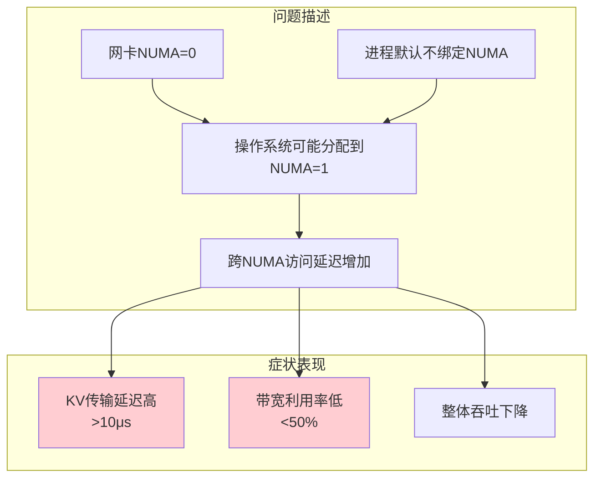

**解决方案：**

```bash
# ============================================================
# NUMA不亲和解决方案
# ============================================================

# Step1: 确认网卡NUMA位置
NIC_NUMA=$(cat /sys/class/net/eth0/device/numa_node)
echo "网卡NUMA: $NIC_NUMA"

# Step2: 启动进程时绑定到同一NUMA
numactl --cpunodebind=$NIC_NUMA --membind=$NIC_NUMA \
    vllm serve Qwen/Qwen2.5-7B-Instruct

# Step3: 验证进程NUMA绑定
ps -eo pid,psr,comm | grep vllm
# 检查进程运行的CPU是否在目标NUMA
```

### 2.2 RDMA未启用坑

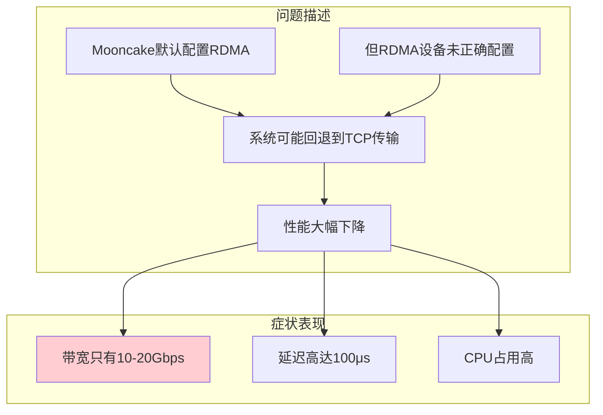

**解决方案：**

```bash
# ============================================================
# RDMA未启用排查与解决
# ============================================================

# Step1: 确认RDMA设备可用
ibv_devices
# 应看到 mlx5_0 等设备

# Step2: 确认设备状态Active
ibv_devinfo | grep port_state
# 应显示 PORT_ACTIVE

# Step3: Mooncake强制使用RDMA
vllm serve Qwen/Qwen2.5-7B-Instruct \
    --kv-transfer-config '{
        "kv_connector": "MooncakeConnector",
        "kv_role": "kv_producer",
        "kv_connector_extra_config": {
            "mooncake_protocol": "rdma"
        }
    }'

# Step4: 测试RDMA连通性
ib_write_bw -d mlx5_0 -a <remote_ip>
```

### 2.3 缓存命中率低坑

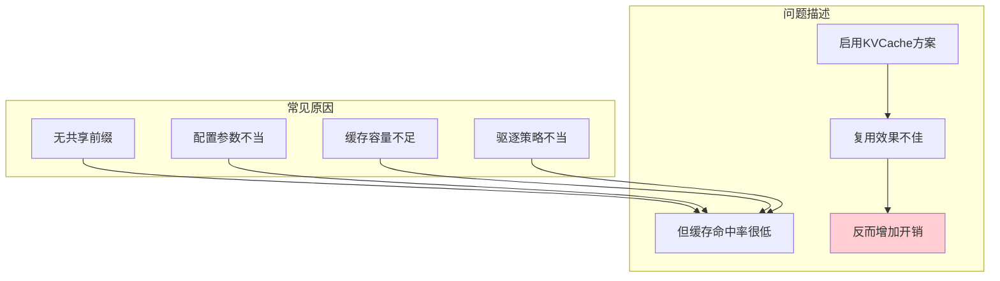

**解决方案：**

```markdown
# ============================================================
# 缓存命中率低解决方案
# ============================================================

# 情况1: 无共享前缀
# 解决：评估业务场景，KVCache优化对无共享前缀场景收益有限
# 建议：如果没有共享前缀，可能不需要KVCache卸载

# 情况2: 配置参数不当
# 解决：LMCache增大chunk_size
LMCACHE_CHUNK_SIZE=256  # 生产环境推荐

# HiCache增大L2容量
--hicache-ratio 2  # 主机内存=GUP内存×2

# 情况3: 缓存容量不足
# 解决：增加存储容量
LMCACHE_MAX_LOCAL_CPU_SIZE=20  # 增加CPU内存容量

# 情况4: 驱逐策略不当
# 解决：使用LRU策略
lmcache server --eviction-policy LRU
```

### 2.4 PD分离配置坑

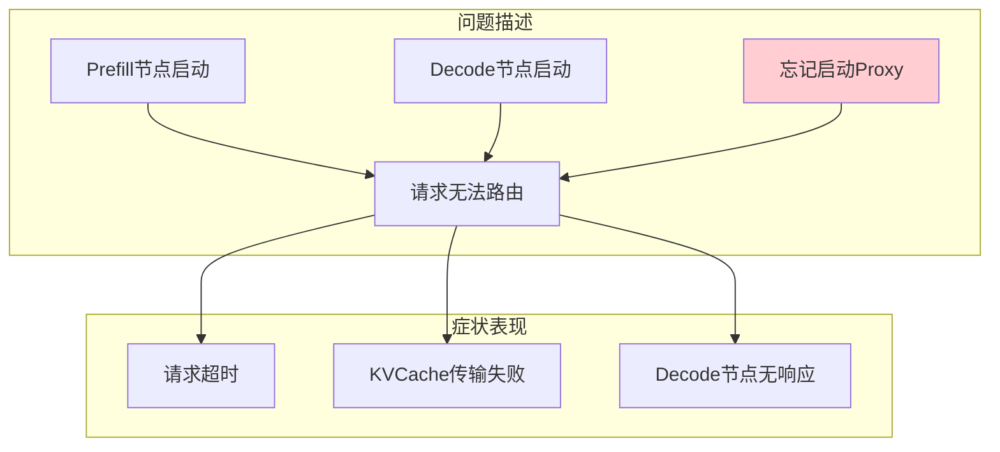

**解决方案：**

```bash
# ============================================================
# Mooncake PD分离完整部署
# ============================================================

# Step1: 启动Prefill节点（节点A）
vllm serve Qwen/Qwen2.5-7B-Instruct --port 8010 \
    --kv-transfer-config '{"kv_connector":"MooncakeConnector","kv_role":"kv_producer"}'

# Step2: 启动Decode节点（节点B）
vllm serve Qwen/Qwen2.5-7B-Instruct --port 8020 \
    --kv-transfer-config '{"kv_connector":"MooncakeConnector","kv_role":"kv_consumer"}'

# Step3: 启动Proxy代理服务（必须！）
python mooncake_connector_proxy.py \
    --prefill http://192.168.0.2:8010 \
    --decode http://192.168.0.3:8020 \
    --port 8000

# Step4: 发送请求到Proxy端口8000
curl http://proxy-server:8000/v1/completions ...
```

### 2.5 存储后端配置坑

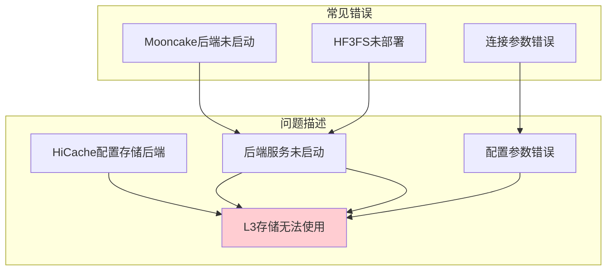

**解决方案：**

```bash
# ============================================================
# 存储后端配置验证
# ============================================================

# 情况1: Mooncake作为L3后端
# 解决：确保Mooncake Transfer Engine已安装
pip install mooncake-transfer-engine
# 测试Mooncake连接
python -c "import mooncake; print('Mooncake OK')"

# 情况2: HF3FS作为L3后端
# 解决：确保3FS集群已部署运行
# 参考：https://github.com/deepseek-ai/3FS

# 情况3: 配置参数验证
# HiCache启动时检查日志
python -m sglang.launch_server \
    --model-path Qwen/Qwen3-8B \
    --enable-hierarchical-cache \
    --hicache-storage-backend mooncake \
    --log-level info  # 查看详细日志
```

---

## 3. 生产环境最佳实践

### 3.1 生产部署清单

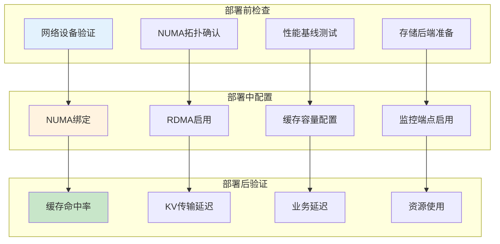

**部署检查清单：**

| 阶段 | 检查项 | 命令/方法 | 期望结果 |
|------|--------|----------|----------|
| **部署前** | RDMA设备可用 | `ibv_devices` | 设备列表 |
| **部署前** | NUMA拓扑确认 | `numactl -H` + `lstopo` | 网卡GPU同NUMA |
| **部署前** | 带宽基线 | `ib_write_bw` | >80Gbps |
| **部署前** | 延迟基线 | `ib_write_lat` | <5μs |
| **部署中** | 进程NUMA绑定 | `numactl --cpunodebind` | 绑定到网卡NUMA |
| **部署中** | RDMA协议强制 | `mooncake_protocol=rdma` | 确认RDMA |
| **部署中** | 缓存容量配置 | `--l1-size-gb` 或 `--hicache-ratio` | 充足容量 |
| **部署后** | 缓存命中率 | 监控端点 | >50% |
| **部署后** | KV传输延迟 | 日志/监控 | <10μs |

### 3.2 生产配置模板

**Mooncake + vLLM 生产配置：**

```yaml
# ============================================================
# Mooncake PD分离生产部署清单
# ============================================================

# Prefill节点配置
apiVersion: v1
kind: Pod
metadata:
  name: vllm-prefill
spec:
  containers:
    - name: vllm
      command:
        - numactl
        - --cpunodebind=0  # NUMA绑定
        - --membind=0
        - --
        - vllm
        - serve
        - Qwen/Qwen2.5-7B-Instruct
        - --port=8010
        - --gpu-memory-utilization=0.85
        - --kv-transfer-config
        - '{"kv_connector":"MooncakeConnector","kv_role":"kv_producer","kv_connector_extra_config":{"mooncake_protocol":"rdma"}}'
      env:
        - name: VLLM_MOONCAKE_BOOTSTRAP_PORT
          value: "8998"

# Decode节点配置（类似）
# Proxy代理服务配置
```

**HiCache + SGLang 生产配置：**

```yaml
# ============================================================
# HiCache生产部署清单
# ============================================================
apiVersion: v1
kind: Pod
metadata:
  name: sglang-hicache
spec:
  containers:
    - name: sglang
      command:
        - numactl
        - --cpunodebind=0  # NUMA绑定
        - --membind=0
        - --
        - python
        - -m
        - sglang.launch_server
        - --model-path
        - Qwen/Qwen3-8B
        - --port=30000
        - --tp=2
        - --mem-fraction-static=0.85
        - --enable-hierarchical-cache
        - --hicache-ratio=2
        - --hicache-io-backend=kernel
        - --hicache-mem-layout=page_first
        - --hicache-write-policy=write_through
        - --hicache-storage-backend=mooncake
        - --hicache-storage-prefetch-policy=timeout
```

---

## 4. 问题排查清单

### 4.1 系统化排查流程

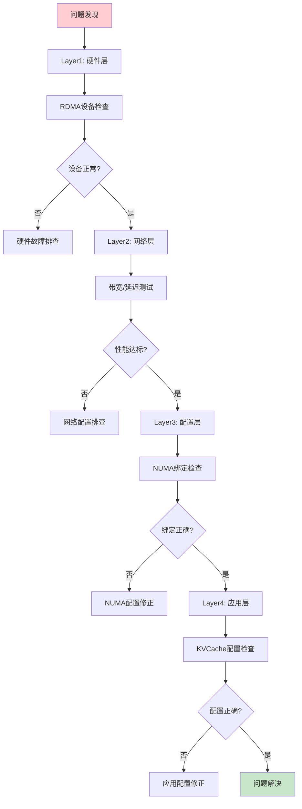

### 4.2 分层排查命令

**Layer1 硬件层：**

```bash
# RDMA设备检查
ibv_devices && ibv_devinfo && ibstat

# GPU检查
nvidia-smi

# 网卡检查
ip link show
```

**Layer2 网络层：**

```bash
# 带宽测试
ib_write_bw -d mlx5_0 -a <remote_ip>

# 延迟测试
ib_write_lat -d mlx5_0 -a <remote_ip>

# NUMA位置检查
cat /sys/class/net/eth0/device/numa_node
```

**Layer3 配置层：**

```bash
# 进程NUMA检查
ps -eo pid,psr,comm | grep vllm

# NUMA策略检查
numactl --show

# 配置文件检查
cat lmc_config.yaml
```

**Layer4 应用层：**

```bash
# 日志检查
kubectl logs <pod-name>

# 监控端点检查（LMCache MP模式）
curl http://lmcache-server:8000/metrics

# 缓存命中率检查
# 通过监控端点或日志分析
```

---

## 附录

### A. 常见错误速查

| 错误现象 | 常见原因 | 快速修复 |
|----------|----------|----------|
| 带宽<50Gbps | NUMA不亲和 | numactl绑定 |
| 延迟>10μs | NUMA不亲和 | numactl绑定 |
| RDMA连接失败 | 设备未Active | ibv_devinfo检查 |
| 缓存命中率<20% | 无共享前缀或容量不足 | 增加容量或评估场景 |
| PD分离请求超时 | Proxy未启动 | 启动Proxy服务 |
| KVCache传输失败 | 存储后端未启动 | 启动后端服务 |

### B. 性能异常阈值

| 指标 | 正常范围 | 异常阈值 | 排查优先级 |
|------|----------|----------|-----------|
| 带宽利用率 | 80-95% | <70% | P1 |
| RDMA延迟 | 1-5μs | >10μs | P1 |
| 缓存命中率 | 50-80% | <20% | P1 |
| GPU显存使用 | 80-90% | >95% | P2 |
| TTFT | 场景相关 | 突然增加 | P1 |

### C. 配置模板文件

详见各子专题的 `manifests/` 目录：
- [4.1mooncake/manifests/](../4.1mooncake/manifests/)
- [4.2lmcache/manifests/](../4.2lmcache/manifests/)
- [4.3hicache/manifests/](../4.3hicache/manifests/)

---

> 下一节：[方案对比总结.md](方案对比总结.md) - 总结三方案的相同优化思路与各自部署差异。