# 推理引擎集成对比详解

> 理解 vLLM 和 SGLang 与 Mooncake/LMCache/HiCache 的集成方式差异与配置要点。

---

## 目录

- [1. 集成架构总览](#1-集成架构总览)
- [2. vLLM 集成方式](#2-vllm-集成方式)
- [3. SGLang 集成方式](#3-sglang-集成方式)
- [4. 集成对比分析](#4-集成对比分析)
- [5. 选型建议](#5-选型建议)
- [附录](#附录)

---

## 1. 集成架构总览

### 1.1 三方案与双引擎的集成矩阵

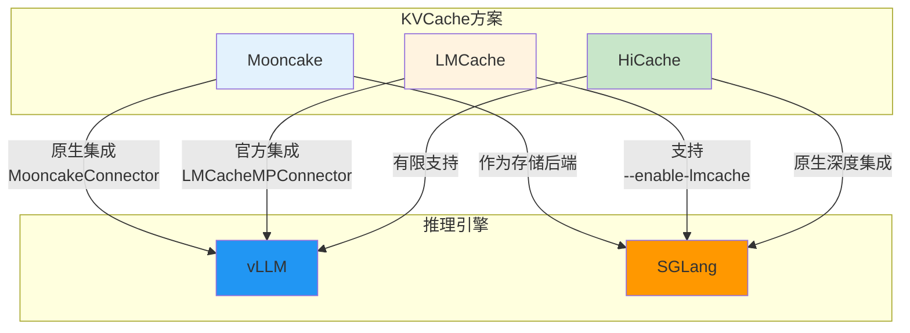

### 1.2 集成成熟度对比

| 方案 | vLLM集成 | SGLang集成 | 集成成熟度 |
|------|----------|-----------|-----------|
| **Mooncake** | 原生Connector | 作为存储后端 | vLLM优先 |
| **LMCache** | 官方Connector | --enable-lmcache | 双引擎支持 |
| **HiCache** | 有限支持 | 原生深度集成 | SGLang优先 |

---

## 2. vLLM 集成方式

### 2.1 KV Transfer Config 机制

vLLM 通过 `--kv-transfer-config` 参数统一管理 KVCache 方案集成。

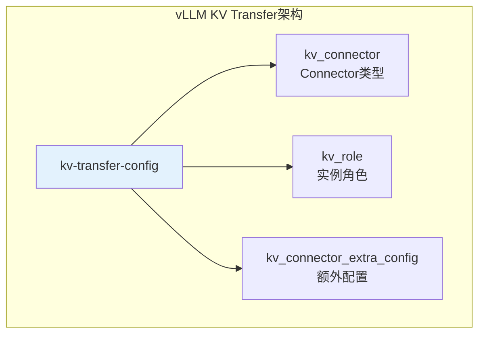

**核心参数说明：**

| 参数 | 说明 | 可选值 |
|------|------|--------|
| `kv_connector` | KVCache连接器类型 | MooncakeConnector, LMCacheMPConnector, LMCacheConnectorV1 |
| `kv_role` | 实例角色 | kv_producer, kv_consumer, kv_both |
| `kv_connector_extra_config` | 连接器额外配置 | JSON格式配置 |

### 2.2 Mooncake 与 vLLM 集成

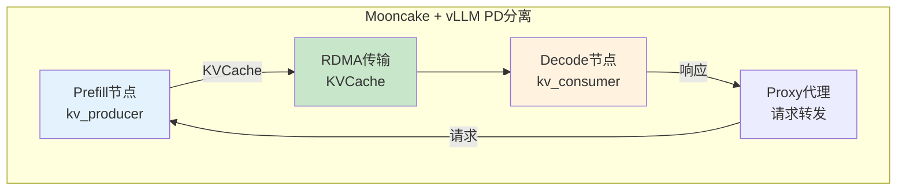

**Prefill节点配置：**

```bash
# ============================================================
# Mooncake Prefill节点（kv_producer）
# ============================================================
vllm serve Qwen/Qwen2.5-7B-Instruct \
    --port 8010 \
    --kv-transfer-config '{
        "kv_connector": "MooncakeConnector",
        "kv_role": "kv_producer"
    }'

# 环境变量配置
export VLLM_MOONCAKE_BOOTSTRAP_PORT=8998  # 引导服务器端口
export VLLM_MOONCAKE_ABORT_REQUEST_TIMEOUT=480  # KV缓存超时
```

**Decode节点配置：**

```bash
# ============================================================
# Mooncake Decode节点（kv_consumer）
# ============================================================
vllm serve Qwen/Qwen2.5-7B-Instruct \
    --port 8020 \
    --kv-transfer-config '{
        "kv_connector": "MooncakeConnector",
        "kv_role": "kv_consumer"
    }'
```

**关键配置参数：**

| 参数 | 默认值 | 说明 |
|------|--------|------|
| `VLLM_MOONCAKE_BOOTSTRAP_PORT` | 8998 | Mooncake引导服务器端口 |
| `VLLM_MOONCAKE_ABORT_REQUEST_TIMEOUT` | 480 | KV缓存自动释放超时（秒） |
| `num_workers` | 10 | Prefill工作线程池大小 |
| `mooncake_protocol` | rdma | 传输协议（rdma/tcp） |

### 2.3 LMCache 与 vLLM 集成

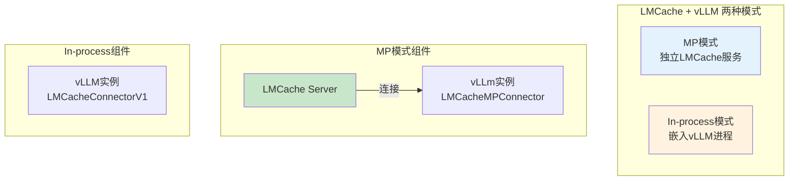

**MP模式（推荐生产环境）：**

```bash
# ============================================================
# Step1: 启动LMCache独立服务
# ============================================================
lmcache server \
    --l1-size-gb 20 \
    --eviction-policy LRU \
    --chunk-size 256

# ============================================================
# Step2: 启动vLLM连接LMCache
# ============================================================
vllm serve Qwen/Qwen3-8B \
    --port 8000 \
    --kv-transfer-config '{
        "kv_connector": "LMCacheMPConnector",
        "kv_role": "kv_both"
    }'
```

**In-process模式（快速实验）：**

```bash
# ============================================================
# In-process模式：单命令启动
# ============================================================
LMCACHE_CHUNK_SIZE=8 \
LMCACHE_LOCAL_CPU=true \
LMCACHE_MAX_LOCAL_CPU_SIZE=10 \
vllm serve Qwen/Qwen3-8B \
    --port 8000 \
    --kv-transfer-config '{
        "kv_connector": "LMCacheConnectorV1",
        "kv_role": "kv_both"
    }'
```

**简化命令（vLLM内置参数）：**

```bash
# ============================================================
# vLLM 0.6.0+ 简化KV卸载配置
# ============================================================
vllm serve Qwen/Qwen3-8B \
    --kv-offloading-backend lmcache \
    --kv-offloading-size 20 \
    --disable-hybrid-kv-cache-manager
```

**LMCache环境变量：**

| 环境变量 | 说明 |
|----------|------|
| `LMCACHE_CONFIG_FILE` | 配置文件路径 |
| `LMCACHE_CHUNK_SIZE` | 分块大小（生产推荐256） |
| `LMCACHE_LOCAL_CPU` | 启用本地CPU存储 |
| `LMCACHE_MAX_LOCAL_CPU_SIZE` | CPU存储容量（GB） |

### 2.4 kv_role 角色详解

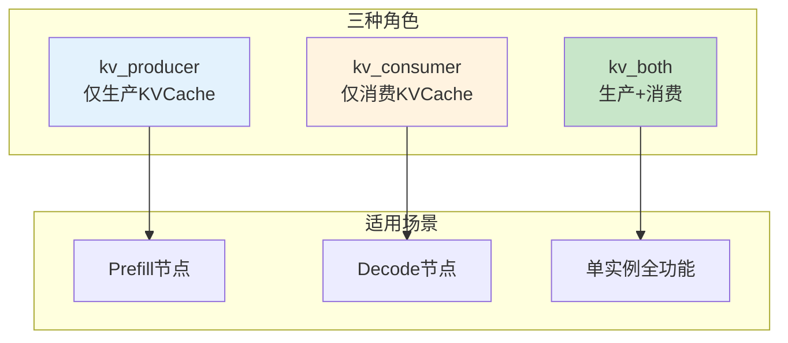

**角色职责对比：**

| 角色 | 职责 | 适用场景 | 传输方向 |
|------|------|----------|----------|
| `kv_producer` | 生成KVCache并传输出去 | Prefill节点 | → 发送 |
| `kv_consumer` | 接收KVCache并使用 | Decode节点 | ← 接收 |
| `kv_both` | 既生成又接收 | 单实例、角色未确定 | ↔ 双向 |

---

## 3. SGLang 集成方式

### 3.1 HiCache 原生集成

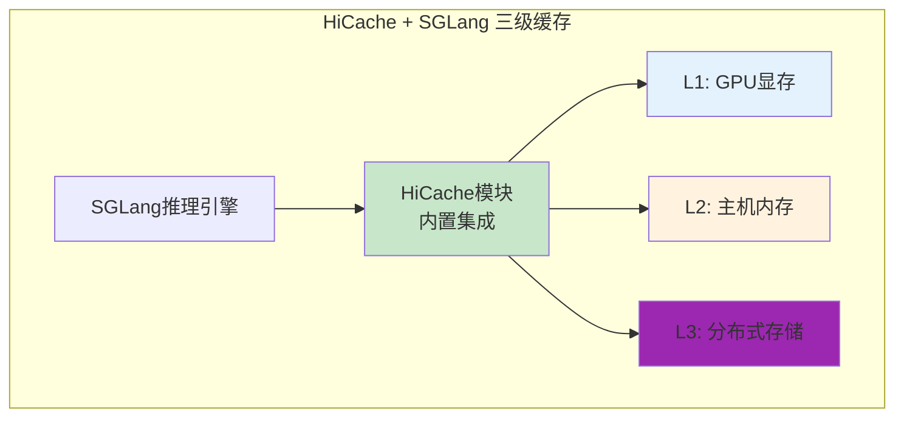

**启用HiCache配置：**

```bash
# ============================================================
# SGLang启用HiCache基本配置
# ============================================================
python -m sglang.launch_server \
    --model-path Qwen/Qwen3-8B \
    --port 30000 \
    --enable-hierarchical-cache \
    --hicache-ratio 2
```

**核心参数详解：**

| 参数 | 说明 | 推荐值 |
|------|------|--------|
| `--enable-hierarchical-cache` | 启用分层缓存 | 必须启用 |
| `--hicache-ratio` | 主机内存/GPU内存比例 | 2（GPU内存×2） |
| `--hicache-size` | 主机内存大小（GB） | 0（使用ratio自动计算） |
| `--page-size` | 缓存页粒度（tokens） | 64 |
| `--hicache-io-backend` | CPU-GPU传输后端 | kernel / direct |
| `--hicache-mem-layout` | 内存布局 | page_first_direct |

### 3.2 HiCache 存储后端配置

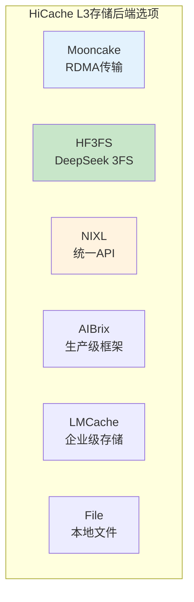

**存储后端对比：**

| 后端 | 特点 | 适用场景 |
|------|------|----------|
| `mooncake` | RDMA+多NIC，零拷贝 | 高性能分布式 |
| `hf3fs` | DeepSeek 3FS，K8s原生 | 大规模集群 |
| `nixl` | 统一API，支持多种存储 | 混合存储 |
| `aibrix` | 生产级KVCache卸载 | 生产环境 |
| `lmcache` | 企业级存储方案 | 企业部署 |
| `file` | 简单本地文件 | 测试演示 |

**配置示例：**

```bash
# ============================================================
# SGLang + Mooncake存储后端
# ============================================================
python -m sglang.launch_server \
    --model-path Qwen/Qwen3-235B-A22B-Instruct \
    --tp 8 \
    --enable-hierarchical-cache \
    --hicache-ratio 2 \
    --hicache-storage-backend mooncake \
    --hicache-write-policy write_through

# ============================================================
# SGLang + HF3FS存储后端（DeepSeek-R1）
# ============================================================
python -m sglang.launch_server \
    --model-path /path/to/DeepSeek-R1/ \
    --tp 8 \
    --enable-hierarchical-cache \
    --hicache-storage-backend hf3fs \
    --hicache-storage-prefetch-policy wait_complete
```

### 3.3 LMCache 与 SGLang 集成

```bash
# ============================================================
# SGLang启用LMCache
# ============================================================
export LMCACHE_CONFIG_FILE=$PWD/lmc_config.yaml

python -m sglang.launch_server \
    --model-path Qwen/Qwen3-8B \
    --port 30000 \
    --enable-lmcache
```

**LMCache配置文件示例：**

```yaml
# ============================================================
# lmc_config.yaml - LMCache配置
# ============================================================
chunk_size: 256          # 生产环境推荐
local_cpu: true
use_layerwise: true
max_local_cpu_size: 20   # GB
```

### 3.4 预取与写回策略

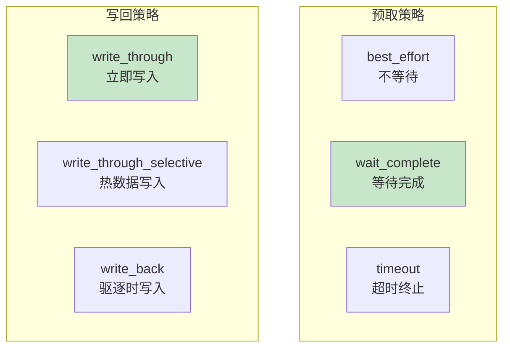

**策略选择建议：**

| 策略类型 | 策略名称 | 适用场景 | 推荐度 |
|----------|----------|----------|--------|
| **预取** | `best_effort` | 极度延迟敏感 | 低 |
| **预取** | `wait_complete` | SystemPrompt共享、高命中率 | 高 |
| **预取** | `timeout` | 生产环境平衡选择 | 推荐 |
| **写回** | `write_through` | 带宽充足、最大缓存收益 | 推荐 |
| **写回** | `write_through_selective` | 减少I/O开销 | 中 |
| **写回** | `write_back` | 存储容量有限 | 低 |

---

## 4. 集成对比分析

### 4.1 配置复杂度对比

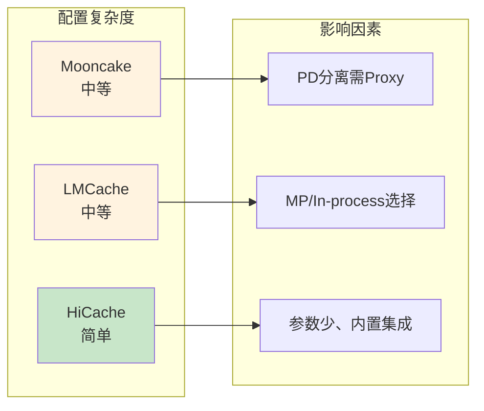

**复杂度因素：**

| 方案 | 配置项数量 | 需要额外组件 | 配置难度 |
|------|-----------|-------------|----------|
| **Mooncake + vLLM** | 5-8个 | Proxy代理服务 | 中等 |
| **LMCache + vLLM** | 6-10个 | LMCache Server（MP模式） | 中等 |
| **HiCache + SGLang** | 4-6个 | 无（内置） | 简单 |

### 4.2 功能支持对比

| 功能 | Mooncake + vLLM | LMCache + vLLM | HiCache + SGLang |
|------|-----------------|----------------|------------------|
| **KV卸载到CPU** | ✅ | ✅ | ✅ |
| **跨实例共享** | ✅ RDMA | ✅ 多后端 | ✅ L3存储 |
| **PD分离** | ✅ 原生支持 | ✅ 支持 | ✅ 支持 |
| **长上下文** | ✅ | ✅ 重点优化 | ✅ |
| **多模态** | ❌ | ✅ | ✅ |
| **存储后端多样性** | 单一RDMA | 15+后端 | 6后端 |
| **监控端点** | ❌ | ✅ MP模式 | ❌ |

### 4.3 性能特性对比

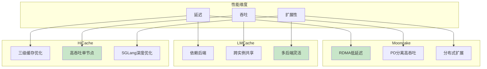

---

## 5. 选型建议

### 5.1 场景化选型指南

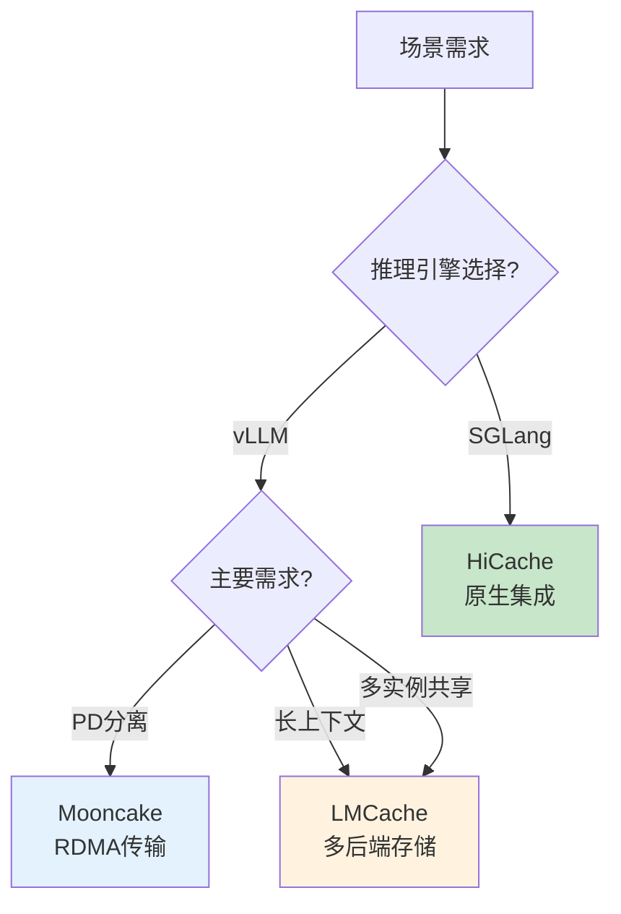

**场景选型表：**

| 场景特征 | 推荐组合 | 原因 |
|----------|----------|------|
| **vLLM + PD分离** | Mooncake | 原生Connector，RDMA零拷贝 |
| **vLLM + 长上下文** | LMCache | 多后端存储，容量大 |
| **vLLM + 多实例共享** | LMCache MP模式 | 独立服务，跨实例共享 |
| **SGLang + 高吞吐** | HiCache | 原生深度集成，三级缓存 |
| **SGLang + 多轮对话** | HiCache | 预取优化，缓存命中率高 |
| **混合引擎环境** | LMCache | 双引擎支持，兼容性好 |

### 5.2 部署模式选择

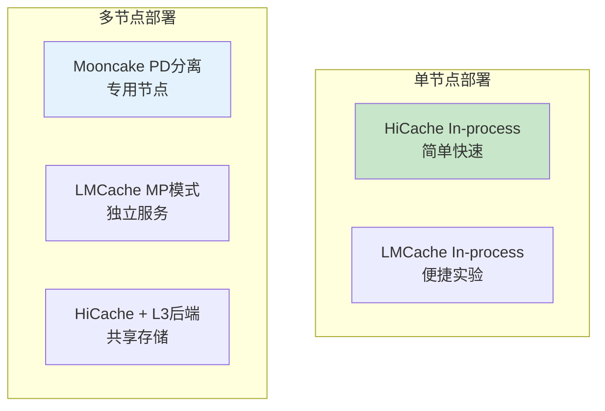

**部署模式对比：**

| 部署规模 | 推荐模式 | 配置要点 |
|----------|----------|----------|
| **单节点测试** | HiCache/SGLang | --enable-hierarchical-cache |
| **单节点生产** | LMCache In-process | 环境变量配置 |
| **小规模集群** | LMCache MP模式 | LMCache Server + 多vLLM |
| **大规模PD分离** | Mooncake + vLLM | Prefill/Decode + Proxy |
| **超大规模** | HiCache + HF3FS | 分布式存储后端 |

---

## 附录

### A. vLLM Connector速查表

| Connector | 方案 | 模式 | 特点 |
|-----------|------|------|------|
| `MooncakeConnector` | Mooncake | 嵌入 | PD分离专用 |
| `LMCacheMPConnector` | LMCache | MP | 独立服务、多实例共享 |
| `LMCacheConnectorV1` | LMCache | In-process | 单命令启动 |

### B. SGLang HiCache参数速查

| 参数 | 默认值 | 说明 |
|------|--------|------|
| `--enable-hierarchical-cache` | false | 启用分层缓存 |
| `--hicache-ratio` | - | L2/GPU内存比例 |
| `--page-size` | 模型相关 | 缓存页粒度 |
| `--hicache-io-backend` | kernel | CPU-GPU传输后端 |
| `--hicache-mem-layout` | layer_first | 内存布局 |
| `--hicache-write-policy` | write_through | 写回策略 |

### C. 集成命令模板

**Mooncake + vLLM PD分离：**
```bash
# Prefill
vllm serve <MODEL> --port 8010 \
  --kv-transfer-config '{"kv_connector":"MooncakeConnector","kv_role":"kv_producer"}'

# Decode
vllm serve <MODEL> --port 8020 \
  --kv-transfer-config '{"kv_connector":"MooncakeConnector","kv_role":"kv_consumer"}'

# Proxy
python mooncake_connector_proxy.py --prefill <PREFILL_IP:8010> --decode <DECODE_IP:8020>
```

**LMCache + vLLM MP模式：**
```bash
# LMCache Server
lmcache server --l1-size-gb 20 --chunk-size 256

# vLLM
vllm serve <MODEL> --kv-transfer-config '{"kv_connector":"LMCacheMPConnector","kv_role":"kv_both"}'
```

**HiCache + SGLang：**
```bash
python -m sglang.launch_server --model-path <MODEL> \
  --enable-hierarchical-cache \
  --hicache-ratio 2 \
  --hicache-storage-backend mooncake
```

---

> 下一节：[网络配置优化指南.md](网络配置优化指南.md) - 了解 IB/RoCE 网卡在 KVCache传输中的配置优化。