# 方案对比总结

> 总结 Mooncake/LMCache/HiCache 三方案的相同优化思路与各自部署差异，帮助做出正确的选型决策。

---

## 目录

- [1. 三方案全景对比](#1-三方案全景对比)
- [2. 相同优化思路](#2-相同优化思路)
- [3. 各方案部署差异](#3-各方案部署差异)
- [4. 选型决策指南](#4-选型决策指南)
- [5. 演进趋势展望](#5-演进趋势展望)
- [附录](#附录)

---

## 1. 三方案全景对比

### 1.1 方案定位与核心特性

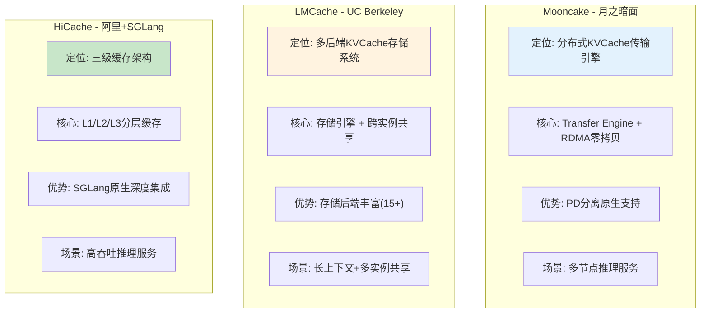

### 1.2 核心特性对比表

| 维度 | Mooncake | LMCache | HiCache |
|------|----------|---------|---------|
| **开源方** | 月之暗面 (kvcache-ai) | UC Berkeley | 阿里 + SGLang团队 |
| **GitHub** | kvcache-ai/Mooncake | LMCache/LMCache | SGLang内置 |
| **核心架构** | Transfer Engine | 多后端存储引擎 | 三级缓存 L1/L2/L3 |
| **传输方式** | RDMA零拷贝（专精） | 多协议支持 | 零拷贝+GPU辅助 |
| **存储介质** | 内存+可选SSD | CPU+磁盘+云存储 | GPU+CPU+分布式 |
| **设计重点** | 高效传输 | 灵活存储 | 分层缓存策略 |

### 1.3 推理引擎集成对比

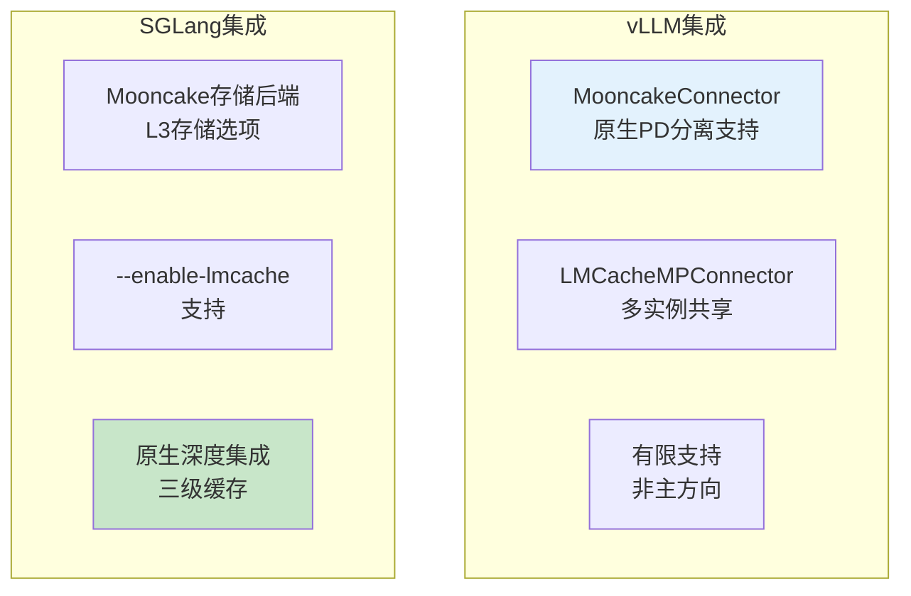

**集成成熟度评分：**

| 方案 | vLLM集成 | SGLang集成 | 综合评分 |
|------|----------|-----------|----------|
| **Mooncake** | ⭐⭐⭐⭐⭐ 原生支持 | ⭐⭐⭐ 作为后端 | vLLM首选 |
| **LMCache** | ⭐⭐⭐⭐⭐ 官方Connector | ⭐⭐⭐⭐ 支持 | 双引擎平衡 |
| **HiCache** | ⭐⭐ 有限支持 | ⭐⭐⭐⭐⭐ 原生集成 | SGLang首选 |

### 1.4 存储后端对比

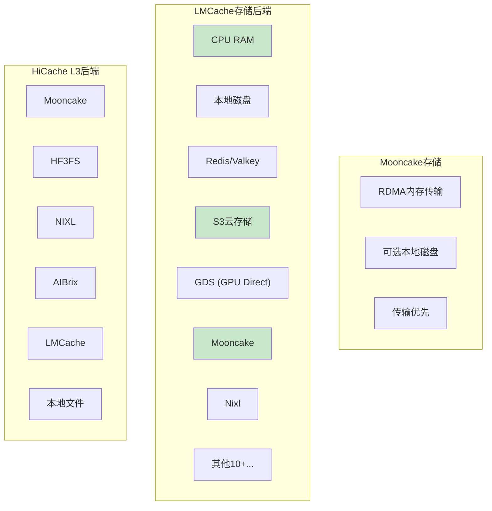

**存储后端数量：**

| 方案 | 存储后端数量 | 特点 |
|------|-------------|------|
| **Mooncake** | 1-2 | 专精RDMA传输 |
| **LMCache** | 15+ | 最丰富，覆盖各类场景 |
| **HiCache** | 6 | 精选主流后端 |

---

## 2. 相同优化思路

### 2.1 网络层共同优化

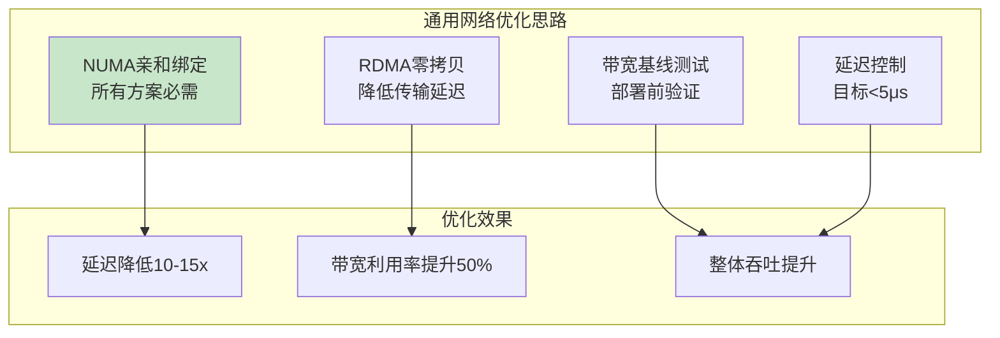

**网络层共同要点：**

| 优化点 | Mooncake | LMCache | HiCache | 统一建议 |
|--------|----------|---------|---------|----------|
| **NUMA亲和** | 必需 | 必需 | 必需 | `numactl --cpunodebind` |
| **RDMA启用** | 默认RDMA | 后端可选 | 后端可选 | 优先RDMA |
| **带宽基线** | ib_write_bw | ib_write_bw | ib_write_bw | 目标80%+ |
| **延迟基线** | ib_write_lat | ib_write_lat | ib_write_lat | 目标<5μs |

### 2.2 存储层共同优化

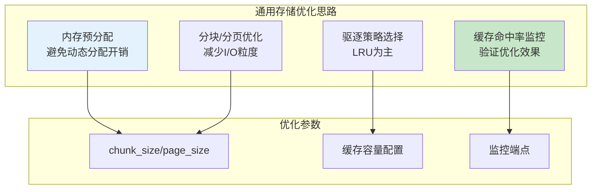

**存储层共同要点：**

| 优化点 | Mooncake | LMCache | HiCache | 统一建议 |
|--------|----------|---------|---------|----------|
| **内存预分配** | 自动管理 | `--l1-size-gb` | `--hicache-ratio` | 预分配避免动态开销 |
| **分块大小** | 内部管理 | `chunk_size=256` | `page-size=64` | 生产环境调大 |
| **缓存监控** | 日志 | MP端点 | 日志 | 监控命中率 |
| **驱逐策略** | 内部LRU | `--eviction-policy LRU` | 内部策略 | LRU为主 |

### 2.3 推理引擎共同优化

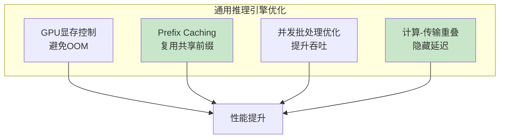

**推理引擎共同要点：**

| 优化点 | vLLM参数 | SGLang参数 | 统一建议 |
|--------|----------|-----------|----------|
| **GPU显存** | `--gpu-memory-utilization 0.85` | `--mem-fraction-static 0.85` | 预留15%安全空间 |
| **Prefix Caching** | `--enable-prefix-caching` | 内置RadixAttention | 启用复用 |
| **并发优化** | `--max-num-seqs` | `--max-running-requests` | 根据负载调整 |
| **计算-传输重叠** | KV方案内部 | `--hicache-storage-prefetch-policy` | 启用预取重叠 |

---

## 3. 各方案部署差异

### 3.1 Mooncake部署差异

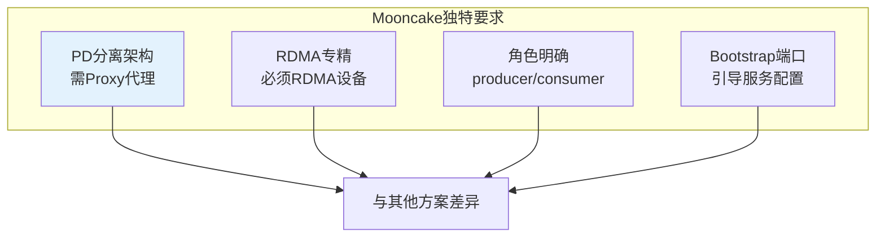

**Mooncake特有配置：**

| 配置项 | 说明 | 其他方案对比 |
|--------|------|-------------|
| **Proxy代理服务** | PD分离必须启动Proxy | LMCache/HiCache无需 |
| **kv_role角色** | producer/consumer必须明确 | LMCache可用kv_both |
| **Bootstrap端口** | Prefill节点需要8998端口 | 其他方案无此概念 |
| **RDMA强制** | 默认RDMA，TCP为备选 | LMCache多协议可选 |

**Mooncake部署关键步骤：**

```bash
# Mooncake特有步骤（其他方案无）
1. 明确Prefill/Decode节点角色
2. Prefill节点配置VLLM_MOONCAKE_BOOTSTRAP_PORT
3. 必须启动mooncake_connector_proxy.py代理服务
4. 请求发送到Proxy端口，而非直接到vLLM
```

### 3.2 LMCache部署差异

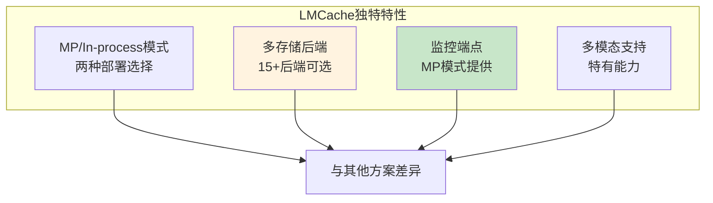

**LMCache特有配置：**

| 配置项 | 说明 | 其他方案对比 |
|--------|------|-------------|
| **MP模式独立服务** | LMCache Server独立运行 | Mooncake/HiCache嵌入式 |
| **多存储后端** | Redis/S3/GDS/Mooncake等15+ | Mooncake单一，HiCache 6个 |
| **监控端点** | MP模式提供/metrics | Mooncake/HiCache无独立端点 |
| **多模态KVCache** | 支持多模态模型 | Mooncake当前不支持 |
| **配置文件** | YAML配置文件方式 | 其他方案命令行为主 |

**LMCache部署关键决策：**

```markdown
# LMCache特有决策（其他方案无）
1. 选择MP模式还是In-process模式？
   - MP模式：生产环境、多实例共享
   - In-process：单节点快速实验

2. 选择存储后端？
   - 本地CPU：快速低延迟
   - Redis/Valkey：分布式共享
   - S3：云端持久化
   - Mooncake：RDMA高性能

3. 配置文件编写？
   - lmc_config.yaml 方式更灵活
```

### 3.3 HiCache部署差异

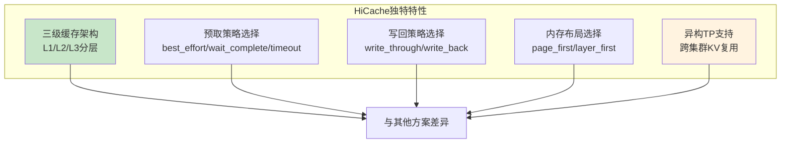

**HiCache特有配置：**

| 配置项 | 说明 | 其他方案对比 |
|--------|------|-------------|
| **三级缓存显式配置** | L1/L2/L3容量比例配置 | 其他方案两层或不分层 |
| **预取策略选择** | 三种策略可选 | Mooncache/LMCache内部管理 |
| **写回策略选择** | 三种策略可选 | 其他方案默认或有限选择 |
| **内存布局选择** | page_first_direct等 | 其他方案无此概念 |
| **异构TP支持** | tp_lcm_size跨集群复用 | 其他方案无此特性 |
| **SGLang原生** | 内置集成，参数简单 | Mooncake/LMCache需额外配置 |

**HiCache部署关键决策：**

```markdown
# HiCache特有决策（其他方案无）
1. 预取策略选择？
   - best_effort: 延迟敏感，不等待
   - wait_complete: 高命中率，SystemPrompt场景
   - timeout: 生产推荐，平衡选择

2. 写回策略选择？
   - write_through: 推荐，带宽充足时收益最大
   - write_through_selective: 减少I/O
   - write_back: 存储容量有限时

3. 内存布局选择？
   - page_first_direct: 推荐，配合direct后端
   - layer_first: 默认兼容

4. 是否启用异构TP？
   - 跨集群KV复用时配置tp_lcm_size
```

---

## 4. 选型决策指南

### 4.1 场景化选型决策树

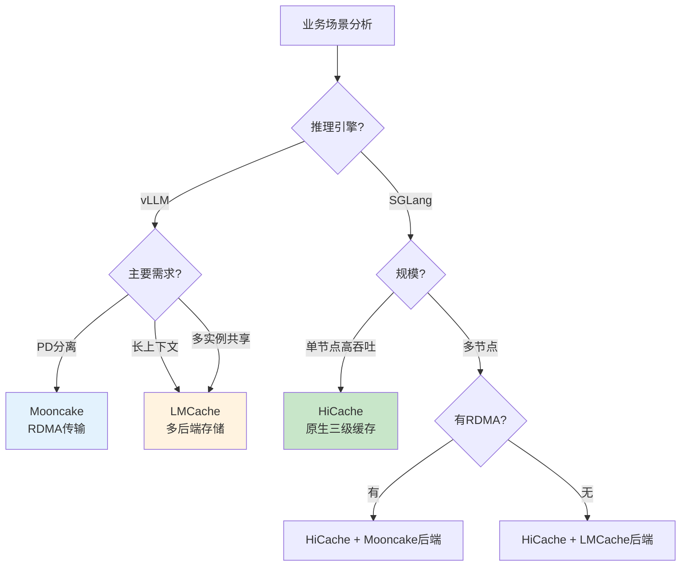

### 4.2 选型决策表

| 场景特征 | 推荐方案 | 推理引擎 | 关键原因 |
|----------|----------|----------|----------|
| **多节点PD分离** | Mooncake | vLLM | 原生Connector，RDMA专精 |
| **长上下文推理** | LMCache | vLLM | 多后端存储，容量大 |
| **多实例共享KVCache** | LMCache MP | vLLM/SGLang | 独立服务，跨实例共享 |
| **高吞吐单节点** | HiCache | SGLang | 原生集成，三级缓存优化 |
| **多轮对话场景** | HiCache | SGLang | 预取优化，缓存命中率高 |
| **混合引擎环境** | LMCache | 双引擎 | 兼容性最好 |
| **异构TP集群** | HiCache | SGLang | tp_lcm_size跨集群复用 |

### 4.3 组合方案推荐

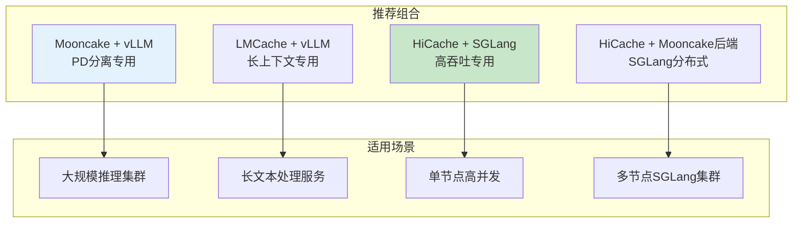

**组合方案说明：**

| 组合 | 优势 | 配置要点 |
|------|------|----------|
| **Mooncake + vLLM** | PD分离原生，RDMA高效 | Prefill+Decode+Proxy三组件 |
| **LMCache + vLLM MP** | 多实例共享，监控端点 | LMCache Server + 多vLLM实例 |
| **HiCache + SGLang** | 原生集成简单，三级缓存 | 单命令启用，参数少 |
| **HiCache + Mooncake后端** | SGLang分布式RDMA | --hicache-storage-backend mooncake |

---

## 5. 演进趋势展望

### 5.1 方案演进方向

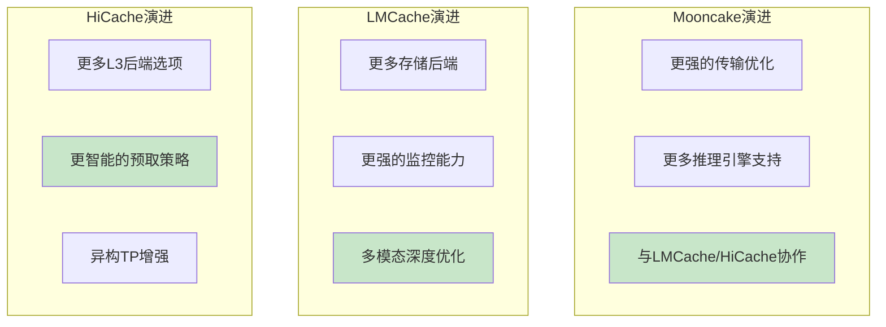

**演进观察：**

| 方案 | 当前重点 | 演进方向 |
|------|----------|----------|
| **Mooncake** | RDMA传输专精 | 扩展引擎支持、与其他方案协作 |
| **LMCache** | 存储后端丰富 | 监控能力、多模态优化 |
| **HiCache** | SGLang深度集成 | 智能预取、异构TP增强 |

### 5.2 方案协作趋势

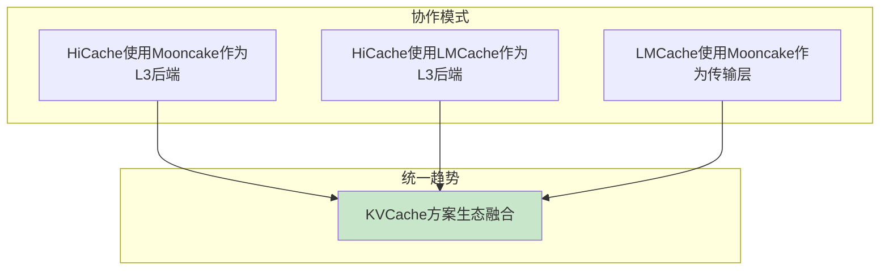

**协作现状：**

| 协作关系 | 现状 | 说明 |
|----------|------|------|
| **HiCache → Mooncake** | 已支持 | Mooncake作为HiCache L3存储后端 |
| **HiCache → LMCache** | 已支持 | LMCache作为HiCache L3存储后端 |
| **LMCache → Mooncake** | 已支持 | Mooncake作为LMCache传输层 |
| **统一接口** | 探索中 | 未来可能统一KVCache接口标准 |

---

## 附录

### A. 方案特性速查表

| 特性 | Mooncake | LMCache | HiCache |
|------|----------|---------|---------|
| **开源方** | 月之暗面 | UC Berkeley | 阿里+SGLang |
| **核心架构** | Transfer Engine | 多后端存储 | 三级缓存 |
| **传输协议** | RDMA专精 | 多协议 | 零拷贝+GPU辅助 |
| **存储后端数** | 1-2 | 15+ | 6 |
| **vLLM集成** | 原生Connector | 官方Connector | 有限 |
| **SGLang集成** | 存储后端 | 支持 | 原生深度 |
| **PD分离** | 原生支持 | 支持 | 支持 |
| **多模态** | 否 | 是 | 是 |
| **监控端点** | 否 | MP模式有 | 否 |
| **部署复杂度** | 中 | 中 | 低 |

### B. 配置参数速查

**Mooncake核心参数：**
- `kv_connector`: MooncakeConnector
- `kv_role`: kv_producer/kv_consumer/kv_both
- `mooncake_protocol`: rdma/tcp
- `VLLM_MOONCAKE_BOOTSTRAP_PORT`: 8998

**LMCache核心参数：**
- `kv_connector`: LMCacheMPConnector/LMCacheConnectorV1
- `LMCACHE_CHUNK_SIZE`: 256 (生产)
- `LMCACHE_LOCAL_CPU`: true
- `LMCACHE_MAX_LOCAL_CPU_SIZE`: 20 (GB)

**HiCache核心参数：**
- `--enable-hierarchical-cache`: 启用
- `--hicache-ratio`: 2
- `--page-size`: 64
- `--hicache-storage-backend`: mooncake/hf3fs/nixl...
- `--hicache-write-policy`: write_through
- `--hicache-storage-prefetch-policy`: timeout

### C. 选型决策快速指南

```
场景问题 → 方案选择：

Q: 使用vLLM且需要PD分离？
A: Mooncake（原生Connector，RDMA专精）

Q: 需要长上下文处理？
A: LMCache（多后端存储，容量大）

Q: 多实例共享KVCache？
A: LMCache MP模式（独立服务，跨实例共享）

Q: 使用SGLang追求高吞吐？
A: HiCache（原生集成，三级缓存）

Q: SGLang多节点集群？
A: HiCache + Mooncake/HF3FS后端

Q: 混合vLLM/SGLang环境？
A: LMCache（双引擎兼容最好）
```

---

> 完成本专题学习后，可进入各子专题深入学习具体部署配置：[4.1mooncake/](../4.1mooncake/)、[4.2lmcache/](../4.2lmcache/)、[4.3hicache/](../4.3hicache/)