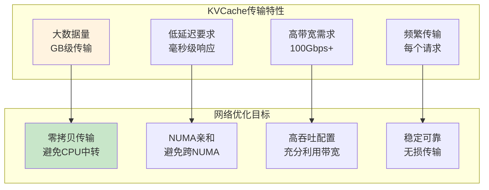
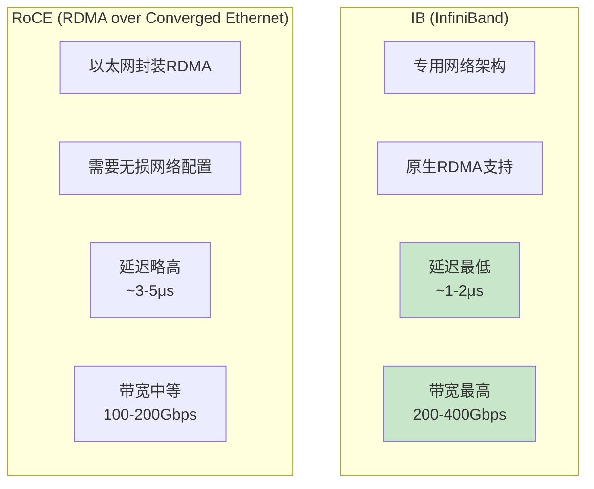
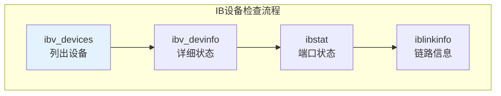
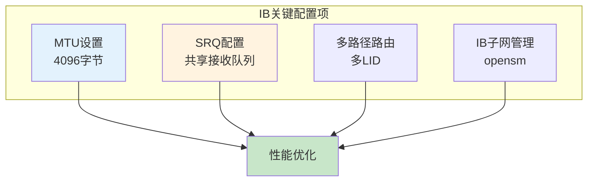
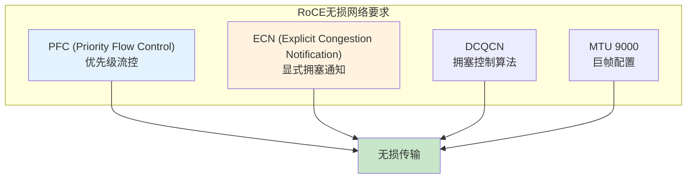
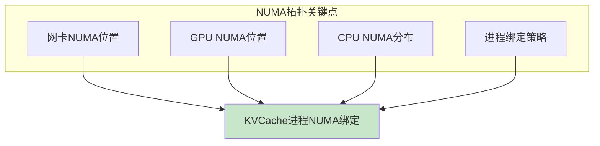
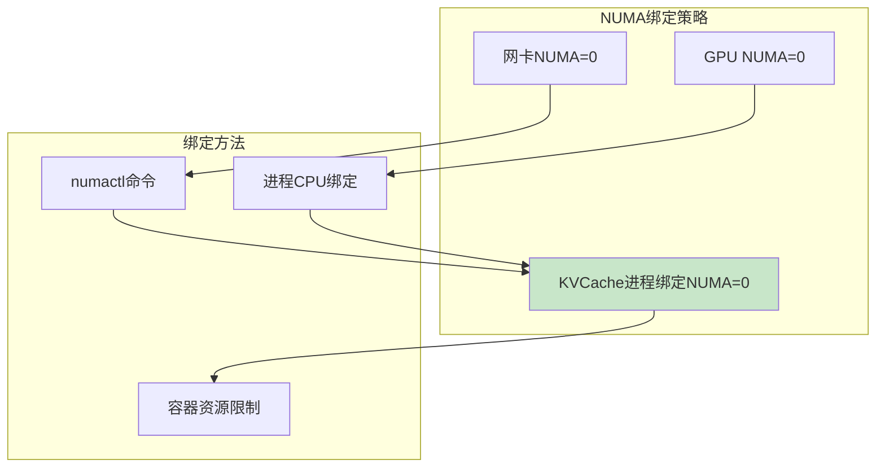
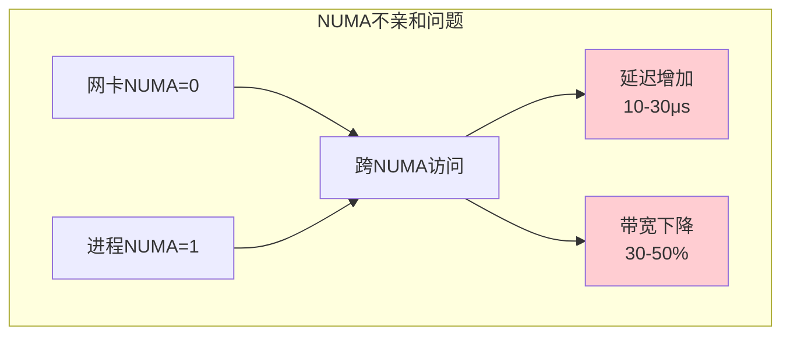
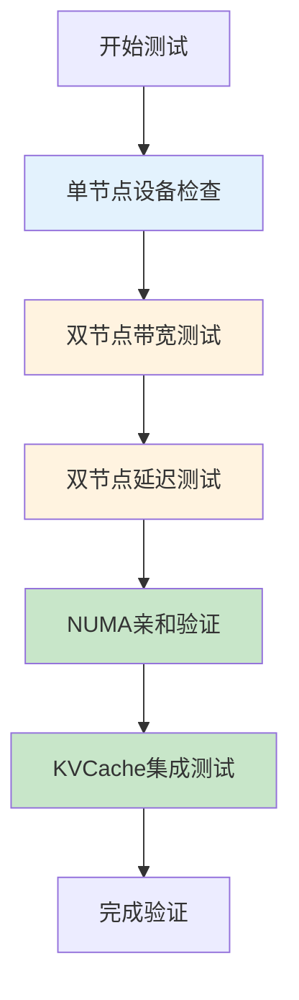

# 网络配置优化指南

> 系统学习 IB/RoCE 网卡在 KVCache 传输场景中的配置优化，实现 RDMA 零拷贝高效传输。

---

## 目录

- [1. 网络优化概述](#1-网络优化概述)
- [2. IB 网络配置优化](#2-ib-网络配置优化)
- [3. RoCE 网络配置优化](#3-roce-网络配置优化)
- [4. NUMA 亲和性配置](#4-numa-亲和性配置)
- [5. 性能验证与测试](#5-性能验证与测试)
- [附录](#附录)

---

## 1. 网络优化概述

### 1.1 KVCache传输对网络的要求



**核心优化目标：**

| 目标 | 说明 | 关键配置 |
|------|------|----------|
| **零拷贝传输** | RDMA直接内存到内存 | GPUDirect + RDMA |
| **NUMA亲和** | 网卡与进程同NUMA节点 | CPU绑定 + 网卡NUMA检查 |
| **带宽最大化** | 充分利用网卡带宽 | MTU调优 + 多路径 |
| **无损传输** | 避免丢包和重传 | 流控配置 |

### 1.2 IB vs RoCE 选择



**特性对比：**

| 特性 | IB (InfiniBand) | RoCE v2 |
|------|-----------------|---------|
| **延迟** | ~1-2μs | ~3-5μs |
| **带宽** | 200-400Gbps (NDR) | 100-200Gbps |
| **流控** | 硬件原生流控 | 需配置PFC+ECN |
| **路由** | IB子网管理器 | IP路由 |
| **成本** | 高（专用设备） | 中（以太网设备） |
| **适用场景** | 大规模训练集群 | 推理服务集群 |

---

## 2. IB 网络配置优化

### 2.1 IB设备发现与验证



**检查命令：**

```bash
# ============================================================
# IB设备发现与验证
# ============================================================

# 列出所有RDMA设备
ibv_devices
# 输出示例：
#    device                 node GUID
#    ------                 ----------------
#    mlx5_0                 506b4b0000a8c0a0
#    mlx5_1                 506b4b0000a8c0a1

# 查看设备详细信息
ibv_devinfo -v
# 关注：port_state (PORT_ACTIVE), max_msg_sz, mtu

# 查看IB端口状态
ibstat
# 关注：State: Active, Rate: 100 (100Gbps)

# 查看链路拓扑
iblinkinfo
# 关注：LinkWidth, LinkSpeed, LID
```

**关键状态检查：**

| 状态字段 | 期望值 | 异常处理 |
|----------|--------|----------|
| `port_state` | PORT_ACTIVE | 检查物理连接 |
| `phys_state` | LinkUp | 检查线缆 |
| `Rate` | 100 (100Gbps) | 检查网卡型号 |
| `mtu` | 4096 (IB默认) | 可调整 |

### 2.2 IB网络参数优化



**MTU配置：**

```bash
# ============================================================
# IB MTU配置（IB默认4096，无需额外配置）
# ============================================================

# 验证当前MTU
ibv_devinfo | grep mtu
# 输出: mtu: 4096

# 如需调整（通过驱动参数）
echo options mlx5_core mtu=4096 > /etc/modprobe.d/mlx5.conf
modprobe -r mlx5_core && modprobe mlx5_core
```

**SRQ（Shared Receive Queue）启用：**

```bash
# ============================================================
# SRQ启用 - 减少资源消耗，提升多连接性能
# ============================================================

# 检查SRQ支持
ibv_devinfo -v | grep srq

# 应用层启用SRQ（Mooncake/LMCache内部配置）
# 通常由KVCache方案自动配置
```

**IB子网管理器配置：**

```bash
# ============================================================
# IB子网管理器（SM）配置
# ============================================================

# 检查SM状态
ibchecksm
# 或
systemctl status opensm

# 启动SM（如无SM运行）
systemctl start opensm

# 多节点集群建议至少两个SM（主备）
```

### 2.3 IB性能测试

```bash
# ============================================================
# IB带宽测试
# ============================================================

# Server端（节点1）
ib_write_bw -d mlx5_0 -a --size=1048576

# Client端（节点2）
ib_write_bw -d mlx5_0 -a <server_ip> --size=1048576

# 期望输出：~100Gbps (IB 100G网卡)

# ============================================================
# IB延迟测试
# ============================================================

# Server端
ib_write_lat -d mlx5_0 -a

# Client端
ib_write_lat -d mlx5_0 -a <server_ip>

# 期望输出：~1-2μs
```

---

## 3. RoCE 网络配置优化

### 3.1 RoCE无损网络配置



**PFC配置（交换机侧）：**

```bash
# ============================================================
# RoCE PFC配置（Mellanox交换机示例）
# ============================================================

# 交换机CLI配置PFC
# 需要在交换机上配置，这里仅示意

# 开启PFC的优先级3（RoCE默认使用优先级3）
# 典型配置：
#   priority-flow-control mode on
#   priority-flow-control priority 3 no-drop
```

**ECN配置（交换机侧）：**

```bash
# ============================================================
# RoCE ECN配置
# ============================================================

# 交换机开启ECN标记
# 典型配置：
#   qos ecn-enable
#   qos ecn-min-threshold 150KB
#   qos ecn-max-threshold 300KB
#   qos ecn-probability 100
```

**主机侧DCQCN配置：**

```bash
# ============================================================
# 主机侧RoCE拥塞控制
# ============================================================

# Mellanox网卡DCQCN配置
# 查看当前配置
mlnx_qos -i eth0

# 设置RoCE优先级和拥塞控制
# 示例配置（需根据交换机配置匹配）
mlnx_qos -i eth0 --pfc 0,0,0,1,0,0,0,0  # 优先级3启用PFC
```

### 3.2 RoCE MTU与网络参数

```bash
# ============================================================
# RoCE MTU配置（建议9000巨帧）
# ============================================================

# 检查当前MTU
ip link show eth0 | grep mtu

# 设置MTU为9000（需交换机支持）
ip link set eth0 mtu 9000

# 永久配置（网络配置文件）
# /etc/sysconfig/network-scripts/ifcfg-eth0 (CentOS)
# MTU=9000

# ============================================================
# RoCE网络其他优化
# ============================================================

# 检查RDMA设备
ibv_devinfo -v

# 确认RoCE模式
# 输出应包含：transport: IB_LINK_LAYER_INFINIBAND 或 ETHERNET
```

### 3.3 RoCE性能测试

```bash
# ============================================================
# RoCE带宽测试
# ============================================================

# Server端
ib_write_bw -d mlx5_0 -a --size=1048576

# Client端
ib_write_bw -d mlx5_0 -a <server_ip> --size=1048576

# 期望输出：接近网卡带宽（100G网卡 ~90Gbps）

# ============================================================
# 使用iperf3验证RoCE网络带宽
# ============================================================

# Server端
iperf3 -s

# Client端
iperf3 -c <server_ip> -t 60 -i 1

# 期望输出：接近网卡带宽
```

---

## 4. NUMA 亲和性配置

### 4.1 NUMA拓扑分析



**NUMA拓扑查看：**

```bash
# ============================================================
# NUMA拓扑查看
# ============================================================

# 查看CPU NUMA分布
numactl -H
# 输出示例：
# available: 2 nodes (0-1)
# node 0 cpus: 0 1 2 3 4 5 6 7
# node 1 cpus: 8 9 10 11 12 13 14 15
# node 0 size: 65536 MB
# node 1 size: 65536 MB

# 查看硬件拓扑（包括网卡、GPU）
lstopo
# 或
lstopo --output-format text

# 查看网卡NUMA位置
cat /sys/class/net/eth0/device/numa_node
# 输出：0 或 1

# 查看GPU NUMA位置
nvidia-smi topo -m
# 输出GPU与NUMA的拓扑关系
```

### 4.2 NUMA亲和绑定配置



**进程NUMA绑定：**

```bash
# ============================================================
# 使用numactl绑定进程到特定NUMA节点
# ============================================================

# 方法1: 命令行绑定
numactl --cpunodebind=0 --membind=0 \
    python -m sglang.launch_server --model-path Qwen/Qwen3-8B

# 方法2: 绑定到网卡所在NUMA
# 先获取网卡NUMA
NIC_NUMA=$(cat /sys/class/net/eth0/device/numa_node)

# 启动进程绑定到同一NUMA
numactl --cpunodebind=$NIC_NUMA --membind=$NIC_NUMA \
    vllm serve Qwen/Qwen2.5-7B-Instruct

# ============================================================
# 检查进程NUMA绑定状态
# ============================================================

# 查看进程NUMA策略
numactl --show
# 或针对特定进程
ps -eo pid,psr,comm | grep vllm
```

**Kubernetes容器NUMA绑定：**

```yaml
# ============================================================
# Kubernetes Pod NUMA绑定示例
# ============================================================
apiVersion: v1
kind: Pod
metadata:
  name: vllm-numa-bound
spec:
  containers:
    - name: vllm
      resources:
        limits:
          cpu: "8"           # 限制CPU数量
          memory: "64Gi"
        requests:
          cpu: "8"
          memory: "64Gi"
      # 通过CPU set实现NUMA绑定
      # 需配合kubelet CPU管理策略
```

### 4.3 NUMA不亲和的影响



**性能影响数据：**

| 场景 | NUMA亲和 | NUMA不亲和 | 性能差异 |
|------|----------|-----------|----------|
| **RDMA延迟** | ~2μs | ~15-30μs | **10-15x增加** |
| **带宽利用率** | ~90% | ~40-60% | **30-50%下降** |
| **KVCache传输** | ~100GB/s | ~50GB/s | **50%下降** |

---

## 5. 性能验证与测试

### 5.1 网络性能测试流程



### 5.2 测试命令汇总

**单节点检查：**

```bash
# ============================================================
# 单节点网络设备检查
# ============================================================

# IB设备检查
ibv_devices && ibv_devinfo && ibstat

# NUMA拓扑检查
numactl -H && lstopo

# 网卡NUMA位置
cat /sys/class/net/*/device/numa_node

# GPU NUMA位置
nvidia-smi topo -m
```

**双节点带宽测试：**

```bash
# ============================================================
# IB/RoCE带宽测试
# ============================================================

# Server端（节点A）
ib_write_bw -d mlx5_0 -a --size=1048576

# Client端（节点B）
ib_write_bw -d mlx5_0 -a <server_ip> --size=1048576

# 期望结果：
# - IB 100G: ~95-100 Gbps
# - RoCE 100G: ~85-95 Gbps
# - 如果低于70%，需排查配置
```

**双节点延迟测试：**

```bash
# ============================================================
# IB/RoCE延迟测试
# ============================================================

# Server端
ib_write_lat -d mlx5_0 -a

# Client端
ib_write_lat -d mlx5_0 -a <server_ip>

# 期望结果：
# - IB: ~1-2 μs
# - RoCE: ~3-5 μs
# - 如果超过10μs，需检查NUMA配置
```

### 5.3 性能基准参考

| 测试项 | IB 100G期望 | RoCE 100G期望 | 异常阈值 |
|--------|-------------|---------------|----------|
| **带宽** | 95-100 Gbps | 85-95 Gbps | <70 Gbps |
| **延迟** | 1-2 μs | 3-5 μs | >10 μs |
| **NUMA延迟** | 同NUMA ~2μs | 同NUMA ~3μs | 跨NUMA >15μs |

---

## 附录

### A. 常用工具速查

| 工具 | 用途 | 关键命令 |
|------|------|----------|
| `ibv_devices` | 列出RDMA设备 | `ibv_devices` |
| `ibv_devinfo` | 设备详细信息 | `ibv_devinfo -v` |
| `ibstat` | IB端口状态 | `ibstat` |
| `ib_write_bw` | RDMA写带宽测试 | `ib_write_bw -d mlx5_0 -a` |
| `ib_write_lat` | RDMA写延迟测试 | `ib_write_lat -d mlx5_0 -a` |
| `numactl` | NUMA控制 | `numactl -H` |
| `lstopo` | 硬件拓扑 | `lstopo` |
| `mlnx_qos` | Mellanox QoS配置 | `mlnx_qos -i eth0` |

### B. 配置参数速查

| 参数 | IB推荐值 | RoCE推荐值 | 说明 |
|------|----------|-----------|------|
| **MTU** | 4096（默认） | 9000 | 巨帧减少开销 |
| **PFC** | 硬件原生 | 优先级3开启 | 无损传输 |
| **ECN** | 不需要 | 开启 | 拥塞通知 |
| **NUMA绑定** | 必须配置 | 必须配置 | 性能关键 |

### C. 常见问题排查

| 问题 | 可能原因 | 排查步骤 |
|------|----------|----------|
| 带宽低于70% | NUMA不亲和、MTU配置 | 检查NUMA、调整MTU |
| 延迟超过10μs | NUMA不亲和 | 检查进程NUMA绑定 |
| RoCE丢包 | PFC未配置 | 检查交换机PFC配置 |
| IB网络不通 | SM未运行 | 启动opensm |

---

> 下一节：[优化建议与避坑指南.md](优化建议与避坑指南.md) - 了解 KVCache 部署中的通用优化建议和常见坑。