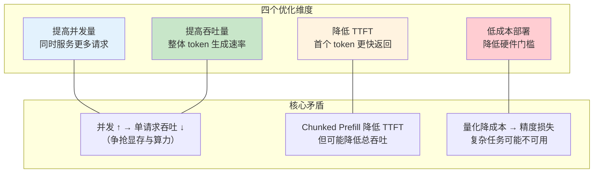
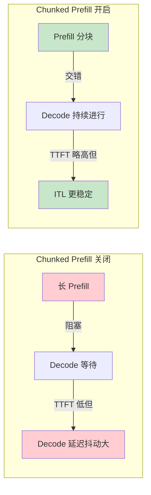
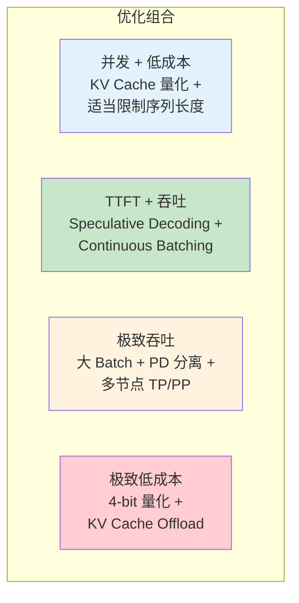

# 通用优化思路指导

> 从四个优化维度出发，系统梳理 vLLM 与 SGLang 共通的推理优化思路。

---

## 目录

- [1. 优化维度总览](#1-优化维度总览)
- [2. 提高并发量](#2-提高并发量)
- [3. 降低首个 Token 延迟 (TTFT)](#3-降低首个-token-延迟-ttft)
- [4. 提高吞吐速率](#4-提高吞吐速率)
- [5. 低成本部署](#5-低成本部署)
- [6. 各维度权衡与选型策略](#6-各维度权衡与选型策略)

---

## 1. 优化维度总览

推理优化存在四个相互制约的维度，需要根据业务场景做权衡：



### 1.1 各维度适用场景

| 维度 | 典型场景 | 核心指标 |
|------|----------|----------|
| 提高并发量 | 在线聊天机器人、多租户 API 服务 | **最大并发请求数** |
| 降低 TTFT | 对话交互、实时助手 | **首个 token 返回时间 (ms)** |
| 提高吞吐量 | 离线批处理、数据生成 | **Tokens/s (生成速率)** |
| 低成本部署 | 边缘部署、小预算场景 | **峰值显存占用 (GB)** |

---

## 2. 提高并发量

### 2.1 核心思路

提高并发量的本质是**在显存容量约束下最大化同时运行请求数**。瓶颈通常是 KV Cache 的显存占用。

### 2.2 共用调优方向

| 调优方向 | 说明 | vLLM 对应参数 | SGLang 对应参数 |
|----------|------|---------------|-----------------|
| **提高显存分配比例** | 给 KV Cache 分配更多显存 | `--gpu-memory-utilization`（默认 0.92） | `--mem-fraction-static`（默认值见最新文档） |
| **限制最大序列长度** | 减少单请求 KV Cache 占用 | `--max-model-len` | `--max-total-tokens` |
| **增大最大并发请求数** | 允许更多请求同时在批处理中 | `--max-num-seqs` | `--max-running-requests` |
| **启用 KV Cache 量化** | 降低每 token 的显存占用 | `--kv-cache-dtype`（设为 fp8） | `--kv-cache-dtype`（设为 `fp8_e4m3`） |
| **分页管理** | 减少内部碎片 | PagedAttention（默认启用） | RadixAttention（默认启用） |

### 2.3 调度策略对并发的影响

- **vLLM**: 使用 `max-num-seqs` 和 `max-model-len` 共同控制并发上限。`enable-chunked-prefill` 可让 prefill 分块插入 decode 批次，提高 GPU 利用率，但可能略微降低单请求吞吐。
- **SGLang**: 使用 `--max-running-requests` 控制运行中请求数上限，`--max-queued-requests` 控制队列深度。`--schedule-policy` 支持多种调度策略（默认 fcfs）。

### 2.4 典型优化路径

```
场景：高并发在线服务 (如 8×A100-80G 部署 70B 模型)
├── 1. 设置 kv-cache-dtype = fp8 → 并发容量翻倍
├── 2. 适当降低 max-model-len（如果业务不需要超长上下文）
├── 3. 增大 max-num-seqs / max-running-requests
├── 4. 启用 chunked-prefill → 减少 prefill 阻塞 decode 的时间
└── 5. 监控 GPU 显存利用率，逐步调整至接近满载而不 OOM
```

---

## 3. 降低首个 Token 延迟 (TTFT)

### 3.1 核心思路

TTFT 主要取决于 **Prefill 阶段**的处理速度，即模型处理输入序列（prompt）的时间。输入越长，TTFT 越大。

### 3.2 共用调优方向

| 调优方向 | 说明 | vLLM 实现 | SGLang 实现 |
|----------|------|-----------|-------------|
| **Prefix Caching** | 缓存相同前缀的 KV Cache，跳过重复 prefill | Automatic Prefix Caching（`--enable-prefix-caching`） | RadixAttention（默认启用，`--radix-eviction-policy`） |
| **Chunked Prefill** | 将长 prefill 拆分为块，与 decode 交错执行，减少对 decode 的阻塞 | `--enable-chunked-prefill` | `--chunked-prefill-size` |
| **PD Disaggregation** | 将 prefill 和 decode 分离到不同实例，各自独立优化 | 可通过社区方案实现 | `--disaggregation-mode`（原生支持） |
| **减少输入长度** | 系统设计层面，如提示词压缩、检索增强 | 应用层策略 | 应用层策略 |

### 3.3 Prefix Caching 适用场景对比

| 场景 | 优化效果 | 说明 |
|------|----------|------|
| 多轮对话（共享历史消息） | 显著 | 历史对话的 KV Cache 被复用 |
| 长文档问答（共享文档前缀） | 显著 | 文档只需 prefill 一次 |
| 随机独立请求（无共享前缀） | 无收益 | Prefix Caching 不生效 |
| 共享 system prompt | 中等 | 仅 system prompt 部分被缓存 |

### 3.4 Chunked Prefill 的权衡



> **TTFT（Time to First Token）** 和 **ITL（Inter-Token Latency，逐 token 延迟）** 之间通常需要权衡。

### 3.5 典型优化路径

```
场景：互动对话服务 (TTFT 敏感)
├── 1. 启用 Prefix Caching → 多轮对话加速
├── 2. 调整 Chunked Prefill 参数 → 平衡 TTFT 和 ITL
├── 3. 如果已经使用共享 system prompt，根据共享前缀长度预期收益
├── 4. 对于极高 QPS 场景 → 考虑 PD Disaggregation 架构
└── 5. 监控 P99 TTFT，逐步调整
```

---

## 4. 提高吞吐速率

### 4.1 核心思路

吞吐速率 = **每秒生成的 token 数**，受 GPU 计算能力（FLOPS）和显存带宽（HBM）的双重约束。

### 4.2 共用调优方向

| 调优方向 | 说明 | vLLM 实现 | SGLang 实现 |
|----------|------|-----------|-------------|
| **Continuous Batching** | 请求完成即移出批次，新请求立即加入，GPU 始终满载 | 默认启用 | 默认启用（RadixScheduler） |
| **Speculative Decoding** | 用小草稿模型快速生成候选，目标模型并行验证 | `--speculative-model` / `--speculative-config` | `--speculative-algorithm` + `--speculative-draft-model-path` |
| **Tensor Parallelism (TP)** | 将单层计算拆分到多卡，减少单卡计算时间 | `--tensor-parallel-size` | `--tensor-parallel-size` |
| **Pipeline Parallelism (PP)** | 将多层拆分到多卡，适合显存受限场景 | `--pipeline-parallel-size` | `--pipeline-parallel-size` |
| **CUDA Graph** | 捕获静态计算图，减少 kernel launch 开销 | 默认启用（部分场景） | `--enable-torch-compile` / Breakable CUDA Graph |
| **Data Parallelism (DP)** | 多副本并行处理不同请求 | 手动多实例 + 负载均衡 | `--data-parallel-size` / DP Router |

### 4.3 Continuous Batching 的核心差异

两者都支持 Continuous Batching，但实现方式不同：

- **vLLM**: 全局统一的 Scheduler，prefill 和 decode 共享一个批次队列。`--enable-chunked-prefill` 允许 prefill 片段插入 decode 批次。
- **SGLang**: RadixScheduler 结合 RadixAttention 做前缀感知的任务调度。通过 `--schedule-policy` 支持多种调度策略（lpm、random、fcfs、dfs-weight、lof、priority）。

### 4.4 Speculative Decoding 的选用原则

```
是否适合使用推测解码？
├── 目标模型 vs 草稿模型尺寸差距大 → 推荐使用
├── batch size 很小（< 8）→ 推荐使用（草稿开销可忽略）
├── batch size 很大（> 64）→ 收益递减（目标模型已充分饱和）
├── 模型输出是固定模板/代码 → Prompt Lookup / NGRAM 无需额外模型
└── 模型输出是创意写作 → 收益有限（接受率低）
```

### 4.5 典型优化路径

```
场景：离线批处理 (吞吐敏感)
├── 1. 最大化 batch size → max-num-seqs / max-running-requests
├── 2. 关闭 Chunked Prefill → 避免碎片化
├── 3. 如果 TP + PP 分布合理 → 确保通信不成为瓶颈
├── 4. 考虑开启 Speculative Decoding → 额外 1.5x-3x 加速
└── 5. CUDA Graph / torch.compile → kernel 级优化
```

---

## 5. 低成本部署

### 5.1 核心思路

在有限的显存预算（如单张 A100-40G、RTX 4090 24G）下运行尽可能大的模型，或承载尽可能多的并发。

### 5.2 共用调优方向

| 调优方向 | 说明 | vLLM 支持 | SGLang 支持 |
|----------|------|-----------|-------------|
| **权重量化** | 模型权重从 BF16 转为低精度 | `--quantization`（awq/gptq/fp8 等） | `--quantization`（awq/gptq/fp8 等 20+ 方法） |
| **KV Cache 量化** | KV Cache 从 BF16 转为 FP8/FP4 | `--kv-cache-dtype`（fp8 等） | `--kv-cache-dtype`（`fp8_e4m3`/`fp8_e5m2`/`fp4_e2m1`） |
| **KV Cache Offloading** | 不活跃的 KV Cache 换出到 CPU 内存 | Hybrid KV Cache Manager（设计文档有描述） | HiCache（--enable-hierarchical-cache） |
| **减少并行度** | 降低 TP 或关闭 DP | TP=1 单卡部署 | TP=1 单卡部署 |
| **激活量化** | 激活值从 FP16 转为 FP8 | 通过 `--quantization` 方案间接支持 | `--quantization` w8a8_fp8 等 |

### 5.3 量化带来的显存节省与精度权衡

| 量化方案 | 权重位宽 | KV Cache 位宽 | 典型显存节省 | 适用场景 |
|----------|---------|---------------|-------------|----------|
| BF16（基线） | 16-bit | 16-bit | 0% | 精度优先，硬件充足 |
| FP8 权重量化 | 8-bit | 16-bit | ~45% | 通用平衡方案 |
| AWQ/GPTQ (4-bit) | 4-bit | 16-bit | ~65% | 显存受限，接受小幅精度损失 |
| AWQ + KV Cache FP8 | 4-bit | 8-bit | ~72% | 极端节省，需验证精度 |
| KV Cache FP4 | 16-bit | 4-bit | KV Cache 部分 3.56× | 超长上下文，实验性 |

> 以上数据基于 SGLang 官方文档和社区 benchmark，实际收益因模型架构和硬件平台而异。

### 5.4 典型优化路径

```
场景：单卡 A100-40G 部署 70B 模型
├── 前提：70B BF16 需要约 140GB 显存，远超 40GB
├── 1. 必须权重量化：使用 AWQ/GPTQ 4-bit → 权重降到 ~35GB
├── 2. 启用 KV Cache 量化：fp8_e4m3 → 进一步降低显存
├── 3. 限制 max-model-len / max-total-tokens → 控制 KV Cache 上限
├── 4. 降低 max-num-seqs → 减少并发 KV Cache 占用
├── 5. 监控实际 OOM 情况，在精度和容量间找到平衡点
└── 如果仍然 OOM → 升级到 80G 版本或使用多卡 TP/PP
```

### 5.5 PP（Pipeline Parallelism）在低成本部署中的应用

当显存不足以加载模型权重时（例如 80G 显存装不下 70B 模型），PP 可以将不同层分布到不同 GPU 上。虽然不提高单卡吞吐，但**扩大了可部署的模型范围**。

---

## 6. 各维度权衡与选型策略

### 6.1 场景与优化优先级

| 业务场景 | 首要优化目标 | 次要优化目标 | 不建议优化的方向 |
|----------|-------------|-------------|-----------------|
| 在线对话助手 | TTFT < 200ms | 高并发 | 追求极致吞吐 |
| 离线批量推理 | 吞吐量最大化 | 低成本 | 追求低 TTFT |
| API 多租户网关 | 高并发 + 稳定性 | 低成本 | 单请求极致优化 |
| 嵌入模型/分类 | TTFT（短输入） | 吞吐量 | Speculative Decoding |
| 边缘设备部署 | 低成本 | TTFT | 高并发 |

### 6.2 优化组合矩阵



### 6.3 调优建议流程

```
1. 确定业务指标（TTFT 目标？吞吐目标？成本上限？）
2. 选择引擎（vLLM / SGLang） → 参见 [对比与选型](04-comparison-and-selection.md)
3. 基线测试 → 记录当前指标
4. 单变量调优 → 每次只改一个参数，观察效果
5. 记录结果 → 不同模型 + 硬件 + 参数组合记录在案
6. 循环迭代 → 逐步逼近最优配置
```

---

## 参考文献

- vLLM 官方文档: https://docs.vllm.ai/en/latest/
- vLLM Paged Attention 设计: https://docs.vllm.ai/en/latest/design/paged_attention/
- vLLM Automatic Prefix Caching: https://docs.vllm.ai/en/latest/design/prefix_caching/
- vLLM CLI serve 参数: https://docs.vllm.ai/en/latest/cli/serve/
- SGLang 官方文档: https://docs.sglang.ai/
- SGLang Server Arguments: https://docs.sglang.ai/docs/advanced_features/server_arguments.md
- SGLang 超参调优指南: https://docs.sglang.ai/docs/advanced_features/hyperparameter_tuning.md
- SGLang Benchmark 与 Profiling: https://docs.sglang.ai/docs/developer_guide/benchmark_and_profiling.md
