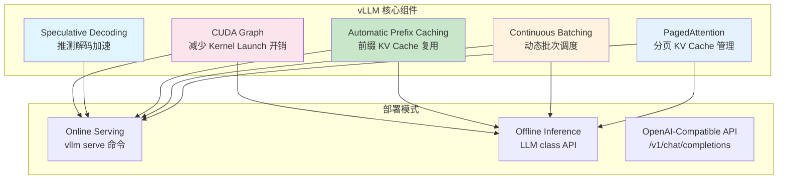

# vLLM 专有优化策略与配置

> 深入 vLLM 推理引擎的核心优化机制、配置参数与最佳实践。

---

## 目录

- [1. 核心架构特性](#1-核心架构特性)
- [2. PagedAttention](#2-pagedattention)
- [3. Continuous Batching 与 Chunked Prefill](#3-continuous-batching-与-chunked-prefill)
- [4. Automatic Prefix Caching (APC)](#4-automatic-prefix-caching-apc)
- [5. Speculative Decoding](#5-speculative-decoding)
- [6. CUDA Graph 与优化等级](#6-cuda-graph-与优化等级)
- [7. 量化方案](#7-量化方案)
- [8. 多节点并行](#8-多节点并行)
- [9. CLI 配置参考](#9-cli-配置参考)
- [10. 性能调优清单](#10-性能调优清单)

---

## 1. 核心架构特性

vLLM 的核心优化组件：



> 官方文档入口: https://docs.vllm.ai/en/latest/

---

## 2. PagedAttention

### 2.1 原理简述

PagedAttention 受操作系统的分页内存管理启发，将 KV Cache 划分为固定大小的 block（块），而非为整个序列分配连续显存。

- **消除了内部碎片**：之前的实作为最大序列长度预先分配连续显存，造成严重浪费
- **支持块级别的内存共享**：多个序列在相同位置可共用同一 block（如 beam search 的公共前缀）
- **按需分配**：仅在需要时分配新的 block

> 官方设计文档: https://docs.vllm.ai/en/latest/design/paged_attention/

### 2.2 对并发的影响

PagedAttention 本身不提供可配置的参数，它是 vLLM 内部默认启用的基础机制。其分页效率通过 `--gpu-memory-utilization` 和 `--max-model-len` 间接调控。

---

## 3. Continuous Batching 与 Chunked Prefill

### 3.1 Continuous Batching

vLLM 默认启用 Continuous Batching。当批次中某个请求生成完毕时，立即退出批次，新请求可立刻加入，GPU 始终满载工作。

### 3.2 Chunked Prefill

**用途**：将长 prompt 的 prefill 拆分为多个较小的 chunk，与 decode 交错执行，避免长 prefill 长时间阻塞 decode。

| 参数 | 类型 | 默认值 | 说明 |
|------|------|--------|------|
| `--enable-chunked-prefill` | bool flag | False | 启用 Chunked Prefill |
| `--max-num-batched-tokens` | int | 由调度器自动决定 | 每批次最大 token 总数（含 prefill + decode），启用 chunked prefill 后有效 |
| `--max-num-seqs` | int | 256（典型值） | 每批次最大序列数 |

> 参考官方 Features 页面: https://docs.vllm.ai/en/latest/features/

**开启方式**：
```bash
vllm serve meta-llama/Llama-3.1-8B-Instruct \
    --enable-chunked-prefill \
    --max-num-batched-tokens 4096
```

### 3.3 适用场景

| 场景 | 推荐设置 | 说明 |
|------|----------|------|
| 长 prompt 在线服务 | 开启，适当调小 `max-num-batched-tokens` | 减少 TTFT 抖动 |
| 短 prompt 在线服务 | 可选开启 | 收益不大 |
| 离线批处理（吞吐优先） | 关闭 | 避免碎片化降低吞吐 |

---

## 4. Automatic Prefix Caching (APC)

### 4.1 工作原理

APC 对 KV Cache block 进行哈希，新请求到达时逐 block 匹配已有缓存。匹配成功的 block 直接映射，跳过 prefill 计算。

> 官方设计文档: https://docs.vllm.ai/en/latest/design/prefix_caching/

### 4.2 配置

| 参数 | 类型 | 默认值 | 说明 |
|------|------|--------|------|
| `--enable-prefix-caching` | bool flag | False | 启用 APC |

**开启方式**：
```bash
vllm serve meta-llama/Llama-3.1-8B-Instruct \
    --enable-prefix-caching
```

或在代码中：
```python
from vllm import LLM
llm = LLM(model="meta-llama/Llama-3.1-8B-Instruct",
          enable_prefix_caching=True)
```

### 4.3 最佳实践

- 共享前缀比例越高（多轮对话、共享 system prompt），收益越大
- 随机独立请求场景，APC 无收益，也不会造成损失
- 长文档问答有显著加速，文档只需 prefill 一次即可复用

---

## 5. Speculative Decoding

vLLM 支持多种推测解码方法，以下基于 vLLM 官方文档和 CLI 参数整理。

> 官方文档: https://docs.vllm.ai/en/latest/features/speculative_decoding/

### 5.1 方法总览

| 方法 | 配置方式 | 是否需要额外模型 | 典型加速比 |
|------|---------|---------------|-----------|
| **Draft Model** | `--speculative-config` + `--speculative-model` | 是（小草稿模型） | 1.5× ~ 2.5× |
| **Medusa** | `--medusa-model` | 是（训练好的 heads） | 1.5× ~ 3× |
| **Eagle** | `--eagle-model` | 是（训练好的 predictor） | 1.5× ~ 2× |
| **Prompt Lookup** | `--speculative-model "prompt-lookup"` | 否 | 1.2× ~ 1.5× |
| **Ghost Speculation** | `--speculative-config` + `--ghost-speculation` | 否（利用目标模型自身） | 1.1× ~ 1.3× |

### 5.2 Draft Model 配置

```bash
vllm serve meta-llama/Llama-3.1-8B-Instruct \
    --speculative-config '{"model": "JackFram/llama-68m", "num_speculative_tokens": 5}'
```

| 参数 | 类型 | 说明 |
|------|------|------|
| `--speculative-model` | str | 草稿模型的 HuggingFace 路径（在 `--speculative-config.model` 中指定） |
| `--num-speculative-tokens` | int | 每次推测的 token 数量（默认 5） |
| `--ghost-speculation` | bool | 是否启用 Ghost Speculation（无额外模型） |

### 5.3 Medusa 配置

```bash
vllm serve meta-llama/Llama-2-7b \
    --medusa-model my-medusa-lora \
    --medusa-num-heads 5 \
    --medusa-top-k 8
```

| 参数 | 类型 | 默认值 | 说明 |
|------|------|--------|------|
| `--medusa-model` | str | 无 | Medusa 模型路径 |
| `--medusa-num-heads` | int | 4 | Medusa 预测头数量 |
| `--medusa-num-layers` | int | 1 | 每个 Medusa 头内部 MLP 层数 |
| `--medusa-top-k` | int | 10 | 每个头输出时保留的最优 token 候选数 |

### 5.4 Eagle 配置

```bash
vllm serve mistralai/Mistral-7B-Instruct-v0.2 \
    --eagle-model yuhuili/Eagle-Mistral-7B \
    --eagle-num-candidates 6
```

| 参数 | 类型 | 默认值 | 说明 |
|------|------|--------|------|
| `--eagle-model` | str | 无 | Eagle 模型路径 |
| `--eagle-num-candidates` | int | 5 | 每次生成的候选 token 数量 |
| `--eagle-tree-size` | int | 5 | 树搜索的深度 |

### 5.5 Prompt Lookup Decoding（无需额外模型）

```bash
vllm serve meta-llama/Llama-3.1-8B-Instruct \
    --speculative-model "prompt-lookup" \
    --num-speculative-tokens 10 \
    --prompt-lookup-min-token-length 5
```

| 参数 | 类型 | 默认值 | 说明 |
|------|------|--------|------|
| `-speculative-model "prompt-lookup"` | str | 无 | 启用 Prompt Lookup Decoding |
| `--num-speculative-tokens` | int | 5（在 prompt-lookup 模式下默认) | 每次查找的 token 数量 |
| `--prompt-lookup-min-token-length` | int | 3 | 用于匹配的最小 n-gram 长度 |

---

## 6. CUDA Graph 与优化等级

### 6.1 CUDA Graph

CUDA Graph 将一系列 kernel launch 捕获为静态图，大幅减少 CPU→GPU 的 kernel 调度开销。

> 设计文档: https://docs.vllm.ai/en/latest/design/cuda_graphs/

vLLM 默认启用 CUDA Graph 优化。对于 decode 阶段（固定批次大小下计算模式重复），收益尤其明显。

### 6.2 Optimization Levels

vLLM 提供了可选的优化等级控制，通过 `--optimization-level` 参数配置，允许在更激进的优化（可能牺牲部分兼容性）与保守优化（保持最大兼容性）之间选择。

> 设计文档: https://docs.vllm.ai/en/latest/design/optimization_levels/

### 6.3 torch.compile 集成

vLLM 支持与 PyTorch 的 `torch.compile` 集成，通过 JIT 编译和算子融合进一步优化性能。

> 设计文档: https://docs.vllm.ai/en/latest/design/torch_compile/

### 6.4 Dual Batch Overlap

当启用 Multi-step（多步调度）时，vLLM 可以将一个批次的计算与下一个批次的准备阶段重叠，提高 GPU 利用率。

> 设计文档: https://docs.vllm.ai/en/latest/design/dbo/

---

## 7. 量化方案

### 7.1 权重量化

vLLM 通过 `--quantization` / `-q` 参数指定量化方法。

| 参数 | 类型 | 默认值 | 说明 |
|------|------|--------|------|
| `--quantization`, `-q` | str | None（自动从模型 config 检测） | 量化方法 |
| `--kv-cache-dtype` | str | auto | KV Cache 数据类型 |

支持的量化方法（来自 CLI 参数定义）：

- `awq` - AWQ 4-bit 量化
- `gptq` - GPTQ 4-bit 量化
- `fp8` - FP8 量化（需 Hopper 架构或以上 GPU）
- `marlin` - Marlin 内核优化的 4-bit 量化
- `gptq_marlin` - GPTQ + Marlin 组合
- `awq_marlin` - AWQ + Marlin 组合
- `bitsandbytes` - bitsandbytes 量化
- `squeezellm` - SqueezeLLM 量化
- `fp8_ds_mla` - DeepSpeed MLA 的 FP8 量化
- `nvfp4` - NVIDIA FP4 量化（Blackwell+）
- `compressed-tensors` - CompressedTensors 格式
- `experts_int8` - MoE 专家的 INT8 量化
- `qqq` - QQQ 量化

### 7.2 KV Cache 量化

通过 `--kv-cache-dtype` 参数控制：

```
--kv-cache-dtype auto        # 默认，不量化 KV Cache
--kv-cache-dtype fp8         # FP8 量化 KV Cache
--kv-cache-dtype fp8_e4m3    # FP8 E4M3 格式
--kv-cache-dtype fp8_e5m2    # FP8 E5M2 格式
--kv-cache-dtype nvfp4       # NVFP4 量化 (Blackwell+)
```

### 7.3 混合 KV Cache

vLLM 提供了 Hybrid KV Cache Manager 设计，支持跨层级（如 GPU + CPU）的 KV Cache 管理策略。

> 设计文档: https://docs.vllm.ai/en/latest/design/hybrid_kv_cache_manager/

---

## 8. 多节点并行

### 8.1 Tensor Parallelism (TP)

将单层计算按维度拆分到多张 GPU 上（需要 NCCL 通信）。

```bash
vllm serve meta-llama/Llama-3.1-70B-Instruct \
    --tensor-parallel-size 4    # 4 卡 TP
```

| 参数 | 类型 | 默认值 | 说明 |
|------|------|--------|------|
| `--tensor-parallel-size`, `-tp` | int | 1 | 张量并行度 |

### 8.2 Pipeline Parallelism (PP)

将模型的不同层分配到不同 GPU 上。

```bash
vllm serve meta-llama/Llama-3.1-70B-Instruct \
    --pipeline-parallel-size 2 \
    --tensor-parallel-size 4    # 总共 8 卡
```

| 参数 | 类型 | 默认值 | 说明 |
|------|------|--------|------|
| `--pipeline-parallel-size`, `-pp` | int | 1 | 流水线并行度 |

### 8.3 TP vs PP 选择

| 对比项 | TP | PP |
|--------|-----|-----|
| 通信量 | 每层都需要 all-reduce，通信密集 | 仅层间传输 activations，通信较少 |
| 适用 | 单节点多卡（NVLink 互连） | 跨节点（InfiniBand / Ethernet） |
| 对延迟的影响 | 单步延迟降低 | 增加 pipeline bubble |
| 对显存的影响 | 每卡只存 1/TP 的权重 | 每卡只存 1/PP 的层数 |

---

## 9. CLI 配置参考

以下为 `vllm serve` 关键 CLI 参数汇总（基于 vLLM 官方文档 CLI 定义）。

> 完整 CLI 参考: https://docs.vllm.ai/en/latest/cli/serve/

### 9.1 内存与调度参数

| 参数 | 类型 | 默认值 | 说明 |
|------|------|--------|------|
| `--gpu-memory-utilization` | float | 0.92 | 模型权重 + KV Cache 可使用的 GPU 显存比例 |
| `--max-model-len` | str | auto | 模型最大上下文长度（支持 `1k`、`25.6k` 等格式） |
| `--max-num-seqs` | int | 由调度器决定 | 每批次最大序列数 |
| `--max-num-batched-tokens` | int | 自动 | 每批次最大 token 总数 |

### 9.2 量化与数据类型

| 参数 | 类型 | 默认值 | 说明 |
|------|------|--------|------|
| `--dtype` | str | auto | 模型权重数据类型（auto/half/float16/bfloat16/float/float32） |
| `--quantization`, `-q` | str | None | 量化方法（awq/gptq/fp8 等） |
| `--kv-cache-dtype` | str | auto | KV Cache 数据类型 |

### 9.3 并行参数

| 参数 | 类型 | 默认值 | 说明 |
|------|------|--------|------|
| `--tensor-parallel-size`, `-tp` | int | 1 | 张量并行度 |
| `--pipeline-parallel-size`, `-pp` | int | 1 | 流水线并行度 |

### 9.4 优化开关

| 参数 | 类型 | 默认值 | 说明 |
|------|------|--------|------|
| `--enable-prefix-caching` | flag | False | 启用 Automatic Prefix Caching |
| `--enable-chunked-prefill` | flag | False | 启用 Chunked Prefill |
| `--optimization-level` | str | 默认值 | 优化等级（通常无需手动设置） |

---

## 10. 性能调优清单

### 10.1 在线服务（TTFT 敏感）

```bash
vllm serve meta-llama/Llama-3.1-8B-Instruct \
    --gpu-memory-utilization 0.90 \
    --max-model-len 8k \
    --max-num-seqs 256 \
    --enable-prefix-caching \
    --enable-chunked-prefill
```

### 10.2 离线批处理（吞吐优先）

```bash
vllm serve meta-llama/Llama-3.1-8B-Instruct \
    --gpu-memory-utilization 0.95 \
    --max-model-len 4k \
    --max-num-seqs 512 \
    --enable-prefix-caching        # 如果有共享前缀否则关闭
```

### 10.3 低成本部署（量化 + 小 batch）

```bash
vllm serve mistralai/Mistral-7B-Instruct-v0.2 \
    --quantization awq \
    --kv-cache-dtype fp8 \
    --gpu-memory-utilization 0.85 \
    --max-model-len 4k \
    --max-num-seqs 64
```

**调优通用原则**：
1. 先确定业务指标（TTFT P99 < Xms / 吞吐 > Y tokens/s）
2. 从默认参数开始做基线
3. 单变量调整，每次改一个参数
4. 记录不同配置下的指标，形成知识库

---

## 参考文献

- vLLM 官方文档: https://docs.vllm.ai/en/latest/
- vLLM CLI serve 参数: https://docs.vllm.ai/en/latest/cli/serve/
- vLLM PagedAttention 设计: https://docs.vllm.ai/en/latest/design/paged_attention/
- vLLM Automatic Prefix Caching: https://docs.vllm.ai/en/latest/design/prefix_caching/
- vLLM Speculative Decoding: https://docs.vllm.ai/en/latest/features/speculative_decoding/
- vLLM CUDA Graph 设计: https://docs.vllm.ai/en/latest/design/cuda_graphs/
- vLLM Optimization Levels: https://docs.vllm.ai/en/latest/design/optimization_levels/
- vLLM torch.compile: https://docs.vllm.ai/en/latest/design/torch_compile/
- vLLM Dual Batch Overlap: https://docs.vllm.ai/en/latest/design/dbo/
- vLLM Hybrid KV Cache: https://docs.vllm.ai/en/latest/design/hybrid_kv_cache_manager/
- vLLM Blog: https://blog.vllm.ai
- vLLM GitHub: https://github.com/vllm-project/vllm
