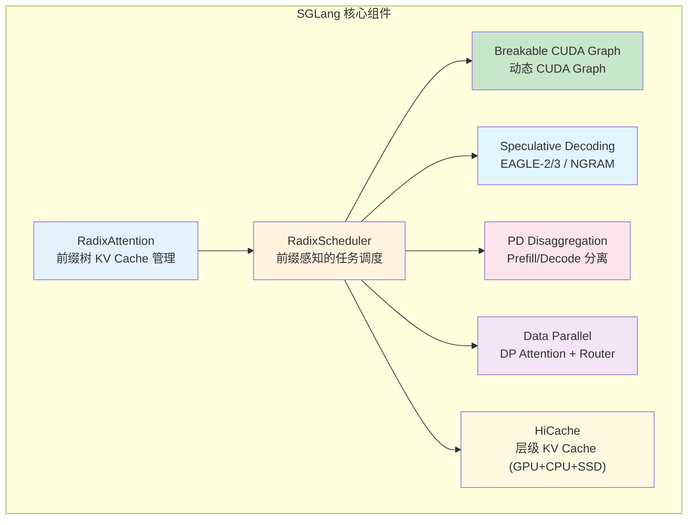
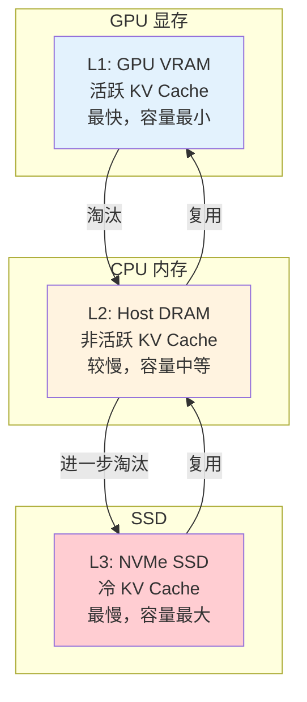

# SGLang 专有优化策略与配置

> 深入 SGLang 推理引擎的核心优化机制、配置参数与最佳实践。

---

## 目录

- [1. 核心架构特性](#1-核心架构特性)
- [2. RadixAttention](#2-radixattention)
- [3. RadixScheduler 与调度策略](#3-radixscheduler-与调度策略)
- [4. Breakable / Piecewise CUDA Graph](#4-breakable--piecewise-cuda-graph)
- [5. 量化方案](#5-量化方案)
- [6. 推测解码 (Speculative Decoding)](#6-推测解码-speculative-decoding)
- [7. PD Disaggregation](#7-pd-disaggregation)
- [8. Data Parallelism 与负载均衡](#8-data-parallelism-与负载均衡)
- [9. HiCache 层级缓存](#9-hicache-层级缓存)
- [10. Structured Outputs 与约束解码](#10-structured-outputs-与约束解码)
- [11. CLI 配置参考](#11-cli-配置参考)
- [12. 性能调优清单](#12-性能调优清单)

---

## 1. 核心架构特性

SGLang 的核心优化组件：



> 官方文档入口: https://docs.sglang.ai/

---

## 2. RadixAttention

### 2.1 原理简述

RadixAttention 是 SGLang 的核心创新，使用**前缀树（Radix Tree / Trie）** 结构管理 KV Cache，天然支持完整的**最长前缀匹配（Longest Prefix Matching）**。

与 vLLM 的 PagedAttention + APC 关键区别：

| 对比项 | RadixAttention | PagedAttention + APC |
|--------|---------------|---------------------|
| 缓存结构 | 前缀树（Radix Tree） | Hash-based Block Table |
| 前缀匹配 | 天然支持最长前缀匹配 | 哈希碰撞匹配 |
| 淘汰策略 | 可配置（LRU / LFU） | 全局 LRU |
| 共享粒度 | 任意长度公共前缀 | Block 级别 |
| 内存碎片 | 分支节点的共享减少碎片 | Block 内可能仍有碎片 |

### 2.2 配置参数

| 参数 | 类型 | 默认值 | 说明 |
|------|------|--------|------|
| `--radix-eviction-policy` | enum | lru | 前缀树淘汰策略（`lru` / `lfu`） |
| `--page-size` | int | 由后端决定 | 每页 token 数，影响内存分配粒度 |
| `--enable-cache-report` | bool | False | 在 API 响应中返回缓存命中 token 数 |

> RadixAttention 是 SGLang 默认启用的基础设施，无需额外开启。

### 2.3 适用场景

与 vLLM APC 类似，但 RadixAttention 在**前缀重合度高**和**多轮对话**场景下效率更高，因为前缀树结构天然支持任意长度的最长前缀匹配，不像基于 block hash 的方案可能因 block 边界对齐问题导致部分缓存失效。

---

## 3. RadixScheduler 与调度策略

### 3.1 调度策略

SGLang 的 RadixScheduler 支持多种调度策略，通过 `--schedule-policy` 参数设置。

| 策略 | 参数值 | 说明 |
|------|--------|------|
| 先来先服务 | `fcfs` | 默认，按请求到达顺序调度 |
| 最长前缀匹配 | `lpm` | 优先调度共享前缀多的请求，最大化 RadixAttention 命中 |
| 随机 | `random` | 随机调度，负载均衡测试 |
| 深度优先权重 | `dfs-weight` | 树搜索风格调度 |
| 最少占用优先 | `lof` | 优先调度资源占用少的请求 |
| 优先级 | `priority` | 配合 `--enable-priority-scheduling` |

### 3.2 优先级调度

```bash
python -m sglang.launch_server \
    --model-path meta-llama/Llama-3.1-8B-Instruct \
    --schedule-policy priority \
    --enable-priority-scheduling \
    --priority-scheduling-preemption-threshold 10
```

| 参数 | 类型 | 默认值 | 说明 |
|------|------|--------|------|
| `--enable-priority-scheduling` | flag | - | 启用优先级调度 |
| `--schedule-low-priority-values-first` | flag | - | 优先调度低优先级值 |
| `--priority-scheduling-preemption-threshold` | int | 10 | 优先级差值达到此阈值才能抢占 |

### 3.3 Chunked Prefill

SGLang 通过 `--chunked-prefill-size` 控制 Chunked Prefill 行为。

| 参数 | 类型 | 默认值 | 说明 |
|------|------|--------|------|
| `--chunked-prefill-size` | int | -1（禁用） | 每块最大 token 数，设为 >0 启用 |
| `--prefill-max-requests` | int | 自动 | 单个 prefill batch 的最大请求数 |
| `--max-prefill-tokens` | int | 16384 | prefill batch 最大 token 数 |
| `--enable-dynamic-chunking` | bool | False | 为 PP 启用动态 chunk 大小调整 |

### 3.4 Prefill Delayer（DP Attention 优化）

减少 DP Attention 中不同 worker 之间的空闲等待时间。

| 参数 | 类型 | 默认值 | 说明 |
|------|------|--------|------|
| `--enable-prefill-delayer` | flag | - | 启用 prefill 延迟器 |
| `--prefill-delayer-max-delay-passes` | int | 30 | 最大延迟前向传递次数 |
| `--prefill-delayer-token-usage-low-watermark` | float | - | token 使用低水位线 |

---

## 4. Breakable / Piecewise CUDA Graph

### 4.1 解决的问题

传统 CUDA Graph 要求捕获的计算图是静态的（固定的批次大小、固定的序列形状）。SGLang 的 **Breakable CUDA Graph** 允许在运行时动态拆分和重建图片段，适应变化的批次结构。

> 官方文档: https://docs.sglang.ai/docs/advanced_features/breakable_cuda_graph.md

### 4.2 Piecewise CUDA Graph

进一步优化，将 CUDA Graph 划分为更小的片段，仅在需要时重建受影响的部分，减少重建开销。

> 官方文档: https://docs.sglang.ai/docs/advanced_features/piecewise_cuda_graph.md

### 4.3 启用方式

```bash
python -m sglang.launch_server \
    --model-path meta-llama/Llama-3.1-8B-Instruct \
    --enable-torch-compile          # 开启 torch.compile
```

| 参数 | 类型 | 默认值 | 说明 |
|------|------|--------|------|
| `--enable-torch-compile` | flag | - | 启用 torch.compile 集成 |
| `--torch-compile-max-bs` | int | - | torch.compile 最大 batch size |

---

## 5. 量化方案

SGLang 支持丰富的量化方法，以下基于官方文档整理。

> 官方文档:
> - 权重量化: https://docs.sglang.ai/docs/advanced_features/quantization.md
> - KV Cache 量化: https://docs.sglang.ai/docs/advanced_features/quantized_kv_cache.md

### 5.1 权重量化 (`--quantization`)

```bash
python -m sglang.launch_server \
    --model-path meta-llama/Llama-3.1-8B-Instruct \
    --quantization awq
```

| 方法 | 参数值 | 说明 |
|------|--------|------|
| **FP8** | `fp8` | FP8 在线量化 |
| **AWQ** | `awq` | AWQ 4-bit 离线量化 |
| **GPTQ** | `gptq` | GPTQ 4-bit 离线量化 |
| **AWQ+Marlin** | `awq_marlin` | AWQ + Marlin 内核加速（仅 CUDA） |
| **GPTQ+Marlin** | `gptq_marlin` | GPTQ + Marlin 内核加速（仅 CUDA） |
| **FP8 (权重+激活)** | `w8a8_fp8` | 权重量 FP8 + 激活 FP8 |
| **INT8 (权重+激活)** | `w8a8_int8` | 权重量 INT8 + 激活 INT8 |
| **Blockwise INT8** | `blockwise_int8` | 分块 INT8（Triton 后端） |
| **GGUF** | `gguf` | GGUF 格式量化 |
| **bitsandbytes** | `bitsandbytes` | bitsandbytes 量化 |
| **ModelOpt FP8** | `modelopt_fp8` | NVIDIA ModelOpt FP8（Hopper+） |
| **ModelOpt FP4** | `modelopt_fp4` | NVIDIA ModelOpt FP4（Blackwell+） |
| **MXFP4** | `mxfp4` | MXFP4 量化（CDNA3/CDNA4） |
| **compressed-tensors** | `compressed-tensors` | CompressedTensors 格式 |
| **quark** | `quark` | AMD Quark 量化 |
| **auto-round** | `auto-round` | Intel auto-round 量化 |

> **注意**：如果加载的是已离线量化的模型（如 AWQ/GPTQ 预量化权重），不应再添加 `--quantization` 参数，量化方法会自动从 Hugging Face 配置中解析。

### 5.2 KV Cache 量化 (`--kv-cache-dtype`)

```bash
python -m sglang.launch_server \
    --model-path meta-llama/Llama-3.1-8B-Instruct \
    --kv-cache-dtype fp8_e4m3
```

| 参数值 | 格式 | 位宽 | 说明 |
|--------|------|------|------|
| `fp8_e5m2` | FP8 E5M2 | 8-bit | 更大动态范围，精度较低 |
| `fp8_e4m3` | FP8 E4M3 | 8-bit | 精度更高，推荐 |
| `fp4_e2m1` | MXFP4 | 4-bit | 实验性，块大小 16 |

显存收益：BF16 → FP8 约 2× 容量；BF16 → FP4 约 3.56× 容量。

> **最佳实践**：优先使用 `fp8_e4m3`，FP4 需在具体模型和工作负载上验证精度。

### 5.3 torch.compile 量化

通过 `--torchao-config` 参数指定 torch.compile 级别的量化方法：

| 方法值 | 说明 |
|--------|------|
| `int8wo` | INT8 权重量量化 |
| `fp8wo` | FP8 权重量量化 |
| `int4wo-128` | INT4 权重量量化（分组 128） |
| `fp8dq-per_tensor` | FP8 逐张量动态量化 |

---

## 6. 推测解码 (Speculative Decoding)

SGLang 支持 7 种推测解码方法，以下基于官方文档整理。

> 官方文档: https://docs.sglang.ai/docs/advanced_features/speculative_decoding.md

### 6.1 方法总览

| 方法 | `--speculative-algorithm` | 是否需要草稿模型 | 说明 |
|------|--------------------------|---------------|------|
| **EAGLE-2** | `EAGLE` | 是 | 推荐默认，树状候选 + 重排序 |
| **EAGLE-3** | `EAGLE3` | 是 | 最高吞吐，移除特征预测 |
| **MTP** | `EAGLE`（复用） | 否 | 利用模型内置多 token 预测头 |
| **DFLASH** | `DFLASH` | 是 | 线性块验证 + 滑动窗口 |
| **STANDALONE** | `STANDALONE` | 是 | 独立小草稿 LLM |
| **NGRAM** | `NGRAM` | 否 | 从历史 token 构建 ngram 缓存 |
| **SpecV2** | 环境变量启用 | - | 实验性 Overlap 调度器 |

### 6.2 EAGLE-2（推荐默认）

```bash
python -m sglang.launch_server \
    --model-path meta-llama/Llama-3.1-8B-Instruct \
    --speculative-algorithm EAGLE \
    --speculative-draft-model-path /path/to/eagle2-draft
```

| 参数 | 类型 | 默认值 | 说明 |
|------|------|--------|------|
| `--speculative-algorithm` | str | - | `EAGLE` / `EAGLE3` / `DFLASH` / `STANDALONE` / `NGRAM` |
| `--speculative-draft-model-path` | str | - | 草稿模型路径 |
| `--speculative-num-steps` | int | Auto（Llama: 5） | 自回归草稿深度 |
| `--speculative-eagle-topk` | int | Auto（Llama: 4） | 每步分支因子 |
| `--speculative-num-draft-tokens` | int | Auto（Llama: 8） | 最大并行验证容量 |
| `--enable-torch-compile` | flag | - | 对草稿模型应用 torch.compile |

**FR-Spec 变体**（高频 token 映射加速）：
```
--speculative-token-map /path/to/token_map.json
```

### 6.3 EAGLE-3（最高吞吐）

```bash
python -m sglang.launch_server \
    --model-path meta-llama/Llama-3.1-8B-Instruct \
    --speculative-algorithm EAGLE3 \
    --speculative-draft-model-path /path/to/eagle3-draft
```

EAGLE-3 的参数与 EAGLE-2 通用，但 `--speculative-token-map` 无效。

### 6.4 NGRAM（无需额外模型）

```bash
python -m sglang.launch_server \
    --model-path meta-llama/Llama-3.1-8B-Instruct \
    --speculative-algorithm NGRAM \
    --speculative-num-draft-tokens 12
```

| 参数 | 类型 | 默认值 | 说明 |
|------|------|--------|------|
| `--speculative-ngram-match-type` | str | `BFS` | `BFS`（新近度）或 `PROB`（频率） |
| `--speculative-ngram-max-trie-depth` | int | 18 | 最大后缀匹配深度 |
| `--speculative-ngram-capacity` | int | 10,000,000 | 缓存容量 |

> NGRAM 仅 CUDA 后端支持，且不支持 `--enable-dp-attention`。

---

## 7. PD Disaggregation

SGLang 原生支持 PD Disaggregation（Prefill/Decode 分离），将两个阶段部署到独立的实例上，各自独立优化。

> 官方文档: https://docs.sglang.ai/docs/advanced_features/pd_disaggregation.md

### 7.1 启动 Prefill 实例

```bash
python -m sglang.launch_server \
    --model-path meta-llama/Llama-3.1-8B-Instruct \
    --disaggregation-mode prefill \
    --port 30000 \
    --disaggregation-ib-device mlx5_roce0
```

### 7.2 启动 Decode 实例

```bash
python -m sglang.launch_server \
    --model-path meta-llama/Llama-3.1-8B-Instruct \
    --disaggregation-mode decode \
    --port 30001 \
    --base-gpu-id 1 \
    --disaggregation-ib-device mlx5_roce0
```

### 7.3 启动 Router

```bash
python -m sglang_router.launch_router \
    --pd-disaggregation \
    --prefill http://127.0.0.1:30000 \
    --decode http://127.0.0.1:30001 \
    --host 0.0.0.0 --port 8000
```

### 7.4 关键参数

| 参数 | 说明 |
|------|------|
| `--disaggregation-mode` | `prefill` 或 `decode` |
| `--disaggregation-transfer-backend` | 传输后端：`mooncake`（默认）、`nixl`、`ascend` |
| `--disaggregation-ib-device` | InfiniBand 设备名称 |

### 7.5 收益

- **调度独立**：Prefill 不打断 Decode，Decode ITL 更稳定
- **异构 TP**：Prefill 和 Decode 可使用不同 TP 大小
- **独立扩缩容**：根据负载分别扩缩 Prefill / Decode 实例
- **高并发下吞吐提升 2-5×**（官方数据，异构 TP 场景）

---

## 8. Data Parallelism 与负载均衡

SGLang 通过 `--data-parallel-size` 实现数据并行，并通过 DP Router 进行请求分发。

> 官方文档: https://docs.sglang.ai/docs/advanced_features/dp_dpa_smg_guide.md

### 8.1 参数

| 参数 | 类型 | 默认值 | 说明 |
|------|------|--------|------|
| `--data-parallel-size`, `--dp-size` | int | 1 | 数据并行度 |
| `--load-balance-method` | enum | `auto` | 负载均衡方法（`auto`/`round_robin`/`follow_bootstrap_room`/`total_requests`/`total_tokens`） |

### 8.2 DP 与其他并行的组合

```bash
python -m sglang.launch_server \
    --model-path meta-llama/Llama-3.1-8B-Instruct \
    --tensor-parallel-size 2 \
    --data-parallel-size 2 \
    --load-balance-method total_tokens
```

> TP=2 内部组成一个模型副本，DP=2 表示 2 个副本各处理不同请求，总共使用 4 卡。

---

## 9. HiCache 层级缓存

HiCache 是 SGLang 的层级 KV Cache 管理系统，支持将不活跃的 KV Cache 换出到 CPU 内存甚至 SSD，突破 GPU 显存限制。

> 官方文档:
> - https://docs.sglang.ai/docs/advanced_features/hicache.md
> - https://docs.sglang.ai/docs/advanced_features/hicache_best_practices.md
> - https://docs.sglang.ai/docs/advanced_features/hicache_design.md

### 9.1 层级结构



### 9.2 适用场景

- 超长上下文推理（>100K tokens）
- 大量并发请求导致显存不足
- 需要突破单卡显存限制的场景

---

## 10. Structured Outputs 与约束解码

SGLang 支持结构化输出生成，在需要 JSON Schema / Regex 约束的场景下，通过在前缀树中剪枝无效路径，既保证了输出格式，又避免了无效 token 的生成浪费。

> 官方文档: https://docs.sglang.ai/docs/advanced_features/structured_outputs.md

---

## 11. CLI 配置参考

> 完整参数列表: https://docs.sglang.ai/docs/advanced_features/server_arguments.md

### 11.1 内存与调度参数

| 参数 | 类型 | 说明 |
|------|------|------|
| `--mem-fraction-static` | float | KV Cache 内存池比例，OOM 时减小 |
| `--max-total-tokens` | int | 内存池最大 token 数，默认自动计算 |
| `--max-running-requests` | int | 最大运行中请求数 |
| `--max-queued-requests` | int | 最大排队请求数 |
| `--page-size` | int | 每页 token 数 |
| `--schedule-policy` | enum | 调度策略（fcfs/lpm/random/dfs-weight/lof/priority） |
| `--schedule-conservativeness` | float | 调度保守度，请求撤回频繁时可增大 |
| `--chunked-prefill-size` | int | Chunked Prefill 每块最大 token 数，-1 禁用 |
| `--max-prefill-tokens` | int | Prefill batch 最大 token 数（默认为 16384） |

### 11.2 并行参数

| 参数 | 简写 | 类型 | 说明 |
|------|------|------|------|
| `--tensor-parallel-size` | `--tp-size` | int | 张量并行度 |
| `--pipeline-parallel-size` | `--pp-size` | int | 流水线并行度 |
| `--data-parallel-size` | `--dp-size` | int | 数据并行度 |
| `--attention-context-parallel-size` | `--attn-cp-size` | int | 注意力上下文并行度 |
| `--moe-data-parallel-size` | `--moe-dp-size` | int | MoE 数据并行度 |

### 11.3 量化与数据类型参数

| 参数 | 类型 | 说明 |
|------|------|------|
| `--dtype` | enum | 数据类型（auto/half/float16/bfloat16/float/float32） |
| `--quantization` | enum | 权重量化方法（fp8/awq/gptq/marlin 等） |
| `--kv-cache-dtype` | enum | KV Cache 数据类型（fp8_e4m3/fp8_e5m2/fp4_e2m1） |
| `--quantization-param-path` | str | FP8 KV Cache 缩放因子 JSON 文件路径 |

### 11.4 优化开关

| 参数 | 类型 | 说明 |
|------|------|------|
| `--enable-torch-compile` | flag | 启用 torch.compile |
| `--enable-dynamic-chunking` | flag | PP 动态 chunk 调整 |
| `--enable-cache-report` | flag | 返回缓存命中 token 数 |
| `--enable-priority-scheduling` | flag | 启用优先级调度 |
| `--enable-prefill-delayer` | flag | 启用 prefill 延迟器（DP attention 优化） |

---

## 12. 性能调优清单

### 12.1 在线服务（低 TTFT + 高并发）

```bash
python -m sglang.launch_server \
    --model-path meta-llama/Llama-3.1-8B-Instruct \
    --mem-fraction-static 0.85 \
    --max-running-requests 256 \
    --chunked-prefill-size 4096 \
    --max-prefill-tokens 16384 \
    --schedule-policy lpm \
    --enable-torch-compile
```

### 12.2 高吞吐批处理

```bash
python -m sglang.launch_server \
    --model-path meta-llama/Llama-3.1-8B-Instruct \
    --mem-fraction-static 0.92 \
    --max-running-requests 512 \
    --enable-torch-compile \
    --schedule-policy dfs-weight
```

### 12.3 低成本部署（量化）

```bash
python -m sglang.launch_server \
    --model-path mistralai/Mistral-7B-Instruct-v0.2 \
    --quantization awq \
    --kv-cache-dtype fp8_e4m3 \
    --mem-fraction-static 0.80 \
    --max-running-requests 64
```

### 12.4 超长上下文（HiCache）

```bash
python -m sglang.launch_server \
    --model-path meta-llama/Llama-3.1-8B-Instruct \
    --enable-hierarchical-cache \
    --max-total-tokens 200000 \
    --mem-fraction-static 0.85
```

---

## 参考文献

- SGLang 官方文档: https://docs.sglang.ai/
- SGLang Server Arguments: https://docs.sglang.ai/docs/advanced_features/server_arguments.md
- SGLang 量化指南: https://docs.sglang.ai/docs/advanced_features/quantization.md
- SGLang 量化 KV Cache: https://docs.sglang.ai/docs/advanced_features/quantized_kv_cache.md
- SGLang 推测解码: https://docs.sglang.ai/docs/advanced_features/speculative_decoding.md
- SGLang PD Disaggregation: https://docs.sglang.ai/docs/advanced_features/pd_disaggregation.md
- SGLang DP Router: https://docs.sglang.ai/docs/advanced_features/dp_dpa_smg_guide.md
- SGLang HiCache: https://docs.sglang.ai/docs/advanced_features/hicache.md
- SGLang Breakable CUDA Graph: https://docs.sglang.ai/docs/advanced_features/breakable_cuda_graph.md
- SGLang Piecewise CUDA Graph: https://docs.sglang.ai/docs/advanced_features/piecewise_cuda_graph.md
- SGLang 超参调优: https://docs.sglang.ai/docs/advanced_features/hyperparameter_tuning.md
- SGLang 性能基准测试: https://docs.sglang.ai/docs/developer_guide/benchmark_and_profiling.md
- SGLang Benchmark Serving: https://docs.sglang.ai/docs/developer_guide/bench_serving.md
- SGLang GitHub: https://github.com/sgl-project/sglang
