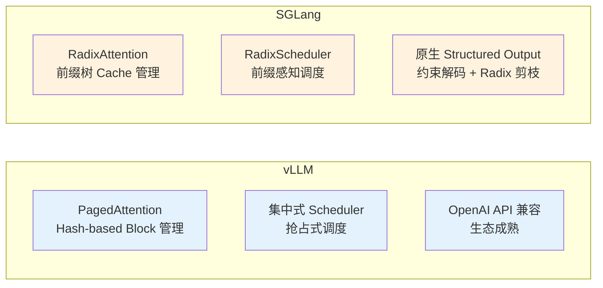
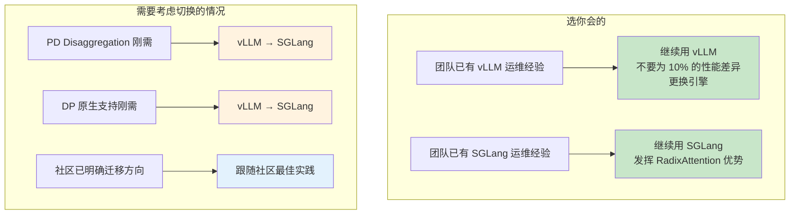

# vLLM vs SGLang 对比与选型指南

> 从架构差异、特性支持、优化维度等角度系统对比两个推理引擎，提供选型建议。

---

## 目录

- [1. 架构差异](#1-架构差异)
- [2. 特性支持矩阵](#2-特性支持矩阵)
- [3. 四维优化对比](#3-四维优化对比)
- [4. 选型建议](#4-选型建议)
- [5. 迁移注意事项](#5-迁移注意事项)

---

## 1. 架构差异

### 1.1 设计哲学



| 对比维度 | vLLM | SGLang |
|----------|------|--------|
| **首次发布** | 2023 年 6 月 | 2024 年 1 月 |
| **核心贡献者** | UC Berkeley 团队 + 社区 | Stanford LMSys 团队 + 社区 |
| **许可证** | Apache 2.0 | Apache 2.0 |
| **核心技术** | PagedAttention + APC | RadixAttention + RadixScheduler |
| **API 兼容** | OpenAI API（最成熟） | OpenAI API（基本兼容） |
| **社区生态** | 最广泛的社区支持、框架集成 | 快速增长，深度绑定 LMSys 生态 |

### 1.2 KV Cache 管理对比

| 对比项 | PagedAttention + APC | RadixAttention |
|--------|---------------------|---------------|
| 缓存结构 | Hash-based Block Table | 前缀树 (Radix Tree / Trie) |
| 前缀匹配方式 | Block 级别哈希碰撞匹配 | 最长前缀匹配 |
| Block 边界对齐问题 | 前缀边界与 block 边界可能不对齐 | 天然无对齐问题 |
| 淘汰策略 | 全局 LRU（不可配置） | LRU 或 LFU（可配置） |
| 缓存利用率 | 高度依赖哈希函数和 block 大小一致 | 前缀树天然高效 |

> 对于重复前缀占比高的场景（多轮对话、共享 system prompt），RadixAttention 的前缀树结构效率更高。对于随机独立请求场景，两者差异不大。

---

## 2. 特性支持矩阵

### 2.1 核心特性对比

| 特性 | vLLM | SGLang | 备注 |
|------|------|--------|------|
| PagedAttention | ✅ 核心 | ❌ | SGLang 使用 RadixAttention |
| Prefix Caching | ✅ `--enable-prefix-caching` | ✅ 默认 RadixAttention | 实现机制不同 |
| Continuous Batching | ✅ 默认 | ✅ 默认 | 调度策略不同 |
| Chunked Prefill | ✅ `--enable-chunked-prefill` | ✅ `--chunked-prefill-size` | 配置方式不同 |
| Speculative Decoding | ✅ `--speculative-config` | ✅ `--speculative-algorithm` | vLLM: Draft/Medusa/Eagle/PromptLookup; SGLang: EAGLE-2/3/DFLASH/NGRAM |
| PD Disaggregation | ❌ 无原生支持 | ✅ 原生支持 | SGLang 原生支持 Mooncake/NIXL 传输 |
| Structured Outputs | ✅ `--guided-decoding-backend` | ✅ 原生 Radix 剪枝 | SGLang 效率更高（基于 Radix 剪枝） |
| CUDA Graph | ✅ 默认 | ✅ Breakable CUDA Graph | SGLang 支持动态图 |
| torch.compile | ✅ 支持 | ✅ 支持 | 两者都支持 |
| Multi-LoRA | ✅ | ✅ | 两者都支持 |
| Quantization: AWQ | ✅ | ✅ |  |
| Quantization: GPTQ | ✅ | ✅ |  |
| Quantization: FP8 | ✅ | ✅ |  |
| Quantization: GGUF | ✅ | ✅ |  |
| Quantization: bitsandbytes | ✅ | ✅ |  |
| ModelOpt Quant | ❌ 需外部转换 | ✅ `--modelopt-quant` | SGLang 原生支持 ModelOpt |
| KV Cache 量化 | ✅ `--kv-cache-dtype` | ✅ `--kv-cache-dtype` | SGLang 还支持 FP4 |
| Data Parallelism | ❌ 需手动多实例 + 负载均衡 | ✅ `--data-parallel-size` | SGLang 原生 DP |
| Hierarchical KV Cache | ✅ Hybrid KV Cache Manager | ✅ HiCache | SGLang 支持 GPU+CPU+SSD |
| Multi-Node Deployment | ✅ manual | ✅ Kubernetes 部署指南 | SGLang 有官方 K8s 部署文档 |

### 2.2 部署集成对比

| 集成场景 | vLLM | SGLang |
|----------|------|--------|
| KServe 集成 | ✅ 官方推理运行时 | ✅ 自定义运行时 |
| Kubernetes 部署 | ✅ Helm Chart / K8s 服务 | ✅ 官方部署指南: https://docs.sglang.ai/docs/references/multi_node_deployment/deploy_on_k8s.md |
| OpenAI 兼容 API | ✅ 最成熟 | ✅ 良好 |
| LangChain 集成 | ✅ 官方支持 | ✅ 支持 |
| Hugging Face 集成 | ✅ 深度集成 | ✅ 深度集成 |
| TensorRT-LLM 后端 | ✅ | ❌（SGLang 不与 TRT-LLM 共享） |

---

## 3. 四维优化对比

### 3.1 提高并发量

| 对比项 | vLLM | SGLang |
|--------|------|--------|
| **关键参数** | `--max-num-seqs` + `--gpu-memory-utilization` | `--max-running-requests` + `--mem-fraction-static` |
| **KV Cache 管理** | PagedAttention 分页 | RadixAttention 前缀树 |
| **并发上限** | 显存约束 | 显存约束 |
| **DP 支持** | ❌ 手动多实例 | ✅ 原生 DP |
| **优势** | 生态成熟，参数明确 | DP 原生、prefix 感知调度减少重复计算 |

> **结论**：显存约束下，SGLang 的 RadixAttention 在共享前缀多的场景可提高有效并发；vLLM 在独立请求场景下并发上限相当。

### 3.2 降低 TTFT

| 对比项 | vLLM | SGLang |
|--------|------|--------|
| **Prefix Caching** | Hash-based APC | 前缀树 RadixAttention |
| **Chunked Prefill** | `--enable-chunked-prefill` | `--chunked-prefill-size` |
| **PD Disaggregation** | ❌ | ✅ 原生支持 |
| **优势** | 适合共享前缀相对固定的场景 | 前缀树匹配更精确，PD 分离原生 |

> **结论**：SGLang 在 TTFT 优化上略有优势，主要因为 RadixAttention 的前缀匹配更精确，以及原生 PD Disaggregation 支持。vLLM 的 APC 在大多数场景下也很接近。

### 3.3 提高吞吐量

| 对比项 | vLLM | SGLang |
|--------|------|--------|
| **Speculative Decoding** | Draft/Medusa/Eagle/PromptLookup | EAGLE-2/3/DFLASH/NGRAM |
| **CUDA Graph** | 默认静态图 | Breakable CUDA Graph |
| **Continuous Batching** | 集中式 Scheduler | RadixScheduler |
| **Batch 调度** | 全局优先 | 前缀感知优先 |
| **DP Attention** | ❌ | ✅ |
| **优势** | 成熟的推测解码生态 | Breakable CUDA Graph 减少重建开销，DP Attention |

> **结论**：在纯吞吐场景，SGLang 的 Breakable CUDA Graph 和原生 DP 有优势。vLLM 的推测解码方法选择更多（Medusa/Eagle 等）。

### 3.4 低成本部署

| 对比项 | vLLM | SGLang |
|--------|------|--------|
| **权重量化** | ✅ AWQ/GPTQ/FP8 等 | ✅ 20+ 方法（最多） |
| **KV Cache 量化** | ✅ FP8 | ✅ FP8 + FP4（实验性）|
| **KV Cache Offload** | ✅ Hybrid KV Cache Manager | ✅ HiCache (GPU + CPU + SSD) |
| **量化方法多样性** | 主流方法均有 | 最丰富 |

> **结论**：SGLang 在量化方法多样性上有优势（FP4 KV Cache、更多 AMD 平台支持）。vLLM 的主流量化方法覆盖也很完整。

---

## 4. 选型建议

### 4.1 场景选型矩阵

| 场景 | 推荐引擎 | 理由 |
|------|---------|------|
| **多轮对话服务（共享前缀多）** | SGLang | RadixAttention 对共享前缀的匹配更精确 |
| **随机独立请求（无共享前缀）** | vLLM（或 SGLang） | 两者差异不大，选生态更成熟的 vLLM |
| **结构化输出占比较高** | SGLang | 原生 Radix 剪枝约束解码，避免无效计算 |
| **PD Disaggregation 架构** | SGLang | 原生支持，传输后端成熟（Mooncake/NIXL） |
| **已有大量 vLLM 集成** | vLLM | 生态迁移成本高，选型应优先考虑 |
| **AMD 硬件部署** | SGLang | AMD Quark 量化支持、CDNA3/CDNA4 优化 |
| **需要原生 DP** | SGLang | vLLM 需要手动多实例 |
| **需要最佳推理吞吐** | SGLang（特定场景） | Breakable CUDA Graph + DP Attention |

### 4.2 不建议频繁切换的情况



### 4.3 选择决策树

```
你当前的场景是？
├── 多轮对话（高共享前缀）→ SGLang（RadixAttention 优势明显）
├── 结构化输出（JSON/Regex 约束多）→ SGLang（原生约束解码）
├── 需要 PD Disaggregation（Prefill/Decode 分离）→ SGLang（原生支持）
├── 特定模型支持 → 查看各引擎支持的模型列表：
│   ├── vLLM: https://docs.vllm.ai/en/latest/models/supported_models/
│   └── SGLang: https://docs.sglang.ai/docs/supported-models/
├── 已在生产环境稳定运行 → 不建议轻易切换
└── 新项目，无历史包袱 → SGLang（新架构优势）或 vLLM（生态成熟）
```

---

## 5. 迁移注意事项

### 5.1 API 兼容性

两者都提供 OpenAI 兼容 API，基础接口（`/v1/chat/completions`、`/v1/models`）可以直接替换。

**需要确认的点**：
- 高级参数（`logprobs`、`stop`、`stream_options` 等）需要验证兼容性
- 自定义采样参数可能不同
- GPU 拓扑要求（依赖 NCCL）

### 5.2 配置参数映射

| vLLM 参数 | SGLang 等价参数 |
|-----------|----------------|
| `--gpu-memory-utilization` | `--mem-fraction-static` |
| `--max-num-seqs` | `--max-running-requests` |
| `--enable-chunked-prefill` | `--chunked-prefill-size` |
| `--enable-prefix-caching` | 默认支持（RadixAttention） |
| `--tensor-parallel-size` | `--tensor-parallel-size` |
| `--pipeline-parallel-size` | `--pipeline-parallel-size` |
| `--max-model-len` | `--max-total-tokens` |
| `--kv-cache-dtype` | `--kv-cache-dtype` |

---

## 参考文献

- vLLM 官方文档: https://docs.vllm.ai/en/latest/
- SGLang 官方文档: https://docs.sglang.ai/
- vLLM GitHub: https://github.com/vllm-project/vllm
- SGLang GitHub: https://github.com/sgl-project/sglang
- SGLang K8s 部署: https://docs.sglang.ai/docs/references/multi_node_deployment/deploy_on_k8s.md
- vLLM 模型支持列表: https://docs.vllm.ai/en/latest/models/supported_models/
- SGLang 模型支持列表: https://docs.sglang.ai/docs/supported-models/
