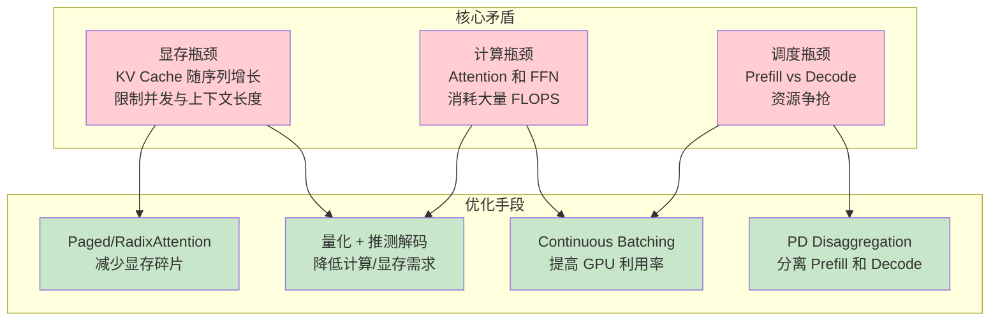

# vLLM + SGLang 推理引擎吞吐量优化详解

> 系统学习 vLLM 和 SGLang 两大主流推理引擎的吞吐量优化技术栈。

---

## 目录

- [1. 概述](#1-概述)
- [2. 通用优化思路指导](#2-通用优化思路指导)
- [3. vLLM 专有优化](#3-vllm-专有优化)
- [4. SGLang 专有优化](#4-sglang-专有优化)
- [5. 对比与选型](#5-对比与选型)
- [6. 学习路径建议](#6-学习路径建议)

---

## 1. 概述

### 1.1 为什么需要推理优化

LLM 推理面临三大核心矛盾：



### 1.2 技术栈定位

```
推理服务全链路
├── 网关层 → week6 Envoy AI Gateway
├── 模型服务层 → week8 KServe + Knative
├── 推理引擎层 → ⬅️ 本专题（week5）
│   ├── vLLM (PagedAttention)
│   └── SGLang (RadixAttention)
├── KV Cache 优化 → week4 KVCache（Mooncake/LMCache/HiCache）
└── 调度基础设施 → week1/2/3
```

### 1.3 核心评估指标

| 指标 | 缩写 | 说明 | 优化目标 |
|------|------|------|----------|
| 首个 Token 延迟 | TTFT | 从请求到第一个 token 生成的时间 | < 200ms (交互式) |
| 逐 Token 延迟 | ITL / TPOT | 每生成一个 token 的平均时间 | < 30ms/token |
| 输出吞吐量 | Throughput | 每秒生成的 token 数 | 越高越好 |
| 请求并发数 | Concurrency | 同时处理的请求数 | 越高越好 |
| 显存占用 | Memory | GPU 显存使用量 | 越低越好 |

---

## 2. 通用优化思路指导

参见 [01-common-optimization-strategy.md](01-common-optimization-strategy.md)，涵盖：

- **提高并发量**：KV Cache 量化、内存管理、请求队列调度
- **降低 TTFT**：Prefix Caching、Chunked Prefill、PD Disaggregation
- **提高吞吐量**：Continuous Batching、Speculative Decoding、TP/PP/CUDA Graph
- **低成本部署**：权重量化、KV Cache 量化、KV Cache Offload

---

## 3. vLLM 专有优化

参见 [02-vllm-optimization.md](02-vllm-optimization.md)，涵盖：

- PagedAttention 分页 KV Cache
- Chunked Prefill + Continuous Batching
- Automatic Prefix Caching (APC)
- Speculative Decoding（Draft/Medusa/Eagle/PromptLookup）
- CUDA Graph / Optimization Levels / Dual Batch Overlap
- 量化方案 + KV Cache 量化
- Tensor/Pipeline Parallelism
- CLI 配置参考与调优清单

---

## 4. SGLang 专有优化

参见 [03-sglang-optimization.md](03-sglang-optimization.md)，涵盖：

- RadixAttention 前缀树 KV Cache
- RadixScheduler 与多种调度策略
- Breakable / Piecewise CUDA Graph
- 20+ 量化方法 + FP4 KV Cache
- Speculative Decoding（EAGLE-2/3/DFLASH/NGRAM）
- PD Disaggregation（原生 Mooncake/NIXL 传输）
- DP Attention + DP Router 负载均衡
- HiCache 层级 KV Cache
- Structured Outputs 约束解码
- CLI 配置参考与调优清单

---

## 5. 对比与选型

参见 [04-comparison-and-selection.md](04-comparison-and-selection.md)，涵盖：

- vLLM vs SGLang 架构差异对比
- 特性支持矩阵（核心特性、集成生态）
- 四维优化对比（并发/TTFT/吞吐/成本）
- 场景选型决策树
- 迁移注意事项与参数映射

---

## 6. 学习路径建议

### 6.1 按角色

| 角色 | 推荐阅读顺序 |
|------|-------------|
| **推理引擎使用者** | 01 通用思路 → 02/03 专有优化（按需）→ 04 选型 |
| **架构选型决策** | 04 对比选型 → 01 通用思路 → 02/03 深度 |
| **性能调优工程师** | 01 通用思路 → 02/03 专有参数 → 官方 Benchmark 指南 |
| **仅做知识归档** | 01 通用思路了解概览即可 |

### 6.2 与业务场景的关联

| 你的角色 | 本专题如何用 |
|----------|------------|
| **调度与网络层工程师**（你） | 了解推理引擎对调度、网络拓扑、显存分配的需求，以便在下层基础设施（week1-3）中做更好的资源抽象和支持 |
| **推理引擎优化工程师**（隔壁团队） | 深入 02/03 的具体配置参数和最佳实践 |

---

## 参考文献

### vLLM

- 官方文档: https://docs.vllm.ai/en/latest/
- CLI serve 参数: https://docs.vllm.ai/en/latest/cli/serve/
- PagedAttention 设计: https://docs.vllm.ai/en/latest/design/paged_attention/
- Automatic Prefix Caching: https://docs.vllm.ai/en/latest/design/prefix_caching/
- Speculative Decoding: https://docs.vllm.ai/en/latest/features/speculative_decoding/
- GitHub: https://github.com/vllm-project/vllm

### SGLang

- 官方文档: https://docs.sglang.ai/
- Server Arguments: https://docs.sglang.ai/docs/advanced_features/server_arguments.md
- 量化指南: https://docs.sglang.ai/docs/advanced_features/quantization.md
- 推测解码: https://docs.sglang.ai/docs/advanced_features/speculative_decoding.md
- PD Disaggregation: https://docs.sglang.ai/docs/advanced_features/pd_disaggregation.md
- HiCache: https://docs.sglang.ai/docs/advanced_features/hicache.md
- K8s 部署: https://docs.sglang.ai/docs/references/multi_node_deployment/deploy_on_k8s.md
- GitHub: https://github.com/sgl-project/sglang
